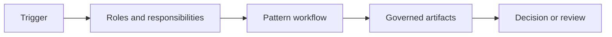

<!-- Use only for a repeatable discovery or governance pattern, not an implementation pattern owned elsewhere. -->

## Problem and Forces

## Applicability

| Use when | Avoid when |
|---|---|
| | |

## Pattern Structure

## Participants and Responsibilities

## Workflow

## Evidence and Artifacts

## Enterprise Example

## Variants

## Tradeoffs

| Benefit | Cost or risk | Mitigation |
|---|---|---|
| | | |

## Failure Modes and Anti-Patterns

## Architecture Review Notes

## Interview Questions

## Summary

## Related Patterns and Canonical Guidance

