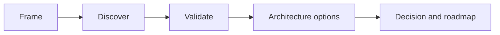

<!-- Use a realistic composite scenario; state assumptions and avoid invented precision. -->

## Executive Brief

## Business Context

## Trigger, Scope, and Constraints

## Stakeholders and Decision Rights

| Stakeholder | Outcome or concern | Authority | Evidence contributed |
|---|---|---|---|
| | | | |

## Discovery Plan

## Evidence and Contradictions

## Current-State Architecture

## Requirements and Quality Attributes

## Options Considered

| Option | Business fit | Architecture fit | Risk | Transition cost | Decision |
|---|---|---|---|---|---|
| | | | | | |

## Recommended Architecture

## Transition and Modernization Roadmap

## Risks, Assumptions, and Decisions

## Deliverables Produced

## Outcomes and Fitness Measures

## Lessons Learned

## Architecture Review Questions

## Interview Exercise

## Related Handbook Guidance

