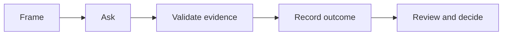

<!-- One-page target: prefer compact tables and prompts; link to explanations. -->

## Purpose

## At a Glance

| Question | Prompt or action | Output |
|---|---|---|
| | | |

## Workflow

## Essential Questions

## Minimum Evidence

## Output Quality Gate

- [ ] The outcome has an owner.
- [ ] Material claims are evidenced or marked as assumptions.
- [ ] Risks and open questions are visible.
- [ ] Next decisions and actions are explicit.

## Red Flags

## Quick Interview Prompts

## Deep-Dive Links

