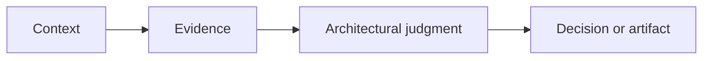

<!-- Answer one architectural question; do not write a glossary entry. -->

## Architectural Question

## Why It Matters

## Enterprise Context

## Core Model

## How It Works

## Evidence and Validation

| Claim | Evidence | Owner | Confidence | Validation |
|---|---|---|---|---|
| | | | | |

## Practical Example

## Tradeoffs and Boundaries

## Common Mistakes

## Architecture Review Notes

## Interview Questions

## Summary

## Related Handbook Guidance

