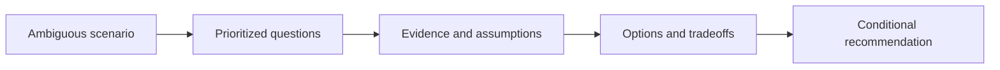

## Scenario

<!-- Give incomplete but sufficient context. Do not reveal the intended solution. -->

## Candidate Task

## What This Evaluates

| Competency | Strong signal | Weak signal |
|---|---|---|
| Discovery framing | | |
| Evidence and assumptions | | |
| Tradeoff judgment | | |
| Governance and communication | | |

## Expected Clarifying Questions

## Evidence Provided on Request

## Strong Answer Structure

## Architecture and Discovery Walkthrough

## Tradeoffs and Alternative Answers

## Follow-Up Probes

## Red Flags

## Scoring Rubric

| Level | Evidence |
|---|---|
| Senior Engineer | |
| Technical Lead | |
| Solution Architect | |
| Enterprise Architect | |

## Related Handbook Guidance

