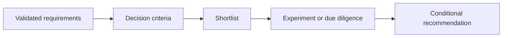

<!-- Compare against a concrete decision context. Never declare a context-free winner. -->

## Decision Context

## Workload and Enterprise Constraints

| Driver | Requirement | Priority | Evidence |
|---|---|---|---|
| | | | |

## Options in Scope

## Elimination Criteria

## Weighted Comparison

| Criterion | Weight | Option A | Option B | Option C | Evidence or caveat |
|---|---:|---:|---:|---:|---|
| | | | | | |

## Architecture Fit

## Operational and Organizational Fit

## Security, Compliance, and Data Considerations

## Cost and Commercial Considerations

## Failure Scenarios and Exit Strategy

## Recommendation by Scenario

| Scenario | Preferred option | Conditions | Reassessment trigger |
|---|---|---|---|
| | | | |

## Validation Plan

## Tradeoffs and Dissent

## Interview Questions

## Canonical Product Guidance

