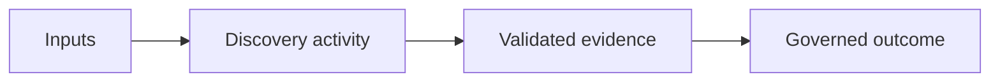

<!-- State what the reader will produce and when the procedure is useful. -->

## Outcome

| Output | Quality criterion |
|---|---|
| <!-- Artifact or decision --> | <!-- Observable completion test --> |

## Context and Preconditions

## Inputs and Participants

| Input or participant | Why required | Validation |
|---|---|---|
| | | |

## Procedure

### 1. Frame the Activity

### 2. Gather Evidence

### 3. Analyze and Resolve Gaps

### 4. Validate with Stakeholders

### 5. Record and Govern the Outcome

## Worked Enterprise Example

## Decision Points and Tradeoffs

| Decision | Option | Tradeoff | Evidence required |
|---|---|---|---|
| | | | |

## Failure Modes and Recovery

## Completion Checklist

- [ ] Outcome has an owner and audience.
- [ ] Claims link to evidence or are marked as assumptions.
- [ ] Conflicts and open questions are visible.
- [ ] Follow-up decisions have owners and dates.

## Architecture Review Notes

## Interview Questions

## Summary

## Related Handbook Guidance

