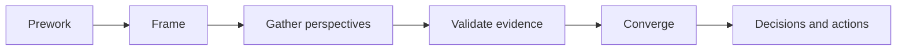

<!-- Design a decision-producing workshop, not an unstructured meeting. -->

## Workshop Objective

| Field | Definition |
|---|---|
| Decision or outcome | |
| In scope | |
| Out of scope | |
| Timebox | |
| Facilitator | |
| Decision owner | |

## When to Use This Workshop

## Participants and Roles

| Role | Why required | Preparation | Authority |
|---|---|---|---|
| | | | |

## Required Inputs and Prework

## Agenda

| Time | Activity | Method | Output |
|---:|---|---|---|
| | | | |

## Facilitation Guide

### Frame the Decision

### Elicit Evidence

### Expose Conflict and Uncertainty

### Converge Without Hiding Dissent

### Confirm Ownership and Follow-Up

## Workshop Flow

## Prompts and Probes

## Expected Artifacts

## Failure Modes and Facilitation Responses

## Completion Criteria

## Follow-Up and Governance

## Architecture Review Notes

## Related Handbook Guidance

