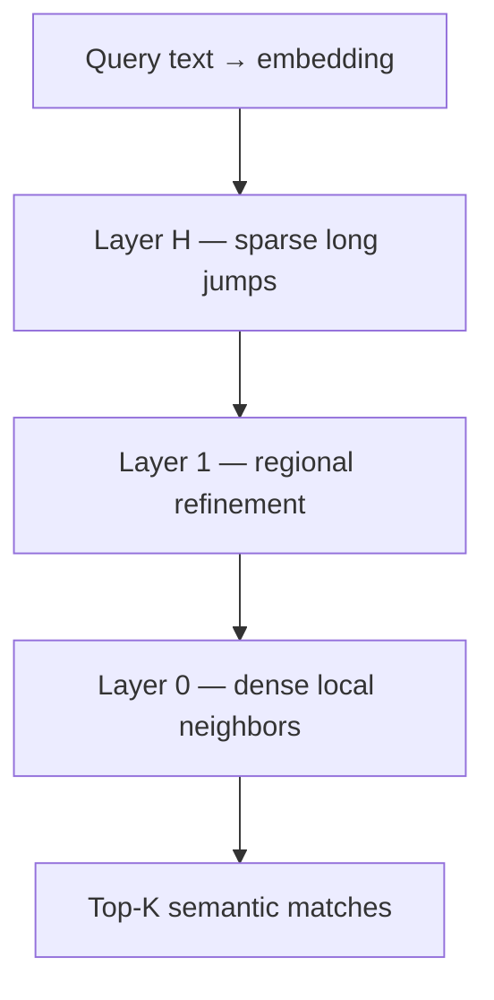
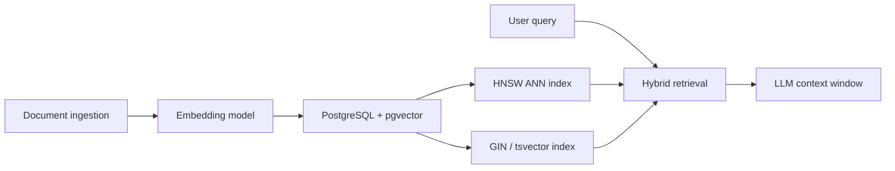

Enterprise data pipelines increasingly process unstructured payloads (such as document archives, support tickets, and raw media streams). To expose these assets to Large Language Models (LLMs) inside Retrieval-Augmented Generation (RAG) frameworks, storage systems convert text concepts into high-dimensional coordinate arrays called **vector embeddings**. Querying these multi-dimensional mathematical profiles requires specialized, graph-based execution architectures.

---

## Vector Embeddings Ingestion

A vector embedding represents semantic meaning as a dense array of fixed-length floating-point values. For example, a standard text chunk passed through an enterprise embedding model (such as OpenAI `text-embedding-3-large`) outputs a vector composed of exactly 3,072 floating-point variables.

When an ingestion pipeline uploads a document, the application calculates these embeddings out-of-band and inserts them into the data store alongside traditional relational column fields or document structures. Traditional indexing trees like [B+ Trees](/database-handbook/b-plus-tree-storage-mechanics/) are fundamentally incapable of querying this high-dimensional coordinate space. B+ Trees partition data along a single scalar dimension to handle direct comparison filters.

In a high-dimensional vector space, locating matching concepts requires computing the directional spatial proximity between vectors. Storage engines evaluate this similarity using mathematical distance formulas, including **Cosine Similarity**, **Euclidean Distance ($L_2$ norm)**, or **Inner Product**:

$$\text{Cosine Similarity} = \frac{\mathbf{A} \cdot \mathbf{B}}{\|\mathbf{A}\| \|\mathbf{B}\|} = \frac{\sum_{i=1}^{n} A_i B_i}{\sqrt{\sum_{i=1}^{n} A_i^2} \sqrt{\sum_{i=1}^{n} B_i^2}}$$

Evaluating these distance equations via raw table sweeps (Exact Nearest Neighbor search) forces the database engine to perform $O(N)$ full table scans. Under high-volume query traffic, this computational load causes immediate execution timeouts.

```sql
-- PostgreSQL + pgvector: store embeddings alongside relational metadata
CREATE TABLE document_chunks (
    id         UUID PRIMARY KEY DEFAULT uuidv7(),
    source_id  UUID NOT NULL,
    content    TEXT NOT NULL,
    embedding  vector(1536)  -- dimension matches embedding model output
);

-- Exact search (O(N) — viable only for small tables)
SELECT id, content, embedding <=> $1::vector AS distance
FROM document_chunks
ORDER BY embedding <=> $1::vector
LIMIT 10;
```

| Distance Metric | Formula Intuition | Best When |
| :--- | :--- | :--- |
| **Cosine** | Angle between vectors | Text embeddings (normalized) |
| **L2 (Euclidean)** | Straight-line distance | Spatial / image embeddings |
| **Inner product** | Dot product magnitude | Pre-normalized vectors (max = most similar) |

---

## HNSW (Hierarchical Navigable Small World) Topology

To achieve sub-millisecond retrieval speeds, advanced vector engines deploy **Approximate Nearest Neighbor (ANN)** index structures, dominated by the **Hierarchical Navigable Small World (HNSW)** graph model.

The HNSW framework organizes high-dimensional vector points into a multi-layer network graph inspired by the concept of skip lists.

- **Layer $H$ (Sparse Multi-Layer Top):** The top layer contains a sparse graph featuring broad, long-range connection links between distant vector points.
- **Layer 0 (Dense Bottom Boundary):** The bottom layer contains every single vector node ingested into the dataset, linked closely to its absolute nearest geographic neighbors.

When a query executes, the engine converts the incoming text prompt into a vector embedding. The execution path enters the search hierarchy at the highest sparse graph layer, making rapid spatial jumps across distant vector coordinates to locate the local region closest to the query embedding.

Once the local optimum is located within the current layer, the engine drops down a level to continue the search. This top-down refinement loop cascades down the graph stack, finishing at Layer 0, where local nearest neighbors are extracted to return the final semantic matches.

```text
  HNSW Multi-Layer Search (top-down)
  Layer 2 (sparse)     A ────────────────► D
                            │
  Layer 1              A ──► B ──► D
                            │    │
  Layer 0 (dense)      A─B─C─D─E─F─G─H    ◄── query enters at top, descends
                            ▲
                       query vector Q
```

```sql
-- pgvector HNSW index (ANN — sub-linear search)
CREATE INDEX idx_chunks_embedding_hnsw
ON document_chunks
USING hnsw (embedding vector_cosine_ops)
WITH (m = 16, ef_construction = 64);
```

| HNSW Parameter | Role | Tuning Guidance |
| :--- | :--- | :--- |
| `m` | Max bi-directional links per node | Higher → better recall, more RAM |
| `ef_construction` | Candidate list size at build time | Higher → better index quality, slower build |
| `ef_search` | Candidate list size at query time | Higher → better recall, slower queries |



---

## The Graph RAM Bottleneck

The primary physical challenge introduced by HNSW indexing is **extreme memory capacity consumption**. To deliver predictable, low-latency graph routing during coordinate jumps, the complete HNSW network layout — including the raw high-dimensional vector coordinate arrays, proximity connection lists, and neighbor tracking nodes — **must reside entirely within system RAM**.

Consider the structural memory footprint required to scale a dataset of 100 million embeddings, where each vector maintains 1,536 dimensions using 32-bit floating-point precision:

$$\text{Raw Data Footprint} = 100{,}000{,}000 \cdot (1536 \cdot 4 \text{ bytes}) \approx 614.4 \text{ GB of RAM}$$

When you incorporate the additional memory overhead required to track graph adjacency links and neighbor indices for each node, the RAM footprint quickly swells past 800 GB. If database memory allocations are exceeded, the operating system shifts to mechanical disk page swapping. This stalls graph navigation loops and severely degrades vector search performance.

| Scale | Dimensions | FP32 Raw Vectors | HNSW Total (est.) |
| :--- | :---: | :---: | :---: |
| 1M docs | 1,536 | ~6 GB | ~8–10 GB |
| 10M docs | 1,536 | ~61 GB | ~80–100 GB |
| 100M docs | 1,536 | ~614 GB | ~800 GB–1 TB |

Under [eventual consistency](/database-handbook/distributed-consistency-primitives/), replica lag means a freshly embedded document may not appear in vector search results on read replicas until the ANN index catches up — a transient window RAG pipelines must account for in freshness SLAs.

---

## Advanced Index Compression

To handle high memory demands while maintaining large vector datasets, production architectures apply data compression techniques:

### 1. Scalar Quantization (SQ)

Scalar Quantization compresses floating-point arrays by mapping continuous 32-bit float values (`FP32`) into compact 8-bit integer formats (`INT8`). The engine calculates the minimum and maximum data values across dimensions and assigns continuous attributes to a uniform 256-step integer matrix. This transformation reduces the overall index memory footprint by **75%** while preserving semantic accuracy.

| Precision | Bytes / Dimension | 100M × 1536d Footprint |
| :--- | :---: | :---: |
| **FP32** | 4 | ~614 GB |
| **FP16** | 2 | ~307 GB |
| **INT8 (SQ)** | 1 | ~154 GB |

### 2. Hybrid Search Architecture

To balance retrieval precision with semantic breadth inside production RAG environments, high-scale engines implement **hybrid search scoring**.

```text
                      Incoming Query String
                                │
              ┌─────────────────┴─────────────────┐
              ▼                                   ▼
  ┌───────────────────────┐           ┌───────────────────────┐
  │  Exact Keyword Match  │           │ Semantic Graph Search │
  │ (Inverted BM25 Index) │           │     (HNSW Index)      │
  └───────────┬───────────┘           └───────────┬───────────┘
              │                                   │
              ▼                                   ▼
         Sparse Score                       Dense Score
              │                                   │
              └─────────────────┬─────────────────┘
                                ▼
                 ┌─────────────────────────────┐
                 │ Reciprocal Rank Fusion (RRF)│ ──► Combined Final Output
                 └─────────────────────────────┘
```

The database engine runs parallel execution pathways when a query is submitted:

1. **The Sparse Path:** Evaluates standard lexical keyword matches over an inverted index structure using BM25 statistics — the same inverted-index principle as [GIN JSONB indexing](/database-handbook/advanced-schema-optimization/), applied to full-text token maps.
2. **The Dense Path:** Executes an $O(\log N)$ semantic proximity search across the HNSW vector graph layer.

The system collects ranked result lists from both paths and resolves them using **Reciprocal Rank Fusion (RRF)**:

$$\text{RRF Score}(d) = \sum_{r \in \{sparse, dense\}} \frac{1}{k + \text{rank}_r(d)}$$

Where $k$ is a smoothing constant (typically 60) and $\text{rank}_r(d)$ is the position of document $d$ in result list $r$. Documents appearing in both lists rise to the top without requiring score normalization across incompatible metrics.

```sql
-- Conceptual hybrid query (PostgreSQL + pgvector + tsvector)
WITH sparse AS (
    SELECT id, ROW_NUMBER() OVER (
        ORDER BY ts_rank_cd(search_vector, plainto_tsquery('english', $1)) DESC
    ) AS rank
    FROM document_chunks
    WHERE search_vector @@ plainto_tsquery('english', $1)
    LIMIT 50
),
dense AS (
    SELECT id, ROW_NUMBER() OVER (
        ORDER BY embedding <=> $2::vector
    ) AS rank
    FROM document_chunks
    ORDER BY embedding <=> $2::vector
    LIMIT 50
)
SELECT COALESCE(s.id, d.id) AS id,
       COALESCE(1.0 / (60 + s.rank), 0) + COALESCE(1.0 / (60 + d.rank), 0) AS rrf_score
FROM sparse s
FULL OUTER JOIN dense d ON s.id = d.id
ORDER BY rrf_score DESC
LIMIT 10;
```

| Search Mode | Strength | Weakness |
| :--- | :--- | :--- |
| **BM25 (sparse)** | Exact keyword, SKU, error codes | Misses semantic paraphrases |
| **HNSW (dense)** | Conceptual similarity | Misses rare exact tokens |
| **Hybrid + RRF** | Best of both | 2× index maintenance cost |

### RAG Pipeline at Scale



### Module 5 Summary

| Concern | Primitive | Article |
| :--- | :--- | :--- |
| **Replica lag / stale reads** | CAP / PACELC trade-offs | [Distributed Consistency](/database-handbook/distributed-consistency-primitives/) |
| **Embedding storage** | Relational + `vector` column | This article |
| **ANN search** | HNSW in-memory graph | This article |
| **Memory ceiling** | Scalar quantization (INT8) | This article |
| **Retrieval quality** | Hybrid BM25 + HNSW + RRF | This article |

Vector indexing closes the database internals curriculum — from on-disk B+ Tree pages through distributed coordination to the graph structures that power modern AI retrieval at scale.
