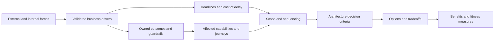
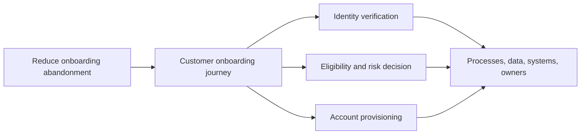

Business context explains why an architecture decision exists and which enterprise forces determine whether it creates value. It connects strategy, customers, markets, regulation, economics, operations, risk, organization, and time to a bounded architecture question.

Architects do not need to rewrite corporate strategy. They need to identify which strategic claims are actionable, evidenced, owned, and relevant to the decision—and where competing drivers create unavoidable tradeoffs.

## Architectural Question

**Which business forces justify architecture change, and how should they shape scope, priorities, constraints, decision criteria, and timing?**

The same technology estate can require different architecture directions under different business contexts. A legacy platform may be acceptable for a stable runoff product, intolerable for a high-growth digital channel, or urgent to replace because a regulatory deadline changes the cost of delay.

## Business Problem

Architecture initiatives often begin with broad statements:

- “Improve agility.”
- “Become cloud first.”
- “Create a unified customer experience.”
- “Reduce cost.”
- “Enable AI.”
- “Meet regulatory expectations.”
- “Modernize the legacy estate.”

These are themes, not yet decision criteria. They hide questions about baseline, target, population, owner, deadline, guardrails, and tradeoffs.

| Strategic statement | Missing discovery | Architecture risk |
|---|---|---|
| Reduce cost | Which cost, baseline, horizon, allocation, and service guardrail? | Cheapest transition increases lifecycle or business cost |
| Improve customer experience | Which journey, segment, failure, measure, and owner? | Platform work lacks measurable customer effect |
| Standardize globally | Which benefits require sameness and which local differences are mandatory? | Standardization destroys market or regulatory fit |
| Increase speed | Speed of product change, onboarding, deployment, recovery, or decision? | Architecture optimizes the wrong bottleneck |
| Meet regulation | Which obligation, jurisdiction, data, process, date, and evidence? | Over- or under-engineered controls |
| Exit legacy | Which value, risk, support date, dependency, and disposition? | Age becomes a substitute for modernization rationale |

Business discovery turns themes into traceable drivers and tensions.

## Why It Matters

Business context controls architecture in at least six ways.

1. **Scope:** identifies which capabilities, journeys, regions, products, and dependencies matter.
2. **Priority:** explains which outcomes and risks justify scarce investment and attention.
3. **Constraints:** reveals binding deadlines, obligations, funding, contracts, and organizational limits.
4. **Criteria:** defines how architecture options will be compared.
5. **Sequence:** exposes dependencies and time-critical changes.
6. **Measures:** establishes whether the decision produced value without violating guardrails.

Without this context, architecture teams default to technical quality, industry trends, or personal preference.

## Enterprise Context

### Driver Categories

| Driver category | Discovery focus | Typical evidence |
|---|---|---|
| Strategy | Strategic objective, portfolio choice, capability ambition, time horizon | Approved strategy, investment thesis, board priorities |
| Customer and user | Journeys, needs, segments, accessibility, trust, service failures | Research, behavior analytics, complaints, service measures |
| Market and competition | Growth, pricing, channel, ecosystem, differentiation, speed | Market data, win/loss, competitor and partner evidence |
| Regulation and policy | Obligation, jurisdiction, effective date, control evidence, enforcement | Legal interpretation, findings, policy, audit, regulator commitments |
| Financial | Revenue, margin, capital, operating cost, cash, allocation, risk exposure | Financial baseline, business case, cost model, contracts |
| Operational | Capacity, quality, resilience, support, manual work, recovery, safety | SLOs, incidents, process data, workforce and DR evidence |
| Technology lifecycle | Support, security, skills, vendor, obsolescence, maintainability | Inventories, support notices, vulnerabilities, delivery history |
| Organization | Ownership, operating model, skills, incentives, decision rights, change capacity | Org/service ownership, workforce data, governance records |
| Transaction or event | Merger, acquisition, divestiture, launch, contract expiry, data-center exit | Deal thesis, separation agreements, launch and exit milestones |

Drivers may reinforce or conflict. Growth can demand speed while regulation demands stronger evidence. Standardization can lower cost while local markets require variation. Discovery must preserve these tensions for option evaluation.

## Core Model

### Driver Statement

Use a consistent structure:

> Because **[evidenced force or condition]**, the enterprise must improve or protect **[owned outcome]** for **[population and scope]** by **[time or trigger]**, while preserving **[guardrails]**. This affects **[capabilities and decisions]**.

Example:

> Because 38% of small-business onboarding applications require manual compliance review and a new beneficial-ownership rule takes effect next April, the bank must reduce median review time from 3.8 days to under one day for domestic entities, while preserving documented analyst judgment and audit evidence. This affects onboarding workflow, identity data, rules ownership, case management, and the first modernization wave.

## How It Works

### 1. Start with the Trigger

Identify what caused action now.

| Trigger | Probe |
|---|---|
| Performance gap | Which measure, baseline, population, and consequence? |
| Opportunity | Which customer, market, capability, and time window? |
| Obligation | Which authority, scope, evidence, and deadline? |
| Lifecycle event | Which support, contract, site, skill, or security condition expires? |
| Transaction | Which merger, divestiture, launch, or partner commitment changes boundaries? |
| Risk event | Which incident, audit finding, concentration, or exposure changed tolerance? |

Distinguish a persistent driver from the event that made it urgent.

### 2. Validate Strategic Relevance

Ask whether the stated driver is:

- approved or aspirational;
- enterprise-wide or limited to a portfolio, region, or product;
- funded or only desired;
- measured or rhetorical;
- stable or under review;
- owned by someone able to resolve tradeoffs; and
- relevant within the architecture decision horizon.

Record source, sponsor, scope, effective period, and conflicting priorities.

### 3. Establish Baseline and Consequence

| Driver | Baseline | Consequence of no change | Evidence |
|---|---|---|---|
| Slow partner onboarding | Median 62 days; p90 118 days | Lost revenue and partner attrition | Workflow timestamps, pipeline, interviews |
| Vendor end of support | Support ends in 16 months | Security and incident support exposure | Contract and vendor notice |
| Checkout abandonment | 11.4% after payment initiation | Revenue and customer-trust loss | Journey analytics, support and payment data |
| Manual reconciliation | 420 person-hours/month | Cost, delay, and control risk | Operations records and observation |

If the baseline does not exist, establishing it becomes discovery work and a confidence limitation.

### 4. Define Owned Outcomes and Guardrails

An outcome needs:

- baseline and target;
- population and scope;
- time horizon;
- accountable owner;
- measurement method and cadence;
- guardrails; and
- dependency or assumption.

Guardrails prevent local optimization. A cost target may include service, security, employee, customer, and transition guardrails.

### 5. Map Drivers to Capabilities and Journeys

Avoid mapping directly from strategic theme to application.

This reveals whether architecture change should target process, policy, ownership, data, integration, technology, or a combination.

### 6. Identify Conflicts and Tradeoffs

| Driver A | Driver B | Architecture tension | Decision owner |
|---|---|---|---|
| Global standardization | Regional market and regulation | Common core versus governed variation | Capability executive |
| Product speed | Operational stability | Independent change versus lifecycle control | Product/service owners |
| Cost reduction | Resilience | Resource efficiency versus redundancy | Business and service risk owners |
| Data reuse | Privacy minimization | Accessibility versus purpose limitation | Data/privacy authorities |
| Vendor consolidation | Exit resilience | Simplicity versus concentration risk | Investment and risk governance |

Do not “balance” conflicts in prose. Convert them into criteria, scenarios, constraints, options, and decision rights.

### 7. Assess Urgency and Cost of Delay

Deadlines have different qualities.

| Deadline type | Treatment |
|---|---|
| Fixed external | Validate authority, scope, lead time, and minimum compliance |
| Contractual | Validate executed terms, notice periods, remedies, and alternatives |
| Market window | Quantify opportunity and uncertainty; define staged commitment |
| Internal target | Identify owner, rationale, dependency, and flexibility |
| Technology support | Separate support end, security exposure, and actual migration lead time |

Calculate cost of delay using ranges and scenarios rather than unsupported precision.

### 8. Translate Drivers into Architecture Criteria

| Business driver | Architecture criterion | Measure or evidence |
|---|---|---|
| Enter two markets within 12 months | Governed regional variation without duplicated core logic | Time to configure region; divergence rate |
| Reduce operational loss | Failure isolation, reconciliation, audit, and recovery | Loss events, RTO, reconciliation completeness |
| Divest business unit | Data, identity, integration, and platform separability | Separation test and exit milestones |
| Reduce product lead time | Independent ownership and safe change for high-change capabilities | Lead time, deployment, rollback, defect measures |
| Reduce vendor concentration | Portability, exit rights, open contracts, recovery alternatives | Exit test, contract, migration estimate |

Criteria should be used later by [Technology Decisions](/technology-playbook/), not replaced by generic product comparisons.

### 9. Record the Business Context Brief

Keep the brief decision-focused:

1. trigger and decision;
2. strategic and external context;
3. evidenced drivers;
4. baselines, outcomes, owners, and guardrails;
5. affected capabilities, journeys, regions, and stakeholders;
6. conflicts and decision rights;
7. urgency and cost of delay;
8. architecture implications and criteria;
9. assumptions, risks, and evidence gaps; and
10. review triggers.

## Evidence and Validation

| Claim | Strong evidence | Common limitation |
|---|---|---|
| Strategic priority | Approved strategy and investment decision | Strategy may not define portfolio scope |
| Customer pain | Behavioral data plus qualitative research | Analytics may exclude failed or offline journeys |
| Market opportunity | Segment demand, pipeline, willingness-to-pay | Forecast uncertainty and survivorship bias |
| Regulatory driver | Formal interpretation and obligation mapping | Jurisdiction and data scope may be unclear |
| Cost problem | Reconciled cost and allocation model | Shared and labor costs may be omitted |
| Operational pain | Incidents, queues, rework, capacity, observation | Manual work may not be recorded |
| Skills constraint | Role/capability assessment and delivery evidence | Self-assessment and hiring assumptions |

Apply the [evidence and confidence model](/architecture-discovery/discovery-framework/evidence-assumptions-and-confidence/) to every driver that materially affects scope or option viability.

## Practical Example

### Insurance Product Modernization

An insurer proposes replacing its policy platform because “the legacy system is slow and expensive.” Business discovery finds:

| Driver | Evidence | Implication |
|---|---|---|
| Product launch delay | Most delay occurs in legal approval and manual configuration testing | Platform replacement alone cannot meet the outcome |
| Mainframe cost | Unit cost is stable; cost rises because old products cannot be retired | Product rationalization and migration govern savings |
| Regulatory change | New disclosure rules require traceable rule versions in nine months | Rules and evidence capability are time-critical |
| Broker growth | APIs and near-real-time quote status are missing | Partner journey and integration become target scope |
| Operational risk | Batch failure recovery depends on two specialists | Knowledge and recovery modernization are urgent |

The decision changes from “which policy platform should replace the mainframe?” to:

> Which sequence of product rationalization, rule externalization, partner integration, recovery remediation, and platform modernization best reduces launch lead time and operational concentration risk while meeting the disclosure deadline?

That framing creates several viable options instead of a premature product selection.

## Tradeoffs and Boundaries

| Choice | Benefit | Risk | Treatment |
|---|---|---|---|
| Enterprise-wide context | Reveals shared forces and dependencies | Scope becomes too broad | Limit depth to decision-relevant capabilities |
| Sponsor-led framing | Fast authority and strategic clarity | Confirmation and hierarchy bias | Triangulate with operational and customer evidence |
| Quantified business case | Supports prioritization | False precision hides uncertainty | Use ranges, scenarios, assumptions, sensitivity |
| Strategic standardization | Simpler operating model | Erases valuable or mandatory variation | Define common core and governed variation criteria |
| Deadline-led decisions | Creates focus | Encourages irreversible shortcuts | Separate minimum outcome, transition, and target state |

Business discovery does not decide corporate strategy or substitute for product, finance, legal, or risk authority. It translates their owned context into architecture implications.

## Best Practices

1. Separate strategic themes from evidenced drivers.
2. Define outcomes before applications and technologies.
3. Give every outcome a baseline, target, owner, scope, and guardrail.
4. Map drivers through capabilities and journeys before systems.
5. Preserve conflicts as explicit decision criteria.
6. Validate deadlines and the consequence of delay.
7. Include customer, operational, regulatory, financial, and organizational evidence.
8. Use ranges and sensitivity for uncertain economics.
9. Record what current strengths and differentiation must be preserved.
10. Define reassessment triggers when strategy or market conditions change.

## Common Mistakes and Anti-Patterns

| Anti-pattern | Why it fails | Correction |
|---|---|---|
| Strategy slide as requirement | Theme has no measurable scope or owner | Convert it into evidenced driver and outcome |
| Technology as outcome | Deployment is mistaken for value | State the business/operational change and guardrails |
| Cost-only modernization | Transition, risk, and lifecycle effects are omitted | Model total economic consequence and sensitivity |
| Everything is strategic | Priorities cannot guide scope or tradeoffs | Require source, owner, measure, and deadline |
| Deadline by assertion | Artificial urgency bypasses evidence | Classify and validate deadline authority |
| Application-first scope | Business capability and process causes are hidden | Map driver → outcome → capability → estate |
| Conflict smoothing | Incompatible priorities become vague compromise | Make tradeoff and authority explicit |

## Architecture Review Notes

Challenge the business context when:

- the driver is a technology trend or product preference;
- outcomes lack baseline, target, owner, population, or guardrail;
- customer claims rely only on internal stakeholders;
- regulation has no jurisdiction, scope, interpretation, or deadline evidence;
- savings exclude transition, labor, licensing, or retained-estate cost;
- capability and process implications are skipped in favor of application lists;
- contradictory drivers disappear from criteria;
- the cost of delay is asserted without consequence; or
- no trigger exists to revisit the context.

## Interview Questions

### How do you translate business strategy into architecture decisions?

Identify approved, relevant strategic drivers; validate their scope and evidence; define owned outcomes and guardrails; map them to capabilities and journeys; expose conflicts and urgency; then derive architecture criteria, risks, and scope.

### What do you do when the business asks for microservices to improve agility?

Clarify which change is slow, establish the baseline and causes, identify affected capabilities and ownership, and define measurable lead-time and reliability outcomes. Microservices remains an option evaluated against those findings.

### How do you validate a regulatory driver?

Identify jurisdiction, legal entity, data/process scope, effective date, formal interpretation, evidence obligation, control owner, and exception or risk route. Do not rely on a generalized policy summary.

### How do you handle conflicting strategic priorities?

Make the affected outcomes, evidence, tradeoff, and decision authority explicit. Translate the conflict into criteria and options rather than hiding it in an ambiguous target architecture.

### How much business context does an architect need?

Enough to understand why the decision matters, which outcomes and capabilities it affects, what constraints and conflicts shape it, how urgency is justified, and how option value will be measured.

## Summary

Business-context discovery turns strategy and external forces into an evidence-backed architecture decision model. It establishes drivers, baselines, outcomes, guardrails, capability impact, conflicts, urgency, criteria, and review triggers.

The architect's role is not to restate strategy or accept solution-shaped goals. It is to make the relationship between enterprise intent and architecture consequence explicit and governable.

The next business-discovery chapter converts these drivers into measurable [outcomes and success measures](/architecture-discovery/business-discovery/business-outcomes-and-success-measures/).

## Related Handbook Guidance

- [Architecture Discovery: Scope and Outcomes](/architecture-discovery/introduction/) — decision-centered discovery
- [Discovery Engagement Charter](/architecture-discovery/discovery-framework/) — governing trigger, outcome, scope, and deadline
- [Evidence, Assumptions, and Confidence](/architecture-discovery/discovery-framework/evidence-assumptions-and-confidence/) — validating driver claims
- [Technology Decisions](/technology-playbook/) — evaluating options after business criteria are established
- [System Design Process](/system-design/system-design-process/) — solution design after business and architecture context is understood
