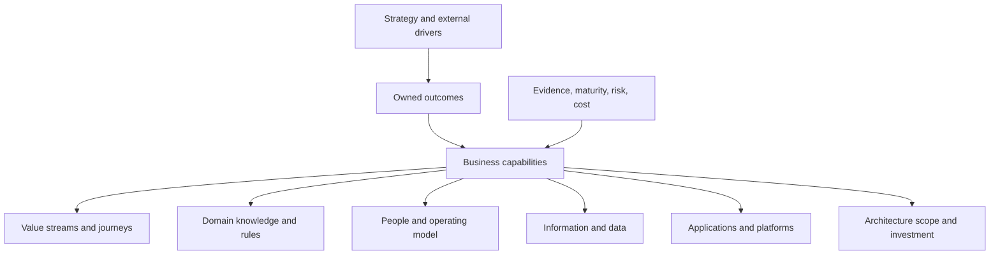
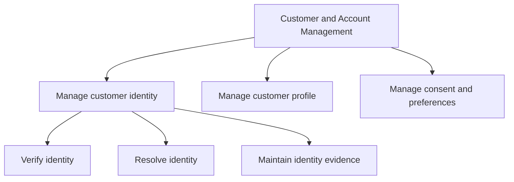
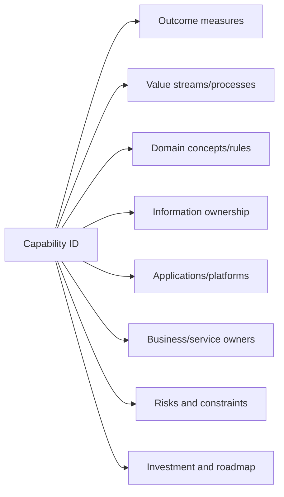

A business capability describes what an enterprise must be able to do to create value, meet an obligation, or operate effectively. It is more stable than an organization structure, process, application, project, or vendor product.

Capability mapping gives architects a business-centered view for defining scope, locating ownership gaps, comparing investment, and connecting outcomes to processes, information, people, and technology.

## Business Problem

Architecture portfolios are often organized by applications and departments. Both are unstable proxies for business need.

| Proxy | Why it misleads |
|---|---|
| Organization chart | Reporting lines change and one capability may span several functions |
| Application inventory | A system can support many capabilities, while one capability can depend on many systems |
| Process list | Processes explain how work flows, not the enduring ability the enterprise needs |
| Project portfolio | Temporary initiatives obscure long-lived ownership and lifecycle |
| Vendor module map | Product packaging becomes the assumed business architecture |

Without a capability view, modernization becomes “replace these applications” rather than “improve these business abilities and outcomes.”

## Outcome

| Output | Quality criterion |
|---|---|
| Capability map | Uses stable business language and mutually understandable boundaries |
| Capability definitions | State purpose, scope, outcomes, information, and exclusions |
| Ownership map | Names accountable business ownership and exposes ambiguity |
| Importance assessment | Connects strategic drivers and obligations to capabilities |
| Maturity/fitness assessment | Uses evidence relevant to the chartered decision |
| Dependency view | Shows enabling and dependent capabilities without becoming a process flow |
| Heatmap | Makes investment, risk, pain, and evidence confidence transparent |
| Architecture linkage | Connects capabilities to journeys, processes, domains, data, systems, and roadmap work |

## Capability Model

### Capability Versus Neighboring Concepts

| Concept | Question answered | Example |
|---|---|---|
| Capability | What must the enterprise be able to do? | Assess credit risk |
| Process | How is work performed? | Loan underwriting process |
| Value stream | How does value move from trigger to outcome? | Need financing to loan serviced |
| Organization | Who is grouped to perform work? | Credit Risk Department |
| Application | Which technology enables work? | Underwriting platform |
| Service | Which reusable outcome is provided through a contract? | Credit-decision service |
| Domain | Which concepts, rules, and ownership boundary govern meaning? | Lending risk domain |

## Procedure

### 1. Start from Outcomes and Scope

Use the [business outcomes](/architecture-discovery/business-discovery/business-outcomes-and-success-measures/) and charter to define which part of the enterprise matters. Avoid mapping the entire organization unless the decision is genuinely enterprise-wide.

Ask:

- Which abilities create or protect the outcome?
- Which abilities are mandatory for operation or regulation?
- Where does the enterprise need differentiation?
- Which shared abilities enable several value streams?
- Which weaknesses could invalidate an architecture option?

### 2. Discover Capability Candidates

Use stable verb-noun language such as:

- manage customer identity;
- evaluate eligibility;
- price risk;
- fulfill an order;
- reconcile settlement;
- manage product configuration; and
- respond to service incidents.

Sources include strategy, value streams, process models, product/service catalogs, regulations, operating models, and domain workshops.

Do not copy departmental names. “Finance” is too broad; “manage liquidity,” “close financial period,” and “report regulatory capital” describe distinct abilities.

### 3. Define Boundaries

For each capability, record:

| Field | Purpose |
|---|---|
| Name and definition | Creates shared meaning |
| Business outcome | Explains why the capability matters |
| Scope and exclusions | Prevents overlap and hidden assumptions |
| Inputs and outputs | Clarifies dependency without modeling sequence |
| Policies and obligations | Shows governing rules |
| Information concepts | Connects capability to data/domain discovery |
| Accountable owner | Establishes lifecycle authority |
| Consumers | Identifies affected value streams and services |

Split capabilities when parts have materially different ownership, change drivers, information, or investment decisions. Merge them when the distinction adds no decision value.

### 4. Structure the Map

Use two or three levels at most during discovery.

Level 1 communicates enterprise scope. Level 2 supports investment and ownership. Level 3 is justified only where deeper decomposition changes architecture or roadmap decisions.

### 5. Assign Ownership

Capability ownership is business accountability for outcomes, policy, investment priority, and lifecycle—not necessarily delivery management.

| Ownership question | Evidence |
|---|---|
| Who owns the capability outcome? | Performance objectives and governance mandate |
| Who may change policy and rules? | Delegated authority and control model |
| Who prioritizes investment? | Portfolio and funding decisions |
| Who accepts operational/business risk? | Risk delegation |
| Who governs cross-unit variation? | Global/local decision model |

If several executives are “co-owners,” define the decision boundary or record an ownership gap.

### 6. Assess Strategic Importance

Use explicit criteria rather than color by opinion.

| Criterion | Probe |
|---|---|
| Differentiation | Does this ability create a meaningful market/customer advantage? |
| Outcome contribution | How strongly does it influence chartered outcomes? |
| Obligation | Is it required for law, safety, control, or license to operate? |
| Dependency | How many critical journeys or capabilities rely on it? |
| Change demand | How frequently and urgently must it evolve? |
| Risk exposure | What happens when it performs poorly or fails? |

### 7. Assess Maturity and Fitness

Avoid generic maturity scores. Evaluate dimensions relevant to the decision.

| Dimension | Evidence examples |
|---|---|
| Outcome performance | KPI distribution and trend |
| Process | Delay, variation, rework, control, automation |
| Information | Ownership, quality, lineage, accessibility |
| Technology | support, changeability, reliability, coupling |
| People and skills | capacity, key-person dependency, role clarity |
| Governance | decision speed, policy ownership, exception control |
| Cost | unit cost, manual effort, license and support |

State confidence and gaps. A score without underlying evidence is not architecture input.

### 8. Create a Decision Heatmap

| Capability | Importance | Current fitness | Risk | Change demand | Evidence confidence | Implication |
|---|---:|---:|---:|---:|---|---|
| | | | | | | |

Heatmaps help prioritize investigation and investment, but they do not select architecture automatically. High-importance/low-fitness capabilities deserve deeper discovery; low-importance capabilities may be standardized, outsourced, retained, or retired depending on context.

### 9. Link to Architecture Views

Use many-to-many relationships. Do not force one application or one team per capability to simplify a diagram.

### 10. Validate and Govern

Validate definitions and ownership with accountable business leaders, domain experts, operations, and architecture. Record disputed boundaries and missing owners.

Define review triggers such as strategy change, acquisition, regulatory change, product launch, operating-model change, or major platform decision.

## Worked Enterprise Example

### Banking Onboarding

A bank wants to replace its onboarding platform. Application-led scope suggests replacing forms, workflow, identity checks, and account provisioning together.

Capability mapping reveals:

| Capability | Importance | Fitness finding | Architecture implication |
|---|---|---|---|
| Manage application intake | Medium | Forms vary unnecessarily by channel | Standardize experience and reusable schema |
| Verify identity | Critical | Vendor-specific flows and weak evidence reuse | Establish identity policy and evidence ownership |
| Assess eligibility | High | Rules embedded across workflow and core | Separate rule ownership and versioning |
| Conduct financial-crime review | Critical/obligatory | Manual exceptions dominate delay | Improve case orchestration and audit evidence |
| Provision products | High | Core dependencies constrain sequencing | Preserve contract and design transition state |
| Manage customer consent | Critical | Ownership differs by region | Govern common semantics and regional policy |

The roadmap becomes capability-led: resolve identity and consent ownership, externalize eligibility rules, improve exception orchestration, then replace channel and workflow components in reversible waves.

## Tradeoffs

| Choice | Benefit | Risk | Mitigation |
|---|---|---|---|
| Broad map | Shared enterprise language | Slow and shallow | Limit depth to decision scope |
| Detailed hierarchy | Precise analysis | Becomes process/application decomposition | Stop where detail no longer changes decisions |
| Single owner | Clear accountability | Oversimplifies federated reality | Define common/local decision rights |
| Numeric maturity | Easy comparison | False precision | Publish evidence and dimension detail |
| Capability-led roadmap | Business alignment | Dependencies may be hidden | Link capabilities to systems, data, and transition views |

## Failure Modes and Anti-Patterns

| Anti-pattern | Why it fails | Correction |
|---|---|---|
| Org chart as capability map | Structure replaces enduring ability | Use outcome-oriented verb-noun language |
| Application modules as capabilities | Vendor packaging dictates business boundaries | Define capability independently, then map technology |
| Hundreds of level-3 boxes | Detail overwhelms decision purpose | Apply scope and stop criteria |
| Heatmap by workshop vote | Colors hide evidence and incentives | Use criteria, sources, confidence, and owners |
| Capability equals microservice | Business architecture is forced into deployment boundaries | Use domain and service analysis separately |
| Owner equals IT custodian | Technology accountability replaces business outcome ownership | Assign business capability and lifecycle roles explicitly |

## Best Practices

1. Start from outcomes, not applications.
2. Use stable, business-oriented definitions.
3. Keep decomposition proportional to the decision.
4. Distinguish capabilities from processes, domains, services, and organizations.
5. Record scope and exclusions for ambiguous capabilities.
6. Make ownership and decision rights explicit.
7. Assess importance and fitness with evidence.
8. Preserve many-to-many relationships to technology and teams.
9. Use heatmaps to focus discovery, not automate decisions.
10. Govern changes and retain stable identifiers.

## Completion Checklist

- [ ] Map scope traces to chartered outcomes and decisions.
- [ ] Capabilities use stable verb-noun business language.
- [ ] Definitions include purpose, scope, outcomes, and exclusions.
- [ ] Capability, process, domain, service, organization, and application are distinguished.
- [ ] Accountable ownership and decision rights are explicit.
- [ ] Strategic importance uses stated criteria.
- [ ] Fitness assessments expose evidence and confidence.
- [ ] Dependencies and enabling capabilities are visible.
- [ ] Capabilities link to journeys, information, systems, risks, and roadmap work.
- [ ] Disputed boundaries and ownership gaps remain visible.

## Architecture Review Notes

Challenge the map when:

- it mirrors departments or vendor modules;
- capability definitions contain implementation choices;
- ownership means only application support;
- heatmap ratings lack criteria and evidence;
- every capability is marked strategic;
- hierarchy depth exceeds its decision purpose;
- process sequence is disguised as capability decomposition;
- capability boundaries are treated as automatic microservice boundaries; or
- roadmap items cannot trace to outcomes and capability gaps.

## Interview Questions

### What is a business capability?

An enduring ability the enterprise needs to create value, meet obligations, or operate. It describes what the business must be able to do independently of current organization, process, application, or vendor product.

### How do capabilities help modernization?

They connect outcomes to ownership, maturity, risk, processes, data, systems, and investment so modernization targets business ability rather than replacing technology without context.

### What is the difference between a capability and a process?

A capability describes what the enterprise can do; a process describes how work flows to produce an outcome. One capability can participate in many processes and value streams.

### How do you determine capability boundaries?

Use differences in purpose, outcomes, ownership, policy, information, change drivers, and investment decisions. Split only when the distinction changes architectural judgment.

### Should capabilities map one-to-one to microservices?

No. Capability maps provide business scope. Service boundaries require deeper domain, data, transaction, change, and operating-model analysis.

## Summary

Business capability mapping gives architecture discovery a stable business frame. It identifies what the enterprise must be able to do, why it matters, who owns it, how well it performs, and which gaps deserve architectural attention.

Used with evidence and proportional detail, it prevents application inventories, org charts, and vendor products from becoming the default business architecture.

The next chapter follows value across capabilities and examines the [value streams and operating model](/architecture-discovery/business-discovery/value-streams-and-operating-model/) that must deliver and govern it.

## Related Handbook Guidance

- [Business Context and Strategic Drivers](/architecture-discovery/business-discovery/) — why capabilities matter now
- [Business Outcomes and Success Measures](/architecture-discovery/business-discovery/business-outcomes-and-success-measures/) — measurable capability outcomes
- [Current-State Architecture Baseline](/architecture-discovery/discovery-framework/current-state-architecture-baseline/) — systems, dependencies, ownership, and evidence
- [Monolith Decomposition](/microservices/09-migration-modernization/monolith-decomposition/) — implementation boundary guidance after business/domain discovery
