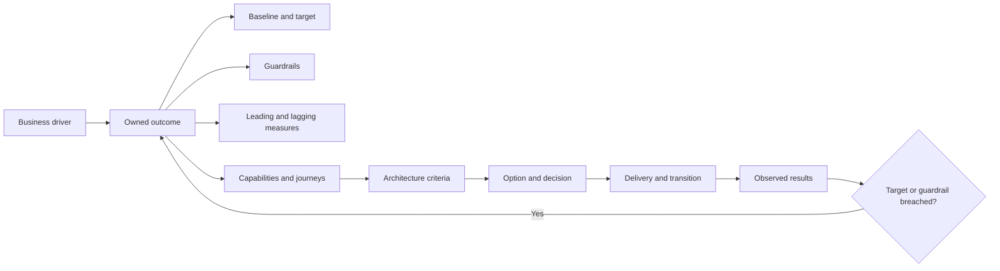
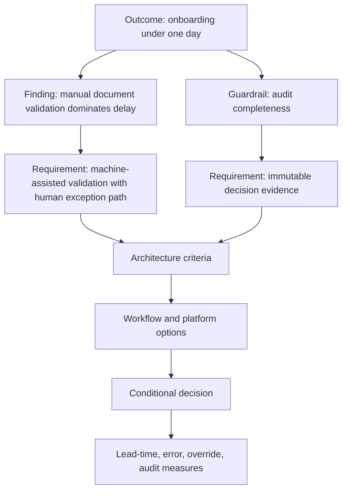

Architecture creates value only when it changes an owned business or operating outcome. A migration, platform, API, data product, or target architecture is an output; it is not evidence that customer experience, risk, cost, resilience, or change performance improved.

Outcome discovery converts strategic intent into measurable commitments and guardrails that can shape architecture options, sequencing, investment, and reassessment.

## Business Problem

Programs often define success through delivery activity:

- applications migrated;
- services decomposed;
- APIs published;
- data sources onboarded;
- workloads containerized;
- vendor platform deployed; or
- legacy servers retired.

These measures are useful for execution but do not explain whether the enterprise became better.

| Output measure | Missing outcome question |
|---|---|
| 80% of applications migrated | Did reliability, cost, security, or change performance improve? |
| 50 microservices created | Did independent ownership and lead time improve without increasing incidents? |
| Customer 360 launched | Did service resolution, consent, data quality, or conversion improve? |
| ERP implemented | Did process consistency, close time, control quality, or working capital improve? |
| AI triage deployed | Did cycle time improve without unacceptable error, bias, or operational burden? |

Without outcomes, architecture reviews cannot distinguish valuable progress from technically impressive motion.

## Outcome

Produce an outcome model containing:

| Output | Quality criterion |
|---|---|
| Outcome statement | Describes a business or operating change, not a technology activity |
| Baseline | Uses defined population, period, source, method, and owner |
| Target | Includes value, horizon, confidence, and rationale |
| Leading indicators | Show early movement and actionable causes |
| Lagging indicators | Confirm durable business effect |
| Guardrails | Prevent optimization that harms another critical outcome |
| Ownership | Names accountable outcome and measurement owners |
| Architecture linkage | Connects outcomes to capabilities, requirements, criteria, decisions, and roadmap items |
| Review model | Defines cadence, thresholds, corrective action, and reassessment trigger |

## Context and Preconditions

Start with validated [business context and strategic drivers](/architecture-discovery/business-discovery/). Confirm the decision scope, stakeholder authority, evidence standard, and time horizon.

Do not set targets before agreeing what is measured. Terms such as “customer,” “order,” “incident,” “cost,” and “lead time” often differ across systems and functions.

## Outcome Architecture

### Outcome Statement Pattern

> Improve **[business or operating result]** from **[baseline]** to **[target]** for **[population and scope]** by **[time horizon]**, owned by **[accountable role]**, while preserving **[guardrails]**. Measure through **[defined sources and method]**.

Example:

> Reduce median small-business onboarding time from 3.8 days to under one day for domestic legal entities by Q2 next year, owned by the Onboarding Capability Executive, while keeping manual-review error below 0.5% and producing complete audit evidence.

## Procedure

### 1. Separate Outcomes, Outputs, and Activities

| Type | Example | Use |
|---|---|---|
| Activity | Run discovery workshops | Execution management |
| Output | Publish API catalog | Capability or deliverable completion |
| Capability | Govern and discover APIs | Enduring organizational ability |
| Outcome | Reduce partner onboarding lead time | Business or operating value |
| Impact | Increase partner revenue and retention | Longer-term enterprise consequence |

Maintain relationships among them, but do not substitute one for another.

### 2. Define the Population and Boundary

An average without scope is misleading. Specify:

- customer or user segment;
- product, service, process, or transaction type;
- geography and legal entity;
- channel and operating condition;
- included and excluded cases;
- time window and seasonality; and
- current, transition, or target state.

For example, onboarding lead time for domestic companies with complete documents is not the same outcome as lead time for complex international ownership structures.

### 3. Establish a Trustworthy Baseline

| Baseline field | Required detail |
|---|---|
| Measure definition | Formula, unit, population, start/end events |
| Source | System, process record, financial source, survey, observation |
| Period | Representative date range and seasonal conditions |
| Quality | Missing records, known bias, reconciliation, confidence |
| Distribution | Median, percentiles, segments, and exceptions where relevant |
| Owner | Accountable owner for meaning and measurement |

Use the [evidence and confidence model](/architecture-discovery/discovery-framework/evidence-assumptions-and-confidence/). If no baseline exists, create an owned measurement action before claiming a benefit.

### 4. Set a Target with Rationale

Targets may derive from:

- customer or regulatory obligation;
- service-level need;
- financial business case;
- observed best-performing segment;
- market or competitive threshold;
- process capacity;
- risk tolerance; or
- validated experiment.

Record the target's evidence, confidence, dependencies, and sensitivity. Avoid targets chosen only because they are round or aspirational.

### 5. Select Leading and Lagging Indicators

| Outcome | Leading indicators | Lagging indicators |
|---|---|---|
| Faster product change | Rule ownership, automated-test coverage, deployment lead time | Time from approved idea to customer availability |
| Better reliability | Dependency error budget, recovery-test success, saturation | Customer-visible availability and loss events |
| Lower onboarding abandonment | Document completion, verification latency, exception queue | Completed onboarding and customer retention |
| Lower operating cost | Automation coverage, resource utilization, ticket volume | Unit cost and total cost to serve |
| Better data quality | Ownership coverage, validation failure, reconciliation backlog | Downstream correction, reporting and decision error |

Leading indicators should be actionable. Lagging indicators confirm whether local improvements produced the intended result.

### 6. Define Guardrails

Optimization creates side effects. Pair every outcome with guardrails.

| Primary outcome | Guardrails |
|---|---|
| Reduce cost | Availability, security exposure, employee workload, customer effort, exit resilience |
| Increase release frequency | Change failure, rollback, incident, control evidence |
| Increase automation | Error, bias, explainability, manual override, exception recovery |
| Improve conversion | Fraud loss, customer complaints, privacy, suitability |
| Consolidate platforms | Regional compliance, product differentiation, migration risk |

Guardrails need thresholds, owners, evidence, and consequences just like primary outcomes.

### 7. Connect Outcomes to Architecture Decisions

Each material architecture criterion should explain which outcome or guardrail it serves.

### 8. Assign Ownership

Distinguish:

| Role | Accountability |
|---|---|
| Outcome owner | Owns the business result and tradeoffs |
| Measurement owner | Maintains definition, source, quality, and reporting |
| Capability/service owner | Changes the system of work that influences the outcome |
| Architecture owner | Ensures options and decisions trace to outcome and guardrails |
| Risk owner | Owns exposure when a guardrail is breached |
| Delivery owner | Executes roadmap items and reports leading indicators |

Architecture cannot own a business outcome on behalf of an absent capability owner.

### 9. Define Review and Intervention

For each measure, define:

- cadence;
- threshold and tolerance;
- segment and environment;
- data-quality check;
- accountable reviewer;
- corrective authority;
- decision or roadmap implication; and
- reassessment trigger.

A dashboard without a response model is observation, not governance.

## Worked Enterprise Example

### Retail Inventory Modernization

A retailer wants “real-time inventory” across stores and e-commerce. Discovery reframes the objective.

| Element | Definition |
|---|---|
| Outcome | Reduce confirmed click-and-collect cancellations caused by unavailable stock |
| Baseline | 7.8% during seasonal peaks; 3.1% normal periods |
| Target | Below 1.5% in both conditions within two rollout waves |
| Population | Domestic click-and-collect orders confirmed by stores |
| Leading indicators | Inventory-event delay, reservation conflict, reconciliation backlog, store adjustment age |
| Guardrails | Store checkout p95, oversell rate, staff correction workload, platform cost |
| Owner | Omnichannel Fulfillment Executive |
| Evidence gaps | Cancellation reasons are missing for 19% of records |

The outcome does not require every inventory update to be globally instantaneous. Architecture options can compare reservation, event, reconciliation, store-connectivity, and source-of-truth designs against the actual cancellation and guardrail measures.

## Decision Points and Tradeoffs

| Decision | Option | Tradeoff | Evidence required |
|---|---|---|---|
| Measure | Single enterprise KPI | Clear headline, hides segments and exceptions | Stable definitions and representative population |
| Measure | Segmented outcome model | Better diagnosis, greater reporting complexity | Reliable dimensions and ownership |
| Target | Ambitious step change | Mobilizes investment, may rely on unknown capability | Experiment and sensitivity analysis |
| Target | Incremental improvement | More credible, may understate opportunity | Cost of delay and capability ceiling |
| Indicator | Technology metric | Fast and automatable, may not represent value | Demonstrated causal relationship |
| Indicator | Business result | Direct value, slower and affected by external factors | Leading indicators and attribution model |

## Failure Modes and Recovery

| Failure mode | Recovery |
|---|---|
| Output presented as outcome | Ask what changes for customer, business, operation, or risk |
| No baseline | Establish measurement action and confidence before benefit claim |
| Average hides failure | Segment by customer, journey, condition, region, and exception |
| Target has no owner | Assign accountable capability owner or treat as uncommitted |
| Architecture metric is isolated | Link it causally to outcome and guardrails |
| Benefits measured only after completion | Add leading indicators and wave-level validation |
| Guardrails omitted | Identify likely optimization side effects and risk owners |
| Dashboard without action | Define thresholds, authority, interventions, and review gates |

## Best Practices

1. Define outcomes before architecture options.
2. Use explicit population, period, and measurement boundaries.
3. Establish baselines from representative evidence.
4. Pair targets with rationale, confidence, and dependencies.
5. Combine leading and lagging indicators.
6. Add guardrails for customer, security, reliability, risk, people, and cost.
7. Segment measures where averages hide meaningful differences.
8. Give every outcome and measurement an accountable owner.
9. Trace decisions and roadmap work to outcomes.
10. Define intervention and reassessment, not only reporting.

## Anti-Patterns

### Migration Percentage as Value

The program celebrates workloads moved while cost, reliability, and lead time remain unchanged.

### Vanity Metric

A measure improves because its definition or population changes, not because the outcome improves.

### Target Without Baseline

Benefits are impossible to verify, and architecture choices use invented urgency.

### Local Optimization

One measure improves by transferring cost, delay, risk, or manual work elsewhere.

### Dashboard Governance

Metrics are visible but nobody is authorized or expected to respond.

## Completion Checklist

- [ ] Outcomes describe business or operating change rather than technology delivery.
- [ ] Population, scope, period, and definitions are explicit.
- [ ] Baselines have sources, methods, confidence, and owners.
- [ ] Targets have rationale, horizon, and dependencies.
- [ ] Leading and lagging indicators are defined.
- [ ] Guardrails cover material side effects.
- [ ] Outcomes map to capabilities and journeys.
- [ ] Architecture criteria trace to outcomes and guardrails.
- [ ] Outcome, measurement, capability, risk, and delivery ownership are explicit.
- [ ] Review cadence, thresholds, intervention, and reassessment are defined.

## Architecture Review Notes

Challenge the outcome model when:

- success is expressed only as migration, deployment, or artifact completion;
- averages hide relevant segments and peak conditions;
- baselines have no source or are measured after change begins;
- targets are aspirational numbers without evidence;
- architecture metrics have no causal link to value;
- guardrails are absent;
- outcome owners have not accepted accountability;
- benefits ignore transition cost and retained estate; or
- no decision changes when measures miss thresholds.

## Interview Questions

### What is the difference between an output and an outcome?

An output is something delivered, such as an API or migrated workload. An outcome is the measurable business or operating change that the output is intended to influence, such as reduced onboarding time or improved recovery.

### How do you define success for a modernization program?

Establish owned outcomes with representative baselines, targets, leading and lagging indicators, guardrails, architecture traceability, review cadence, and reassessment triggers—not only migration completion.

### What do you do when no baseline exists?

Make the gap explicit, define the measure and population, assign an owner, collect representative evidence or run a bounded pilot, and treat benefit claims as conditional until confidence is sufficient.

### Why are guardrails important?

They prevent one outcome from being optimized by degrading another, such as lowering cost while increasing incidents, manual work, security exposure, or customer effort.

### How do outcomes influence architecture choices?

They define capabilities, measurable requirements, option criteria, tradeoffs, sequence, risk tolerance, fitness measures, and the conditions under which a decision should be revisited.

## Summary

Business outcomes connect architecture activity to enterprise value. Strong outcome discovery establishes scope, baseline, target, leading and lagging measures, guardrails, ownership, architecture relationships, and governance response.

The result lets decision makers judge not only whether architecture work was delivered, but whether it improved the condition that justified investment.

The next chapter maps these outcomes to stable [business capabilities](/architecture-discovery/business-discovery/business-capability-mapping/) and exposes capability gaps.

## Related Handbook Guidance

- [Business Context and Strategic Drivers](/architecture-discovery/business-discovery/) — evidence and forces behind outcomes
- [Findings, Requirements, and Decision Traceability](/architecture-discovery/discovery-framework/findings-requirements-decision-traceability/) — connecting outcomes to decisions and delivery
- [Non-Functional Requirements](/system-design/non-functional-requirements/) — quality attributes supporting owned outcomes
- [Technology Decisions](/technology-playbook/) — evaluating technology after outcome criteria are established
