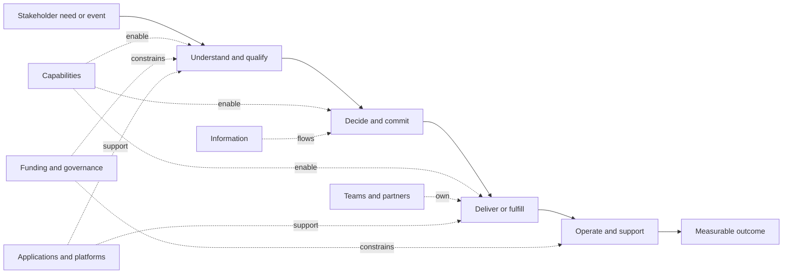
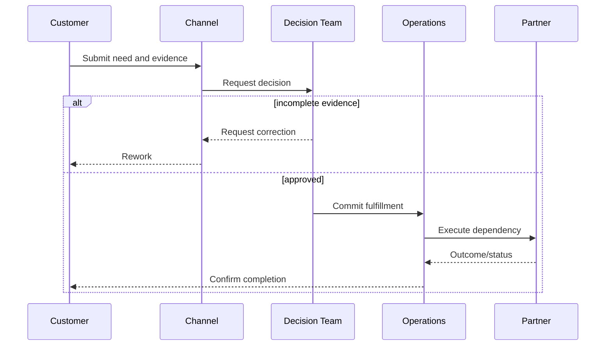

A value stream follows value from a triggering need to an outcome for a customer, employee, partner, regulator, or the enterprise. The operating model explains how capabilities, people, information, technology, funding, governance, and partners are arranged to deliver that value repeatedly.

Together they expose architecture problems that application inventories miss: fragmented ownership, queues between functions, conflicting measures, unfunded dependencies, manual controls, and platforms whose operating responsibility does not match their intended architecture.

## Architectural Question

**How does value move across enterprise boundaries today, and which ownership, funding, governance, information, and operating constraints must architecture address?**

## Business Problem

Most customer and operational outcomes cross several teams and systems. Each local function can meet its target while the end-to-end result fails.

| Local optimization | End-to-end consequence |
|---|---|
| Sales maximizes submitted applications | Operations receives incomplete cases and longer queues |
| Fraud reduces false negatives | Legitimate customer abandonment increases |
| Platform team standardizes deployment | Product teams wait for centralized changes |
| Finance minimizes infrastructure cost | Resilience and engineering lead time deteriorate |
| Regional teams customize processes | Global data and controls become inconsistent |
| Program funds build only | Services launch without lifecycle ownership or support capacity |

Architecture must account for the system of work, not only the system of software.

## Why It Matters

Value-stream and operating-model discovery reveals:

- where value waits or is lost;
- which capability or decision owns each stage;
- where information is re-entered, reconciled, or mistrusted;
- which controls and exceptions are manual;
- where organizational boundaries create technical coupling;
- who funds change and ongoing operation;
- whether target ownership can operate the proposed architecture; and
- which roadmap sequence is feasible.

## Core Model

### Value Stream Versus Process

| View | Focus |
|---|---|
| Value stream | End-to-end value and outcomes across capability boundaries |
| Process | Detailed sequence, roles, decisions, controls, and exceptions |
| Journey | Stakeholder experience, goals, channels, and touchpoints |
| Capability map | Stable abilities required to deliver value |

Use the value stream to frame scope and ownership; use process and journey discovery for operational detail.

## How It Works

### 1. Define Trigger, Stakeholder, and Outcome

Examples:

- customer needs a mortgage and reaches funded loan;
- retailer needs stock replenished and reaches available inventory;
- employee needs access and reaches productive, governed access;
- regulator requests evidence and receives complete, timely submission;
- product team needs a feature and reaches safe customer availability.

Define measurable outcome and guardrails using the [success-measure model](/architecture-discovery/business-discovery/business-outcomes-and-success-measures/).

### 2. Identify Value Stages

Use 5–9 stages expressed as achieved states, not departments or applications.

| Weak stage | Better stage |
|---|---|
| Sales | Need understood and offer selected |
| Risk Team | Eligibility and exposure decided |
| Operations | Request fulfilled and confirmed |
| IT | Service available and supported |

Stages should remain understandable if the organization or technology changes.

### 3. Map Enabling Capabilities

Connect each stage to the [business capabilities](/architecture-discovery/business-discovery/business-capability-mapping/) it needs.

| Stage | Core capability | Enabling capability | Current gap |
|---|---|---|---|
| | | | |

Capabilities reused across several value streams often justify shared platforms or governance—but reuse alone does not determine central ownership.

### 4. Measure Flow

Capture more than elapsed time.

| Measure | What it reveals |
|---|---|
| Lead time | Total time from trigger to outcome |
| Touch time | Time actively creating value |
| Wait/queue time | Organizational or capacity delay |
| First-pass yield | Work completed without correction |
| Rework and handoffs | Quality and boundary friction |
| Abandonment/failure | Lost value and affected segments |
| Exception rate | Variability and need for human judgment |
| Work in progress | Overload and bottleneck |
| Cost to serve | Economic impact across functions |

Segment by case type and conditions; averages hide exceptions that drive architecture requirements.

### 5. Discover Handoffs and Decisions

For each boundary, ask:

- What information and evidence cross it?
- Is meaning shared or translated?
- Who can accept or reject the work?
- Which SLA or queue applies?
- What happens when information is missing?
- Which system and owner track state?
- How are failure and compensation handled?
- Does funding or authority stop at the boundary?

### 6. Map the Operating Model

| Dimension | Discovery questions |
|---|---|
| Accountability | Who owns end-to-end outcome and each capability? |
| Organization | Which teams perform, decide, enable, and support? |
| Decision rights | What is centralized, delegated, federated, or local? |
| Funding | Who funds platforms, product change, migration, and run? |
| Governance | Which policies, reviews, exceptions, and escalation apply? |
| Information | Who owns semantics, quality, access, and lifecycle? |
| Technology | Which shared and local platforms enable the stream? |
| Sourcing | Which vendors and partners own critical outcomes or constraints? |
| Measures | Do local incentives support the end-to-end outcome? |

### 7. Identify Operating-Model Archetypes

| Model | Strength | Risk |
|---|---|---|
| Centralized | Consistency and concentrated expertise | Bottleneck and distance from domain outcomes |
| Decentralized | Local speed and context | Duplication and incompatible standards |
| Federated | Shared guardrails with domain autonomy | Ambiguous boundaries and negotiation cost |
| Platform-enabled | Reusable self-service capabilities | Platform adoption and product-management maturity required |
| Outsourced/partnered | Access to capability and scale | Contract, observability, concentration, and exit risk |

The target architecture must be operable by the chosen model. A distributed microservice architecture with centralized change approval and no service ownership is structurally inconsistent.

### 8. Expose Funding and Incentive Misalignment

Common gaps include:

- project funding without product/service lifecycle funding;
- shared platforms funded by one consumer;
- benefits owned by one function while costs sit in another;
- migration funding excluding coexistence and decommissioning;
- local KPIs that increase global queue or risk; and
- vendors rewarded for delivery volume rather than outcome.

Treat funding and incentives as architecture constraints because they determine whether ownership and operational responsibility are sustainable.

### 9. Derive Architecture Implications

| Finding | Architecture implication |
|---|---|
| Shared customer evidence is collected repeatedly | Governed reusable evidence capability and consent model |
| One decision team queues every product change | Rule ownership and delegated decision model |
| No owner spans fulfillment journey | End-to-end outcome governance and service-level model |
| Platform funded as a project | Product funding and lifecycle ownership before adoption |
| Regional variations are undocumented | Common core and governed variation architecture |
| Partner dependency has no operational telemetry | Contract, observability, fallback, and escalation requirements |

### 10. Validate Target Feasibility

Test proposed architecture against operating reality:

- Who will own each service and outcome?
- Can teams deploy, support, recover, secure, and pay for it?
- Which decisions remain centralized and why?
- How will platform demand and priorities be governed?
- Which transition states create dual operation?
- What changes in incentives, roles, skills, and funding are required?

## Evidence and Validation

| Claim | Evidence |
|---|---|
| Flow delay | Workflow timestamps, queue data, observation |
| Rework | Case history, exception records, support contacts |
| Ownership | Governance mandate, objectives, budget and service records |
| Decision bottleneck | Approval logs, wait time, change history |
| Funding constraint | Budget model, chargeback, contract, portfolio decisions |
| Operating readiness | On-call, incidents, recovery tests, delivery history, skills evidence |

Workshop maps must be corroborated with actual flow and operating data.

## Practical Example

### Telecom Product Launch

A telecom operator wants a modern product catalog to reduce launch time.

Value-stream discovery finds:

| Stage | Finding | Implication |
|---|---|---|
| Offer design | Commercial, network, and billing definitions diverge | Shared product semantics and ownership needed |
| Feasibility | Reviews happen sequentially across functions | Parallel evidence and decision workflow |
| Configuration | Catalog, charging, CRM, and channels re-enter data | Governed configuration distribution |
| Testing | Environment and test-data queues dominate | Environment/data platform capability |
| Launch | Regional operations use manual checklists | Observable release and rollback model |

The catalog replacement remains useful, but the outcome depends equally on decision rights, semantic ownership, testing capability, and regional operating readiness.

## Tradeoffs and Boundaries

| Choice | Benefit | Risk | Treatment |
|---|---|---|---|
| End-to-end ownership | Optimizes outcome | Can conflict with functional authority | Define capability and decision boundaries |
| Central standard | Consistency | Slow response and local misfit | Common core with governed variation |
| Domain autonomy | Speed and ownership | Duplication and fragmentation | Platform contracts and enterprise guardrails |
| Shared platform | Reuse and leverage | Queue, funding, and adoption risk | Product operating model and self-service measures |
| Outsourcing | Scale and expertise | Reduced control and exit risk | Contracts, telemetry, portability, and retained ownership |

## Common Mistakes and Anti-Patterns

| Anti-pattern | Why it fails | Correction |
|---|---|---|
| Department swimlane equals value stream | Internal structure replaces stakeholder value | Start with trigger and outcome |
| Happy-path stream | Exceptions and rework disappear | Use real cases and failure paths |
| Technology-only bottleneck | Queues and authority are ignored | Measure flow across people, process, data, and systems |
| Target architecture without target ownership | No team can operate the design | Co-design operating model and architecture |
| Shared platform by mandate | Adoption and funding remain unresolved | Define platform product, consumers, measures, and governance |
| Project-to-run cliff | Delivery ends before lifecycle ownership | Fund and accept service operation before launch |

## Best Practices

1. Begin with stakeholder trigger and measurable outcome.
2. Express stages as achieved states.
3. Connect stages to capabilities and ownership.
4. Measure wait, rework, exceptions, failure, and cost—not only cycle time.
5. Include manual, partner, and governance handoffs.
6. Make funding and incentives visible.
7. Test architecture against operating-model capability.
8. Preserve valuable local variation deliberately.
9. Design transition ownership for coexistence states.
10. Align local measures with end-to-end outcomes.

## Architecture Review Notes

Challenge the model when:

- stages mirror departments or systems;
- value recipient and outcome are unclear;
- flow data relies only on workshop estimates;
- exceptions, controls, and partners are missing;
- no one owns the end-to-end result;
- platform or service ownership begins after implementation;
- funding covers build but not run or decommissioning;
- target architecture assumes autonomy the governance model does not permit; or
- local KPIs conflict with the outcome.

## Interview Questions

### What is the difference between a value stream and a process?

A value stream frames end-to-end value from trigger to outcome across capabilities. A process describes the detailed flow of activities, decisions, controls, roles, and exceptions.

### How does the operating model affect architecture?

It determines ownership, decision rights, funding, skills, support, governance, platform use, and lifecycle accountability. An architecture that the operating model cannot own or run is not viable.

### How do you identify value-stream bottlenecks?

Measure lead and touch time, queues, handoffs, rework, exceptions, failure, work in progress, and cost; then validate causes across process, policy, data, systems, capacity, and authority.

### When should a capability be centralized?

When shared consistency, risk, scale, or scarce expertise outweighs local responsiveness—and when the central model can provide funded, measurable service without becoming a bottleneck.

### What signals that a platform operating model is missing?

Project funding, unclear product ownership, manual consumer onboarding, centralized ticket queues, no adoption/outcome measures, weak support, and consumers building alternatives.

## Summary

Value-stream discovery shows how business outcomes cross capabilities, systems, teams, and partners. Operating-model discovery explains who owns, funds, decides, governs, and runs that flow.

Together they prevent architects from proposing technically coherent target states that are organizationally unfundable, unowned, or impossible to operate.

The handbook next moves into domain discovery: shared language, business rules, ownership boundaries, and domain events.

## Related Handbook Guidance

- [Business Outcomes and Success Measures](/architecture-discovery/business-discovery/business-outcomes-and-success-measures/) — end-to-end outcome definition
- [Business Capability Mapping](/architecture-discovery/business-discovery/business-capability-mapping/) — abilities enabling value streams
- [Stakeholders and Decision Rights](/architecture-discovery/discovery-framework/stakeholders-and-decision-rights/) — authority and escalation
- [Microservices](/microservices/) — service and platform implementation patterns after operating boundaries are understood
