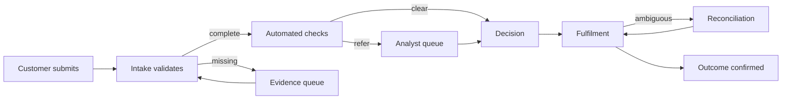

Current-state process discovery explains how an outcome is produced today—not how policy says it should be produced. It follows work across actors, systems, queues, controls, spreadsheets, messages, batch windows, and manual intervention. The purpose is not to preserve every step; it is to expose architectural facts, constraints, failure modes, and improvement opportunities.

## Architectural Question

**How does work really move from trigger to verified outcome, and where do ownership, information, controls, delays, dependencies, and failure recovery shape the architecture?**

## Process, Journey, and Capability

These views answer different questions:

| View | Primary question | Stable anchor |
|---|---|---|
| Journey | What does an actor experience while pursuing a goal? | Actor outcome |
| Process | How is work coordinated to produce the outcome? | Flow of work |
| Capability | What must the enterprise be able to do? | Business ability |

Connect the three but do not collapse them. One journey may invoke several processes; one process may support several journeys; capabilities often remain stable while process and technology change.

## Evidence-First Mapping

Start with a recent representative case and follow its evidence: timestamps, audit trails, tickets, emails, queue records, logs, forms, decisions, and reconciliations. Then compare it with procedure and policy. Interview the people doing and receiving the work.

Record disagreements explicitly:

- **documented process** — the approved or expected flow;
- **observed process** — what participants actually do;
- **system behavior** — what production evidence demonstrates;
- **exception practice** — how difficult cases are completed;
- **control intent** — the risk a control is meant to address.

Existing behavior is evidence, not automatic target-state requirement.

## Minimum Process Record

| Field | Discovery content |
|---|---|
| Trigger and outcome | Observable start and verified completion |
| Scope | First/last step, products, regions, channels, exclusions |
| Participants | Performers, decision owners, support, external parties |
| Activities | Work performed and information consumed or produced |
| Systems and records | Applications, files, queues, messages, source of truth |
| Handoffs and waits | Ownership changes, queues, batching, scheduling |
| Rules and controls | Validations, approvals, segregation, evidence |
| Measures | Volume, elapsed/touch time, backlog, error, rework, abandonment |
| Exceptions | Frequency, cause, handling, escalation, recovery |
| Evidence | Source, observation date, confidence, owner |

## Mapping the Real Flow

For every connector ask: who sends what, through which channel, under which contract, with what timing and correlation, and what happens when it does not arrive.

## Quantify Flow

A process map without measures cannot distinguish an architectural constraint from anecdote. Capture distributions rather than averages when possible:

- arrival rate and seasonality;
- work-in-progress and backlog age;
- touch time versus elapsed time;
- queue and dependency wait time;
- first-pass yield, rejection, rework, and abandonment;
- exception and manual-intervention rate;
- control failure and reconciliation volume;
- cost per outcome and operational capacity.

Segment by channel, product, geography, actor, risk class, or other material context. A low average can hide a severe tail for the most important cases.

## Handoffs and Ownership

Handoffs are architecture signals. They may require state transfer, access changes, evidence preservation, notification, timeout handling, queue ownership, and operational visibility. Record both responsibility for the next action and accountability for the end-to-end outcome.

Look for orphan states: work accepted by one participant but not acknowledged by the next. Define how it is detected, aged, escalated, and reconciled.

## Controls and Manual Work

Do not label every manual activity as waste. Manual work may provide judgment, safety, legal review, or risk control. Capture its purpose, authority, evidence, capacity, consistency, and failure modes. Automation should preserve control intent while improving outcome, not merely remove a human step.

Conversely, distinguish intentional control from accidental work caused by poor data, fragmented systems, or missing integration.

## Discovery Procedure

1. Define the outcome, boundary, variants, and accountable owner.
2. Select normal, high-value, high-risk, and recent failed cases.
3. Walk evidence from trigger through confirmation and recovery.
4. Capture activities, decisions, handoffs, waits, systems, data, and controls.
5. Measure volume, time, backlog, quality, exceptions, and manual effort.
6. Compare documented, observed, and system-recorded behavior.
7. Identify ownership gaps, duplicate records, hidden queues, and control dependencies.
8. Validate the map with performers, recipients, operations, risk, and data owners.
9. Link findings to scenarios, requirements, risks, and target outcomes.

## Common Failure Modes

- Mapping only the happy path or workshop participants' recollection.
- Drawing applications instead of the flow of work.
- Omitting email, spreadsheets, batch jobs, and offline decisions.
- Treating averages as sufficient evidence.
- Ignoring queue ownership, work ageing, and end-to-end accountability.
- Assuming all manual work should be automated.
- Producing a diagram without findings, measures, or traceability.

## Completion Criteria

The actual flow and important variants are evidenced. Triggers, outcomes, boundaries, ownership, handoffs, queues, controls, systems, records, and measures are explicit. Normal work and exceptions connect to functional, integration, data, quality, security, and operational discovery. Contradictions and confidence are recorded.

## Interview Questions

### Why map current state if the enterprise plans to replace it?

Current state contains commitments, controls, dependencies, data semantics, operational knowledge, failure recovery, and transition constraints. Ignoring it creates unsafe target designs and incomplete migration plans.

### What is the most valuable process metric?

There is no universal metric. Start with the business outcome, then measure flow, quality, risk, and cost. Elapsed time, tail latency, backlog age, first-pass yield, exception rate, and reconciliation often expose more than activity counts.

### How much detail is enough?

Detail is sufficient when it supports a material decision, requirement, risk, or measure. Decompose high-variability or high-risk areas; summarize stable low-risk mechanics.

## Summary

Current-state discovery makes invisible coordination visible. It establishes how work, information, authority, and evidence move, where they wait or fail, and which facts the target architecture and transition must preserve.

Next, examine [process exceptions and compensations](/architecture-discovery/business-process/process-exceptions-and-compensations/).
