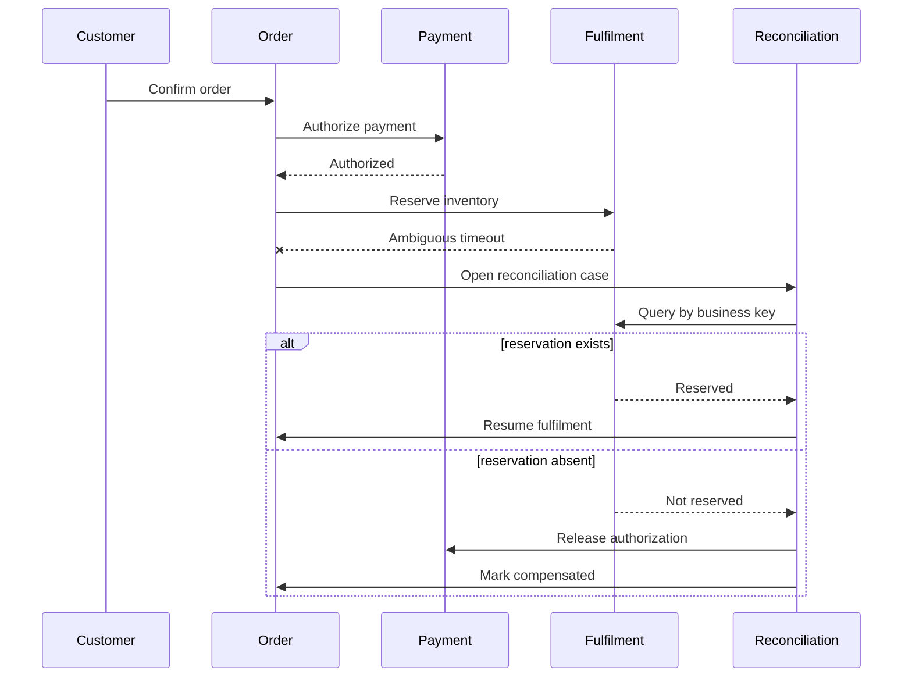
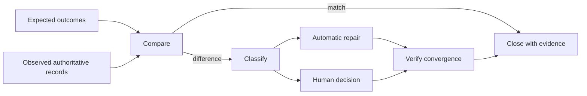

Exceptions are not peripheral behavior. In enterprise systems they determine integrity, customer trust, operational load, and regulatory exposure. Discovery must establish what can fail, the state left behind, who detects and owns it, which actions are safe, and how a trustworthy outcome is eventually reached or explicitly abandoned.

## Architectural Question

**When a process cannot follow its intended path, how is the condition detected, contained, recovered, reconciled, evidenced, and owned?**

## Exception Taxonomy

Classify exceptions by cause and business effect:

| Class | Examples | Discovery focus |
|---|---|---|
| Input | Missing, invalid, contradictory, duplicate | Correction authority and resumption |
| Policy | Ineligible, approval absent, limit exceeded | Decision owner and appeal path |
| Dependency | Timeout, rejection, ambiguous response | Retry, degradation, correlation |
| Concurrency | Stale update, double action, ordering conflict | Invariants and conflict resolution |
| Capacity | Queue saturation, batch overrun, staffing gap | Admission, priority, escalation |
| Security | Suspected fraud, access violation, compromised identity | Containment and investigation |
| Operational | Misconfiguration, partial deployment, data corruption | Restore, rollback, reconciliation |
| External | Partner, network, market, or regulatory disruption | Continuity and communication |

Distinguish an expected business exception from a technical fault. "Applicant needs more evidence" may be a normal state; "the evidence vanished" is a fault.

## Recovery Semantics

Use precise terms:

- **Retry:** repeat an operation when repetition is safe and likely to succeed.
- **Resume:** continue from a durable known state without repeating completed work.
- **Reverse:** apply an authorized business action that changes an outcome.
- **Compensate:** perform a new action that offsets an already completed effect.
- **Reconcile:** compare authoritative evidence and repair or explain differences.
- **Escalate:** transfer decision or action to an accountable role.
- **Abandon:** terminate under an explicit policy while preserving required evidence.

A compensation is not a database rollback. Shipping cannot be rolled back after delivery; a return and refund are new business events with their own rules and risks.

## Failure-State Record

For each material exception capture:

1. trigger and detection mechanism;
2. affected business outcome and actors;
3. known, unknown, and authoritative state;
4. containment and permitted next actions;
5. retry, resume, compensate, or reconciliation policy;
6. time limits and escalation path;
7. customer, partner, and operator communication;
8. ownership and decision authority;
9. audit and operational evidence;
10. acceptance tests and residual risk.

## Example: Partial Fulfilment

The timeout does not prove failure. Retrying blindly could reserve twice. Discovery must establish authoritative query, business idempotency key, pending state, customer message, reconciliation owner, and maximum uncertainty window.

## Retry Policy Discovery

Retries require evidence about failure duration, load, safety, and downstream behavior. Capture retryable conditions, attempt limits, backoff, jitter, deadline, idempotency, duplicate detection, admission control, and final disposition. Coordinate retry budgets across layers; independent retries can multiply load during an outage.

Never use retry to avoid defining an ambiguous outcome. Once the business deadline expires, the process may need reconciliation or compensation instead.

## Human Recovery

Manual recovery needs architecture, not a spreadsheet afterthought. Define:

- a durable case with business correlation;
- complete context and authoritative evidence;
- safe commands rather than direct data editing;
- fine-grained authority and segregation of duties;
- queue ownership, priority, ageing, and escalation;
- explanation, communication, and audit trail;
- bulk handling for systemic incidents;
- feedback into defect, rule, and process improvement.

Operators should not need production database access to restore a business outcome.

## Reconciliation Design Inputs

Discover which records are compared, source precedence, matching keys, tolerances, timing, unresolved-case ownership, correction authority, downstream notification, and evidence retention. Reconciliation may be continuous, scheduled, incident-triggered, or close-of-business. Its service level must match business exposure.

## Common Failure Modes

- Treating every timeout as a failed transaction.
- Retrying operations without business idempotency.
- Using compensation as a synonym for rollback.
- Leaving pending states invisible to customers and operations.
- Assigning exceptions to a generic support queue without outcome ownership.
- Repairing data directly without controlled commands or evidence.
- Designing only single-item recovery when incidents create thousands of cases.
- Measuring uptime while ignoring reconciliation backlog and age.

## Completion Criteria

Material exceptions have defined detection, state, containment, recovery semantics, deadlines, communications, ownership, evidence, and tests. Duplicate, concurrency, late-arrival, partial-success, and ambiguous-outcome cases are covered. Manual recovery and reconciliation are safe, observable, scalable, and governed.

## Review Questions

1. Which failures leave the business outcome unknown rather than failed?
2. What stable key prevents duplicate business effects?
3. Who owns a case while systems disagree?
4. Which completed effects can be compensated, and which are irreversible?
5. How will customers and operators understand pending state?
6. Can recovery handle the volume produced by a systemic outage?

## Summary

Exception discovery turns hidden operational improvisation into explicit business semantics. It defines trustworthy pending states, safe recovery, compensation, reconciliation, communication, and accountability.

Next, use the evidence to design [target processes and automation opportunities](/architecture-discovery/business-process/target-process-and-automation-opportunities/).
