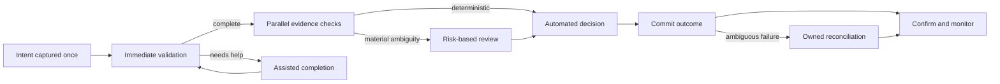
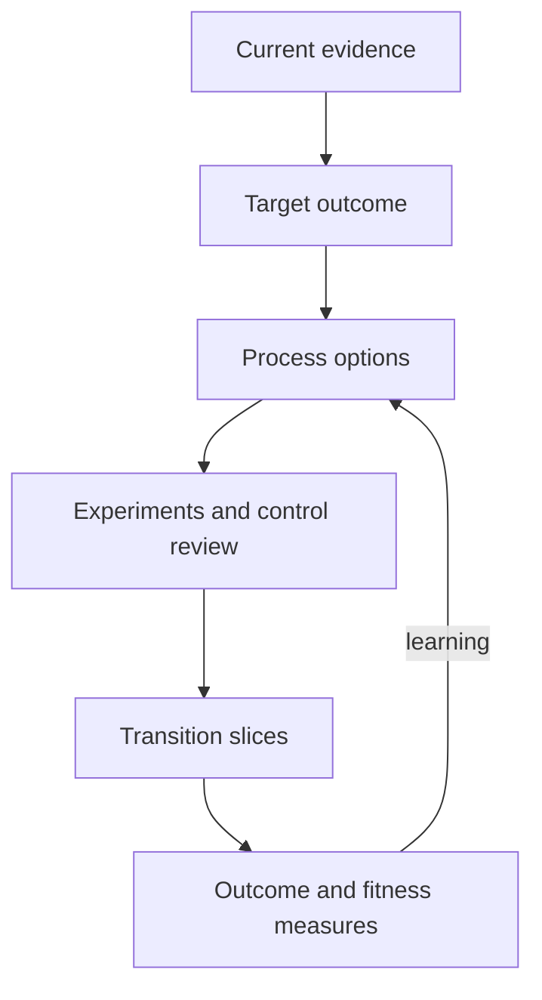

Target-process discovery redesigns how an outcome is achieved. It should remove avoidable delay and rework, strengthen evidence and controls, clarify ownership, and create safe automation boundaries. Reproducing the current process in new technology merely makes old constraints faster and harder to change.

## Architectural Question

**What flow best achieves the target outcome, and which activities should be eliminated, simplified, standardized, assisted, automated, or intentionally retained?**

## Begin with Outcome and Principles

Set measurable outcome targets before drawing the future process: elapsed time, first-pass yield, customer effort, risk exposure, cost, recovery time, accessibility, or another relevant measure. Add design principles such as:

- capture information once at the authoritative point;
- make ownership and pending state visible;
- validate early without blocking unnecessarily;
- automate deterministic high-volume decisions;
- preserve human judgment for material ambiguity;
- build controls into the flow and produce evidence by default;
- design failure recovery with the normal path;
- decouple improvements where independent change creates value.

Principles guide options; they do not replace tradeoff analysis.

## Activity Disposition

For each current activity choose an evidenced disposition:

| Disposition | Suitable when | Key concern |
|---|---|---|
| Eliminate | No longer contributes to outcome or control | Hidden downstream dependency |
| Simplify | Complexity exceeds business need | Policy and variant agreement |
| Standardize | Variation has no outcome value | Local regulatory or customer need |
| Self-service | Actor can safely complete with guidance | Accessibility and assisted fallback |
| Assist | Technology augments human judgment | Explanation and authority |
| Automate | Rules are sufficiently explicit and stable | Exceptions, bias, monitoring |
| Retain manual | Judgment/control value exceeds automation benefit | Capacity and consistency |
| Defer | Evidence or readiness is inadequate | Explicit owner and trigger |

## Automation Suitability

Score candidates across volume, rule clarity, input quality, exception rate, consequence of error, reversibility, policy volatility, integration readiness, observability, control requirements, and human acceptance. A high-volume activity with ambiguous rules and irreversible harm is not an easy automation win.

Do not automate around poor upstream data without addressing ownership and quality. Otherwise the organization moves rework into exception queues.

## Target Flow

For each step define responsibility, state, data, rule, service level, control, exception, operational evidence, and measure. Explicitly model work that remains outside software.

## Control-by-Design

Preserve control intent while reconsidering mechanism. A sequential approval may exist to prevent unauthorized commitments; a target flow might enforce policy automatically, require step-up approval only above a threshold, and continuously monitor exceptions. Validate redesigned controls with risk, compliance, audit, operations, and accountable business owners.

Record segregation of duties, override authority, evidence, retention, monitoring, and periodic review. Faster flow is not success if exposure grows invisibly.

## Human-in-the-Loop Boundaries

Define when human action is required, optional, prohibited, or escalated. A review queue needs reason codes, complete context, recommended action where appropriate, confidence, service level, priority, authority, safe commands, and learning feedback. Monitor automation outcomes by relevant segments and detect drift.

Human review should address meaningful uncertainty—not compensate permanently for missing integration or unclear ownership.

## Evaluate Process Options

Compare at least plausible alternatives. For example:

| Criterion | Central orchestration | Domain-owned collaboration | Managed case flow |
|---|---:|---:|---:|
| End-to-end visibility | High | Medium | High |
| Domain autonomy | Medium | High | Medium |
| Long-running human work | Medium | Low | High |
| Coordination coupling | High | Contract-based | Workflow-based |
| Recovery model | Central state | Distributed reconciliation | Case state |

The table is not a universal ranking. Weight criteria using discovery evidence and test uncertain assumptions with small experiments.

## Transition Feasibility

The target process must coexist with current channels, records, controls, teams, and partners during transition. Discover cutover unit, in-flight work treatment, routing, data synchronization, compatibility, training, support, rollback, and decommission criteria.

Prefer outcome-oriented increments. A slice should improve a measurable journey or process result while remaining operationally supportable.

## Common Failure Modes

- Digitizing every current approval and handoff.
- Choosing automation by labor cost alone.
- Removing manual control without preserving its intent.
- Hiding low-confidence decisions behind automated interfaces.
- Designing the target without recovery and reconciliation.
- Assuming one target variant works for every region or channel.
- Producing an end-state diagram without viable transition increments.
- Measuring activity automation rather than business outcome.

## Completion Criteria

The target flow links to measurable outcomes and evidence. Activity dispositions and automation boundaries are justified. Control intent, human judgment, exceptions, recovery, and operational ownership are explicit. Alternatives and tradeoffs are recorded. Transition slices, dependencies, acceptance evidence, and reassessment triggers are defined.

## Interview Questions

### How do you identify a good automation candidate?

Look for meaningful outcome value, sufficient volume, explicit and stable rules, trustworthy inputs, manageable exceptions, reversible or contained errors, observable behavior, and operational ownership.

### Should the target process ever preserve manual work?

Yes. Human judgment, empathy, negotiation, legal authority, safety review, or low-volume complex work may be intentional. The architecture should support it safely and measurably.

### How do you avoid designing an unrealistic end state?

Evaluate readiness and coexistence early. Define independently valuable transition slices, in-flight treatment, control continuity, support, rollback, and measures that validate assumptions.

## Summary

Target-process discovery redesigns work around outcomes rather than applications. It makes automation selective and evidence-based, preserves control intent and human judgment, embeds recovery, and connects the future flow to feasible transition increments.

Continue with [quality-attribute discovery](/architecture-discovery/non-functional-discovery/) to express how well these behaviors must operate under measurable conditions.
