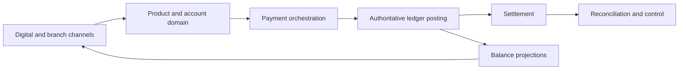
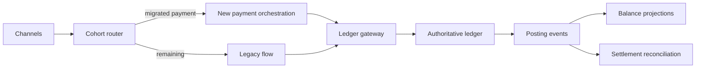

## Scenario

A regional bank operates deposits, payments, fees, interest, statements, and servicing on a thirty-year-old core platform. Digital growth, real-time payment obligations, slow product change, a shrinking specialist workforce, and an upcoming infrastructure-support deadline have triggered modernization. The core is stable during normal operation but releases require coordinated weekend windows, reconciliation creates substantial manual work, and several channels read replicated balances with different freshness.

Leadership proposes “move the core to cloud in two years.” Discovery must determine what outcome is required, what the core actually owns, which risks are acceptable, and how value can be delivered without compromising ledger integrity or regulatory evidence.

## Engagement Charter

**Decision:** Select modernization dispositions and a transition approach for retail deposits and payments.

**Outcomes:**

- reduce product-rule change lead time from twelve weeks to two;
- support real-time payment deadlines and controlled degradation;
- retire unsupported infrastructure before the contractual deadline;
- preserve zero unexplained financial loss and reproducible posting decisions;
- reduce manual reconciliation cases by 70%;
- establish sustainable service ownership and recovery evidence.

**Scope:** deposit products, posting, balance, fees, interest, payment initiation, settlement, reconciliation, statements, customer servicing, critical integrations, data, controls, and operations.

**Exclusions:** commercial lending and treasury replacement, except where they consume shared core data.

## Stakeholders and Decision Rights

| Role | Accountability |
|---|---|
| Retail banking executive | Outcomes, investment, residual business risk |
| Product/domain owners | Product, account, payment, ledger rules |
| Finance/controller | Posting, balancing, close, financial evidence |
| Operations | Exceptions, settlement, reconciliation, support |
| Risk/compliance | Obligations, controls, acceptance authority |
| Architecture/engineering | Options, boundaries, quality and transition evidence |
| Platform/vendor | Runtime, support, capacity, recovery responsibilities |

Frontline branch, call-center, settlement, and reconciliation staff participate because documented procedures omit critical recovery work.

## Discovery Findings

### Business and capability

- Product launch delay comes primarily from shared rule deployment and regression, not infrastructure provisioning.
- The “core” contains distinct product, account, posting, fee, statement, settlement, and reference-data responsibilities.
- Fee and eligibility behavior varies across channels because rules were copied.
- Several low-volume products are in runoff but impose disproportionate regression cost.

### Domain and data

- Available balance, ledger balance, and displayed balance are conflated in channel documentation.
- The ledger owns completed postings; a channel cache is treated incorrectly as authoritative during incidents.
- Product rules lack stable version identifiers, making historical decisions difficult to reproduce.
- Customer identity is owned outside the core, but nightly matching creates duplicate party links.

### Integration and operations

- Forty-three critical consumers use files or database views; eleven are absent from the catalogue.
- A payment timeout produces unknown posting state, but two channels retry with a new reference.
- Recovery documentation restores infrastructure but does not prove ledger-to-network reconciliation.
- One vendor team and three internal specialists hold most core knowledge.
- Month-end and payment peaks overlap with batch work and reduce capacity headroom.

### Security and compliance

- Privileged correction uses controlled procedures but includes direct database updates.
- Audit evidence crosses the core, settlement engine, case tooling, and archived files.
- Data residency and records requirements apply to target, transitional, and backup copies.

## Governing Quality Scenarios

1. When a payment request is repeated after an ambiguous timeout, one business posting occurs and the original outcome is returned by stable idempotency key.
2. During loss of a payment-network dependency, accepted instructions remain durable, customers see pending status, and reconciliation completes within the agreed window.
3. After regional recovery, priority balance and payment journeys resume within RTO, ledger loss remains within RPO, and external settlement differences are reconciled before normal volume resumes.
4. A product-rule change can be introduced for one bounded product without coordinated deployment of unrelated products, with historical decisions reproducible by rule version.

## Options

| Option | Strength | Material limitation |
|---|---|---|
| Rehost current core | Meets facility deadline fastest | Preserves product/release coupling and specialist risk |
| Replace with packaged core | Transfers platform lifecycle and common capability | Process fit, customization, data migration, vendor concentration |
| Incremental domain extraction | Targets change bottlenecks and preserves proven ledger | Longer coexistence and demanding data/contract governance |
| Full custom rebuild | Maximum target control | Highest equivalence, delivery, control, and cutover risk |

## Recommendation

Adopt a staged combination:

1. stabilize and replatform the existing ledger/core runtime to retire immediate infrastructure risk;
2. establish authoritative identifiers, event evidence, payment idempotency, observability, and reconciliation;
3. extract product configuration and fee decisioning behind governed contracts;
4. move digital payment orchestration by customer/product cohorts while the ledger remains authoritative;
5. evaluate package replacement for commodity account servicing after process-standardization evidence;
6. retire runoff products and unused consumers continuously.

The recommendation preserves the tested financial ledger initially while changing the responsibilities that constrain business outcomes.

## Transition Architecture

The gateway enforces stable business keys and compatibility. The ledger remains authoritative for posting. Cohort routing is sticky for in-flight instructions. Every transition adapter has an owner, telemetry, expiry, and consumer migration plan.

## Migration Waves

| Wave | Outcome | Exit evidence |
|---|---|---|
| 0 | Establish baseline and operational safety | Service ownership, incident signals, recovery/reconciliation exercise |
| 1 | Real-time payment integrity | Idempotency, pending state, settlement evidence under failure |
| 2 | Independent product-rule change | Versioned rules, bounded deployment, audit reproduction |
| 3 | Migrate payment cohorts | Outcome/SLO/control parity and legacy-volume reduction |
| 4 | Simplify products and servicing | Runoff retirement, process adoption, consumer migration |
| 5 | Decide ledger disposition | Updated evidence, package/custom options, last responsible date |

## Risks and Fitness Measures

- Unregistered consumer removal → runtime discovery, owner validation, deprecation window.
- Divergent balance projections → authoritative definitions, freshness signals, reconciliation.
- Specialist attrition → knowledge pairing, runbook tests, bounded interfaces.
- Permanent coexistence → transition WIP limits, adapter expiry, legacy-traffic fitness.
- Control regression → automated posting invariants, audit evidence, recovery exercises.

Track product change lead time, payment success and pending age, duplicate effects, reconciliation exposure/age, incident detection-to-reconciliation, legacy traffic, transition cost, rule-version coverage, and retired infrastructure.

## Lessons

- The valuable stable ledger and the constraining “core” were not the same boundary.
- Infrastructure movement alone could not deliver product changeability.
- Ambiguous payment outcomes and reconciliation shaped architecture more than API style.
- Transition states required full security, operations, data, and control ownership.
- Retirement evidence was an outcome, not a final cleanup task.

Next case: [Healthcare Interoperability Platform](/architecture-discovery/case-studies/healthcare-interoperability-platform/).
