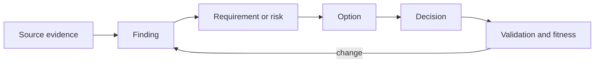

## Purpose

Architecture discovery produces sufficient evidence for a bounded decision. It does not attempt to remove every unknown or preselect a technology.

## Lifecycle

| Stage | Primary question | Exit evidence |
|---|---|---|
| Frame | What decision, outcome, scope, authority, and deadline? | Accepted charter |
| Prepare | Who participates and what evidence is accessible? | Engagement readiness |
| Discover | What is true across business and architecture domains? | Findings with confidence |
| Validate | Which claims conflict or remain uncertain? | Playback and targeted evidence |
| Synthesize | What decision themes and viable options emerge? | Comparable options |
| Decide | Which option and tradeoffs are accepted? | ADR/recommendation |
| Handoff | What conditions, owners, measures, and triggers continue? | Accepted closure package |

## Core Roles

- Sponsor/outcome owner: owns purpose and benefits.
- Decision authority: accepts the architecture choice.
- Domain/data owners: own meaning, rules, and authoritative state.
- Service/operations owners: own sustained outcomes and recovery.
- Security/risk owners: own control evidence and residual exposure.
- Architect: integrates evidence, options, consequences, and traceability.

## Evidence Flow

Record source, scope, date, owner, confidence, contradiction, and decision impact.

## Minimum Outputs

- charter and stakeholder/decision-rights map;
- evidence-backed current-state baseline;
- measurable requirements and quality scenarios;
- risk, assumption, dependency, and decision records;
- viable options, evaluation, recommendation, and conditions;
- transition/operating model where required;
- artifact index, owners, measures, and reassessment triggers.

## Quality Gates

- The decision question and authority are clear.
- Facts are distinguishable from assumptions and preferences.
- Critical domains and failure/recovery paths are covered.
- Options are materially different and pass mandatory gates.
- Residual risk is accepted by an authorized owner.
- Open work has owner, due date, consequence, and next gate.

## Stop Asking When

Additional answers will not change scope, requirements, risk, options, acceptance, or the next authorized decision.

Detailed guide: [Architecture Discovery Framework](/architecture-discovery/introduction/).
