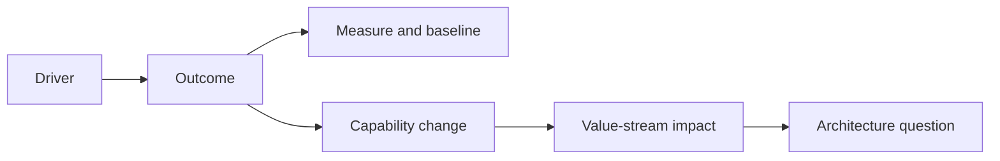

## Outcome Chain

## Essential Evidence

| Concern | Capture |
|---|---|
| Drivers | Market, customer, regulation, cost, risk, strategy, deadline |
| Outcomes | Actor-valued result, baseline, target, horizon, owner |
| Capabilities | Stable business ability, importance, maturity, ownership, gap |
| Value streams | Trigger-to-outcome stages, measures, participants, handoffs |
| Operating model | Funding, decision rights, organization, partners, incentives |
| Scope | Included/excluded capability, region, product, channel, dependency |

## Strong Outcome

State actor, observable result, baseline, target/range, measurement method, date, and accountable owner. Separate leading measures from lagging benefits.

## Capability Mapping

- Model what the enterprise must be able to do, not the org chart.
- Use consistent granularity.
- Assess importance and condition separately.
- Connect gaps to outcomes and evidence.
- Avoid embedding current applications in capability names.

## Value-Stream Questions

- Where does value begin and become realized?
- Where are waits, rework, failure, and control?
- Who owns end-to-end outcome versus each stage?
- Which capability, data, and system enable each stage?
- Which measure demonstrates constraint or improvement?

## Red Flags

- “modernize,” “be agile,” or “move to cloud” used as outcomes;
- targets without baselines or benefit owners;
- capability heat maps based only on opinion;
- process details substituted for strategic context;
- architecture scope that ignores operating-model change.

Detailed guide: [Business Context and Strategic Drivers](/architecture-discovery/business-discovery/).
