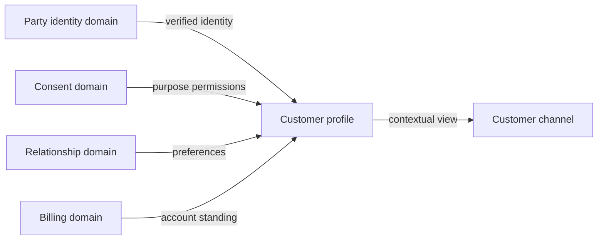
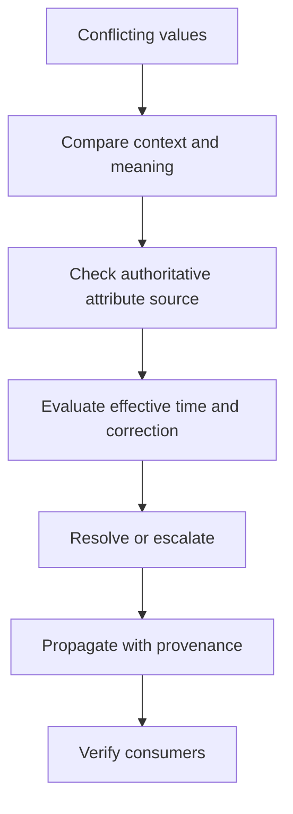

Data discovery begins with meaning and accountability, not tables. The same label can represent different facts in sales, finance, operations, and regulation. Architecture must establish which domain defines each concept, where authoritative state is created, who may change it, how consumers interpret it, and how conflicts are resolved.

## Architectural Question

**Which data concepts are material to business outcomes, what do they mean in each context, and who is accountable for their definition, quality, access, and lifecycle?**

## Data Domains

A data domain groups information around coherent business meaning and ownership. It should align with business responsibilities rather than database boundaries. Customer identity, party relationship, product, agreement, order, clinical encounter, ledger, and workforce are examples; each enterprise must discover its own language.

Do not force a single enterprise-wide meaning where legitimate contexts differ. Define translations and authority instead.

| Term | Sales context | Finance context | Architecture consequence |
|---|---|---|---|
| Customer | Prospect or buying relationship | Legal counterparty with account | Explicit identifiers and translation |
| Revenue | Booked commercial value | Recognized amount under accounting rules | Different timing and authority |
| Product | Market offer | Financial/reporting classification | Versioned mappings |
| Active | Eligible for engagement | Contract/account status | Context-qualified states |

## Ownership Dimensions

Avoid a single ambiguous “data owner” field. Record:

- **semantic owner:** approves definition and business rules;
- **system-of-record owner:** operates authoritative state changes;
- **data product owner:** commits to consumer usability and service levels;
- **steward:** coordinates quality, metadata, and issue resolution;
- **control owner:** ensures privacy, retention, and regulatory obligations;
- **consumer owner:** validates intended use and fitness requirements.

One role may perform several responsibilities, but accountability must be named.

## Data Concept Record

| Field | Discovery content |
|---|---|
| Concept and context | Preferred term, aliases, bounded meaning |
| Definition and rules | Inclusion, exclusion, derivation, invariants |
| Identifier | Business key, technical keys, matching authority |
| Authoritative source | System/domain for each fact and lifecycle stage |
| Creation/change | Events, actors, validations, effective time |
| Consumers and purpose | Decision, operation, analytics, reporting, control |
| Quality | Dimensions, thresholds, monitoring, issue ownership |
| Classification | Sensitivity, residency, access, retention |
| Evidence | Source, owner validation, date, confidence |

## Authority Is Attribute-Specific

One system is rarely authoritative for every attribute of an entity. Identity may own legal name, CRM may own communication preference, billing may own payment standing, and consent may own permitted use. Build an authority matrix at concept or attribute group level.

The contextual view is composed; it should not silently become a new master.

## Discover Consumers and Purpose

Record why each consumer uses data. The same dataset may be fit for operational display but not for credit decisions or regulatory reporting. Capture required freshness, completeness, accuracy, history, explainability, granularity, and permitted purpose.

Consumer discovery also reveals shadow copies, extracts, spreadsheets, local corrections, and derived fields whose lineage or authority is unclear.

## Identity and Matching

Discover natural and assigned identifiers, scope, reuse, survivorship, merge/split policy, aliases, duplicates, household or organization relationships, and cross-domain correlation. Avoid assuming email, phone, or name is a stable unique identifier.

For entity resolution, record confidence, human-review thresholds, correction, downstream propagation, and audit. A false merge may be more harmful than an unresolved duplicate.

## Data Ownership Conflict

When systems disagree, do not automatically choose the newest timestamp. Determine semantic authority, effective time, correction status, provenance, and business rule. Record unresolved conflicts as architecture risks or decisions.

## Discovery Procedure

1. Start from outcomes, domain language, processes, decisions, reports, and events.
2. Identify material concepts and context-specific meanings.
3. Assign semantic, operational, stewardship, control, and consumer responsibilities.
4. Map attribute-level authority and state-change rules.
5. Inventory consumers, purpose, fitness, and shadow copies.
6. Analyze identifiers, relationships, history, and conflict handling.
7. Capture classification and lifecycle obligations for follow-on discovery.
8. Validate with domain experts, data teams, operations, privacy, and consumers.

## Common Failure Modes

- Treating database schemas as the enterprise data model.
- Declaring one “golden source” for every attribute and context.
- Assigning ownership to an application or committee rather than a role.
- Standardizing labels while preserving incompatible semantics.
- Ignoring consumer purpose and fitness requirements.
- Assuming timestamps resolve authority conflicts.
- Omitting derived data, spreadsheets, extracts, and correction flows.

## Completion Criteria

Material concepts have context-qualified definitions, rules, identifiers, attribute-level authority, accountable roles, consumers, purpose, quality needs, classification leads, and evidence. Conflicting meanings and ownership gaps are explicit. Findings connect to domain, integration, security, lifecycle, and architecture decisions.

## Interview Questions

### What is a source of truth?

It is an accountable authority for a defined fact in a defined context and time—not simply the database with the most complete copy. Authority can differ by attribute and lifecycle stage.

### How do data domains relate to bounded contexts?

Both organize coherent meaning and ownership. They often align, but analytical, regulatory, or shared-reference domains can cross operational contexts. Make translation and accountability explicit rather than forcing identical boundaries.

### Who owns data quality?

The domain accountable for meaning and creation owns the outcome, while stewards, platforms, producers, and consumers have specific responsibilities. Ownership cannot be delegated entirely to a central data team.

## Summary

Data architecture starts with meaning, authority, and consumer purpose. Context-qualified concepts and accountable ownership prevent duplicated stores and modern platforms from reproducing semantic conflict.

Next, trace [data flows, lineage, quality, and reconciliation](/architecture-discovery/data/data-flows-lineage-quality-and-reconciliation/).
