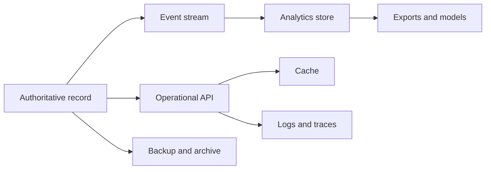
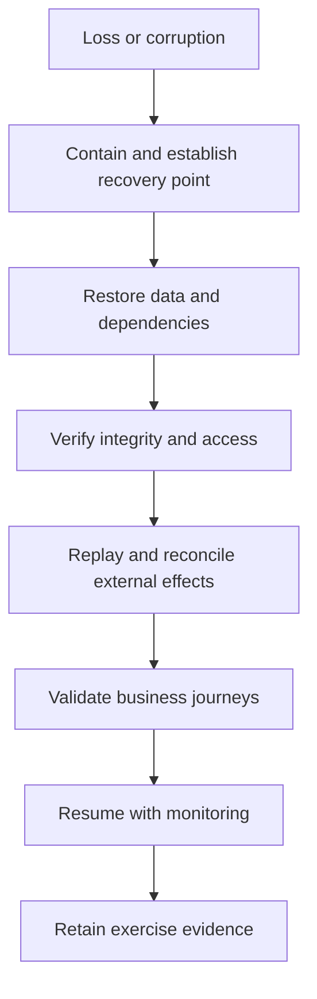

Data lifecycle discovery determines how information is collected, used, shared, retained, archived, corrected, restored, and destroyed. Classification connects business harm and obligation to controls. Recovery connects infrastructure restoration to verified business state. Both must follow copies and derived data across the landscape.

## Architectural Question

**What protection and lifecycle behavior does each material data class require, and how will the enterprise restore and verify trustworthy state after loss or corruption?**

## Classification Beyond Labels

A label is useful only when it drives controls. Classify by consequence and obligation:

- confidentiality and privacy harm;
- integrity and decision consequence;
- availability and recovery criticality;
- regulatory, contractual, or records obligation;
- residency and sovereignty;
- permitted purpose and consent;
- aggregation and re-identification risk.

Record the classifier, rationale, effective date, owner, inherited handling rules, exceptions, and review trigger.

| Class consideration | Questions |
|---|---|
| Sensitivity | What harm follows unauthorized disclosure? |
| Integrity | What happens if altered, stale, incomplete, or duplicated? |
| Criticality | Which outcomes stop, degrade, or become unsafe? |
| Purpose | Why may it be used, and what secondary use is prohibited? |
| Location | Where may it be stored, processed, accessed, or supported? |
| Lifecycle | What starts/ends retention and what overrides deletion? |

## Data Inventory and Propagation

Start from critical concepts and follow all material representations: source records, replicas, caches, events, logs, search indexes, analytics, models, exports, files, backups, support tools, test data, and partner copies. Derived or tokenized data may remain sensitive depending on reversibility and linkage.

Apply classification and lifecycle to each representation, not just the source database.

## Purpose and Access

Discover actors, business purpose, legal or contractual basis where relevant, minimum attributes, approval, segregation of duties, privileged access, emergency access, delegated action, machine identity, and periodic review. Access should reflect domain action and purpose, not broad application roles alone.

Include support, analytics, development, vendors, and administrators. Masking a user interface does not protect logs, exports, or operational tools.

## Retention and Deletion

Translate policy into executable rules:

- object and scope;
- start event and effective time;
- duration and jurisdiction;
- legal hold, dispute, investigation, or audit override;
- archive and retrieval behavior;
- deletion or anonymization method;
- propagation to replicas, derived stores, search, caches, and partners;
- backup expiry and restore re-deletion;
- evidence and accountable owner.

Conflicting obligations require a recorded decision. “Keep forever” is not a safe default, and immediate deletion may violate records duties.

## Residency and Cross-Border Flow

Capture storage, processing, access, support, backup, failover, telemetry, and subcontractor locations. Discover which movement is prohibited, conditional, or requires contractual and technical safeguards. Region labels on a primary database do not prove end-to-end residency.

## Backup Is Not Recovery

A successful backup proves that a process wrote something; it does not prove that the right data can be restored within business objectives or reconciled with external effects. Define:

- business capability and data scope;
- failure/corruption scenario;
- RPO and RTO;
- restore order and dependency prerequisites;
- keys, secrets, configuration, schemas, and software versions;
- integrity and malware checks;
- reconciliation with events, partners, and money movement;
- operational owner, exercise frequency, and evidence.

## RPO and RTO Semantics

Define RPO by data class and business event. Some facts can be reconstructed from an immutable journal; others cannot be lost. Define RTO from business disruption to usable, verified capability—not to server startup. Add maximum tolerable data uncertainty and backlog-clearance objectives.

Dependencies must support the recovery sequence. Restoring an application before identity, keys, network, reference data, or integration partners may not restore the outcome.

## Corruption and Cyber Recovery

Discover detection lag, blast radius, clean-point selection, immutable or isolated copies, privileged access, key recovery, forensic preservation, staged restoration, and reinfection prevention. Replication can copy corruption quickly; availability architecture is not automatically cyber recovery.

## Lifecycle Change and Exit

When a product, tenant, region, provider, or platform exits, define export, portability, deletion, proof, contractual handoff, archive, legal hold, encryption-key disposition, and residual copies. Include decommissioned environments and unmanaged exports.

## Common Failure Modes

- Applying classification only to databases, not logs and derived data.
- Using labels without mapped controls or owners.
- Retaining everything because deletion is difficult.
- Deleting primary records while leaving searchable or exported copies.
- Treating replication or backup success as recovery proof.
- Defining RTO for infrastructure rather than verified business use.
- Omitting keys, configuration, dependencies, and reconciliation from restore.
- Assuming primary-region location proves residency.

## Completion Criteria

Critical data and representations are classified with rationale and control mapping. Purpose, access, location, retention, deletion, holds, and exit are executable and owned. Recovery scenarios have data-specific RPO/RTO, clean restore, dependency order, business validation, reconciliation, exercise evidence, and reassessment triggers.

## Interview Questions

### How do classification and data criticality differ?

Classification commonly describes confidentiality, integrity, availability, and obligation. Criticality focuses on business consequence and recovery priority. Sensitive data may be low availability, while public reference data can be operationally critical.

### How do you delete data from backups?

Often by limiting backup retention, cryptographic erasure where appropriate, access controls, and reapplying deletion after restore. Requirements must reconcile deletion rights with immutable backup and legal retention obligations.

### What proves recoverability?

A representative exercise that restores required data and dependencies, verifies integrity and controls, reconciles external effects, completes priority business journeys within objectives, and records limitations and actions.

## Summary

Classification, lifecycle, and recovery turn data obligations into architecture behavior across every representation. Trustworthy recovery restores business meaning and control—not merely bytes.

Continue with [security discovery: assets, actors, and trust](/architecture-discovery/security/).
