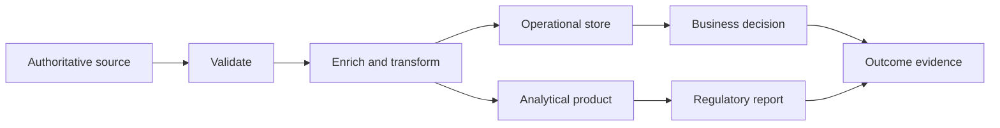
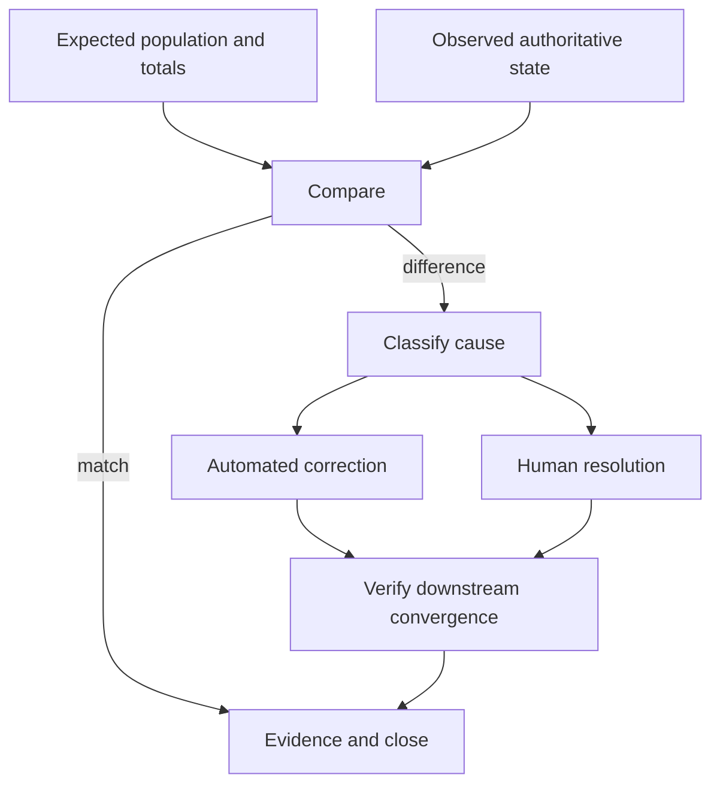

Data flow discovery follows important facts from creation through validation, transformation, movement, storage, use, correction, and deletion. Lineage explains how an outcome or decision was produced. Quality discovery establishes fitness for purpose. Reconciliation restores trust when independently maintained states diverge.

## Architectural Question

**How does material data change as it moves, where can meaning or quality be lost, and what evidence detects and repairs divergence?**

## Select Critical Data Journeys

Do not map every column. Prioritize data that drives money movement, safety, identity, authorization, regulatory reporting, customer commitments, machine decisions, operational recovery, or major architecture change.

Trace representative journeys:

- source to operational decision;
- source to customer-visible outcome;
- source to regulatory or financial report;
- correction back through downstream consumers;
- restore/replay to reconciled state;
- current platform through migration and coexistence.

## Data-Flow Record

| Field | Discovery question |
|---|---|
| Fact and purpose | What meaning moves, and why? |
| Producer/authority | Who creates and owns it? |
| Trigger and timing | Event, request, schedule, cutoff, effective time? |
| Transformation | Mapping, calculation, enrichment, aggregation, filtering? |
| Transport/store | API, event, stream, file, database, report? |
| Consumer/use | Which outcome, decision, control, or analysis? |
| Quality controls | Validation, monitoring, threshold, owner? |
| Provenance | Source, rule/model version, timestamps, actor? |
| Failure/correction | Reject, quarantine, retry, reconcile, restate? |
| Protection/lifecycle | Classification, minimization, retention, deletion? |

## Lineage Levels

Use the least detail that supports the decision:

1. **Business lineage:** concepts and outcomes across domains.
2. **System lineage:** applications, stores, interfaces, reports, and models.
3. **Dataset lineage:** tables, topics, files, pipelines, and transformations.
4. **Field lineage:** attribute-level derivation for high-consequence facts.
5. **Runtime lineage:** actual execution, version, input, and output evidence.

Field-level mapping for every low-risk attribute creates expensive noise. Conversely, system-only arrows cannot explain a regulatory figure or automated decision.

At each edge capture version, effective time, quality, and ownership.

## Data Quality as Fitness

Common dimensions include accuracy, completeness, validity, consistency, timeliness, uniqueness, integrity, provenance, and accessibility. Define them for a consumer purpose.

Example:

> For sanctions screening before payment release, verified legal name, date of birth or incorporation, jurisdiction, and stable party identifier must be present for 99.95% of eligible parties; missing required attributes prevent automatic release, create an owned review case, and are measured by source and channel.

This ties quality to outcome, threshold, behavior, segmentation, and ownership.

## Quality Controls

Place controls where they can prevent or contain harm:

- at creation: validation, reference integrity, authoritative lookup;
- at contract boundary: schema and semantic checks;
- during transformation: balancing, control totals, reasonability;
- at consumption: fitness and freshness checks;
- after outcome: reconciliation and anomaly detection;
- during correction: provenance, approval, propagation, verification.

Do not silently coerce invalid values or substitute defaults that change meaning. Quarantine needs an owner, service level, visibility, and disposition.

## Temporal Semantics

Distinguish event time, effective time, processing time, ingestion time, and correction time. Discover late arrival, backdating, restatement, period close, time-zone, clock, and version rules. “Latest” is unsafe when corrections or future-effective records exist.

For reproducible decisions retain the relevant input facts and rule/model versions or a reliable way to reconstruct them.

## Reconciliation

Reconciliation compares expected and observed authoritative state. Define population, matching keys, tolerances, control totals, frequency, deadline, source precedence, difference classes, automated repair, human authority, downstream correction, and closure evidence.

Monitor unreconciled count, amount/exposure, oldest age, recurrence, cause, and correction latency—not only job completion.

## Correction and Propagation

Discover who may correct which fact, whether correction is overwrite or new version, what effective time applies, how consumers are notified, whether derived results are recomputed, and how prior decisions or reports are restated. Prevent local patches from becoming invisible competing truth.

## Migration and Coexistence

During migration define extraction scope, transformation rules, rejected records, control totals, historical depth, dual-write or synchronization behavior, cutover authority, freeze windows, rollback, validation, and decommission evidence. Reconcile business outcomes, not just row counts.

## Common Failure Modes

- Mapping pipelines without business meaning or consumer purpose.
- Declaring quality globally rather than per use.
- Measuring averages that hide source or segment failures.
- Ignoring effective time, corrections, and rule versions.
- Quarantining records without ownership or deadline.
- Reconciling counts but not business amounts and states.
- Correcting one store without downstream propagation.
- Assuming migration tooling proves semantic equivalence.

## Completion Criteria

Critical data journeys have appropriate business-to-runtime lineage. Transformations, temporal semantics, quality thresholds, controls, provenance, correction, and reconciliation are owned and evidenced. Consumers confirm fitness. Migration and coexistence risks connect to requirements, tests, operational measures, and decisions.

## Interview Questions

### How much lineage is enough?

Use risk-based depth. Trace to the level required to explain a consequential decision, control, report, quality issue, migration, or recovery. Automate broad technical lineage and validate critical semantic links.

### Why can two correct systems disagree?

They may use different meanings, effective times, update latency, transformation rules, correction states, or authority. Reconciliation must compare semantics and time, not only values.

### What is the difference between validation and reconciliation?

Validation checks data against rules at a point in flow. Reconciliation compares independently recorded expectations and outcomes to detect loss, duplication, or divergence after processing.

## Summary

Flow, lineage, quality, and reconciliation make data outcomes explainable and recoverable. They expose where meaning changes and establish controls that keep producers and consumers aligned.

Next, define [data classification, lifecycle, and recovery](/architecture-discovery/data/data-classification-lifecycle-and-recovery/).
