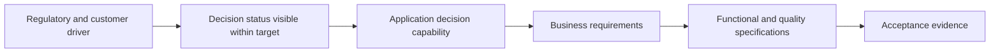

A Business Requirements Document is useful when several business owners, delivery groups, suppliers, or governance bodies need one controlled statement of why change is required, what outcome and scope are authorized, and which business requirements govern acceptance. It should not become a container for detailed solution design or every discovery note.

## Decision Supported

**Do accountable stakeholders agree on the business need, measurable outcomes, scope, capabilities, requirements, constraints, ownership, and acceptance basis for investment and architecture work?**

## When to Use

Use a BRD when:

- investment or procurement requires a governed business baseline;
- outcomes cross products, capabilities, teams, or suppliers;
- regulatory or contractual traceability matters;
- scope and acceptance must remain stable across delivery increments;
- several functional/detailed specifications will derive from one business context.

Use a concise decision brief instead when the change is bounded, ownership is local, and equivalent information already exists in maintained product artifacts.

## Recommended Structure

| Section | Content |
|---|---|
| Control | Owner, status, version, approvers, access, change history |
| Executive context | Decision, driver, urgency, recommendation/ask |
| Outcomes | Actor-valued results, baselines, targets, horizon, benefit owners |
| Scope | Included/excluded capability, actors, process, region, product, data |
| Current evidence | Material facts, pain, risk, measures, confidence |
| Capability/value stream | Affected abilities and outcome flow |
| Business requirements | Stable, testable, uniquely identified statements |
| Rules/obligations | Policies, controls, constraints, sources, authority |
| Assumptions/dependencies | Validation, owners, dates, consequences |
| Risks | Business exposure, treatment, residual acceptance |
| Acceptance | Measures, evidence, accountable approval |
| Traceability | Links to source, detailed requirements, options, decisions, delivery |

## Requirement Quality

A business requirement should state required business behavior or condition without prescribing an unapproved solution.

> BR-017: The bank shall provide an applicant with a durable decision status across digital and assisted channels, including pending evidence and manual-review states, with ownership and next action visible.

Add rationale, source, owner, priority, scope, acceptance measure, dependencies, and status. Avoid “the system shall use Kafka” unless technology is an authorized constraint recorded elsewhere.

## Outcome and Scope Example



Define exclusions with consequence: “Historical document migration is excluded; the records owner will retain searchable access through the legacy archive until retention expiry.”

## Evidence and Traceability

Link each material claim to research, policy, metric, incident, process observation, or owner validation. Mark confidence and contradictions. Maintain stable requirement IDs so change impact can reach detailed scenarios, tests, controls, architecture decisions, and benefits.

Do not duplicate complete source documents. Link authoritative policy and record the interpreted obligation and owner.

## Governance

- Business owner approves need, outcome, scope, and benefit.
- Domain/process owners approve requirements and rules.
- Risk/compliance owners approve obligation interpretation and residual exposure.
- Architecture validates that requirements are decision-ready, not the business authority.
- Change control evaluates outcome, scope, cost, risk, and dependent artifacts.

Approval should permit explicit states: accepted, accepted with conditions, evidence required, rejected, or superseded.

## Quality Checklist

- [ ] Decision and intended audience are clear.
- [ ] Outcomes have baseline, target, horizon, and owner.
- [ ] Scope and exclusions are bounded and consequence-aware.
- [ ] Requirements are necessary, unambiguous, solution-neutral, and verifiable.
- [ ] Rules and obligations cite sources and authority.
- [ ] Assumptions, dependencies, and risks have owners and dates.
- [ ] Acceptance describes evidence, not document approval alone.
- [ ] Traceability supports change impact.
- [ ] Status, version, access, and lifecycle are governed.

## Anti-Patterns

- A 200-page template completed before the decision question is clear.
- Benefits expressed as “modernization” or “improved experience” without measures.
- Current screens copied into requirements.
- Every stakeholder preference marked mandatory.
- Architecture/design embedded among business requirements.
- Sign-off used to conceal unresolved contradictions.
- BRD copied into backlog and specifications until versions diverge.

## Lightweight Template

```text
Decision and authority:
Business driver and evidence:
Outcomes, baselines, targets, owners:
Scope and exclusions:
Affected capabilities/value streams:
Business requirements (ID, statement, rationale, source, owner, acceptance):
Rules and obligations:
Assumptions and dependencies:
Risks and accepted conditions:
Traceability and change governance:
```

## Completion Criteria

The BRD is complete when accountable owners can use it to authorize scope and outcomes, detailed artifacts can derive requirements without reinterpretation, acceptance is measurable, contradictions are governed, and changes can be traced to decisions and delivery.

Next deliverable: [Functional Requirements Specification](/architecture-discovery/deliverables/functional-requirements-specification/).
