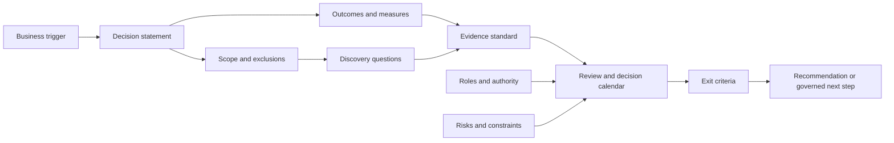
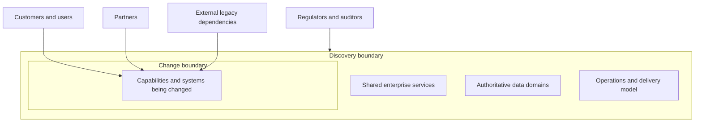
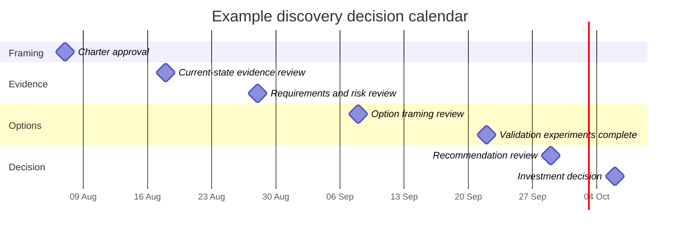
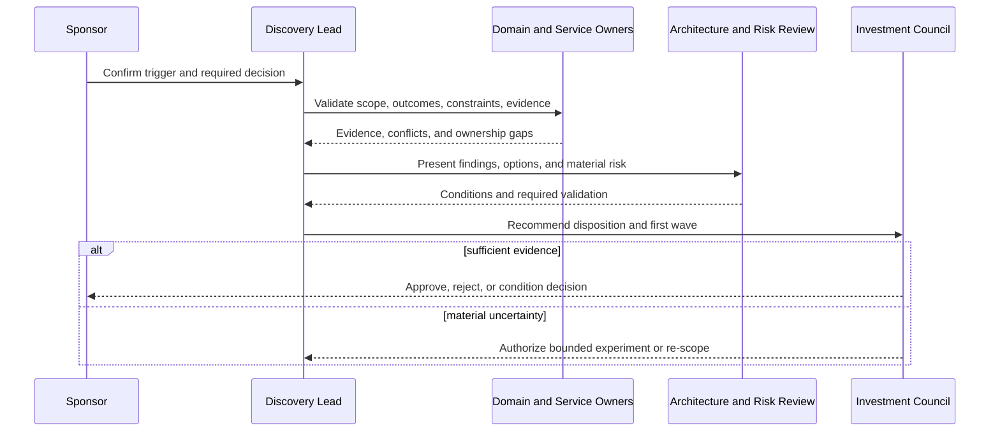

A discovery engagement charter is the agreement that makes architecture discovery governable. It defines which decision the work must enable, why that decision matters, what is inside and outside the boundary, who owns the outcome and risk, which evidence standard applies, and what must be true before discovery can close.

The charter is deliberately short. Its value comes from explicit commitments, not document volume. A useful charter can usually be reviewed in one meeting and understood without a methodology briefing.

## Business Problem

Discovery frequently begins with a calendar invitation and a solution-shaped objective: “cloud assessment,” “microservices workshop,” “ERP replacement,” or “data-platform strategy.” Participants arrive with different assumptions about the actual decision.

| Participant | Common interpretation |
|---|---|
| Sponsor | Confirm the investment direction and produce a roadmap |
| Business owner | Fix a specific customer or operational problem |
| Enterprise architect | Assess strategic fit and cross-domain impact |
| Solution architect | Produce target-state views and key decisions |
| Engineering lead | Resolve technical debt and delivery constraints |
| Operations | Protect reliability, supportability, and recovery |
| Security or compliance | Demonstrate obligations and control coverage |
| Vendor | Position a product or delivery approach |

Without an explicit charter, these interpretations coexist until they collide. The team collects information without knowing what is material, workshops expand into adjacent domains, missing decision owners delay closure, and a polished target architecture is mistaken for stakeholder agreement.

The charter prevents three costly conditions:

1. **Undefined decision:** nobody can state what approval, recommendation, or commitment discovery must enable.
2. **Unbounded investigation:** every related concern enters scope because no exclusion or materiality rule exists.
3. **Unowned outcome:** participants contribute knowledge, but nobody has authority to resolve conflicts or accept residual risk.

## Motivation

The [Architecture Discovery scope and outcomes guide](/architecture-discovery/introduction/) establishes that discovery should begin with a decision rather than a technology. The charter turns that principle into an operating agreement.

It gives the engagement a stable reference when:

- a sponsor asks to add another business unit or region;
- stakeholders disagree over whether a process or system is in scope;
- required evidence is unavailable;
- a preferred solution appears before decision criteria are agreed;
- a regulatory or operational risk requires escalation;
- discovery reaches its deadline with unresolved uncertainty; or
- reviewers need to determine whether the recommendation answers the original question.


The charter is not a contract that freezes learning. It is a governed baseline. Material changes are expected, but their impact on scope, time, evidence, and decision quality must be made explicit.


## Outcome

The activity produces one approved discovery charter and a small set of operational controls.

| Output | Quality criterion |
|---|---|
| Decision statement | Names the decision, accountable decision owner, required date, and consequence of delay |
| Outcome statement | Defines measurable business or operating change rather than a technology deployment |
| Scope boundary | Identifies included and excluded capabilities, processes, systems, data, organizations, geographies, and time horizons |
| Stakeholder baseline | Covers outcome, knowledge, delivery, operations, risk, funding, and approval roles |
| Evidence standard | States which material claims need records, metrics, observation, experiments, or formal validation |
| Constraint baseline | Distinguishes verified constraints from assumptions and preferences |
| Decision calendar | Schedules evidence reviews, option reviews, risk escalation, recommendation, and approval |
| Exit criteria | Defines what must be known, validated, decided, owned, or explicitly deferred |
| Change control | Defines who may alter scope and how impact is assessed and communicated |

The charter does not contain all discovery findings. It defines how those findings will be produced and governed.

## Context and Preconditions

Create the charter before detailed domain workshops, inventories, questionnaires, or target-state design. A short framing conversation may be required first, especially when the initial request is vague.

### Minimum Preconditions

| Precondition | Why it matters | If absent |
|---|---|---|
| A credible business trigger | Prevents discovery from becoming architecture research without sponsorship | Run a sponsor-framing session before chartering |
| A provisional decision owner | Gives the team a route for scope and priority conflicts | Escalate ownership; do not infer authority from seniority |
| A target decision date or event | Makes evidence depth and sequencing concrete | Establish a planning horizon and consequence of delay |
| Access to representative stakeholders | Prevents one function from defining the enterprise context | Record the coverage gap and secure participation |
| Permission to expose uncertainty | Allows assumptions and conflicts to remain visible | Treat lack of candor as an engagement risk |

### When a Full Charter Is Not Needed

A lightweight team decision may need only a one-page decision brief when it is reversible, locally owned, low consequence, and independent of enterprise policy or shared platforms. Use the fuller charter when the decision crosses business domains, changes customer or regulatory outcomes, commits substantial funding, introduces hard-to-reverse technology, or carries material transition risk.

## Inputs and Participants

The charter is created collaboratively, but collaboration does not mean equal decision authority.

| Input or participant | Why required | Validation |
|---|---|---|
| Executive or business sponsor | Confirms strategic trigger, outcome, funding context, and urgency | Sponsor accepts outcome and consequence statement |
| Decision owner | Resolves scope and recommendation conflicts and owns the final decision | Authority is explicit and recognized by governance bodies |
| Business or capability owner | Defines value, process impact, service obligations, and success measures | Outcomes have baselines or an action to establish them |
| Lead architect | Frames the engagement, evidence model, dependencies, and architecture outputs | Charter covers all material perspectives without prescribing a solution |
| Engineering and delivery | Provides estate, feasibility, delivery, dependency, and skills context | Delivery constraints are evidenced rather than anecdotal |
| Operations or service owner | Represents incidents, support, reliability, recovery, capacity, and cost | Operational history and accountable owner are identified |
| Security, privacy, risk, and compliance | Establishes obligations, evidence expectations, review gates, and risk authority | Applicable obligations and approval routes are named |
| Data and integration owners | Expose information ownership, lineage, interfaces, contracts, and migration constraints | Critical shared dependencies have accountable owners |
| Existing strategy and decisions | Prevents contradiction and repeated debate | Currency, applicability, and decision status are confirmed |
| Operational and business evidence | Anchors the charter in actual outcomes and current behavior | Source, period, owner, and limitations are recorded |

F03 will deepen stakeholder analysis and decision rights. At charter stage, the goal is to ensure no material perspective or approval authority is absent from the engagement design.

## Architecture of the Charter

The charter connects the business trigger to a bounded evidence and governance system.

The model creates traceability in both directions:

- Every discovery activity should support an agreed question, outcome, risk, or decision.
- Every recommendation should be traceable through findings and evidence to the chartered decision.

## Procedure

### 1. Frame the Trigger and Decision

Begin by separating the triggering event from the proposed response.

| Weak framing | Decision-ready framing |
|---|---|
| “Create a cloud strategy.” | “Decide which application groups should move, remain, retire, or be replaced over three years, and approve the landing-zone capabilities required for the first migration wave.” |
| “Decompose the monolith.” | “Decide how to reduce product-change lead time without increasing payment and settlement risk, including whether selective service extraction is justified.” |
| “Replace the ERP.” | “Decide whether the current ERP can support the target operating model through 2032 and select a modernization disposition and investment sequence.” |

Write the decision using five fields:

1. **Decision:** the commitment or recommendation required.
2. **Owner:** the person or governance body accountable for it.
3. **Deadline:** the date or business event that requires it.
4. **Consequence:** what happens if it is delayed or wrong.
5. **Reversibility:** how difficult and costly it would be to change later.

Do not conceal multiple decisions in one sentence. If the organization must first approve a modernization disposition and later select a platform, show them as dependent decisions.

### 2. Define Outcomes and Measures

Describe why the decision matters using business and operating outcomes.

| Outcome element | Example |
|---|---|
| Baseline | Policy product changes require a median of 74 days |
| Target | Reduce median lead time below 20 days |
| Population | Product-rule changes that do not require regulatory approval |
| Measurement owner | Head of Product Operations |
| Measurement window | Rolling quarter after each migration wave |
| Guardrail | No increase in escaped pricing defects or audit exceptions |

When a baseline is unavailable, do not invent one. Add a discovery action, owner, source, and due date. “Establish the current lead-time distribution” is valid early work; “improve agility” is not a measurable outcome.

### 3. Draw the Scope Boundary

Define scope across dimensions instead of relying on a single system list.

| Dimension | In scope | Out of scope | Boundary owner |
|---|---|---|---|
| Business capabilities | | | |
| Processes and journeys | | | |
| Applications and platforms | | | |
| Data domains | | | |
| Interfaces and partners | | | |
| Organizations and teams | | | |
| Geographies and legal entities | | | |
| Time horizon | | | |

Use a context diagram to expose actors and dependencies. A system may be outside the change boundary but inside the discovery boundary because its contract, data, or operational behavior constrains the decision.

This distinction prevents two errors: redesigning every dependency merely because it was discovered, and ignoring a dependency merely because it will not be changed.

### 4. Record Constraints, Assumptions, and Non-Negotiables

Classify each limiting statement before accepting it.

| Classification | Meaning | Example | Treatment |
|---|---|---|---|
| Verified constraint | Externally or organizationally binding condition | Statutory data residency for a defined record class | Record source, scope, owner, and review condition |
| Architecture principle | Approved guidance that may allow governed exceptions | Cloud-managed services preferred | Confirm applicability and exception process |
| Assumption | Unverified belief used temporarily | Partner cannot change its interface before Q4 | Assign validation owner and due date |
| Preference | Desirable but negotiable choice | Team prefers PostgreSQL | Convert to criterion or remove from constraints |
| Dependency | External outcome or decision required | Identity platform upgrade precedes migration | Record owner, date, and impact |

“Mandated” is not an evidence category. Ask who mandated it, under which authority, for what scope, and whether an exception process exists.

### 5. Establish Evidence Standards

Agree how material claims will be validated. Evidence rigor should increase with consequence and irreversibility.

| Claim type | Minimum evidence | Stronger validation when material |
|---|---|---|
| Business performance | Owner-confirmed metric and period | Reconciled operational and financial sources |
| Demand and capacity | Representative telemetry | Peak-event analysis and forward forecast |
| Process behavior | Process owner account | Observation, queue data, samples, and exception records |
| System dependency | Inventory or SME statement | Runtime traffic, code/configuration, contract, and owner confirmation |
| Compliance obligation | Policy summary | Formal legal, privacy, or compliance determination |
| Product capability | Documentation or vendor response | Representative proof of concept and reference evidence |
| Organizational readiness | Leadership assessment | Skills inventory, support model, delivery history, and pilot |

Define where evidence will be stored, how sources are referenced, which confidence scale is used, and how contradictions are escalated. F06 provides the deeper evidence-management method.

### 6. Define Roles and Decision Rights

At minimum, distinguish these responsibilities:

| Role | Accountability in the engagement |
|---|---|
| Sponsor | Owns the reason for investment and removes organizational blockers |
| Decision owner | Accepts, rejects, defers, or conditions the recommendation |
| Discovery lead | Maintains scope, plan, evidence quality, synthesis, and escalation |
| Domain owners | Validate findings within their accountable business or technical boundary |
| Risk owners | Own treatment or acceptance of identified exposure |
| Review authorities | Provide required architecture, security, data, compliance, or investment decisions |
| Contributors | Supply knowledge and evidence but do not implicitly approve outcomes |

Avoid assigning a committee as the only owner. Name the governance body and the accountable chair or executive role that resolves deadlock.

### 7. Build the Decision Calendar

Discovery needs decision cadence, not only workshop cadence.

For each gate, state:

- the decision or validation expected;
- required inputs and evidence;
- decision owner and required reviewers;
- permitted outcomes;
- escalation route; and
- effect of delay.

Permitted outcomes should include conditional approval, targeted experiment, scope change, deferral, and rejection. A review is not meaningful if approval is the only socially acceptable result.

### 8. Define Exit Criteria

Exit criteria describe decision readiness, not task completion.

| Area | Example exit criterion |
|---|---|
| Outcome | Baseline, target, owner, guardrails, and measurement plan are accepted |
| Scope | Included and excluded boundaries and external dependencies are validated |
| Evidence | Material claims meet the agreed confidence standard or are governed assumptions |
| Requirements | Critical functional and quality requirements are measurable and owned |
| Options | Viable alternatives, including incremental and no-change options, were assessed |
| Risk | Material risks have exposure, treatment, owner, and acceptance authority |
| Transition | Critical coexistence, migration, rollback, and organizational implications are understood |
| Decision | Recommendation, conditions, dissent, and reassessment triggers are recorded |
| Handoff | Deliverables, backlog, owners, dates, and governance route are accepted |

Do not require every question to be answered. Require every material unknown to be resolved, tested, explicitly accepted, or assigned to a governed next step.

### 9. Agree Change Control

Define three change levels:

| Change | Example | Treatment |
|---|---|---|
| Clarification | Rename an artifact or add a non-material interview | Discovery lead records it |
| Material scope change | Add a region, data domain, major platform, or regulatory obligation | Decision owner approves impact on plan and evidence |
| Decision change | Replace the investment question or alter the target outcome | Re-charter with sponsor and governance approval |

A charter that cannot change becomes obsolete. A charter that changes silently provides no governance.

### 10. Validate and Approve

Run a charter review with the sponsor, decision owner, discovery lead, and required risk or governance representatives. Ask each participant to state:

- the decision they believe will be made;
- the outcome they expect;
- what they consider in and out of scope;
- the evidence they require to trust the recommendation; and
- the risk they own or have authority to accept.

Differences in these answers reveal ambiguity that document review alone often misses.

## Reusable Charter Structure

Use this as the minimum charter, not as a form to complete mechanically.

| Section | Required content |
|---|---|
| Engagement | Name, sponsor, discovery lead, version, status, dates |
| Trigger | Event, problem, opportunity, obligation, and consequence |
| Decision | Decision statement, owner, deadline, reversibility |
| Outcomes | Baseline, target, population, owner, guardrails |
| Scope | Included and excluded dimensions; discovery vs change boundary |
| Stakeholders | Outcome, knowledge, delivery, operations, risk, funding, approval |
| Questions | Prioritized questions whose answers could change the decision |
| Evidence | Sources, confidence standard, repository, validation and contradiction handling |
| Constraints | Verified constraints, principles, assumptions, dependencies, preferences |
| Deliverables | Artifact, audience, decision enabled, owner, quality criterion |
| Governance | Decision gates, reviewers, permitted outcomes, escalation |
| Exit criteria | Conditions for recommendation, deferral, experiment, or closure |
| Change control | Approval authority and impact treatment |

## Worked Enterprise Example

### Scenario

A retailer operates separate order-management platforms for e-commerce and 280 stores. The board has funded an “omnichannel platform” after customers experienced canceled click-and-collect orders during seasonal peaks. A vendor has proposed replacing both platforms within eighteen months.

### Charter Extract

| Field | Agreed charter content |
|---|---|
| Trigger | 7.8% of peak click-and-collect orders were canceled after inventory confirmation; the store platform reaches vendor end-of-support in 20 months |
| Decision | Approve a modernization disposition and first transition wave for order and inventory capabilities by 30 November |
| Decision owner | Chief Digital and Operations Officer, advised by Architecture Investment Council |
| Outcomes | Cancellation below 1.5%; inventory-confirmation p95 below 3 seconds; no increase in store checkout disruption |
| In scope | Order capture, reservation, inventory availability, fulfillment routing, store integration, product and location identifiers |
| Out of scope | Pricing transformation, loyalty redesign, warehouse automation replacement |
| Discovery boundary | Payment, customer identity, finance, merchandising, logistics partners, support and DR remain dependencies even where unchanged |
| Evidence standard | Two seasonal periods where available; production telemetry; cancellation reason reconciliation; store observation; contract and support evidence |
| Key constraints | Holiday change freeze; store bandwidth variability; financial posting interfaces; data residency in two markets |
| Options required | Stabilize current estate, selective capability replacement, packaged platform, staged custom platform; include no-change risk |
| Exit criteria | Outcomes and baseline validated; critical interfaces owned; inventory semantics agreed; transition risks treated; first wave is fundable and reversible |

### Decision Flow

The charter prevents the vendor proposal from becoming the default architecture. It also prevents discovery from expanding into loyalty and pricing transformation merely because those domains are related.

## Decision Points and Tradeoffs

| Decision | Option | Tradeoff | Evidence required |
|---|---|---|---|
| Charter depth | One-page brief | Fast but may hide cross-domain governance | Decision is reversible and locally owned |
| Charter depth | Full engagement charter | Stronger alignment but requires senior participation | Enterprise consequence or hard-to-reverse commitment |
| Scope | Capability-led | Stable business view but may span many systems and owners | Capability map, outcomes, ownership |
| Scope | System-led | Fast inventory boundary but can miss process and organizational change | System context, consumers, interfaces, operations |
| Evidence | Existing records | Efficient but may be stale or aspirational | Currency, owner, source, observed consistency |
| Evidence | New measurement or experiment | Stronger confidence but consumes time and budget | Decision sensitivity and validation plan |
| Governance | Central approval | Consistency and enterprise risk control, slower cadence | Decision rights and escalation SLA |
| Governance | Delegated approval | Faster and closer to delivery, risk of local optimization | Guardrails, authority threshold, review trigger |

## Failure Modes and Recovery

| Failure mode | Signal | Recovery |
|---|---|---|
| Technology appears in the outcome | Success is “migrate to product X” | Restate the business or operating result and treat technology as an option |
| Scope is a list of applications only | Processes, data, people, and dependencies are absent | Add multidimensional scope and discovery/change boundaries |
| Everyone is “accountable” | Conflicts wait for consensus or escalate informally | Name one decision owner and explicit risk authorities |
| Constraints have no source | “Mandatory” choices cannot be challenged | Classify and evidence every material limiting statement |
| Dates describe workshops, not decisions | Activity is high but closure drifts | Add decision gates, inputs, owners, outcomes, and escalation |
| Exit means “deliver documents” | Artifacts exist but material uncertainty remains | Define decision-readiness criteria and residual-risk treatment |
| Scope changes through meeting notes | Cost and evidence impact are invisible | Apply explicit material-change approval and re-baseline |
| Sponsor delegates all chartering | Team optimizes technical detail without outcome authority | Require sponsor confirmation of trigger, outcome, and decision |

## Best Practices

1. Draft the charter before the kickoff and use the kickoff to challenge it.
2. Keep the decision statement visible in every evidence and option review.
3. Show exclusions as clearly as inclusions; exclusions are governance decisions.
4. Distinguish systems being changed from dependencies that must be understood.
5. Give every measure a baseline, target, population, owner, and guardrail.
6. Treat unavailable evidence as a planned validation action, not an invitation to invent precision.
7. Schedule decision gates early enough that missing evidence can still be obtained.
8. Record permitted review outcomes so governance can reject, condition, defer, or experiment.
9. Version the charter and retain material changes with their rationale and approver.
10. Revisit the charter when evidence disproves the initial problem framing.

## Anti-Patterns

### The Ceremonial Charter

The team copies a project template after scope and technology are already fixed. It documents commitment instead of governing discovery.

### The Universal Questionnaire

The charter lists every possible architecture topic as in scope. This transfers prioritization work to stakeholders and guarantees shallow answers.

### The Sponsor-Free Charter

Architects define outcomes and constraints without accountable business sponsorship. The engagement can produce analysis but cannot resolve priority or investment conflicts.

### The Invisible Change Boundary

Every system discovered becomes a modernization target. Cost and organizational disruption expand without relationship to the original outcome.

### The Approval-Only Gate

Reviews are scheduled after public commitments and vendor selection. Governance can endorse but cannot influence the decision.

## Completion Checklist

- [ ] The trigger is distinct from the proposed solution.
- [ ] The required decision, owner, deadline, consequence, and reversibility are explicit.
- [ ] Outcomes have baselines or owned actions to establish them.
- [ ] Targets include populations, measurement owners, and guardrails.
- [ ] Scope and exclusions cover capabilities, processes, systems, data, organizations, geography, and time.
- [ ] Discovery and change boundaries are distinguished.
- [ ] Outcome, knowledge, delivery, operations, risk, funding, and approval perspectives are represented.
- [ ] Material constraints are classified and sourced.
- [ ] Evidence standards match decision consequence.
- [ ] Planned deliverables name their audience and decision purpose.
- [ ] Decision gates identify inputs, owners, permitted outcomes, and escalation.
- [ ] Exit criteria describe decision readiness rather than document completion.
- [ ] Material change control is agreed.
- [ ] Sponsor, decision owner, discovery lead, and required authorities approved the charter.

## Architecture Review Notes

Reviewers should reject or condition the charter when:

- the solution appears fixed while the business decision remains ambiguous;
- the sponsor cannot state the measurable outcome;
- material perspectives or risk authorities are absent;
- scope excludes dependencies capable of invalidating the decision;
- constraints are preferences presented as mandates;
- the evidence standard cannot support the consequence of the decision;
- the calendar has workshops but no decision or escalation gates;
- exit criteria can be satisfied while critical uncertainty remains invisible; or
- the engagement has no mechanism to re-charter after material learning.

A charter review is successful when participants share the same understanding of the decision and can explain how disagreement, missing evidence, and scope change will be governed.

## Interview Questions

### How would you charter discovery when the sponsor has already selected a product?

Preserve the product as a stated hypothesis or constraint candidate, then clarify the business outcome, decision authority, alternatives permitted, evidence required, and conditions that could invalidate the selection. If alternatives truly cannot be considered, charter a fit, risk, and implementation-readiness assessment rather than pretending to run a selection exercise.

### What belongs outside a discovery scope?

Anything that cannot materially affect the chartered decision within its time horizon. However, an unchanged system may remain inside the discovery boundary when its interface, data, reliability, control, ownership, or transition behavior constrains the change.

### Who should approve the charter?

The sponsor and accountable decision owner, with acknowledgment from the discovery lead and any governance or risk authorities whose evidence and approval are required. Contributor consensus is useful but does not replace explicit authority.

### How do you handle a critical baseline that does not exist?

Record the gap, its decision impact, the method to establish or approximate the baseline, an owner, due date, and confidence limitation. If the decision is highly sensitive to it, authorize measurement or a bounded experiment before commitment.

### How do you stop charter governance from slowing discovery?

Use proportional governance: delegate clarifications, reserve approval for material scope and decision changes, define response times, and schedule gates around real decisions. Unclear authority causes more delay than a lightweight explicit process.

## Summary

A discovery engagement charter converts an architecture request into a governed decision process. It aligns the sponsor, decision owner, architects, domain owners, delivery, operations, and risk functions around:

- the decision and measurable outcome;
- multidimensional scope and explicit exclusions;
- the evidence required to trust material claims;
- roles, authority, and escalation;
- decision gates and permitted outcomes;
- decision-readiness exit criteria; and
- controlled adaptation when discovery changes the initial framing.

The charter should remain short enough to use and strong enough to challenge scope drift, unsupported constraints, premature solution commitment, and artificial certainty.

The next foundation chapter deepens [stakeholder analysis and decision rights](/architecture-discovery/discovery-framework/stakeholders-and-decision-rights/) so knowledge, outcome, approval, and risk authority are not confused during discovery.

## Related Handbook Guidance

- [Architecture Discovery: Scope and Outcomes](/architecture-discovery/introduction/) — why discovery begins with a decision and evidence boundary
- [System Design Process](/system-design/system-design-process/) — solution-design workflow after decision context is sufficiently understood
- [Architecture Decision Records](/microservices/10-production-playbook/architecture-decision-records/) — recording consequential architecture decisions after discovery
- [Technology Decisions](/technology-playbook/) — evaluating architecture and technology choices against validated criteria
- [Security Architecture](/security-architecture/) — detailed security reviews and control design identified by the charter
