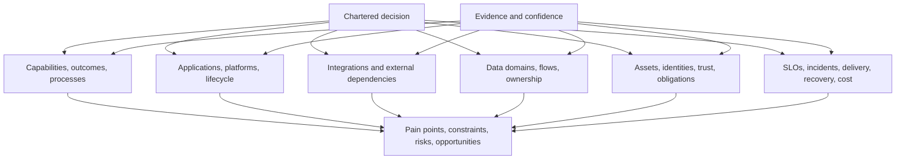
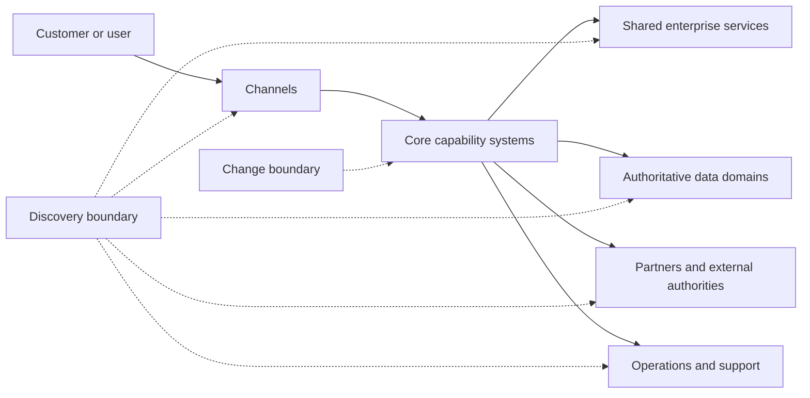
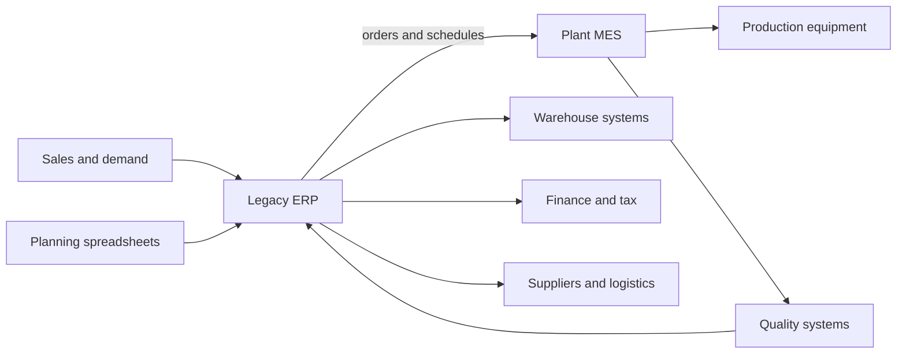

A current-state architecture baseline is a decision-focused representation of how the enterprise works today: which capabilities and processes matter, which systems and data support them, how dependencies behave, who owns the lifecycle, where risk and pain appear, and how confidently those claims are known.

It is not a complete inventory, an archaeological reconstruction of every design decision, or a set of diagrams copied from old projects. Its purpose is to expose the current conditions that constrain or enable the chartered architecture decision.

## Business Problem

Modernization programs routinely underestimate the current state because enterprise behavior is distributed across systems, people, contracts, manual controls, operational practices, and undocumented dependencies.

| Baseline gap | Typical assumption | Consequence |
|---|---|---|
| Capability context missing | Application replacement equals business transformation | New platform preserves old bottlenecks or breaks useful differentiation |
| Runtime dependencies missing | Inventory entries define system boundaries | Cutover disrupts consumers, batch jobs, partners, or shared services |
| Manual work missing | Process diagrams represent actual execution | Automation removes exception handling or compensating controls |
| Data meaning and ownership missing | Shared tables imply shared semantics | Migration creates duplicates and reconciliation failure |
| Operational evidence missing | Written SLO and DR documents represent capability | Target inherits untested recovery and support assumptions |
| Commercial constraints missing | Technology can be changed when engineering is ready | Licensing, support, exit, or procurement blocks sequencing |
| Ownership missing | Program delivery team can decide for all dependencies | Decisions stall or produce unowned services |
| Evidence confidence missing | Polished diagrams are accepted as facts | Unknowns become hidden transition risk |

The baseline prevents target-state design from being built on an idealized or partial version of reality.

## Outcome

Produce the minimum set of validated views and records needed to make the chartered decision.

| Output | Quality criterion |
|---|---|
| Baseline scope and viewpoint map | Every view is tied to a decision question and explicit boundary |
| Business capability and process context | Shows outcomes, critical flows, pain points, controls, and ownership |
| System context | Shows actors, systems, external dependencies, and change/discovery boundaries |
| Application and platform inventory | Records purpose, owner, lifecycle, support, hosting, criticality, and evidence |
| Dependency and integration view | Identifies providers, consumers, contracts, volumes, failure behavior, and ownership |
| Data baseline | Identifies domains, meaning, systems of record, flows, classification, quality, and lifecycle |
| Trust and security context | Shows assets, identities, trust boundaries, obligations, findings, and exceptions |
| Operational baseline | Shows service ownership, SLOs, incidents, support, observability, deployment, recovery, capacity, and cost |
| Pain-point and constraint register | Connects business or operational impact to evidence and affected decisions |
| Confidence and gap map | Makes stale, missing, disputed, or weak evidence visible |

The baseline is complete when reviewers can understand what materially constrains the decision and what remains uncertain—not when every configuration item has been cataloged.

## Context and Preconditions

Start after the [engagement charter](/architecture-discovery/discovery-framework/), [stakeholder map](/architecture-discovery/discovery-framework/stakeholders-and-decision-rights/), and [evidence model](/architecture-discovery/discovery-framework/evidence-assumptions-and-confidence/) exist.

### Define the Decision Lens

| Decision | Baseline emphasis |
|---|---|
| Replace an ERP | Processes, customizations, controls, master data, integrations, reports, contracts, rollout constraints |
| Move applications to cloud | Workloads, dependencies, data classification, network, identity, operations, licensing, latency, recovery |
| Decompose a monolith | Capabilities, domain rules, change coupling, data ownership, runtime dependencies, deployment and support |
| Consolidate customer platforms | Journeys, identity, customer semantics, channels, consent, data flows, regional obligations |
| Improve resilience | Critical journeys, failure modes, SLOs, dependencies, incidents, recovery evidence, ownership |

The same estate produces different baselines for different decisions. Reuse evidence, but do not let an existing inventory dictate the viewpoint.

## Inputs and Participants

| Input or participant | Why required | Validation |
|---|---|---|
| Business capability and process owners | Outcomes, rules, controls, actual pain, and priorities | Measures, process evidence, and frontline examples |
| Product and service owners | Purpose, consumers, roadmap, SLO, and lifecycle | Catalogs, backlogs, telemetry, and ownership acceptance |
| Engineering and platform owners | Runtime design, deployment, dependencies, change coupling | Code, configuration, topology, and operational evidence |
| Data owners and stewards | Meaning, authority, quality, classification, and lifecycle | Catalog, lineage, samples, quality and access records |
| Integration owners | Contracts, consumers, volumes, change and failure behavior | Gateway/broker/file evidence and provider-consumer confirmation |
| Operations and support | Incidents, manual recovery, observability, capacity, DR, and support | Incident records, dashboards, runbooks, exercises |
| Security, privacy, compliance, and audit | Assets, trust, obligations, findings, exceptions, and evidence | Current policies, assessments, findings, approvals |
| Finance, procurement, and vendor management | Cost, contracts, licensing, support, roadmap, and exit | Executed agreements and reconciled financial data |
| Existing repositories | Starting inventory and documentation | Currency, coverage, accountable owner, and runtime corroboration |

## Baseline Architecture

Use linked viewpoints rather than one unreadable enterprise diagram.

Every view should use stable identifiers so a system, interface, data domain, finding, risk, and decision can be traced across artifacts.

## Procedure

### 1. Define Questions and Viewpoints

List the questions the baseline must answer.

- Which capabilities and journeys are affected?
- Where do delay, failure, cost, control weakness, or change friction occur?
- Which systems, people, data, and partners participate?
- Which dependencies can constrain transition order or rollback?
- Which owners can authorize change and accept lifecycle accountability?
- Which current-state strengths must be preserved?
- Which claims are weak enough to require validation before option design?

Map each question to an artifact and evidence source. Do not create views with no decision consumer.

### 2. Establish the Business Context

Capture capabilities, outcomes, key process or journey stages, ownership, measures, and pain.

| Capability | Outcome | Supporting systems | Owner | Pain or constraint | Evidence |
|---|---|---|---|---|---|
| | | | | | |

Use representative scenarios and exceptions. Averages can hide the failure paths driving transformation.

### 3. Draw the System Context

Show the primary system or capability boundary, actors, external systems, and critical interaction directions.

Distinguish:

- **change boundary:** elements the initiative may alter;
- **discovery boundary:** unchanged elements that constrain or depend on the decision; and
- **environment:** actors and conditions that matter but are not controlled.

### 4. Build the Estate Inventory

Do not copy every CMDB field. Capture architecture-significant attributes.

| Attribute | Why it matters |
|---|---|
| Purpose and capability | Connects technology to business value |
| Product/service owner | Establishes decision and lifecycle accountability |
| Technology and version | Exposes support, skills, security, and migration constraints |
| Hosting and environments | Exposes topology, sovereignty, network, and operational context |
| Criticality and consumers | Prioritizes evidence, resilience, and transition |
| Change frequency and coupling | Indicates modularity and modernization pressure |
| Support and contract dates | Creates time-bound risk and roadmap constraints |
| Cost and allocation | Supports option economics and ownership |
| Data handled | Connects semantics, sensitivity, residency, retention, and recovery |
| Dependencies | Exposes sequencing, coexistence, and blast radius |
| Evidence status | Prevents inventory confidence from being assumed |

Reconcile repositories against runtime and owner evidence. “Not in the catalog” does not mean “not in production.”

### 5. Discover Dependencies

Capture more than protocol lines.

| Dependency | Provider/consumer | Contract | Volume/criticality | Failure behavior | Change owner | Evidence |
|---|---|---|---|---|---|---|
| | | | | | | |

Look for:

- synchronous APIs and shared databases;
- events, queues, topics, and change-data streams;
- files, batch jobs, schedulers, and managed transfers;
- identity, DNS, certificates, secrets, and network services;
- reports, extracts, spreadsheets, and human handoffs;
- vendor and partner interfaces;
- shared deployment, release, or operational dependencies; and
- undocumented consumers inferred from logs, code, or access records.

### 6. Establish Data Context

For each material data domain, record:

- meaning and authoritative owner;
- systems of record and derived copies;
- creation, transformation, and consumption flows;
- key identifiers and reconciliation rules;
- quality issues and manual correction;
- sensitivity, access, residency, retention, and deletion;
- backup, restore, RPO, and RTO; and
- migration or coexistence implications.

A logical data model alone does not reveal lineage, ownership, or operational truth.

### 7. Establish Trust and Control Context

Identify assets, actors, identities, trust transitions, privileged paths, external exposure, applicable obligations, current findings, control exceptions, and risk owners. The baseline supplies inputs to [Security Architecture](/security-architecture/); it should not duplicate detailed control design.

### 8. Establish the Operational Baseline

| Area | Evidence to collect |
|---|---|
| Ownership | Service owner, on-call, support tiers, suppliers, escalation |
| Reliability | SLOs, actual availability, incidents, error budgets, dependency failures |
| Observability | Metrics, logs, traces, audit, dashboards, blind spots |
| Delivery | Repositories, pipelines, environments, release frequency, rollback, change controls |
| Recovery | Backup, restore, failover, DR exercises, tested RPO/RTO |
| Capacity | Demand shape, peaks, saturation, quotas, headroom, forecasts |
| Cost | Infrastructure, licenses, support, labor, allocation, major drivers |
| Lifecycle | Patch, upgrade, certificate, key, dependency, and end-of-support processes |

Compare stated targets with observed and tested behavior.

### 9. Record Pain, Strengths, Constraints, and Opportunities

Avoid a deficit-only baseline. Current systems often embody essential rules, controls, reliability, and organizational knowledge.

| Type | Statement | Impact | Evidence | Owner | Architecture implication |
|---|---|---|---|---|---|
| Pain | | | | | |
| Strength | | | | | |
| Constraint | | | | | |
| Opportunity | | | | | |

Connect technical debt to business or operational consequence. “Old technology” is not enough; identify support risk, change delay, incident exposure, cost, or capability limitation.

### 10. Validate and Baseline

Run viewpoint reviews with accountable owners, then a cross-view review to find contradictions.

Ask:

- Do process steps map to systems and ownership?
- Do system dependencies align with runtime evidence?
- Do data flows align with interface and access evidence?
- Do criticality claims align with business journeys and incidents?
- Do recovery requirements align with tested capability?
- Do stated constraints have sources and scope?
- Do pain points have measurable consequence?
- Are missing owners and weak evidence visible as risks?

Version the baseline with an effective date, scope, evidence cutoff, owners, confidence, open gaps, and review triggers.

## Worked Enterprise Example

### Manufacturing Order-to-Production Modernization

A manufacturer plans to replace a heavily customized ERP and introduce a common manufacturing platform across six plants.

The initial estate inventory lists ERP, MES, warehouse, quality, and finance systems. The decision-focused baseline reveals more:

| View | Baseline finding | Architecture implication |
|---|---|---|
| Business process | Production planners use spreadsheets to compensate for ERP lead-time rules | Replacement must address planning policy and data, not only software |
| Integration | Three plants exchange schedules through files during network windows | Transition must tolerate intermittent connectivity |
| Data | Material identifiers differ after acquisitions; reconciliation occurs manually | Master-data ownership precedes global process standardization |
| Operations | Plant engineers support MES locally with no central on-call | Target operating model and skills are migration prerequisites |
| Security | OT networks trust ERP batch hosts through broad firewall rules | Trust-boundary redesign must be sequenced with interface migration |
| Recovery | ERP restore is tested, but plant-level reconciliation after outage is not | Business recovery exceeds infrastructure recovery |
| Commercial | A custom tax module is licensed through a local partner | Country rollout depends on contract and replacement decision |

### Dependency View

The baseline changes the program from a software replacement into a sequenced capability, data, integration, operating-model, and OT/IT transition.

## Decision Points and Tradeoffs

| Decision | Option | Tradeoff | Evidence required |
|---|---|---|---|
| Baseline depth | Broad inventory first | Fast portfolio coverage, shallow dependency insight | Common attributes and confidence indicators |
| Baseline depth | Deep critical-path analysis | Better transition confidence, narrower coverage | Business criticality and representative scenarios |
| Source | Repository-led | Efficient and structured, may be stale | Ownership and runtime reconciliation |
| Source | Runtime-led | Reveals actual behavior, may miss manual and dormant paths | Telemetry coverage and business validation |
| Modeling | One enterprise diagram | Simple headline, unreadable and misleading at depth | Use only as navigation to linked views |
| Modeling | Multiple viewpoints | Decision-useful detail, traceability overhead | Stable identifiers and common scope |
| Currency | Snapshot baseline | Clear decision reference, decays over time | Effective date and reassessment triggers |
| Currency | Continuously maintained catalog | Reusable, requires durable ownership and tooling | Operating model and data-quality controls |

## Failure Modes and Recovery

| Failure mode | Signal | Recovery |
|---|---|---|
| Inventory dump | Hundreds of rows have no relationship to the decision | Define viewpoint questions and material attributes |
| Diagram archaeology | Old diagrams are relabeled current | Validate against runtime, code, records, and owners |
| Technology-only baseline | Capabilities, process, ownership, and operations are absent | Add business and lifecycle views |
| Happy-path modeling | Exceptions, batch, manual work, and recovery are absent | Walk real failures and edge scenarios |
| Repository absolutism | Undocumented systems are assumed nonexistent | Triangulate access, network, logs, code, finance, and SMEs |
| Target-state contamination | Current limitations are redrawn as proposed components | Separate observed baseline from options and hypotheses |
| Unbounded archaeology | Team investigates history that cannot affect the decision | Apply materiality and stop criteria |
| Baseline without date | Reviewers cannot know what changed | Record evidence cutoff and review triggers |

## Best Practices

1. Start with decision questions, not available repository fields.
2. Use linked viewpoints and stable identifiers.
3. Distinguish change, discovery, and environmental boundaries.
4. Combine repository, runtime, owner, process, and commercial evidence.
5. Model exceptions, failures, manual controls, and recovery.
6. Connect technical conditions to business and operational impact.
7. Record strengths that target options must preserve.
8. Show evidence confidence and missing ownership directly.
9. Validate within each domain and across viewpoints.
10. Version the baseline and define when it must be refreshed.

## Anti-Patterns

### CMDB Equals Architecture

Configuration records show assets, not necessarily capabilities, runtime behavior, semantics, control, or ownership.

### The One-Diagram Enterprise

Thousands of relationships are compressed into a picture that communicates neither decision context nor evidence quality.

### Current State by Interview

Stakeholder recollection replaces runtime, process, contract, and incident evidence.

### Rewrite Everything

Every discovered weakness becomes transformation scope, regardless of outcome or materiality.

### Modernization as Technology Age

Old components are labeled debt without showing value, risk, cost, change friction, or lifecycle consequence.

## Completion Checklist

- [ ] Baseline scope and viewpoints trace to the chartered decision.
- [ ] Business capabilities, outcomes, processes, and owners are visible.
- [ ] Change and discovery boundaries are distinct.
- [ ] Material applications and platforms have lifecycle and ownership attributes.
- [ ] Critical dependencies include contracts, behavior, consumers, and owners.
- [ ] Data meaning, ownership, flow, classification, and recovery are represented.
- [ ] Trust boundaries, obligations, findings, and exceptions are visible.
- [ ] Operational reality includes incidents, observability, delivery, recovery, capacity, and cost.
- [ ] Manual work, exceptions, shared databases, files, and batch paths are included.
- [ ] Pain points and constraints link to measurable consequence and evidence.
- [ ] Current strengths and controls to preserve are recorded.
- [ ] Evidence confidence, contradictions, missing ownership, and gaps are explicit.
- [ ] Accountable owners validated relevant viewpoints.
- [ ] Effective date, cutoff, version, and reassessment triggers are recorded.

## Architecture Review Notes

Challenge the baseline when:

- it is a technology inventory with no business decision lens;
- ownership fields name teams that have not accepted accountability;
- diagrams lack evidence, date, scope, or status;
- runtime behavior contradicts repositories without explanation;
- shared databases, files, manual controls, or partner dependencies are absent;
- written SLO and recovery claims are not compared with observed capability;
- pain points are adjectives without measurable impact;
- target-state choices appear inside current-state findings;
- missing evidence is hidden to make the baseline appear complete; or
- no trigger exists to refresh the baseline before later decisions.

## Interview Questions

### How do you approach current-state architecture discovery?

Start from the decision and define required viewpoints. Combine business, estate, dependency, data, trust, operational, commercial, and ownership evidence; validate with accountable owners and runtime sources; then record pain, strengths, constraints, confidence, and gaps.

### How much current-state detail is enough?

Enough to identify material conditions that could change option viability, transition sequence, risk, cost, or ownership. Stop when additional detail cannot reasonably affect the chartered decision or a governed downstream decision.

### Why is a CMDB insufficient?

It may list assets but rarely captures actual business use, runtime dependencies, data meaning, process exceptions, manual controls, service behavior, decision authority, evidence confidence, or transition implications.

### How do you discover undocumented dependencies?

Triangulate runtime traffic, logs, broker and gateway metadata, database access, code/configuration, schedules, file transfers, identity/network records, finance/vendor records, and provider-consumer interviews.

### How do you keep the baseline current?

Assign durable owners, use stable identifiers and source links, automate evidence where practical, version decision snapshots, and define review triggers tied to material estate, ownership, incident, policy, or program changes.

## Summary

A current-state architecture baseline is a governed explanation of the present conditions that matter to a decision. It connects business capabilities and processes to systems, dependencies, data, trust, operations, ownership, pain, strengths, constraints, and evidence confidence.

Its quality is measured by decision usefulness and traceability—not inventory size or diagram polish. A strong baseline lets architects frame viable options and transition states without rediscovering critical dependencies during delivery.

The next foundation chapter traces baseline findings into requirements, risks, decisions, deliverables, and roadmap work through [decision traceability](/architecture-discovery/discovery-framework/findings-requirements-decision-traceability/).

## Related Handbook Guidance

- [Evidence, Assumptions, and Confidence](/architecture-discovery/discovery-framework/evidence-assumptions-and-confidence/) — evidence quality and gap treatment
- [Discovery Workshops](/architecture-discovery/discovery-framework/discovery-workshops/) — collaborative validation of current behavior and conflicts
- [System Design Process](/system-design/system-design-process/) — solution design after current context is understood
- [Microservices Migration and Modernization](/microservices/09-migration-modernization/) — implementation patterns after modernization direction is selected
- [Security Architecture](/security-architecture/) — detailed trust, control, and platform-security design
