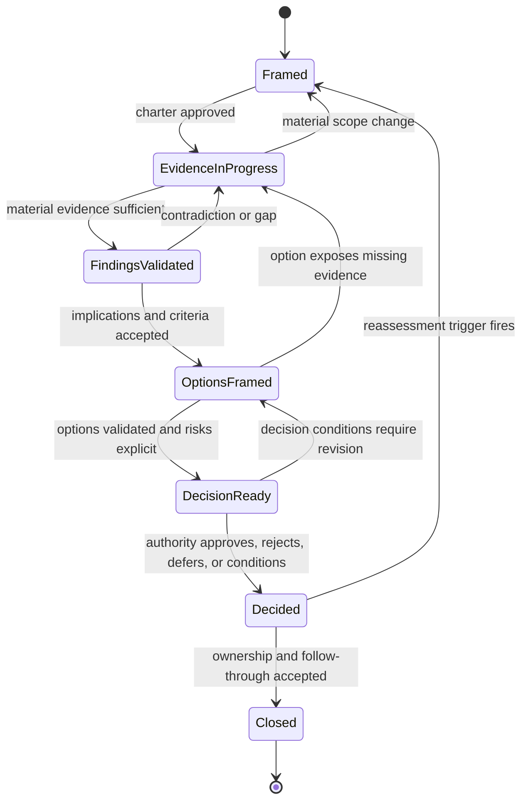
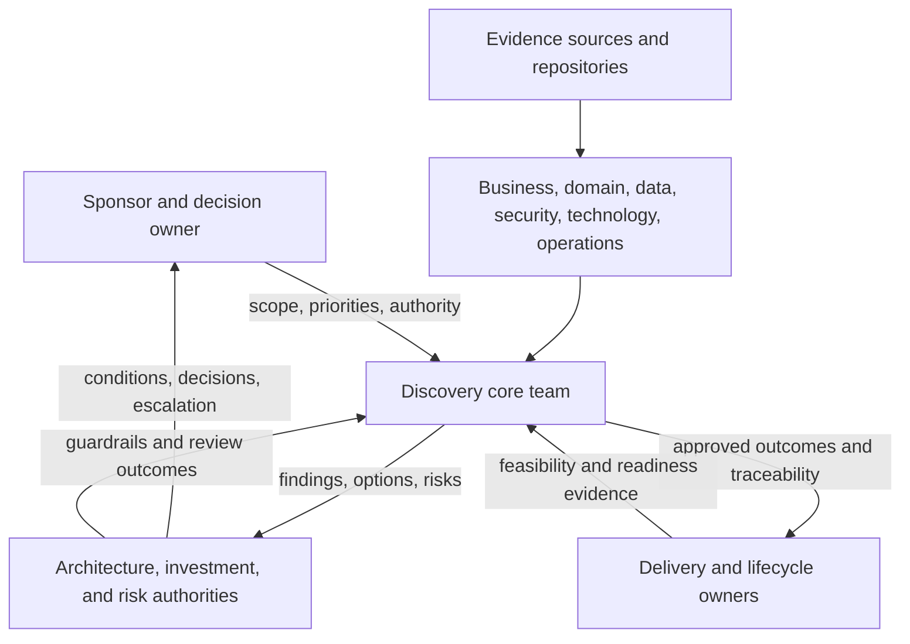
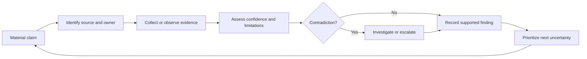

Architecture discovery needs enough structure to produce trustworthy decisions, but not so much process that learning waits for governance ceremonies. The effective pattern is an iterative evidence lifecycle with explicit gates: frame the decision, collect material evidence, synthesize implications, validate findings, compare options, govern the decision, and close with owned follow-through.

## Business Problem

Discovery programs usually fail in one of two directions.

The first is **unstructured exploration**. Interviews, workshops, inventories, and diagrams accumulate without a shared decision model. Teams cannot explain which evidence is sufficient, when findings are stable enough for option design, or who can close an open conflict.

The second is **stage-gate theater**. A linear methodology requires documents and approvals at predetermined dates even when evidence invalidates the original scope. Teams optimize artifact completion, suppress uncertainty, and present architecture choices after political commitment has already occurred.

| Failure | Observable symptom | Consequence |
|---|---|---|
| Activity without decision flow | Calendar is full, but no decision backlog exists | Discovery expands without convergence |
| Design begins before evidence stabilizes | Target diagrams appear during initial interviews | Preferred solutions bias subsequent questions |
| Validation is informal | Workshop consensus is recorded as fact | Critical assumptions reach investment decisions |
| Governance enters late | Review boards first see the recommendation | Approval becomes ceremonial or causes disruptive rework |
| Gates measure documents | Teams pass reviews despite unresolved material uncertainty | False confidence and unmanaged risk |
| Discovery has no closure state | Open questions persist into delivery without ownership | Delivery teams rediscover decisions under schedule pressure |

The lifecycle must make learning, iteration, authority, and closure work together.

## Problem and Forces

The pattern balances competing forces:

- **speed versus confidence:** decisions have deadlines, but evidence takes time;
- **breadth versus materiality:** enterprise context is broad, but not every fact can change the decision;
- **iteration versus control:** discovery must adapt, while funding and governance require a stable baseline;
- **expertise versus authority:** specialists interpret evidence, while accountable owners decide and accept consequences;
- **local autonomy versus enterprise coherence:** domain decisions need speed, but shared platforms, data, policy, and risk cross boundaries;
- **transparency versus political pressure:** uncertainty and dissent must remain visible even when leaders prefer certainty; and
- **analysis versus action:** sometimes the correct next step is an experiment, not more documentation.


A governance gate should answer a decision-readiness question. If its only test is whether a document exists, it is an artifact checkpoint rather than architecture governance.


## Applicability

| Use when | Avoid or simplify when |
|---|---|
| A decision crosses domains, systems, organizations, or risk authorities | A reversible team decision has clear ownership and limited blast radius |
| Current-state evidence is incomplete or contested | The change follows an already approved, repeatable standard with no material exception |
| The decision commits substantial funding or hard-to-reverse technology | The activity is a narrow implementation task under an existing architecture decision |
| Modernization requires transition and coexistence states | No architecture choice is being made and delivery scope is already governed |
| Regulatory, security, data, or operational exposure is material | Governance would cost more than the consequence and can be delegated safely |
| Several decision gates depend on one another | A short decision brief and peer review provide sufficient control |

Use proportional governance. The lifecycle remains the same, but the number of participants, evidence threshold, artifacts, and approval levels scale with consequence and reversibility.

## Pattern Structure

Discovery operates as a series of governed evidence states rather than a waterfall of documents.

The backward transitions are deliberate. Evidence can invalidate framing, an option can expose a missing dependency, and a decision can be revisited when an explicit trigger occurs.

### Lifecycle Stages and Gates

| Stage | Governing question | Primary output | Exit gate |
|---|---|---|---|
| 1. Frame | What decision, outcome, boundary, authority, and consequence govern discovery? | Approved charter | Charter gate |
| 2. Collect | Which evidence can confirm or challenge the important claims? | Evidence register and current-state baseline | Evidence sufficiency gate |
| 3. Synthesize | What do the facts imply for requirements, constraints, risks, and criteria? | Findings and traceability model | Findings validation gate |
| 4. Frame options | Which viable choices respond to the evidence? | Options, transition states, tradeoffs | Option completeness gate |
| 5. Validate | Which uncertainties could change the choice, and how will they be tested? | Experiments, due diligence, risk treatments | Decision-readiness gate |
| 6. Decide | Which option or next step is authorized under which conditions? | Decision record | Authority gate |
| 7. Close | Who owns implementation, residual uncertainty, measures, and reassessment? | Handoff and closure record | Closure gate |

## Governance Architecture

Governance should separate working-level learning from decision authority.

### Governance Layers

| Layer | Purpose | Must not become |
|---|---|---|
| Sponsor and decision ownership | Own outcome, priority, funding context, and final decision | A substitute for domain evidence |
| Discovery core team | Integrate evidence, maintain traceability, frame options, and manage uncertainty | An approval authority beyond delegation |
| Domain validation | Confirm meaning, ownership, implications, and quality within accountable boundaries | Independent silos producing incompatible findings |
| Architecture and risk review | Challenge evidence, tradeoffs, policy fit, exposure, and decision conditions | A late presentation forum |
| Delivery and lifecycle ownership | Validate feasibility, transition, operability, measures, and handoff | A downstream recipient excluded from discovery |

## Participants and Responsibilities

| Participant | Lifecycle responsibility |
|---|---|
| Sponsor | Maintains strategic intent, resolves organizational blockers, and owns the consequence of delay |
| Decision owner | Approves the charter and final decision; resolves material priority and scope conflicts |
| Discovery lead | Orchestrates stages, evidence, traceability, gates, risks, and closure |
| Lead architect | Synthesizes findings, frames options, and owns the architecture recommendation |
| Domain and capability owners | Validate business meaning, outcomes, rules, and ownership boundaries |
| Engineering, platform, data, and integration owners | Validate estate facts, feasibility, dependencies, and technical implications |
| Operations and service owners | Validate incidents, support, recovery, capacity, cost, and lifecycle readiness |
| Security, privacy, compliance, and risk authorities | Define obligations, challenge exposure, and provide decisions within delegation |
| Finance, procurement, and vendor management | Validate financial, contractual, supplier, and exit implications |
| Governance secretariat | Schedules gates and records outcomes, conditions, dissent, and follow-up |

The [stakeholder and decision-rights model](/architecture-discovery/discovery-framework/stakeholders-and-decision-rights/) determines who fills these roles for each material decision.

## Workflow

### Stage 1 — Frame

Approve the [engagement charter](/architecture-discovery/discovery-framework/): trigger, decision, outcomes, scope, exclusions, decision rights, evidence standard, calendar, change control, and exit criteria.

Do not begin broad interviews while the sponsor and decision owner hold different interpretations of the outcome. Limited fact-finding is appropriate to improve the charter, but solution design is not.

**Gate question:** Is the decision sufficiently explicit and governed to justify discovery investment?

### Stage 2 — Collect Evidence

Collect evidence according to decision impact, not questionnaire order. Build a current-state baseline across business, domain, function, process, quality attributes, integration, data, security, technology, and operations.

Evidence work proceeds in short cycles:

**Gate question:** Is the evidence sufficient for material findings, and are remaining gaps visible and governed?

### Stage 3 — Synthesize and Validate Findings

Evidence becomes useful when translated into architectural implications:

- business outcomes and success measures;
- capability and domain boundaries;
- functional scenarios and process exceptions;
- measurable quality attributes;
- integration and data obligations;
- security, compliance, and privacy requirements;
- technology and operational constraints;
- risks, assumptions, issues, and dependencies; and
- option-evaluation criteria.

Validate implications with accountable owners, not only with the people who supplied evidence. Record dissent where evidence supports multiple interpretations.

**Gate question:** Can reviewers trace each material requirement, constraint, risk, and criterion to evidence and an owner?

### Stage 4 — Frame Options

Create options only after decision criteria are visible. Include credible alternatives such as stabilization, incremental change, managed service, package replacement, custom build, coexistence, or no change.

Each option must show:

| Dimension | Required analysis |
|---|---|
| Outcome fit | Which outcomes it enables and under which assumptions |
| Architecture fit | Alignment with domains, quality attributes, data, integration, security, and operations |
| Transition | Interim states, dependencies, migration, rollback, and decommissioning |
| Organization | Ownership, skills, support, governance, and change capacity |
| Economics | Investment, operating cost, licensing, opportunity cost, and uncertainty |
| Risk | Exposure, treatment, reversibility, and residual-risk authority |

**Gate question:** Are the options genuinely viable, distinguishable, and evaluated against agreed evidence rather than preference?

### Stage 5 — Validate Decision-Critical Uncertainty

Do not use a proof of concept as product theater. Validate a specific uncertainty whose result could change the recommendation.

| Uncertainty | Suitable validation |
|---|---|
| Unknown peak behavior | Representative load test or production measurement |
| Vendor capability claim | Contractual evidence and scenario-based proof |
| Migration feasibility | Thin-slice migration with rollback and reconciliation |
| Operating readiness | On-call, recovery, deployment, and incident simulation |
| User or process assumption | Observation, prototype, or controlled pilot |
| Cost model | Measured workload, commercial quote, and sensitivity analysis |

**Gate question:** Has material uncertainty been reduced, bounded by conditions, or assigned to an authorized risk owner?

### Stage 6 — Decide

Present a decision package, not a document dump:

1. decision and outcome;
2. scope and material context;
3. evidence-backed findings;
4. options and evaluation criteria;
5. recommendation and rationale;
6. tradeoffs and dissent;
7. risks, assumptions, and conditions;
8. transition and organizational implications;
9. measures and reassessment triggers; and
10. required follow-up decisions.

The decision authority may approve, reject, defer, condition, delegate, narrow scope, or authorize an experiment.

**Gate question:** Is the decision within authority, evidence-supported, explicit about consequence, and recorded with conditions?

### Stage 7 — Close and Hand Off

Discovery closes when its outputs have durable ownership. Transfer:

- decision records and conditions;
- approved architecture views and deliverables;
- prioritized delivery and discovery backlog;
- risks, assumptions, issues, and dependencies;
- transition milestones and decision gates;
- measures and architecture fitness functions;
- unresolved questions with impact, owners, and dates; and
- reassessment triggers.

**Gate question:** Can delivery and lifecycle owners execute and govern the decision without rediscovering its context?

## Evidence and Artifacts

Artifacts are selected by decision need. The lifecycle does not require every artifact in every engagement.

| Lifecycle state | Minimum governed record | Optional supporting artifacts |
|---|---|---|
| Framed | Charter and decision-rights matrix | Stakeholder map, context sketch, decision backlog |
| Evidence in progress | Evidence register and question backlog | Inventories, interview notes, process observations |
| Findings validated | Findings traceability and risk register | Capability map, domain model, process model, catalogs |
| Options framed | Option comparison and transition views | Experiments, cost model, architecture views |
| Decision ready | Recommendation package | Threat model, NFR scenarios, due-diligence report |
| Decided | Decision record with conditions | Approval minutes, exception or risk acceptance |
| Closed | Handoff and closure record | Roadmap, implementation backlog, fitness measures |

Every material artifact needs an owner, audience, decision purpose, evidence references, version, status, and review trigger.

## Governance Gates

Use consistent gate outcomes.

| Outcome | Meaning | Required record |
|---|---|---|
| Pass | Evidence and authority are sufficient to proceed | Decision, rationale, owner, date |
| Pass with conditions | Proceed only if named conditions are met | Conditions, owners, dates, verification |
| Return | Rework findings or options before proceeding | Gaps, impact, owner, next review |
| Experiment | Buy information before commitment | Hypothesis, measure, boundary, owner, decision rule |
| Re-scope | Material learning changes the boundary or decision | Updated charter and impact |
| Defer | Decision timing or dependency makes commitment irresponsible | Trigger, owner, holding risk |
| Reject | Proposed direction is not acceptable | Rationale, consequences, permitted alternatives |

Governance bodies should not rewrite the analysis during the gate. They challenge it, request evidence, impose conditions, or make the decision within their authority.

## Enterprise Example

### Telecom BSS Modernization

A telecom operator plans to replace customer care, product catalog, order management, and billing components across three countries. The initial program assumes one packaged platform and a country-by-country rollout.

The lifecycle exposes material learning:

| Stage | Finding or decision |
|---|---|
| Frame | The decision is split: product-catalog standardization precedes platform selection |
| Collect | Country processes differ mainly because of regulation and prepaid charging, not preference |
| Synthesize | Shared product semantics are a prerequisite; billing transition has the highest reconciliation risk |
| Frame options | Full-suite replacement, catalog-first coexistence, and country-specific replacement remain viable |
| Validate | A thin-slice catalog migration proves core semantics but exposes missing partner-offer rules |
| Decide | Approve catalog-first coexistence; defer billing selection until reconciliation evidence improves |
| Close | Domain ownership, interface contracts, migration measures, and next decision gates transfer to the program |

Without lifecycle gates, the product-suite decision would have preceded agreement on product meaning and transition risk. Governance does not merely slow the selection; it changes the sequence to protect value and reversibility.

## Variants

### Rapid Discovery

Use for a bounded, reversible decision. Combine evidence and findings gates, use a small core team, and produce a decision brief. Do not remove explicit authority, uncertainty, or closure.

### Regulatory Discovery

Add formal obligation interpretation, control evidence, audit traceability, independent review, and risk-acceptance gates. Legal and compliance conclusions must identify jurisdiction and scope.

### Modernization Portfolio Discovery

Run a common framing and scoring model across applications, then deeper evidence cycles for high-value, high-risk, or ambiguous groups. Portfolio scores guide investigation; they do not replace architecture judgment.

### Product or Vendor Selection

Separate requirements and criteria ownership from vendor evidence. Add commercial, exit, data portability, operating model, and reference validation before the decision gate.

## Tradeoffs

| Benefit | Cost or risk | Mitigation |
|---|---|---|
| Explicit gates prevent premature commitment | Reviews can become slow and bureaucratic | Scale authority and artifacts to consequence; define response SLAs |
| Iteration allows evidence to change direction | Stakeholders may perceive rework or instability | Version the charter and explain the evidence that triggered change |
| Traceability improves defensibility | Maintaining links requires discipline | Track only material claims and automate references where practical |
| Cross-domain validation exposes systemic risk | Coordination cost increases | Engage stakeholders by stage and decision, not universal attendance |
| Experiments reduce uncertainty | Pilots can become uncontrolled production commitments | Define hypothesis, boundary, exit, owner, and decision rule first |
| Conditions enable progress | Conditions may be forgotten during delivery | Put them in decision records, backlogs, gates, and fitness measures |

## Failure Modes and Anti-Patterns

| Anti-pattern | Why it fails | Corrective action |
|---|---|---|
| Waterfall discovery | Learning cannot revise scope or findings | Permit governed backward transitions |
| Architecture sprint theater | Timebox produces diagrams before evidence | Timebox questions and experiments, not predetermined answers |
| Gate by document count | Artifact presence substitutes for decision readiness | Define evidence and authority questions for each gate |
| Steering committee as design team | Senior forum debates implementation without context | Present decision packages and explicit options |
| Hidden pre-decision | Preferred choice is committed before validation | Record it as a hypothesis and preserve credible alternatives |
| Permanent “amber” status | Material gaps remain visible but ownerless | Tie every condition to owner, date, consequence, and escalation |
| Discovery-to-delivery cliff | Context and unresolved assumptions do not transfer | Use closure and handoff as a formal gate |
| Governance exception by exhaustion | Teams bypass review because response times are undefined | Establish delegated authority and decision SLAs |

## Best Practices

1. Maintain a decision backlog alongside the discovery question backlog.
2. Prioritize evidence by its ability to change a material decision.
3. Define gate questions and permitted outcomes before work begins.
4. Engage governance during framing and option design, not only approval.
5. Keep findings separate from recommendations so evidence can be challenged cleanly.
6. Record dissent and conditions in the decision package.
7. Use experiments to resolve specific uncertainty, not to endorse a product generally.
8. Treat transition architecture and organizational readiness as first-class option criteria.
9. Transfer decision context and residual uncertainty into delivery governance.
10. Define reassessment triggers for material changes in evidence, strategy, regulation, cost, or risk.

## Architecture Review Notes

Reviewers should challenge the lifecycle when:

- a target option exists before the charter and criteria;
- gates have deliverables but no governing question;
- evidence sufficiency has no materiality or confidence standard;
- domain validation lacks accountable owners;
- experiments have no hypothesis or decision rule;
- risk conditions have no authorized owner;
- governance can approve but cannot condition, defer, reject, or re-scope;
- backward transitions are treated as failure and therefore hidden;
- closure occurs without delivery and lifecycle acceptance; or
- no event can trigger reassessment after approval.

## Interview Questions

### How is architecture discovery different from a waterfall requirements phase?

Discovery is decision-centered and iterative. Evidence can change framing, options can expose missing evidence, and governance can condition or re-scope the work. Its outputs include uncertainty, risks, options, and decision traceability—not only a signed requirements baseline.

### How do you prevent governance from slowing architecture decisions?

Use proportional authority, explicit gate questions, minimum sufficient artifacts, response SLAs, and delegated thresholds. Engage reviewers early so gates resolve known decisions instead of discovering context late.

### When should discovery move backward to an earlier stage?

When new evidence materially changes the decision, scope, outcome, constraint, risk, or viability of an option. The change should be governed and traceable rather than hidden as informal rework.

### What does “evidence sufficient” mean?

Material claims are supported to a confidence appropriate for consequence and reversibility; contradictions and limitations are visible; and remaining uncertainty is either unlikely to change the decision, assigned to validation, or accepted by authorized owners.

### How do you close discovery when important questions remain?

Classify their decision impact. Resolve or test material unknowns; condition, defer, or reject the decision when necessary; and transfer non-blocking questions with owners, dates, consequences, and escalation. Closure does not require artificial certainty.

## Summary

The discovery lifecycle turns enterprise learning into governed commitment. It moves through framing, evidence, synthesis, options, validation, decision, and closure while allowing material evidence to send the work backward.

Strong governance does not demand every artifact or centralize every choice. It ensures that:

- each stage answers a decision-readiness question;
- evidence and findings remain traceable;
- roles and authority match the decision;
- uncertainty, dissent, risk, and conditions stay visible;
- option design includes transition and lifecycle consequences; and
- delivery inherits the context needed to execute and reassess the decision.

The next foundation chapter applies this lifecycle to the design and facilitation of [discovery workshops](/architecture-discovery/discovery-framework/discovery-workshops/).

## Related Patterns and Canonical Guidance

- [Architecture Discovery: Scope and Outcomes](/architecture-discovery/introduction/) — discovery as decision enablement
- [Discovery Engagement Charter](/architecture-discovery/discovery-framework/) — lifecycle framing and exit criteria
- [Stakeholders and Decision Rights](/architecture-discovery/discovery-framework/stakeholders-and-decision-rights/) — authority, participation, and escalation
- [Architecture Decision Records](/microservices/10-production-playbook/architecture-decision-records/) — durable recording of architecture decisions
- [Technology Decisions](/technology-playbook/) — option evaluation after evidence and criteria are validated
- [Security Architecture](/security-architecture/) — detailed security design and governance context
