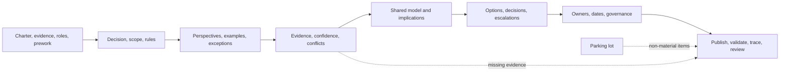
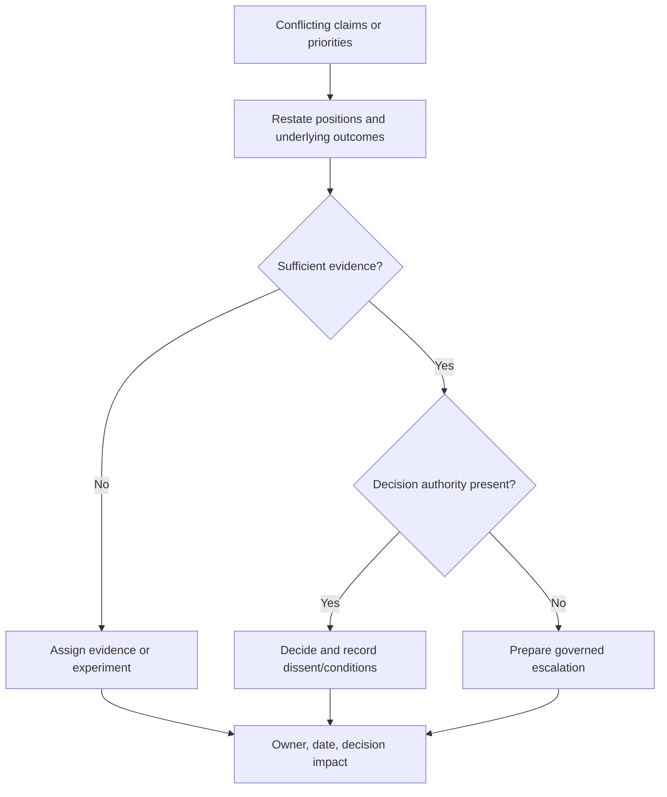

A discovery workshop is a designed intervention that turns distributed knowledge into explicit evidence, models, conflicts, questions, and decisions. It is not a long meeting, a questionnaire read aloud, or a mechanism for forcing agreement.

The facilitator's job is to make the decision context more truthful: include the right perspectives, distinguish observed fact from belief, expose incompatible assumptions, and leave every consequential outcome with an owner and governance route.

## Business Problem

Enterprise knowledge is fragmented. A process owner understands policy, frontline staff know exceptions, engineers know actual system behavior, operations knows incidents, security knows control obligations, and finance knows cost. None holds the complete architecture context.

Workshops can integrate these perspectives quickly, but they also amplify organizational failure modes.

| Workshop failure | What actually happened | Consequence |
|---|---|---|
| “Everyone agreed” | Senior voices dominated and dissent remained private | False consensus becomes a requirement |
| Detailed current-state map completed | Participants modeled the documented process, not observed behavior | Target design solves an idealized problem |
| Technology shortlist created | Criteria were invented after preferred products appeared | Selection is post-hoc justification |
| Action list captured | Actions have no decision impact, owner authority, or due date | Workshop output decays immediately |
| All stakeholders invited | Too many roles attended without preparation or purpose | Low engagement and shallow evidence |
| Workshop series completed | No lifecycle gate consumed the outputs | Activity is mistaken for discovery progress |

The business problem is not how to run an engaging session. It is how to produce decision-quality knowledge in the presence of hierarchy, incomplete evidence, conflicting incentives, limited time, and genuine uncertainty.

## Workshop Objective

Every workshop needs one primary outcome. Examples include:

- validate a business capability and outcome map;
- expose current-process bottlenecks and exception paths;
- agree domain language and unresolved ownership conflicts;
- identify critical interfaces and failure semantics;
- formulate measurable quality-attribute scenarios;
- validate trust boundaries and threat-model inputs;
- compare architecture options against agreed criteria; or
- resolve a specific cross-domain decision.

Use this definition card before scheduling:

| Field | Definition |
|---|---|
| Decision or outcome | What must be understood, modeled, validated, or decided? |
| Why now | Which lifecycle gate, dependency, risk, or deadline requires it? |
| In scope | Which questions and boundaries may be explored? |
| Out of scope | Which related topics will be parked or handled elsewhere? |
| Required evidence | What must participants bring or review? |
| Timebox | How much synchronous time is justified? |
| Facilitator | Who owns process neutrality and participation quality? |
| Decision owner | Who can resolve or route conflicts and accept the output? |
| Output owner | Who will finish, validate, store, and govern the artifact? |

If the objective contains “discuss,” “brainstorm,” or “align” without a concrete output and quality criterion, it is not ready.

## When to Use This Workshop

| Use a workshop when | Use another method when |
|---|---|
| Several perspectives must build or challenge one shared model | One specialist owns a bounded fact—use an interview or evidence request |
| Conflict or dependency must be visible across boundaries | The issue is sensitive or hierarchy will suppress candor—use confidential interviews first |
| Participants must make tradeoffs together | Formal authority must decide—prepare a decision package and use a governance forum |
| Rapid feedback can validate relationships and exceptions | Evidence requires observation, telemetry, document analysis, or testing |
| The output benefits from collaborative modeling | A detailed artifact needs focused authoring—draft asynchronously and review it |

A workshop is an expensive use of senior attention. Use it for interaction that cannot be achieved more accurately through asynchronous evidence collection.

## Participants and Roles

Select participants from the [stakeholder and decision-rights map](/architecture-discovery/discovery-framework/stakeholders-and-decision-rights/).

| Role | Why required | Preparation | Authority |
|---|---|---|---|
| Sponsor or outcome owner | Anchors the business purpose and consequence | Confirm outcome, baseline, target, and guardrails | Clarifies priority; may not decide every detail |
| Decision owner | Resolves the workshop's material decision or routes it | Review decision statement, options, and authority limits | Approve, reject, condition, defer, or escalate |
| Facilitator | Protects structure, neutrality, time, and participation | Design agenda, prompts, artifacts, and interventions | Controls process, not architecture outcome |
| Lead architect | Integrates evidence and architecture implications | Prepare hypotheses, context, and known gaps | Recommends; does not silently own business risk |
| Domain or capability owners | Validate meaning, policy, outcomes, and ownership | Bring rules, measures, examples, and exceptions | Validate within accountable boundary |
| SMEs and frontline practitioners | Reveal actual behavior and edge cases | Bring representative cases and evidence | Contribute knowledge, not automatic approval |
| Engineering and platform owners | Validate feasibility and dependencies | Bring topology, telemetry, roadmaps, and constraints | Own technical lifecycle within delegation |
| Operations and service owners | Expose incidents, recovery, support, and capacity | Bring SLOs, incidents, runbooks, DR and cost data | Validate operational acceptance conditions |
| Data, security, privacy, compliance, and risk | Expose obligations, controls, evidence, and risk | Bring classifications, findings, policy and authority | Agree or accept only within delegated scope |
| Scribe or modeler | Maintains visible record and traceability | Prepare templates and identifiers | Records; does not reinterpret silently |

### Participation Rules

- Invite a role because of a contribution or authority, not status.
- Keep the active group small enough for interaction; use reviewers and observers deliberately.
- Identify delegates who can contribute and commit within a defined boundary.
- Separate vendor product expertise from evaluation and recommendation ownership.
- Give low-authority stakeholders channels to challenge senior claims safely.
- Do not let observers silently become decision makers after the workshop.

## Required Inputs and Prework

Participants should not spend synchronous time discovering that basic records exist.

### Facilitator Prework

1. Confirm the chartered decision and lifecycle gate.
2. Define one primary workshop outcome and its quality criterion.
3. Identify participants, roles, conflicts, authority, and accessibility needs.
4. Collect existing evidence and mark its currency and confidence.
5. Prepare a visible starting model with hypotheses clearly labeled.
6. Write prioritized prompts, not a comprehensive questionnaire.
7. Define parking-lot rules and escalation paths.
8. Prepare artifact identifiers for evidence, findings, assumptions, risks, and decisions.
9. Plan interventions for hierarchy, dominance, silence, and remote participation.
10. Confirm follow-up ownership and validation deadline before the session.

### Participant Prework

| Participant | Minimum preparation |
|---|---|
| Outcome owner | Baseline, target, guardrails, and business consequence |
| Domain owner | Terms, rules, ownership, known conflicts, representative examples |
| Engineering | Current topology, dependencies, change history, telemetry, limitations |
| Operations | Incidents, SLOs, support model, recovery evidence, operational pain |
| Security or compliance | Applicable obligations, findings, exceptions, required evidence |
| Data or integration | Catalogs, contracts, lineage, quality, consumers, ownership gaps |
| Vendor | Current supported capability, constraints, evidence, and roadmap status |

Send a concise pre-read with the objective, decision, scope, model, evidence, questions, roles, and expected preparation. Ask participants to challenge factual errors before the workshop where possible.

## Agenda

This 120-minute agenda suits a cross-domain discovery workshop. Reduce or split it when cognitive load is high.

| Time | Activity | Method | Output |
|---:|---|---|---|
| 0–10 min | Frame decision and working rules | Decision statement, scope, authority, evidence rules | Shared purpose and boundaries |
| 10–25 min | Validate known context | Silent review followed by corrections | Corrected starting model |
| 25–55 min | Elicit evidence and exceptions | Structured round-robin and scenario probes | Facts, assumptions, conflicts, gaps |
| 55–70 min | Model relationships | Collaborative process, domain, context, or dependency mapping | Shared model with traceability |
| 70–85 min | Break | Facilitator consolidates visible themes | Prepared convergence view |
| 85–105 min | Resolve or frame conflicts | Evidence-based comparison and decision-rights check | Decisions, options, or escalations |
| 105–115 min | Confirm risks and open questions | Materiality and confidence review | Prioritized validation backlog |
| 115–120 min | Commit | Read-back of owners, dates, decisions, and review | Explicit closure |

Never remove the close to recover time lost earlier. An unfinished model with clear ownership is more useful than a polished model with ambiguous commitments.

## Workshop Flow

The workshop moves from divergence to convergence, but it does not require forced agreement. Valid outputs include a confirmed finding, a contested claim, an experiment, a decision, an escalation, or a documented unknown with consequence and owner.

## Facilitation Guide

### Frame the Decision

Open with a read-back, not a presentation:

> “By the end of this session we need to validate the current order-reservation failure paths and identify which unresolved facts block the first modernization-wave decision. We are not selecting a platform today.”

Confirm:

- decision and outcome;
- scope and exclusions;
- what can and cannot be decided in the room;
- how evidence, assumptions, and disagreement will be recorded;
- parking-lot criteria;
- confidentiality and attribution rules; and
- completion test.

Ask the decision owner to confirm the framing. This prevents the facilitator from inventing authority.

### Validate the Starting Model

Begin with silent review so participants can think before hierarchy and group dynamics take over. Ask them to mark:

- factually wrong;
- incomplete;
- assumption;
- disputed;
- no longer current; and
- outside scope.

Correct the model visibly. Preserve the original evidence reference and record who can validate each change.

### Elicit Evidence

Use concrete scenarios instead of opinions:

- “Show the last three incidents where this dependency failed.”
- “Walk through a real order that required manual compensation.”
- “Which report proves the stated volume and period?”
- “What happens at month-end, seasonal peak, or regional outage?”
- “Who changes this rule and how does the system learn about it?”
- “Which consumer breaks if this identifier changes?”

Use a visible classification:

| Marker | Meaning |
|---|---|
| Fact | Corroborated by an identifiable source |
| Experience | Credible observation needing further validation |
| Assumption | Temporarily accepted belief with validation owner |
| Conflict | Sources or accountable perspectives disagree |
| Unknown | No reliable answer or source exists |
| Decision | Authorized choice with rationale and conditions |

### Expose Conflict and Uncertainty

Conflict is useful data. Keep it impersonal and specific:

1. state each position in language its owner accepts;
2. identify the outcome, constraint, or risk behind it;
3. list supporting evidence and limitations;
4. identify the valid decision authority;
5. determine whether more evidence could change the choice; and
6. resolve, experiment, or escalate.

Do not ask stakeholders to “take it offline” without defining the decision, owner, evidence, due date, and escalation.

### Manage Power and Participation

Use techniques deliberately:

- silent writing before open discussion;
- round-robin input before free debate;
- anonymous collection for sensitive risks;
- scenario walkthroughs led by frontline practitioners;
- separate interviews before sessions with severe hierarchy;
- explicit invitation to challenge the starting model;
- timeboxing dominant speakers; and
- read-back from quiet accountable owners.

Neutral facilitation does not mean neutrality about evidence quality or exclusion. The facilitator should challenge unsupported claims and harmful participation dynamics.

### Converge Without Hiding Dissent

Convergence may produce:

- accepted finding;
- accepted requirement or criterion;
- decision within authority;
- shortlist of options;
- rejected hypothesis;
- bounded experiment;
- documented dissent;
- formal escalation; or
- re-chartering recommendation.

Use dot voting only to prioritize investigation or surface sentiment. Do not use popularity voting to decide security risk, regulatory interpretation, domain ownership, or enterprise architecture.

### Confirm Ownership and Follow-Up

End with a visible commitment table.

| ID | Outcome or action | Type | Owner | Due | Decision impact | Review route |
|---|---|---|---|---|---|---|
| | | Finding / evidence / decision / risk / escalation | | | | |

Read every decision, conflict, risk, and action aloud. Ask owners to accept or correct them. Confirm when and by whom the workshop artifact will be validated.

## Prompts and Probes

### Outcome and Scope

- Which decision could this workshop change?
- What measurable outcome is at risk?
- Which adjacent concern is important but outside today's scope?
- What would make the workshop result unusable?

### Current State

- What actually happens, not what the process says should happen?
- Which exceptions consume the most time or create the most risk?
- Where are manual controls, reconciliation, or workarounds hiding?
- Which owner or evidence source could contradict this model?

### Quality and Risk

- Under which load, outage, attack, or operational condition does this fail?
- What is measured today, and what is only believed?
- Who owns the consequence and can accept the residual risk?
- Which unknown could reverse the architecture recommendation?

### Dependencies and Transition

- Which provider, consumer, data source, or team must change first?
- What must coexist, for how long, and who operates both states?
- How will rollback, reconciliation, and decommissioning work?
- Which dependency sits outside program funding or authority?

### Decision and Governance

- Are we making a finding, recommendation, or authorized decision?
- Who has authority, and what is their threshold?
- What dissent or condition must remain visible?
- What triggers reassessment?

## Expected Artifacts

Select artifacts based on the objective.

| Workshop type | Primary artifact | Supporting record |
|---|---|---|
| Chartering | Engagement charter | Stakeholder and decision-rights map |
| Business discovery | Outcome, capability, or value-stream map | Measures, assumptions, open questions |
| Domain discovery | Domain language, context, or event model | Ownership conflicts and rule sources |
| Process discovery | Current/target process with exceptions | Pain points, controls, measures |
| NFR discovery | Quality-attribute scenarios | Evidence, priorities, conflicts, validation |
| Integration discovery | Context or dependency map | Interface catalog gaps and failure semantics |
| Security discovery | Asset and trust-boundary view | Threat inputs, obligations, control gaps |
| Option workshop | Option model and evaluation | Tradeoffs, dissent, experiments, risks |
| Review workshop | Findings and conditions | Decisions, escalations, follow-up |

Workshop notes are not the final artifact. Convert the visible working model into a governed version while preserving evidence links and dissent.

## Enterprise Example

### Healthcare Referral Workshop

A healthcare network wants to reduce referral leakage between primary care, specialists, diagnostic partners, and insurers. Leadership initially attributes the problem to missing APIs.

The facilitator designs a current-process and exception workshop with referral operations, clinicians, scheduling, integration engineering, data privacy, payer contracting, contact-center staff, and a patient representative.

Scenario walkthroughs reveal:

| Initial belief | Workshop evidence | Implication |
|---|---|---|
| Referrals fail because partners lack APIs | Many partners receive messages successfully but reject incomplete clinical or authorization data | Data completeness and rule ownership precede transport redesign |
| One global workflow is sufficient | Urgent, routine, diagnostic, and payer-authorized referrals have different decision points | Model distinct scenarios and exception paths |
| Scheduling owns referral completion | Primary care, payer authorization, patient choice, and specialist capacity share the outcome | Establish cross-capability ownership and measures |
| The privacy rule prohibits status sharing | Policy allows defined status data with purpose and consent controls | Obtain formal interpretation and control design |

The workshop does not select an integration platform. It produces a validated process model, four scenario classes, unresolved ownership decisions, evidence actions, and a governance escalation for the shared completion measure.

## Failure Modes and Facilitation Responses

| Failure mode | Facilitator response |
|---|---|
| Sponsor dictates the answer | Re-anchor on outcome, mark the statement as a hypothesis or decision constraint, and confirm authority |
| Participants debate abstractions | Request a concrete case, incident, transaction, or observed example |
| One SME becomes the source of truth | Ask for corroborating evidence, counterexamples, and accountable owner validation |
| Silence follows a senior statement | Use silent input, round-robin, anonymous collection, or separate follow-up |
| Discussion leaves scope | Park it with owner and decision impact; re-charter if material |
| Technology dominates early | Return to requirements, criteria, and uncertainty before options |
| Conflict cannot be resolved | Record positions and evidence; invoke the decision-rights escalation path |
| Remote participants disengage | Use shared artifacts, equal digital input, explicit turns, and dedicated facilitation support |
| Time expires before closure | Stop modeling and complete the commitment read-back |
| Notes become the “truth” | Publish a draft with evidence status and require owner validation |

## Best Practices

1. Design workshops around one decision-relevant outcome.
2. Collect factual prework asynchronously and reserve live time for integration and conflict.
3. Start with a model participants can challenge rather than a blank canvas.
4. Use concrete cases, incidents, and scenarios to defeat abstraction.
5. Classify facts, assumptions, conflicts, unknowns, and decisions visibly.
6. Make authority and permitted decisions explicit at the start.
7. Protect low-authority evidence holders from hierarchy effects.
8. Separate facilitation ownership from recommendation and approval.
9. Preserve dissent and source limitations in final artifacts.
10. Close with owner acceptance, due dates, decision impact, and review route.

## Anti-Patterns

### Questionnaire Karaoke

The facilitator reads a generic list while participants answer from memory. Questions are not prioritized by decision impact, and evidence is not validated.

### Blank-Canvas Theater

Senior participants spend expensive time drawing basic facts that could have been prepared. The output feels collaborative but remains shallow.

### Consensus Manufacturing

Silence, voting, or a sponsor's summary becomes “agreement.” Dissent and authority remain undocumented.

### Architecture by Sticky Note

Colorful clusters are treated as domain boundaries, requirements, or roadmap priorities without evidence, ownership, or quality criteria.

### The Mega-Workshop

Every stakeholder and topic is combined into one session. Cognitive load, hierarchy, and scope make meaningful validation impossible.

### No-Owner Parking Lot

Hard questions are deferred to protect the agenda, then disappear because their decision impact and ownership were never captured.

## Completion Criteria

- [ ] The workshop answered its primary question or explicitly recorded why it could not.
- [ ] Scope and authority remained clear throughout the session.
- [ ] Material claims are linked to evidence or classified by confidence.
- [ ] Conflicts and dissent remain visible.
- [ ] Decisions were made only by valid authorities.
- [ ] Unresolved material uncertainty has validation or escalation owners.
- [ ] Artifacts identify status, owner, audience, and review date.
- [ ] Actions include due dates and decision impact.
- [ ] Participants know how and when outputs will be validated.
- [ ] The lifecycle gate consuming the output is identified.

## Follow-Up and Governance

Within one working day, publish:

- the corrected model or artifact;
- evidence references and confidence;
- findings and implications;
- decisions, rationale, dissent, and conditions;
- risks and conflicts;
- open questions and validation actions;
- owners and dates; and
- the next review or decision gate.

Do not label outputs “approved” merely because participants attended. Apply the agreed validation rule: accountable-owner review, evidence reconciliation, formal governance decision, or a stated combination.

Track material workshop outcomes through the [discovery lifecycle](/architecture-discovery/discovery-framework/discovery-lifecycle-and-governance/), not in isolated minutes.

## Architecture Review Notes

Reviewers should challenge workshop outputs when:

- the purpose says “alignment” but no decision or artifact is defined;
- required knowledge or authority was absent;
- senior agreement is presented without evidence;
- output status does not distinguish draft, validated, and decided;
- models omit exceptions, failure paths, or external dependencies;
- voting replaced accountable decision rights;
- vendor claims are recorded as capabilities without validation;
- dissent disappeared between the working session and final artifact;
- actions have no decision impact or escalation; or
- the output is not consumed by a lifecycle gate.

## Interview Questions

### How do you prepare for an architecture discovery workshop?

Start from the chartered decision and lifecycle gate, define one output and quality criterion, select roles through the stakeholder map, collect evidence, prepare a challengeable model, prioritize prompts, make authority explicit, and pre-assign follow-up ownership.

### How do you handle a dominant executive?

Confirm their authority without treating assertions as facts. Use silent input, structured rounds, concrete evidence, scenario walkthroughs, and explicit invitations to other accountable owners. Record the executive's position and its status accurately.

### What do you do when stakeholders disagree?

Restate each position, identify underlying outcomes or risks, compare evidence and limitations, determine decision authority, and either decide, validate, experiment, or escalate. Do not force consensus or defer without ownership.

### When should you not use a workshop?

When one expert can provide a bounded fact, evidence needs independent analysis or observation, sensitive hierarchy prevents candor, detailed authoring requires focus, or a formal authority must decide from a prepared package.

### How do you know a workshop succeeded?

It produced a decision-relevant, traceable output; distinguished evidence from uncertainty; preserved conflict; assigned valid decisions and follow-up; and moved a defined discovery lifecycle gate forward.

## Summary

Discovery workshops are evidence-integration and governance mechanisms. Their quality depends on a clear decision, deliberate participation, prepared evidence, visible uncertainty, protected dissent, valid authority, and accountable follow-through.

The architect-facilitator should optimize for truth and decision readiness, not energy, attendance, sticky-note volume, or apparent consensus.

The next foundation chapter establishes the [evidence and confidence model](/architecture-discovery/discovery-framework/evidence-assumptions-and-confidence/) used to validate workshop claims and resolve contradictions.

## Related Handbook Guidance

- [Discovery Engagement Charter](/architecture-discovery/discovery-framework/) — workshop purpose, scope, authority, and exit criteria
- [Stakeholders and Decision Rights](/architecture-discovery/discovery-framework/stakeholders-and-decision-rights/) — participant selection, authority, and escalation
- [Discovery Lifecycle and Governance](/architecture-discovery/discovery-framework/discovery-lifecycle-and-governance/) — gates consuming workshop outputs
- [System Design Process](/system-design/system-design-process/) — solution-design workflow after discovery
- [Security Architecture](/security-architecture/) — deeper control and trust design after security discovery identifies need
