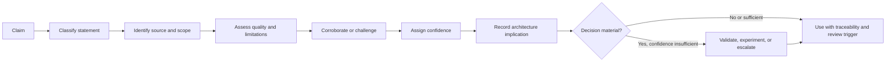
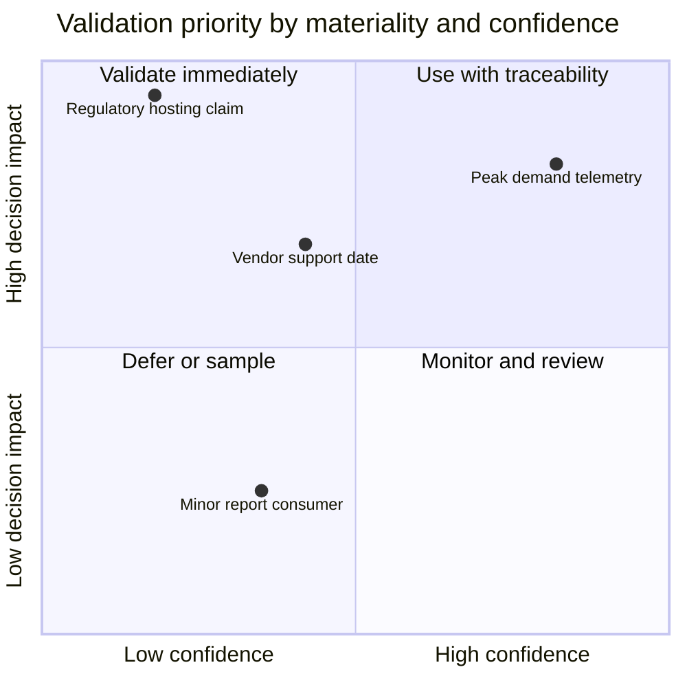
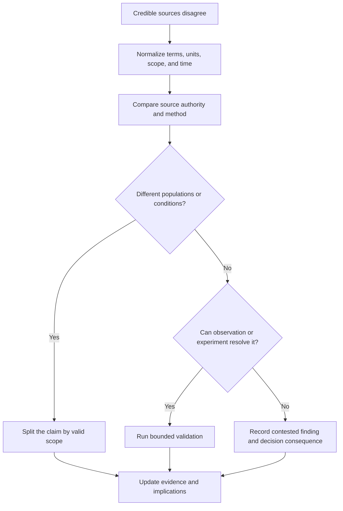

Architecture discovery converts incomplete organizational knowledge into decisions. That conversion is trustworthy only when important claims retain their source, limitations, confidence, owner, and validation status.

Evidence discipline does not mean demanding scientific certainty for every architecture choice. It means applying evidence rigor proportional to consequence and making the difference between fact, inference, assumption, opinion, and decision visible.

## Architectural Question

**How should architects decide whether a discovery claim is reliable enough to influence an enterprise decision?**

The answer depends on more than the credibility of the person making it. Architects must consider the claim's materiality, source quality, representativeness, currency, corroboration, known limitations, and the cost of being wrong.

## Business Problem

Enterprise discovery receives statements such as:

- “The application cannot scale.”
- “The regulator requires on-premises hosting.”
- “This interface has no consumers.”
- “Recovery takes four hours.”
- “The vendor will support the feature next quarter.”
- “Customers abandon because onboarding is too slow.”
- “The team lacks cloud skills.”

Each statement may be true, partly true, outdated, scoped incorrectly, or politically convenient. Treating all of them as facts creates hidden architecture risk.

| Evidence failure | Example | Decision impact |
|---|---|---|
| Authority bias | A senior leader's estimate becomes the demand baseline | Capacity and cost are distorted |
| Documentation bias | A target process is mistaken for current behavior | Architecture ignores manual exceptions |
| Availability bias | The last incident dominates reliability priorities | Investment does not address systemic failure |
| Vendor-roadmap bias | Planned capability is treated as deployable | Program depends on an uncommitted future state |
| Sample bias | One region represents the enterprise | Rollout fails under different rules and volumes |
| False precision | Unsupported numbers appear in formal tables | Reviewers cannot see uncertainty |
| Evidence decay | Old inventories and diagrams retain “approved” status | Dependencies and ownership are missed |

The cost is not only a wrong decision. Weak evidence makes architecture hard to review, defend, reassess, and govern when conditions change.

## Why It Matters

Evidence quality determines whether discovery can responsibly move through the [lifecycle gates](/architecture-discovery/discovery-framework/discovery-lifecycle-and-governance/).

It enables architects to:

1. distinguish what is known from what is temporarily believed;
2. prioritize validation toward uncertainty that could change the decision;
3. resolve contradictions without relying on hierarchy;
4. make recommendations conditional when evidence is incomplete;
5. expose the cost and risk of missing information;
6. preserve decision rationale for audit and reassessment; and
7. prevent delivery teams from inheriting assumptions disguised as requirements.


Confidence is a property of a specific claim in a specific scope—not a permanent rating of a person, document, system, or organization.


## Core Model

Every material discovery statement should move through a controlled chain.

### Statement Classification

| Type | Meaning | Example | Treatment |
|---|---|---|---|
| Observation | Directly recorded behavior or event | Gateway logs show 8,200 RPS at 10:04 | Preserve source, time, scope, and limitations |
| Fact | Corroborated observation accepted for the defined scope | Peak production demand reached 8,200 RPS during the campaign | Record corroboration and validity period |
| Inference | Reasoned conclusion from evidence | Connection-pool exhaustion probably caused the latency spike | Record reasoning and plausible alternatives |
| Assumption | Unverified statement temporarily used for progress | Partner migration will complete before wave two | Assign owner, validation date, and failure consequence |
| Estimate | Quantified projection with a method and uncertainty | Peak demand may reach 15k–20k RPS next year | Record model, range, inputs, and sensitivity |
| Opinion | Preference or judgment not presented as evidence | The team prefers managed Kafka | Convert to criterion or label clearly |
| Constraint | Binding condition with source and scope | Records for jurisdiction X must remain in-region | Validate authority, applicability, and exception route |
| Decision | Authorized choice based on evidence and judgment | Adopt active-active for the payment authorization path | Record owner, rationale, tradeoffs, and review trigger |

A decision is not a fact, and an assumption is not automatically a defect. Problems arise when categories are hidden.

## Evidence Quality Dimensions

Assess evidence using consistent dimensions.

| Dimension | Question | Weak signal | Strong signal |
|---|---|---|---|
| Authority | Is the source entitled to define this fact or obligation? | Unnamed stakeholder | Accountable owner or formal authority |
| Directness | How close is the source to the behavior? | Repeated hearsay | Direct measurement, record, or observation |
| Currency | Does it represent the relevant time? | Undated diagram | Timestamped evidence covering current state |
| Scope | Does it cover the population and boundary in the claim? | One region generalized globally | Representative segments and explicit exclusions |
| Method | Can the result be reproduced or challenged? | Spreadsheet with unknown formula | Defined collection and calculation method |
| Corroboration | Do independent sources agree? | Single interview | Multiple independent evidence types |
| Completeness | Are known gaps and exceptions visible? | Only successful cases | Failures, exceptions, and missing data included |
| Incentive | Could the source benefit from a particular conclusion? | Vendor self-assessment | Bias disclosed and independently validated |
| Stability | How quickly can the evidence become stale? | Product roadmap claim | Contracted current capability or monitored state |
| Traceability | Can reviewers locate the source and context? | Copied number in slides | Durable reference, owner, version, and scope |

Evidence can be strong in one dimension and weak in another. Production telemetry is direct but may cover only a quiet period. A regulator's rule is authoritative but may be interpreted incorrectly for the data and legal entity in scope.

## Confidence Model

Use a small, explainable scale. Avoid numeric scores that imply precision unsupported by judgment.

| Confidence | Definition | Decision treatment |
|---|---|---|
| High | Authoritative or direct, current, representative, corroborated, and limitations do not materially affect the claim | May support the decision with normal review triggers |
| Medium | Credible and partly corroborated, but has a known scope, currency, method, or completeness limitation | Use conditionally; validate if the decision is sensitive |
| Low | Indirect, old, weakly scoped, disputed, or unsupported by durable evidence | Do not use as a decisive premise without validation or risk acceptance |
| Unknown | Source, scope, or reliability has not been established | Treat as an explicit discovery gap |
| Contested | Credible sources disagree or define the claim differently | Preserve positions; investigate meaning, scope, and evidence |

Confidence must be paired with **materiality**.

The highest priority is high-impact, low-confidence evidence. High-confidence claims still require review triggers when they can decay.

## Evidence Register

Maintain a register for material evidence, not every meeting statement.

| Field | Purpose |
|---|---|
| Evidence ID | Durable reference used by findings and decisions |
| Claim | Precise statement supported or challenged |
| Classification | Observation, fact, inference, assumption, estimate, opinion, constraint, or decision |
| Source | System, record, person, contract, policy, observation, experiment |
| Owner | Accountable person for meaning or validation |
| Scope and period | Boundary, population, environment, and time covered |
| Method | How evidence was collected or calculated |
| Confidence | High, medium, low, unknown, or contested |
| Limitations | Bias, missing population, age, method, exceptions |
| Corroboration | Independent supporting or conflicting sources |
| Implication | Requirement, risk, criterion, option, or roadmap effect |
| Validation action | Owner, due date, method, and decision threshold |
| Review trigger | Event or date that can invalidate the evidence |

Do not turn the register into a document warehouse. Store references and architecture meaning; keep source material in the appropriate governed repository.

## How It Works

### 1. Write a Testable Claim

Replace vague statements with scoped assertions.

| Vague statement | Testable claim |
|---|---|
| “The system is slow.” | Checkout API p95 exceeded 2.5 seconds for 18% of requests during the last three seasonal peaks |
| “Users hate the process.” | 31% of applicants abandon between document upload and identity verification |
| “The vendor cannot support us.” | The current contract excludes 24×7 severity-one support in two operating regions |
| “The database cannot scale.” | Write latency exceeds the 80 ms budget above 6,000 sustained writes/s under the current partition and index design |

A claim should identify behavior, boundary, population, condition, and time where relevant.

### 2. Locate the Best Available Evidence

Prefer the source closest to actual behavior and accountability:

1. direct observation, measurement, or executed record;
2. authoritative system of record, contract, policy, or formal determination;
3. reproducible analysis or experiment;
4. accountable-owner testimony with context;
5. experienced practitioner testimony;
6. secondary documentation; and
7. unsupported recollection or preference.

This is a heuristic, not a universal hierarchy. A metric can be wrong because instrumentation excludes failures; a practitioner may reveal the exclusion.

### 3. Assess Scope and Limitations

Ask:

- Which environment, region, customer segment, product, and time period are covered?
- Which failures, retries, manual steps, and excluded records are missing?
- Is the collection method stable and documented?
- Does the source have an incentive to favor an interpretation?
- What changed since the evidence was produced?
- Could another plausible explanation fit the same evidence?

Record limitations beside the claim, not in an appendix reviewers will miss.

### 4. Triangulate Material Claims

Use different evidence types where possible.

| Claim | Useful triangulation |
|---|---|
| Process delay | Workflow timestamps + observation + support cases |
| System dependency | Runtime traffic + configuration/code + provider and consumer confirmation |
| Reliability weakness | SLO data + incident records + recovery tests + operator interviews |
| Customer pain | Journey analytics + research + complaints + abandonment behavior |
| Cost problem | Invoice + allocation model + resource telemetry + contract |
| Compliance constraint | Legal text + formal interpretation + data classification + control owner |

Multiple sources repeating the same undocumented claim are not independent corroboration.

### 5. Resolve Contradictions

Contradiction often indicates different definitions, scopes, periods, or incentives.

Do not average incompatible claims or choose the more senior source. If uncertainty cannot be resolved, frame options and conditions that make it governable.

### 6. Assign Confidence and Materiality

Document the judgment briefly:

> **Medium confidence, high materiality:** production telemetry confirms normal-week volumes, but seasonal partner traffic is excluded. Obtain gateway logs from the last campaign before capacity and commercial commitment.

This is more useful than a score of 63/100 because it explains what is missing and why it matters.

### 7. Choose a Treatment

| Condition | Treatment |
|---|---|
| High confidence, material | Use with traceability and review trigger |
| Medium confidence, material | Validate or make the decision conditional |
| Low/unknown confidence, material | Block commitment, experiment, re-scope, or seek authorized risk acceptance |
| Contested and material | Resolve definitions/scope, test, or escalate |
| Low materiality | Record minimally, sample, defer, or exclude |
| Rapidly changing evidence | Monitor and bind decision to a validity period |

### 8. Propagate Evidence Status

When evidence changes, update dependent findings, requirements, risks, options, estimates, and decisions. Traceability prevents an invalidated assumption from remaining embedded in the target architecture.

## Evidence Debt

Evidence debt is the accumulated risk of decisions relying on missing, stale, weak, or untraceable evidence.

| Evidence debt type | Example | Risk |
|---|---|---|
| Missing baseline | No current process cycle-time distribution | Benefits cannot be verified |
| Stale inventory | CMDB omits cloud and batch dependencies | Migration scope is incomplete |
| Unowned semantics | No owner defines “active customer” | Reports and integrations disagree |
| Untested recovery | Written RTO has never been exercised | Transition risk is understated |
| Uncontracted roadmap | Decision assumes future vendor feature | Critical dependency lacks commitment |
| Hidden manual control | Spreadsheet reconciliation is absent from process model | Automation removes a necessary control |

Manage evidence debt like architecture risk:

- identify the dependent decision;
- describe consequence and exposure;
- assign validation owner and date;
- decide whether to pay, accept, isolate, or monitor it;
- prevent it from silently becoming a delivery assumption.

## Practical Example

### Government Benefits Platform

A government agency plans to consolidate three citizen-benefit portals. Discovery receives these claims:

| Claim | Initial source | Initial status |
|---|---|---|
| 80% of citizens use digital channels | Strategy presentation | Medium confidence; survey population unclear |
| All programs use the same citizen identifier | Enterprise data model | Low confidence; model is six years old |
| Records must remain within the country | Security policy summary | Medium confidence; data classes not specified |
| Legacy batch completes by 05:00 | Operations manager | Contested; recent incidents suggest otherwise |
| The identity vendor supports delegated guardians | Vendor roadmap | Low confidence; not current contracted capability |

Validation changes the architecture context:

- channel logs show digital usage varies from 52% to 91% by program and accessibility cohort;
- two programs use household-level identifiers, so consolidation requires semantic and reconciliation work;
- residency applies to defined personal-data classes, while anonymized analytics has a different rule;
- batch completion misses 05:00 in 14% of month-end runs;
- delegated guardianship needs a separate policy and identity design before vendor selection.

The team no longer treats “one portal” as a simple front-end consolidation. Evidence exposes domain, data, accessibility, batch, and identity decisions that must precede commitment.

## Tradeoffs and Boundaries

| Choice | Benefit | Cost or risk | Appropriate treatment |
|---|---|---|---|
| Validate every claim | Maximum theoretical confidence | Slow, expensive, and unfocused | Avoid; prioritize by materiality |
| Trust accountable owners | Fast and context-rich | Ownership may not equal current evidence | Corroborate material behavior and constraints |
| Depend on telemetry | Direct and scalable | Instrumentation may exclude failures or populations | Validate definitions, coverage, and gaps |
| Use formal confidence scoring | Comparable and reportable | Creates false precision and scoring debates | Prefer small ordinal scale with rationale |
| Accept assumptions | Enables progress | Hidden conditions can invalidate decisions | Make owner, expiry, consequence, and validation explicit |
| Delay for certainty | Reduces some risks | Opportunity cost and changing conditions | Use bounded experiments and conditional decisions |

Evidence practice does not replace architecture judgment. Evidence establishes premises; architects still interpret tradeoffs, future uncertainty, organizational readiness, and strategic direction.

## Best Practices

1. Write precise claims before searching for evidence.
2. Match validation effort to decision materiality and reversibility.
3. Record scope, period, method, and limitations beside every material claim.
4. Triangulate with independent evidence types.
5. Separate authority over meaning from evidence of actual behavior.
6. Preserve contradiction until definitions, scope, or observation resolve it.
7. Use ranges and sensitivity analysis instead of invented precision.
8. Assign assumptions owners, expiry dates, failure consequences, and review triggers.
9. Track evidence debt as risk, not administrative backlog.
10. Propagate changed evidence through dependent findings and decisions.

## Common Mistakes and Anti-Patterns

| Anti-pattern | Why it fails | Correction |
|---|---|---|
| Seniority as evidence | Authority does not prove behavior | Seek accountable source and corroboration |
| Document equals truth | Documents may be aspirational or stale | Verify currency, owner, and observed state |
| Workshop consensus | Agreement can reproduce shared assumptions | Validate material claims independently |
| Confidence without rationale | Rating cannot be challenged or improved | State source strengths, gaps, and consequence |
| Numeric scoring theater | Precision hides subjective judgment | Use ordinal confidence with explicit reasoning |
| Assumption appendix | Conditions are detached from dependent decisions | Link assumptions directly to options and risks |
| Proof of concept as marketing | Demonstration does not test decision uncertainty | Define hypothesis, environment, measure, and decision rule |
| Evidence hoarding | Repository grows without architecture meaning | Register only material references and implications |

## Architecture Review Notes

Reviewers should challenge a discovery package when:

- material numbers have no period, population, source, or method;
- documents are called authoritative without a current owner;
- confidence ratings have no explanation;
- one evidence type supports every conclusion;
- vendor roadmap claims are treated as current capability;
- regulatory statements lack jurisdiction, data scope, or formal interpretation;
- conflicting evidence disappears from the recommendation;
- assumptions have no owner, expiry, or consequence;
- experiments do not define what decision their result changes; or
- changed evidence has not propagated to requirements and options.

## Interview Questions

### How do you validate information from stakeholder interviews?

Convert important statements into scoped claims, identify accountable and direct sources, compare them with operational or documentary evidence, record limitations, triangulate material claims, and preserve contradictions until resolved or governed.

### What is the difference between an assumption and a risk?

An assumption is an unverified statement temporarily treated as true. A risk is an uncertain event or condition with potential consequence. If an assumption proves false, it may trigger one or more risks; both need owners and decision traceability.

### How much evidence is enough?

Enough that material premises are supported to confidence appropriate for consequence and reversibility, and remaining uncertainty is unlikely to change the decision or is explicitly validated, conditioned, or accepted by authorized owners.

### What do you do when telemetry contradicts an SME?

Check definitions, scope, instrumentation coverage, time period, and exceptions. Telemetry may omit manual or failed paths; the SME may generalize exceptional experience. Normalize the claim and seek a test that distinguishes explanations.

### How do you handle a critical decision with low-confidence evidence?

Delay or narrow commitment, run a bounded validation or experiment, choose a reversible option, impose explicit conditions, or escalate residual uncertainty to an authorized risk owner. Do not hide it behind a precise recommendation.

## Summary

Evidence discipline makes architecture discovery reviewable and decisions conditional on what is actually known. It separates observations, facts, inferences, assumptions, estimates, opinions, constraints, and decisions; evaluates source quality; assigns explainable confidence; and directs validation toward high-impact uncertainty.

The goal is not perfect knowledge. It is to prevent weak or contested premises from becoming invisible architecture commitments and to manage evidence debt with the same seriousness as other enterprise risks.

The next foundation chapter uses this evidence model to build a decision-useful [current-state architecture baseline](/architecture-discovery/discovery-framework/current-state-architecture-baseline/).

## Related Handbook Guidance

- [Discovery Lifecycle and Governance](/architecture-discovery/discovery-framework/discovery-lifecycle-and-governance/) — evidence sufficiency and decision gates
- [Discovery Workshops](/architecture-discovery/discovery-framework/discovery-workshops/) — eliciting and validating multi-stakeholder knowledge
- [Non-Functional Requirements](/system-design/non-functional-requirements/) — canonical quality-attribute framing after discovery evidence is established
- [Architecture Decision Records](/microservices/10-production-playbook/architecture-decision-records/) — preserving decision context and tradeoffs
- [Technology Decisions](/technology-playbook/) — option evaluation using validated criteria
