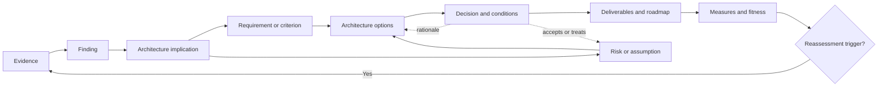
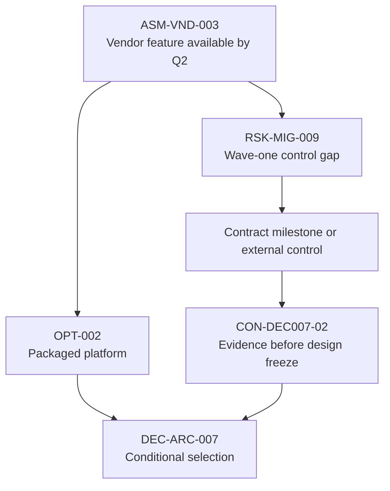

Decision traceability preserves the reasoning chain from observed evidence to architecture commitment. It allows a reviewer to reconstruct why a requirement exists, which finding supports it, how it influenced options and risks, who authorized the decision, and what event should cause reassessment.

Without that chain, architecture becomes a collection of authoritative-looking documents whose conclusions cannot be challenged or maintained safely.

## Business Problem

Discovery outputs fragment easily:

- interview notes contain claims;
- spreadsheets contain inventories and requirements;
- diagrams contain implicit boundaries;
- risk tools contain exposure;
- decision records contain rationale;
- roadmaps contain work packages; and
- delivery backlogs contain implementation tasks.

When these artifacts use different identifiers and ownership, context disappears between them.

| Traceability break | Symptom | Consequence |
|---|---|---|
| Evidence to finding | “Everyone knows this is a problem” | Reviewers cannot validate the premise |
| Finding to requirement | Requirements appear without business or operational consequence | Scope grows through preference |
| Requirement to option | Product comparison uses generic criteria | Options are evaluated against the wrong context |
| Risk to decision | Material exposure sits in a separate register | Decision authority does not see residual risk |
| Decision to delivery | Conditions remain in meeting minutes | Implementation violates approval constraints |
| Delivery to measure | Roadmap completes features, not outcomes | Benefits and architecture fitness are unknown |
| Change to reassessment | Source evidence becomes invalid | Old decisions persist without review |

Traceability is therefore not merely audit documentation. It is an architecture control that keeps discovery, decision, and execution aligned.

## Problem and Forces

The pattern balances:

- **defensibility versus administrative cost;**
- **stable identifiers versus changing artifacts;**
- **granularity versus usability;**
- **central visibility versus domain ownership;**
- **decision history versus current truth;** and
- **automated links versus human architectural judgment.**

Trace every material reasoning step, not every sentence or backlog task.

## Applicability

| Use when | Simplify when |
|---|---|
| Decisions carry enterprise, regulatory, security, operational, or financial consequence | A decision is reversible, local, and has minimal dependency |
| Several artifacts and governance systems contribute to one recommendation | One short decision brief contains the complete reasoning chain |
| Modernization spans transition waves and dependent decisions | Delivery is a direct implementation of a stable standard |
| Assumptions and evidence can decay | The fact and decision are short-lived and monitored directly |
| Reviewers need to challenge or audit rationale | Informal team judgment is sufficient within delegation |

Even lightweight traceability should retain the decision, owner, source, rationale, conditions, and review trigger.

## Pattern Structure

### Traceable Object Types

| Object | Question answered |
|---|---|
| Evidence | What source supports or challenges the claim? |
| Finding | What did discovery establish within a defined scope and confidence? |
| Implication | Why does the finding matter architecturally? |
| Requirement | What behavior or quality must be satisfied? |
| Constraint | Which binding condition limits the option space? |
| Assumption | What unverified premise is temporarily relied upon? |
| Risk | What uncertain consequence needs treatment or acceptance? |
| Criterion | How will options be compared? |
| Option | Which viable response was considered? |
| Decision | What was authorized, by whom, and why? |
| Condition | What must remain true or be completed for approval to stand? |
| Deliverable | Which artifact communicates or governs the outcome? |
| Roadmap item | Which change, experiment, or dependency advances the decision? |
| Measure | How will outcome and architecture fitness be observed? |
| Trigger | What event requires review or invalidates a premise? |

## Participants and Responsibilities

| Participant | Responsibility |
|---|---|
| Discovery lead | Defines identifiers, status model, repositories, and quality checks |
| Architects | Record implications, options, tradeoffs, and decision relationships |
| Evidence and domain owners | Validate sources, findings, meaning, and scope |
| Requirement owners | Accept requirement intent, priority, measure, and lifecycle |
| Risk owners | Own exposure, treatment, acceptance, and review |
| Decision owner | Authorizes choice, conditions, dissent, and reassessment |
| Delivery owners | Translate decisions into work while preserving conditions |
| Governance secretariat | Records gate outcomes and ensures follow-through |
| Service/outcome owners | Monitor measures and trigger reassessment |

Traceability ownership remains distributed. A central tool cannot substitute for accountable content owners.

## Workflow

### 1. Assign Stable Identifiers

Use human-readable identifiers independent of filenames and tool row numbers.

| Prefix | Object | Example |
|---|---|---|
| EVD | Evidence | `EVD-OPS-014` |
| FND | Finding | `FND-REL-006` |
| REQ | Requirement | `REQ-NFR-012` |
| ASM | Assumption | `ASM-VND-003` |
| RSK | Risk | `RSK-MIG-009` |
| OPT | Option | `OPT-003` |
| DEC | Decision | `DEC-ARC-007` |
| CON | Decision condition | `CON-DEC007-02` |
| MEA | Measure | `MEA-OUT-004` |

Identifiers should survive migration between document, catalog, risk, and delivery tools.

### 2. Convert Evidence into Findings

A finding is a scoped interpretation of evidence, not a copied source.

> **FND-REL-006:** Payment authorization availability fell below 99.90% in four of the last six months; 73% of unavailable minutes involved the synchronous fraud dependency. Confidence: high. Evidence: `EVD-OPS-014`, `EVD-INC-021`.

Record:

- statement and scope;
- evidence references;
- confidence and limitations;
- accountable validator;
- date and review trigger; and
- related or conflicting findings.

### 3. State the Architecture Implication

Do not jump directly from evidence to product choice.

| Finding | Weak leap | Valid implication |
|---|---|---|
| Fraud dependency drives payment outage | “Use Kafka” | Authorization must tolerate fraud-service unavailability within defined risk and latency conditions |
| Product rules change weekly | “Create microservices” | High-change rules need independent ownership, testing, deployment, and rollback from stable settlement logic |
| Recovery test takes nine hours | “Buy DR tooling” | Recovery design and operating procedure must meet the agreed business RTO and reconciliation criterion |

The implication becomes one or more requirements, criteria, risks, or discovery actions.

### 4. Define Owned Requirements and Criteria

Every material requirement should carry:

- statement and type;
- source finding;
- owner and affected stakeholder;
- priority and consequence;
- measurable acceptance;
- environment or scenario;
- dependencies and conflicts;
- status and version; and
- validation method.

Link requirements to findings, not directly to interview notes.

### 5. Link Risks and Assumptions

Show which option or decision depends on an assumption and which risk appears if it fails.

This makes conditional approval visible to delivery and governance.

### 6. Trace Options to Criteria

For each option, retain:

| Relationship | Why it matters |
|---|---|
| Criteria satisfied or violated | Explains architecture fit |
| Evidence and estimates used | Exposes confidence and sensitivity |
| Risks introduced or treated | Makes exposure part of comparison |
| Assumptions required | Shows conditional viability |
| Transition dependencies | Connects choice to roadmap feasibility |
| Rejected rationale | Prevents options from reappearing without new evidence |

### 7. Record the Decision

The decision record should include:

- decision, owner, date, authority, and status;
- context and outcome;
- options considered;
- criteria, evidence, and tradeoffs;
- risks and assumptions;
- dissent;
- conditions and actions;
- measures; and
- review date or trigger.

Use the existing [Architecture Decision Records](/microservices/10-production-playbook/architecture-decision-records/) guidance for the durable ADR process. Discovery provides the evidence chain feeding it.

### 8. Propagate Conditions into Delivery

Translate conditions into owned work and gates.

| Decision condition | Delivery representation | Verification |
|---|---|---|
| Prove restore below two hours | Recovery epic and release gate | Independent restore exercise |
| Resolve customer identifier ownership | Data-governance decision | Signed ownership and reconciliation rules |
| Contract vendor exit export | Procurement milestone | Executed contractual clause |
| Maintain legacy consumer compatibility | Transition architecture work | Contract and traffic validation |

Do not mark the decision complete while conditions remain detached from delivery governance.

### 9. Monitor Measures and Triggers

Trace decisions to outcome and fitness measures:

- outcome baseline and target;
- architecture quality measures;
- risk indicators;
- condition completion;
- evidence validity period; and
- triggers such as regulation, scale, incident, cost, ownership, vendor, or strategy change.

When a trigger fires, reviewers can identify which findings, requirements, options, and decisions must be reconsidered.

## Evidence and Artifacts

### Minimum Traceability Record

| Source ID | Target ID | Relationship | Owner | Status | Evidence/reason |
|---|---|---|---|---|---|
| `EVD-OPS-014` | `FND-REL-006` | supports | Service owner | validated | Availability telemetry |
| `FND-REL-006` | `REQ-NFR-012` | motivates | Product owner | approved | Outage consequence |
| `REQ-NFR-012` | `OPT-003` | evaluated-by | Lead architect | complete | Option assessment |
| `RSK-MIG-009` | `DEC-ARC-007` | conditions | Risk owner | accepted | Decision condition |
| `DEC-ARC-007` | `CON-DEC007-02` | imposes | Decision owner | open | Validation required |
| `CON-DEC007-02` | `MEA-OUT-004` | verified-by | Delivery owner | planned | Fitness measure |

The relationship is as important as the identifiers. A link should say “supports,” “contradicts,” “motivates,” “satisfies,” “violates,” “depends on,” “treats,” “supersedes,” or “verifies.”

## Enterprise Example

### Insurance Claims Automation

An insurer proposes AI-assisted claims triage. Discovery finds that settlement delay is concentrated in document-quality and coverage exceptions rather than routine claim classification.

| Chain step | Traceable object |
|---|---|
| Evidence | 41% of delayed claims have unreadable documents; 29% await policy-coverage clarification |
| Finding | Classification accuracy is not the dominant delay for exception-heavy claims |
| Implication | Options must address document quality, policy-rule access, and human escalation |
| Requirement | Triage must explain routing and preserve human override for defined risk classes |
| Risk | Automated routing could discriminate or delay vulnerable claimants |
| Options | Classification-only model; document + rules workflow; process redesign before AI |
| Decision | Pilot document-quality and policy-rule workflow for two claim types |
| Conditions | Bias assessment, audit evidence, override monitoring, and no automated denial |
| Roadmap | Eight-week pilot, operational readiness, then investment review |
| Measure | Cycle time, rework, override, error, fairness, and customer-impact measures |

Traceability prevents “deploy an AI model” from surviving after evidence changes the problem definition.

## Variants

### Lightweight Decision Thread

For bounded decisions, use a single page containing claim, evidence, implication, options, decision, conditions, and trigger.

### Regulated Traceability

Add formal versioning, approval signatures, obligation/control relationships, retention, segregation of duties, and audit evidence.

### Portfolio Traceability

Trace application assessments to dispositions, dependencies, waves, funding decisions, and outcome measures. Avoid forcing every application into identical detail.

## Tradeoffs

| Benefit | Cost or risk | Mitigation |
|---|---|---|
| Decisions are defensible and reviewable | Link maintenance costs time | Limit scope to material reasoning objects |
| Changed evidence can propagate | Tool fragmentation breaks links | Use stable IDs and exportable relationship records |
| Conditions reach delivery | Delivery systems may treat governance as overhead | Make conditions acceptance and release criteria |
| Rejected options retain rationale | Records may discourage reconsideration | Include assumptions and reassessment triggers |
| Central visibility improves governance | Central ownership can weaken domains | Keep content ownership distributed with common standards |

## Failure Modes and Anti-Patterns

| Anti-pattern | Why it fails | Correction |
|---|---|---|
| Link everything | Noise makes material reasoning invisible | Trace only decision-significant objects |
| Traceability after approval | Rationale is reconstructed inaccurately | Capture relationships during discovery |
| Filename as identifier | Links break when artifacts move | Use stable semantic IDs |
| Tool equals governance | Fields exist but owners do not validate them | Assign accountable content owners and gates |
| Requirement orphan | Requirement has no finding or outcome | Challenge necessity, source, and owner |
| Decision orphan | ADR has no evidence or criteria | Restore option and evidence context |
| Condition in minutes | Delivery never sees approval constraint | Create owned backlog and gate relationships |
| Supersede by overwrite | Historical rationale disappears | Preserve status and explicit supersession |

## Best Practices

1. Trace material reasoning, not every sentence.
2. Use stable IDs and explicit relationship verbs.
3. Separate evidence, finding, implication, and decision.
4. Give every object an owner, status, and review trigger.
5. Preserve contradictory evidence and dissent.
6. Link assumptions to dependent options and risks.
7. Push decision conditions into delivery and release governance.
8. Trace roadmap work to outcomes, not only architecture components.
9. Preserve rejected-option rationale and the assumptions behind it.
10. Test traceability by reconstructing the decision during review.

## Architecture Review Notes

Challenge the package when:

- requirements have no finding, owner, or measurable acceptance;
- findings quote stakeholders but omit evidence scope and confidence;
- options are compared against criteria unrelated to outcomes;
- assumptions do not identify dependent choices;
- residual risks are absent from the decision record;
- dissent or rejected alternatives disappeared;
- approval conditions do not appear in delivery work;
- roadmap items cannot explain which outcome or risk they address;
- superseded decisions are overwritten; or
- no trigger can reopen the decision when evidence changes.

## Interview Questions

### Why is traceability important in architecture discovery?

It connects evidence to findings, requirements, risks, options, decisions, delivery, and measures so reviewers can challenge rationale, conditions reach execution, and changed evidence triggers the correct reassessment.

### How much traceability is enough?

Enough to reconstruct every material decision and understand its premises, alternatives, risks, conditions, ownership, and outcome measures. Avoid tracing low-impact detail whose maintenance exceeds its governance value.

### What is the difference between a finding and a requirement?

A finding is what discovery established from evidence within a scope and confidence. A requirement states behavior or quality that a solution or process must satisfy because of one or more findings and owned outcomes.

### How do you prevent assumptions from disappearing into design?

Give each material assumption an ID, owner, expiry, validation action, failure consequence, and links to dependent options, risks, decisions, and conditions.

### What happens when source evidence changes?

Mark its status, follow trace relationships to affected findings and decisions, reassess material implications, and record whether the decision remains valid, becomes conditional, or is superseded.

## Summary

Decision traceability is the connective tissue of architecture discovery. It preserves how evidence becomes findings, how findings become requirements and risks, how options respond, why a decision is authorized, and how conditions and measures govern execution.

Applied proportionately, it reduces rediscovery, hidden assumptions, ceremonial ADRs, lost approval conditions, and architecture drift while making reassessment faster and more defensible.

The next foundation chapter explains how to tailor and operate the [enterprise discovery questionnaire](/architecture-discovery/discovery-questionnaire/) across this traceability model.

## Related Patterns and Canonical Guidance

- [Evidence, Assumptions, and Confidence](/architecture-discovery/discovery-framework/evidence-assumptions-and-confidence/) — evidence classification and confidence
- [Current-State Architecture Baseline](/architecture-discovery/discovery-framework/current-state-architecture-baseline/) — source findings and dependencies
- [Discovery Lifecycle and Governance](/architecture-discovery/discovery-framework/discovery-lifecycle-and-governance/) — gates that consume traceable outputs
- [Architecture Decision Records](/microservices/10-production-playbook/architecture-decision-records/) — durable architecture decision process
- [Technology Decisions](/technology-playbook/) — evidence-based option evaluation
