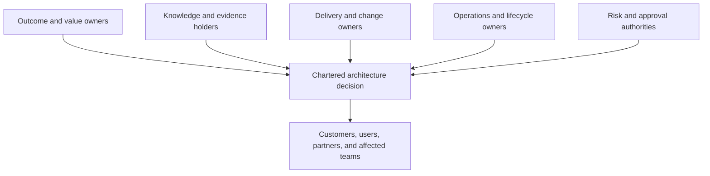
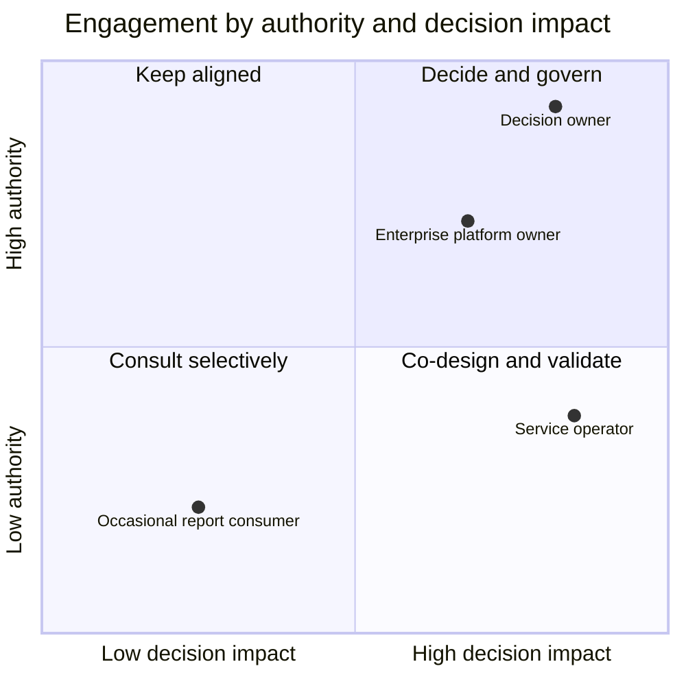
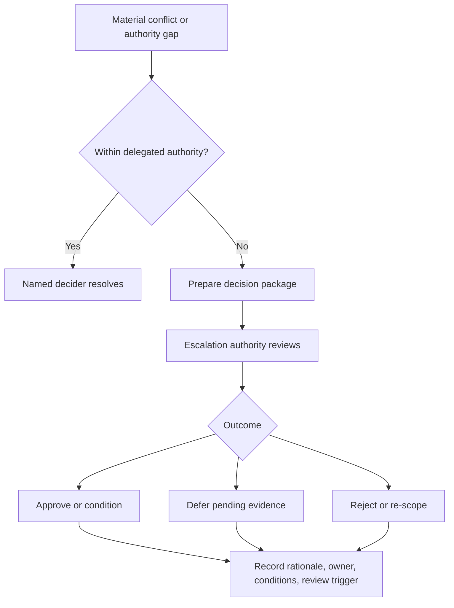

Enterprise discovery fails when the people in the room are mistaken for the people who own the truth, outcome, decision, or risk. A stakeholder may understand a process without owning it, fund a program without using its services, approve an investment without accepting security risk, or operate a platform without authority to change its roadmap.

Stakeholder analysis must therefore do more than produce a contact list. It must expose how knowledge, incentives, accountability, authority, and consequences are distributed—and establish how conflicts will become decisions.

## Business Problem

Architecture decisions cross organizational boundaries that were designed for different purposes. Business units own outcomes, product teams own roadmaps, platform teams own shared capabilities, security functions own control standards, operations teams own service continuity, procurement owns commercial commitments, and governance bodies approve investment or risk.

These ownership structures rarely align neatly with the system boundary.

| Situation | Hidden governance problem | Architecture consequence |
|---|---|---|
| A sponsor requests modernization but service owners are absent | Investment authority is confused with operational knowledge | Target architecture ignores support and recovery constraints |
| A workshop reaches consensus without a data owner | Participants agree on semantics they cannot govern | Data duplication and reconciliation problems surface during delivery |
| Security attends only the final review | Risk authority enters after options are politically committed | Late controls, exceptions, redesign, or risk escalation |
| A global template is approved by headquarters | Regional legal and process owners were treated as implementers | Local obligations invalidate the rollout plan |
| A vendor facilitates discovery and proposes the architecture | Commercial interest is not separated from recommendation authority | Criteria are biased toward the proposed product |
| A steering committee is listed as accountable | No individual resolves deadlock between meetings | Decisions drift or emerge through informal escalation |

The core problem is not lack of participation. It is **unclear decision rights across people with different knowledge, incentives, and exposure**.

## Motivation

The [Discovery Engagement Charter](/architecture-discovery/discovery-framework/) identifies the sponsor, decision owner, discovery lead, domain owners, risk owners, and review authorities at a high level. This chapter makes that operating model precise enough for real discovery.

Good stakeholder and decision-rights design enables the team to answer:

- Who can describe the current state, and which evidence can validate that account?
- Who owns the business outcome and its measurement?
- Who recommends an architecture option?
- Who must agree before the recommendation proceeds?
- Who can accept security, operational, financial, legal, or delivery risk?
- Who must be consulted because the decision changes their boundary?
- Who can block, condition, defer, or reverse the decision?
- Where does a conflict go, by when, and with which evidence?


Do not infer authority from job title, seniority, meeting attendance, or subject-matter expertise. Decision authority must be explicitly delegated and valid for the decision's scope and risk class.


## Outcome

The activity produces a stakeholder and decision-governance baseline.

| Output | Quality criterion |
|---|---|
| Stakeholder map | Covers every material outcome, domain, lifecycle stage, dependency, and risk perspective |
| Interest and impact analysis | Explains what each stakeholder gains, loses, controls, contributes, and must operate |
| Knowledge map | Identifies expertise, evidence sources, blind spots, and single-person dependencies |
| Decision-rights matrix | Separates recommendation, input, approval, execution, risk acceptance, and escalation |
| Engagement plan | Matches participation method and cadence to stakeholder role and decision timing |
| Conflict and escalation path | Names the escalation owner, evidence package, response time, and permitted outcomes |
| Coverage gaps | Records missing representation and its consequence for decision confidence |

The output is not complete because every stakeholder agrees. It is complete when the team knows who must contribute, who can decide, who owns consequences, and how unresolved conflict will be governed.

## Context and Preconditions

Perform this activity after the engagement has a provisional trigger, decision, scope, and outcome. Repeat it whenever scope, material risk, organizational ownership, or decision authority changes.

### Inputs

- discovery engagement charter;
- provisional capability, process, system, data, integration, and organization boundaries;
- existing governance forums and delegated authorities;
- organization and service-ownership records;
- applicable risk, investment, architecture, security, privacy, and compliance policies;
- known partners, vendors, customers, and external authorities; and
- the decision calendar.

### Proportionality

A reversible team-level decision may need a product owner, engineering owner, affected platform owner, and security consultation. A regulated core-platform replacement may require business executives, operations, finance, data, security, privacy, legal, procurement, audit, regional owners, delivery partners, and several formal governance bodies.

Stakeholder breadth should follow decision consequence, blast radius, irreversibility, and dependency—not the architect's desire for universal consensus.

## Stakeholder Model

Map stakeholders through five lenses instead of relying only on power and interest.

### 1. Outcome and Value

Who owns the business capability, customer or employee outcome, financial result, regulatory obligation, or strategic objective? This stakeholder defines why the decision matters and how success will be measured.

### 2. Knowledge and Evidence

Who understands the actual process, business rules, exceptions, system behavior, data semantics, interface contracts, incidents, costs, and prior decisions? Knowledge holders may have no formal approval authority, but excluding them weakens the evidence base.

### 3. Change and Delivery

Who funds, designs, builds, tests, migrates, procures, coordinates, and adopts the change? These stakeholders expose feasibility, sequencing, capacity, commercial, and organizational constraints.

### 4. Operations and Lifecycle

Who supports, monitors, secures, audits, recovers, pays for, upgrades, and eventually retires the solution? Delivery ownership ends; lifecycle accountability does not.

### 5. Risk and Approval

Who approves architecture, investment, data use, security posture, privacy, compliance, vendor terms, and residual risk? Different authorities may apply to different risk types and thresholds.

## Inputs and Participants

| Input or participant | Why required | Validation |
|---|---|---|
| Sponsor | Owns strategic intent and organizational access | Confirms outcome, urgency, and escalation sponsorship |
| Accountable decision owner | Makes or sponsors the chartered decision | Authority is documented for the decision scope |
| Business capability and process owners | Own value, policies, measures, and operational change | Ownership is accepted by relevant governance |
| Product and service owners | Own roadmaps and service outcomes | Catalog, budget, and operational records corroborate ownership |
| Domain SMEs and frontline users | Reveal actual behavior, exceptions, workarounds, and language | Evidence is sampled beyond nominated advocates |
| Engineering and platform owners | Explain feasibility, standards, dependencies, and lifecycle | Repositories, inventories, telemetry, and roadmaps corroborate claims |
| Data and integration owners | Own semantics, quality, contracts, lineage, and shared dependencies | Catalogs and consumer/provider confirmation align |
| Operations and support | Provide incidents, recovery, support, observability, and capacity evidence | Service-management and telemetry sources are available |
| Security, privacy, legal, compliance, and risk | Define obligations, controls, exceptions, and acceptance authority | Applicable policy and delegation are named |
| Finance, procurement, and vendor management | Expose cost, contract, licensing, exit, and supplier constraints | Executed agreements and financial sources are used |
| Partners, vendors, and external authorities | Constrain interfaces, timelines, certification, and obligations | Formal commitments distinguish facts from sales claims |
| Architecture and investment governance | Defines approval gates, conditions, and enterprise alignment | Terms of reference and delegated authority are current |

## Procedure

### 1. Start from the Decision, Not the Organization Chart

Decompose the chartered decision into affected outcomes and boundaries.

| Boundary | Discovery prompt |
|---|---|
| Business capability | Who owns performance and policy for this capability? |
| Process or journey | Who performs, measures, controls, and experiences the process? |
| Domain and data | Who defines meaning, rules, quality, access, and lifecycle? |
| System and service | Who changes, funds, operates, supports, and retires it? |
| Integration | Who provides and consumes each critical contract? |
| Security and compliance | Who owns the asset, control, obligation, exception, and residual risk? |
| Transition | Who operates current, interim, and target states? |
| Commercial | Who owns contracts, licenses, suppliers, and exit rights? |

An organization chart shows reporting lines. It rarely shows service accountability, informal expertise, shared-platform dependency, external authority, or who suffers when a decision fails.

### 2. Identify Stakeholders by Role and Consequence

Use nouns more precise than “business” and “IT.” Record the role in this decision, not only the person's job title.

| Weak label | Decision-specific role |
|---|---|
| Business | Claims Operations outcome owner |
| Security | Customer Identity control owner and authentication-risk adviser |
| Data team | Customer master data owner and lineage evidence provider |
| Architecture | Architecture recommendation owner and review-secretariat lead |
| Operations | Tier-1 service owner and disaster-recovery evidence owner |
| Vendor | Product capability evidence provider with commercial interest |

For each stakeholder, capture:

- outcome or concern;
- authority and its boundary;
- knowledge and evidence contributed;
- effect of the decision on them;
- incentives and potential bias;
- availability and required timing;
- delegate or continuity risk; and
- engagement method.

### 3. Map Knowledge and Evidence Ownership

Subject-matter expertise is not self-validating. Connect people to evidence and expose coverage gaps.

| Question | Claimed expert | Evidence source | Confidence risk |
|---|---|---|---|
| Why are orders canceled? | E-commerce operations | Cancellation codes, support cases, inventory events | Reason codes are incomplete |
| Which interfaces use customer ID? | Integration architect | Gateway logs, broker schemas, code search, API catalog | Batch-file consumers are not centrally logged |
| What is the recovery target? | Service owner | DR plan, exercise reports, business impact analysis | Written target differs from tested recovery |
| Can the vendor meet residency rules? | Vendor architect | Contract, deployment topology, legal determination | Roadmap capability is presented as current |

Classify important knowledge as:

- **authoritative:** accountable owner with corroborating evidence;
- **experienced:** credible operational knowledge not yet fully evidenced;
- **inferred:** conclusion from partial evidence;
- **contested:** credible stakeholders or sources disagree; or
- **missing:** no reliable owner or evidence exists.

This becomes an input to the evidence and confidence method in F06.

### 4. Analyze Interest, Impact, and Incentives

Traditional power-interest grids help plan communication but are insufficient for architecture governance. Add impact and incentive.

| Dimension | Questions |
|---|---|
| Authority | Can this stakeholder approve, block, condition, fund, or accept risk? |
| Impact | What changes in their outcome, workload, control, cost, or accountability? |
| Interest | How closely will they follow and influence the work? |
| Knowledge | What unique facts, context, or evidence do they hold? |
| Incentive | What outcome or option benefits or disadvantages them? |
| Exposure | What consequence do they own if the decision fails? |

A stakeholder with low hierarchy but high operational impact may require deep involvement. A senior executive with high authority but limited subject knowledge requires concise decision packages, not attendance in every workshop.

Do not use the quadrant to silence low-authority stakeholders. Frontline users, support teams, and external consumers often hold evidence that invalidates senior assumptions.

### 5. Separate Work Responsibility from Decision Authority

RACI is useful for activities and deliverables:

- **Responsible:** performs the work;
- **Accountable:** owns completion and outcome;
- **Consulted:** provides required input; and
- **Informed:** receives the result.

It is often too vague for consequential decisions. Add explicit decision roles:

| Decision role | Meaning |
|---|---|
| Recommend | Frames options and proposes a choice using evidence |
| Input | Supplies mandatory expertise or evidence before recommendation |
| Agree | Must concur because the decision crosses an owned policy or boundary |
| Decide | Approves, rejects, defers, or conditions the recommendation |
| Execute | Implements the decision and reports conditions or blockers |
| Accept risk | Formally owns residual exposure within delegated authority |
| Escalate | Resolves conflict or authority limits at the next governance level |

One person may hold several roles, but each role must be explicit. “Agree” should be reserved for genuine shared authority; excessive agreement roles recreate consensus governance.

### 6. Build the Decision-Rights Matrix

Create one row per material decision, not one row for the whole program.

| Decision | Recommend | Mandatory input | Agree | Decide | Execute | Risk acceptance | Escalation |
|---|---|---|---|---|---|---|---|
| Modernization disposition | Lead architect | Capability, service, finance, operations | Enterprise architecture | Investment council chair | Program owner | Business sponsor | Executive committee |
| Customer-data migration | Data architect | Data owner, privacy, operations | Privacy and data governance | Data executive | Migration lead | Data risk owner | Risk committee |
| Temporary security exception | Security architect | Service owner, threat model, compliance | Control owner | Delegated security authority | Engineering owner | Named business risk owner | CISO or risk committee |
| First-wave production cutover | Delivery lead | Service, operations, security, business | Service owner | Program executive | Release authority | Operational risk owner | Transformation board |

Validate that:

- there is one clear decider for each decision;
- the decider's authority covers the scope and threshold;
- required agreements are few and justified;
- the risk acceptor is authorized for the specific risk type and exposure;
- execution ownership is compatible with the approved conditions; and
- escalation has a response time aligned with the decision calendar.

### 7. Design Participation by Decision Stage

Not every stakeholder needs every meeting.

| Stage | Participation objective | Typical participants | Output |
|---|---|---|---|
| Chartering | Confirm decision, outcomes, scope, authority, and evidence | Sponsor, decision owner, discovery lead, key risk authorities | Approved charter |
| Evidence discovery | Establish current facts, contradictions, and gaps | SMEs, owners, users, operators, analysts | Evidence and findings |
| Synthesis | Convert evidence into requirements, risks, and criteria | Architects, domain owners, delivery and operations | Validated implications |
| Option framing | Create viable choices and transition conditions | Architecture, engineering, operations, finance, security, vendors as inputs | Option set |
| Recommendation | Compare options and record dissent and conditions | Recommender, mandatory inputs, agreement roles | Recommendation package |
| Decision | Approve, reject, defer, condition, or experiment | Decider and required authorities | Decision record |
| Handoff | Transfer actions, ownership, measures, and review triggers | Execution and lifecycle owners | Governed backlog and roadmap |

Use interviews for sensitive or specialist evidence, workshops for shared modeling and conflict exposure, document reviews for precise validation, and decision forums for commitment. Do not force every purpose into a two-hour workshop.

### 8. Expose Conflicts Before They Become Escalations

Common stakeholder conflicts include:

- global standardization versus local regulatory or market need;
- product speed versus platform stability;
- delivery date versus evidence or control quality;
- capital cost versus long-term operating cost;
- centralized data control versus domain autonomy;
- vendor roadmap versus required current capability; and
- business continuity versus aggressive migration sequencing.

Record conflict as a decision object:

| Field | Purpose |
|---|---|
| Competing positions | Preserve each argument without forced synthesis |
| Underlying outcome or risk | Reveal why the positions differ |
| Evidence | Separate measured consequence from preference |
| Authority | Identify who owns the tradeoff |
| Options | Include conditions, experiments, or staged decisions |
| Deadline | Align resolution with dependent work |
| Escalation | Name the next authority and required package |

### 9. Define Escalation as a Service

“Escalate to steering” is not an escalation design. Define:

1. trigger: which conflict, risk threshold, missing authority, or delay activates escalation;
2. owner: who prepares and submits it;
3. package: decision, positions, evidence, options, recommendation, consequence of delay;
4. authority: named role or forum with valid delegation;
5. response time: decision SLA based on the dependent milestone;
6. outcomes: approve, reject, condition, defer, delegate, or request evidence; and
7. record: where rationale, dissent, conditions, and review triggers are stored.

### 10. Validate the Map

Review the stakeholder and decision-rights baseline using scenario questions:

- Who decides if a regional requirement conflicts with the global target architecture?
- Who can accept an availability reduction during coexistence?
- Who owns customer-data semantics after migration?
- Who decides if missing evidence requires an experiment?
- Who funds a dependency outside the program boundary?
- Who can approve a vendor exception?
- Who operates the interim state at 02:00 during an incident?
- Who revisits the decision when an assumption fails?

If the answer is a vague committee, a department name, or “the program,” ownership remains unresolved.

## Worked Enterprise Example

### Scenario

A bank is replacing a legacy customer-onboarding platform across retail and small-business channels. The program sponsor expects a single global workflow. Regional compliance teams require different identity evidence, operations wants to preserve manual exception handling, and the selected vendor claims its roadmap will cover missing features before rollout.

### Initial Stakeholder List

The program initially names the COO, CIO, program director, enterprise architect, vendor, and regional business leads. This looks senior but omits several decision-critical roles.

### Expanded Stakeholder and Authority Map

| Stakeholder role | Contribution or exposure | Decision right |
|---|---|---|
| Global onboarding capability owner | Target outcomes and process policy | Recommends global process direction |
| Regional business owners | Market outcomes and adoption | Input; agree where regional operating accountability changes |
| Financial-crime policy owner | Customer due-diligence policy | Mandatory agreement on control-policy interpretation |
| Regional compliance officers | Local obligations and regulator position | Mandatory input; escalate jurisdiction conflicts |
| Customer identity data owner | Semantics, quality, access, retention | Agrees data ownership and migration controls |
| Onboarding service owner | Reliability, support, incidents, recovery | Agrees service acceptance and coexistence conditions |
| Branch and contact-center operations | Manual exceptions and customer recovery | Validates actual process and operational readiness |
| Vendor product manager | Current capability, roadmap, product constraints | Evidence provider; no recommendation or approval authority |
| Architecture review board | Enterprise fit and exception governance | Agrees architecture conditions |
| Transformation investment committee chair | Funding and modernization commitment | Final decision owner |
| Business risk executive | Residual customer and operational exposure | Accepts risk within delegated threshold |

### Material Conflict

The vendor roadmap cannot be contractual evidence for the first regional rollout. Compliance requires a control that is not currently available, while the global capability owner opposes customization.

The decision-rights design routes the conflict as follows:

1. lead architect recommends three options: delay, external control integration, or limited configuration extension;
2. vendor supplies current capability and committed delivery evidence;
3. regional compliance provides the legal interpretation and control requirement;
4. service and data owners assess operational and migration implications;
5. financial-crime policy owner must agree that the option satisfies policy;
6. investment committee chair decides schedule and funding; and
7. business risk executive accepts any residual exposure within authority or escalates it.

The architecture is not decided by the loudest workshop participant or by forcing the compliance officer and vendor to “align.” Evidence and authority determine the route.

## Decision Points and Tradeoffs

| Decision | Option | Tradeoff | Evidence required |
|---|---|---|---|
| Stakeholder breadth | Small core group | Fast synthesis, risk of blind spots and late challenge | Stable scope, low consequence, strong delegated ownership |
| Stakeholder breadth | Broad representation | Better coverage, higher coordination and conflict cost | Enterprise blast radius, regulation, shared dependencies |
| Decision model | Consensus | High social commitment, slow and vulnerable to veto ambiguity | Small peer group with genuinely shared accountability |
| Decision model | Named decider with input | Clear and timely, depends on trust and valid delegation | Explicit authority, transparent evidence, dissent recorded |
| Vendor role | Co-designer | Uses product expertise efficiently, introduces commercial bias | Transparent criteria and independent recommendation ownership |
| Governance | Centralized | Consistency and enterprise-risk control, slower local decisions | Shared platforms, policy, high exposure |
| Governance | Delegated | Speed and domain autonomy, potential fragmentation | Guardrails, thresholds, observability, reassessment triggers |

## Failure Modes and Recovery

| Failure mode | Signal | Recovery |
|---|---|---|
| Executive-only discovery | Senior views are complete but operational evidence is thin | Add frontline, service, data, and support evidence holders |
| SME as decider | Expertise silently becomes approval authority | Separate knowledge contribution from delegated decision rights |
| Committee accountability | Actions and conflicts have no durable individual owner | Name accountable role and escalation authority |
| RACI overload | Every cell has multiple A's and C's | Use RACI for work; create a separate decision-rights matrix |
| Risk acceptance by architects | Architecture records residual risk without authorized owner | Route risk to the accountable business or delegated risk authority |
| Token representation | A stakeholder attends but lacks time, evidence, or authority | Define contribution, preparation, delegate, and validation method |
| Vendor-controlled criteria | Comparison favors product strengths | Establish independent outcomes, constraints, and criteria first |
| Late governance | Reviewers first see the decision after commitment | Place required authorities in chartering and option gates |
| Stakeholder map never changes | New dependencies emerge but engagement remains static | Review coverage at every material scope or risk change |

## Best Practices

1. Describe decision-specific roles rather than departments.
2. Map people to evidence; do not equate expertise with proof.
3. Include those who operate, recover, audit, pay for, and retire the solution.
4. Separate recommendation, decision, agreement, execution, and risk acceptance.
5. Use one clear decider per material decision.
6. Minimize mandatory agreement roles and justify each one.
7. Record incentives and commercial interests without treating them as misconduct.
8. Give low-authority, high-impact stakeholders safe channels to expose evidence and dissent.
9. Design engagement by stage; attendance is not a proxy for inclusion.
10. Test authority using concrete conflict and failure scenarios.
11. Define escalation response times and permitted outcomes.
12. Revisit the map after material scope, organization, dependency, or risk changes.

## Anti-Patterns

### Stakeholder Bingo

The team adds names until every organizational box appears represented. No relationship to the decision, evidence, or authority is defined.

### Highest-Paid Person's Opinion

Seniority converts an untested belief into architecture direction. Evidence and accountable domain knowledge become politically difficult to surface.

### Consensus Theater

The facilitator reports alignment because nobody objected publicly. Authority, incentive, and dissent remain hidden.

### Architecture by Vendor

The vendor owns discovery questions, evaluation criteria, recommendation, and proof. Product knowledge is useful, but independent decision ownership disappears.

### Governance as a Final Presentation

Required authorities are informed after option selection. Their only practical choices are approval or disruptive late rejection.

### The Permanent SME

One individual becomes the unchallenged source for a critical process or system. The program inherits key-person risk and undocumented assumptions.

## Completion Checklist

- [ ] Stakeholders are derived from the decision, outcomes, boundaries, dependencies, and risks.
- [ ] Outcome, knowledge, change, operations, risk, funding, and approval lenses are covered.
- [ ] Roles describe this decision rather than only job titles or departments.
- [ ] Material knowledge is connected to evidence and confidence.
- [ ] Affected frontline users, consumers, partners, and operators have appropriate representation.
- [ ] Incentives, commercial interests, and likely conflict are visible.
- [ ] Work responsibility is separated from decision authority.
- [ ] Every material decision has one clear decider.
- [ ] Mandatory input and agreement roles are justified.
- [ ] Risk acceptance is assigned by risk type, threshold, and delegation.
- [ ] Participation methods match stakeholder role and discovery stage.
- [ ] Conflicts have named owners, evidence packages, deadlines, and escalation paths.
- [ ] Coverage gaps and key-person dependencies are recorded as risks.
- [ ] The map has an owner and review trigger.

## Architecture Review Notes

Reviewers should challenge the engagement when:

- the stakeholder map mirrors the organization chart but not the architecture boundary;
- sponsors and vendors dominate while operations, data, security, or affected users are absent;
- decision authority is described as consensus or assigned to an unnamed committee;
- risk is accepted by someone without authority for that risk type or exposure;
- the same party owns commercial proposal, evaluation criteria, and recommendation;
- agreement roles are so numerous that any stakeholder can create an informal veto;
- operational ownership begins only after go-live;
- regional or external authorities enter after global commitments;
- knowledge depends on one SME without corroborating evidence; or
- escalation has no response time or permitted outcomes.

The strongest map does not maximize attendance. It makes accountability, evidence, participation, and authority fit the decision.

## Interview Questions

### How do you identify stakeholders for an architecture discovery?

Start from the decision and map owners and affected parties across outcomes, capabilities, processes, domains, data, systems, integrations, delivery, operations, security, risk, finance, and external obligations. Then connect each stakeholder to authority, evidence, impact, incentive, and engagement stage.

### What is wrong with using only a RACI matrix?

RACI clarifies work and deliverable responsibility but often hides who recommends, decides, must agree, executes, accepts residual risk, and resolves deadlock. Consequential decisions need an explicit decision-rights matrix alongside activity responsibility.

### How do you handle disagreement between a senior sponsor and an operational SME?

Separate outcome authority from current-state knowledge. Capture both claims, validate operational evidence, expose the tradeoff and consequence, and route the decision to the named owner. Do not let expertise silently override authority or authority silently rewrite evidence.

### Should a vendor participate in discovery?

Yes, when product or delivery expertise is relevant. Their commercial interest should be explicit, evidence should distinguish current capability from roadmap, and independent parties should own requirements, criteria, option framing, recommendation, and approval.

### Who accepts architecture risk?

The accountable business or delegated risk authority with the mandate and information to own the consequence. Architects identify and analyze risk and may recommend treatment; they do not automatically have authority to accept business, security, operational, legal, or financial exposure.

## Summary

Stakeholder analysis for architecture discovery is the design of an evidence and decision network. It ensures the engagement includes people who own outcomes, hold knowledge, deliver change, operate the lifecycle, govern policy, and accept risk—without confusing those responsibilities.

A decision-ready stakeholder model makes five things explicit:

1. who knows and which evidence validates that knowledge;
2. who owns the outcome and measurement;
3. who recommends, contributes, agrees, decides, and executes;
4. who accepts each type and threshold of residual risk; and
5. how conflict or insufficient authority is escalated and recorded.

The next foundation chapter defines the end-to-end [discovery lifecycle and governance flow](/architecture-discovery/discovery-framework/discovery-lifecycle-and-governance/) that these stakeholders operate.

## Related Handbook Guidance

- [Architecture Discovery: Scope and Outcomes](/architecture-discovery/introduction/) — decision-centered discovery and evidence boundaries
- [Discovery Engagement Charter](/architecture-discovery/discovery-framework/) — scope, roles, governance gates, and exit criteria
- [Architecture Decision Records](/microservices/10-production-playbook/architecture-decision-records/) — recording decisions and their tradeoffs
- [Security Architecture](/security-architecture/) — security authority, trust, control, and risk-design context
- [Technology Decisions](/technology-playbook/) — structured option evaluation after decision criteria are validated
