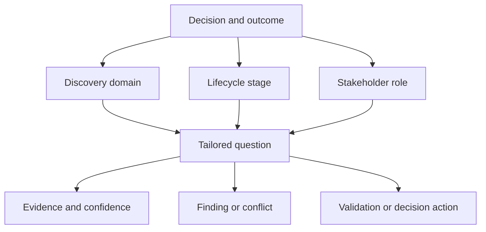
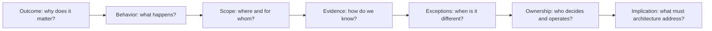
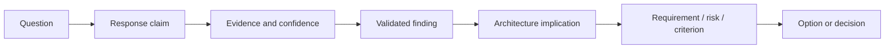

An enterprise discovery questionnaire is a reusable question library and routing mechanism—not a form that every stakeholder completes from top to bottom. Its purpose is to expose decision-relevant facts, uncertainty, conflict, ownership, evidence, and follow-up across business, domain, functional, quality, integration, data, security, technology, operations, compliance, risk, and roadmap concerns.

The operating discipline matters more than the number of questions. A small set tailored to the decision and asked of the right evidence owners is more valuable than hundreds of generic prompts answered from memory.

## Business Problem

Questionnaires are attractive because they make discovery appear repeatable. Used mechanically, they produce predictable failure.

| Failure | What happened | Consequence |
|---|---|---|
| Every question goes to every stakeholder | Role and decision relevance were ignored | Fatigue, shallow responses, low trust |
| Answers are accepted as facts | Interview statements were not linked to evidence | Assumptions enter requirements |
| Questions follow document sections | Sequence ignores decision dependencies | Critical uncertainty appears late |
| Closed questions dominate | Participants confirm the architect's framing | Exceptions and conflict stay hidden |
| Technology questions appear first | The questionnaire anchors on solutions | Criteria become post-hoc justification |
| Completed spreadsheet means “done” | No synthesis, validation, or governance follows | Data collection is mistaken for discovery |
| Answers have no owner or scope | Different regions and teams generalize differently | Contradictory requirements appear during delivery |

The questionnaire must support the [discovery lifecycle](/architecture-discovery/discovery-framework/discovery-lifecycle-and-governance/), not become a parallel process.

## Outcome

| Output | Quality criterion |
|---|---|
| Tailored question plan | Every question traces to a chartered decision, risk, outcome, dependency, or evidence gap |
| Participant routing | Each question is assigned to relevant knowledge, outcome, lifecycle, or authority roles |
| Sequenced interview/workshop plan | Foundational answers precede dependent domain and option questions |
| Response record | Captures claim, source, scope, confidence, evidence, owner, and follow-up |
| Discovery backlog | Prioritizes unanswered and contested questions by decision impact |
| Findings and traceability | Converts responses into validated findings, requirements, risks, criteria, and decisions |
| Coverage report | Shows material domains covered, gaps, exclusions, and confidence |

Questionnaire completion is not an outcome. Decision readiness is.

## Context and Preconditions

Before selecting questions, establish:

- chartered decision, outcomes, scope, exclusions, and deadline;
- stakeholder and decision-rights map;
- discovery lifecycle stage and upcoming gate;
- known evidence and current-state baseline;
- material risks, assumptions, and conflicts;
- interview, workshop, review, and validation channels; and
- repository and traceability conventions.

If the decision is “which integration approach supports cross-border payment reconciliation,” do not begin with the entire cloud, AI, workplace, and mobile question library.

## Question Architecture

Organize questions along three axes.

### Axis 1 — Discovery Domain

| Domain | Question intent |
|---|---|
| Business | Outcomes, measures, strategy, capabilities, funding, market and regulatory drivers |
| Domain | Language, rules, ownership, events, boundaries, and conflicts |
| Functional | Actors, journeys, scenarios, exceptions, permissions, and acceptance |
| NFR | Measurable quality scenarios, priorities, conflicts, owners, and validation |
| Process | Actual flow, controls, queues, handoffs, manual work, failure, and compensation |
| Integration | Providers, consumers, contracts, volumes, criticality, change, and failure semantics |
| Data | Meaning, ownership, lineage, quality, classification, access, retention, recovery |
| Security and compliance | Assets, actors, trust, threats, obligations, controls, evidence, exceptions |
| Technology | Estate, lifecycle, standards, licensing, skills, support, and constraints |
| Operations | Ownership, SLOs, incidents, observability, delivery, capacity, recovery, and cost |
| Risk | Exposure, assumptions, issues, dependencies, treatment, acceptance, and review |
| Roadmap | Transition states, dependencies, waves, readiness, measures, and triggers |

The complete reusable bank is planned for Phase 10. This chapter defines how to operate it responsibly.

### Axis 2 — Lifecycle Stage

| Stage | Question emphasis |
|---|---|
| Frame | Why, what decision, whose outcome, which boundary, which authority? |
| Collect | What happens, what evidence exists, where are gaps and exceptions? |
| Synthesize | What does the evidence imply for requirements, constraints, risks, and criteria? |
| Options | Which viable choices respond, and what do they assume? |
| Validate | Which uncertainty could change the recommendation, and how can it be tested? |
| Decide | Who can authorize, under which conditions and residual risk? |
| Close | Who owns follow-through, measures, evidence debt, and reassessment? |

### Axis 3 — Stakeholder Role

A single question changes by audience.

| Topic | Outcome owner | Operator | Engineer | Risk authority |
|---|---|---|---|---|
| Availability | Which customer or financial outcome fails? | What incidents and recovery behavior occur? | Which dependency and failure modes dominate? | Which residual exposure is acceptable? |
| Data quality | Which decisions or processes suffer? | Where is correction or reconciliation performed? | Where is data created, transformed, and duplicated? | Which obligation and control evidence applies? |

## Question Design

### Start with an Architectural Unknown

Weak question:

> Do you need high availability?

Decision-useful sequence:

1. Which business journey must remain available?
2. What happens when it is unavailable, and who owns the consequence?
3. Under which load, region, dependency failure, or operating condition?
4. What availability has been observed, and from which evidence?
5. Which outage duration and frequency are tolerable?
6. How is recovery validated today?
7. Which cost, consistency, security, or operability tradeoffs are acceptable?

### Use a Question Ladder

### Prefer Neutral Wording

| Leading question | Neutral question |
|---|---|
| Why is the monolith blocking delivery? | Which factors contribute to delivery lead time, and what evidence separates them? |
| Should we use event-driven architecture? | Which interactions need decoupling, ordering, delivery guarantees, latency, and recovery? |
| Is the database a bottleneck? | Where does time or saturation occur across the request and data path? |
| Can the team support Kubernetes? | Which platform capabilities, responsibilities, skills, and support evidence exist today? |

### Ask for Cases and Counterexamples

- Show the last occurrence.
- Walk through the normal and exception path.
- When is this statement not true?
- Which region, product, customer, or workload behaves differently?
- What evidence would disprove the claim?
- Who would challenge this answer?

Counterexamples reveal scope and hidden conditions faster than abstract agreement.

## Procedure

### 1. Define the Question Objective

For every question cluster, record:

| Field | Example |
|---|---|
| Decision link | Select first migration wave |
| Unknown | Which dependency creates irreversible cutover risk? |
| Audience | Service, integration, operations, data owners |
| Evidence expected | Runtime calls, contracts, incidents, batch schedules |
| Output | Validated dependency and risk finding |
| Stop rule | Critical providers/consumers and recovery paths are owned |

### 2. Select and Tailor

Choose questions by materiality:

- could the answer change scope, option viability, sequence, risk, or ownership?
- is the answer already available from reliable evidence?
- is synchronous discussion required?
- does the participant have relevant knowledge or authority?
- is a broader question needed before this detail?

Remove questions that cannot affect the decision.

### 3. Sequence Dependencies

Ask questions in causal order:

1. outcomes and decision;
2. scope, actors, capabilities, and process;
3. current behavior, evidence, and exceptions;
4. requirements, constraints, and quality attributes;
5. data, integration, security, technology, and operations;
6. options and transition;
7. risks, authority, and roadmap.

Do not ask participants to evaluate technology before workload, constraints, ownership, and operating model are understood.

### 4. Route to the Right Method

| Need | Best method |
|---|---|
| Sensitive incentive or political context | Confidential interview |
| Shared process, domain, or dependency model | Facilitated workshop |
| Exact policy, contract, metric, or topology | Evidence request and document review |
| Actual user or operational behavior | Observation or scenario walkthrough |
| Technical uncertainty | Experiment, measurement, or code/config analysis |
| Formal choice or risk acceptance | Decision forum with prepared package |

### 5. Record Responses as Claims

Use a structured response record.

| Field | Purpose |
|---|---|
| Question ID | Links reusable question to engagement use |
| Claim | Precise answer in scope |
| Respondent role | Knowledge and authority context |
| Source/evidence | Durable support or requested validation |
| Scope and period | Population, environment, geography, time |
| Classification | Fact, observation, inference, assumption, opinion, constraint, decision |
| Confidence | High, medium, low, unknown, contested |
| Implication | Requirement, risk, criterion, option, or action |
| Owner and due date | Validation, decision, or follow-up accountability |

Do not store consequential answers only inside meeting prose.

### 6. Probe and Triangulate

Use the [evidence and confidence model](/architecture-discovery/discovery-framework/evidence-assumptions-and-confidence/). Compare interviews with telemetry, incidents, observations, contracts, policies, catalogs, and accountable-owner validation.

When credible responses conflict, normalize definitions and scope before asking stakeholders to agree.

### 7. Convert Responses into Findings

Responses are inputs, not requirements. Synthesize them through [decision traceability](/architecture-discovery/discovery-framework/findings-requirements-decision-traceability/):

### 8. Manage the Discovery Backlog

Prioritize open questions by:

- decision impact;
- current confidence;
- dependency on later questions;
- cost and time to validate;
- deadline and risk proximity; and
- reversibility of decisions that rely on them.

| Priority | Treatment |
|---|---|
| High impact, low confidence | Validate immediately or block/condition decision |
| High impact, medium confidence | Triangulate or run bounded validation |
| Low impact, low confidence | Defer, sample, or exclude |
| High confidence but volatile | Monitor and define review trigger |

### 9. Review Coverage and Stop

Stop asking when:

- material decision domains are covered;
- critical findings have sufficient evidence or governed uncertainty;
- owners and authority are clear;
- options can be evaluated against traceable criteria; and
- remaining questions cannot materially change the current gate or have owned treatment.

The ability to ask more questions is not a reason to continue.

## Worked Enterprise Example

### Cloud Migration Questionnaire

A financial-services organization asks application owners to complete a 180-question cloud readiness form. Completion is high, but answers are inconsistent and rarely evidenced.

The discovery lead replaces the universal form with routed clusters.

| Cluster | Routed to | Decision purpose | Evidence |
|---|---|---|---|
| Business criticality and change horizon | Capability/product owner | Migration priority and disposition | Outcomes, roadmap, financial impact |
| Runtime and dependencies | Engineering/platform | Migration feasibility and grouping | Topology, traffic, code/config, catalogs |
| Data and residency | Data/privacy/legal | Landing pattern and eligibility | Classification, lineage, formal interpretation |
| Operations and recovery | Service/operations owner | Target operating model and wave readiness | SLOs, incidents, DR tests, support |
| Licensing and vendor | Procurement/vendor management | Cost and deployment constraints | Contracts, support and portability terms |
| Security controls | Security and control owners | Required landing-zone capabilities and exceptions | Findings, policy, evidence and risk authority |

Follow-up workshops focus only on contested criticality, undocumented dependencies, residency interpretation, and untested recovery. The questionnaire becomes a routing and evidence tool rather than a self-assessment score.

## Decision Points and Tradeoffs

| Decision | Option | Tradeoff | Evidence required |
|---|---|---|---|
| Question breadth | Standard full bank | Comparable coverage, high fatigue and irrelevance | Broad portfolio triage with automated routing |
| Question breadth | Tailored clusters | Higher relevance, requires architectural judgment | Clear decision, scope, and stakeholder map |
| Response format | Self-service form | Scalable, weak probing and evidence quality | Low-risk factual inventory with validation |
| Response format | Interview/workshop | Rich context, expensive and subject to dynamics | Material ambiguity, conflict, and shared modeling |
| Sequencing | Domain-by-domain | Simple administration, can hide dependencies | Stable domains and independent decisions |
| Sequencing | Decision dependency | Better convergence, more planning effort | Complex cross-domain architecture decision |

## Failure Modes and Recovery

| Failure mode | Recovery |
|---|---|
| Questionnaire dumping | Remove questions without decision links; route by role |
| Answer equals requirement | Validate and synthesize claims before requirement creation |
| Leading questions | Rewrite around outcome, behavior, evidence, exception, and ownership |
| “Unknown” treated as failure | Capture decision impact and validation route |
| One respondent per system | Triangulate outcome, engineering, operations, data, and risk perspectives |
| Generic maturity scoring | Retain underlying evidence and decision consequence |
| No stop rule | Define coverage and material-uncertainty exit criteria |
| Spreadsheet silo | Link question outputs into evidence, findings, risks, and decisions |

## Best Practices

1. Start from a decision-relevant unknown.
2. Route questions by role, evidence, and authority.
3. Ask outcome and scope questions before solution questions.
4. Use neutral wording and request counterexamples.
5. Separate self-reported claims from validated findings.
6. Record source, scope, confidence, and follow-up with each material answer.
7. Use interviews, workshops, observation, analysis, and experiments appropriately.
8. Prioritize unanswered questions by impact and confidence.
9. Preserve conflicting answers until definitions and evidence resolve them.
10. Stop when the lifecycle gate is decision-ready.

## Anti-Patterns

### The 300-Question Workbook

Volume creates the appearance of rigor while responsibility for relevance, evidence, and synthesis is transferred to respondents.

### Interview as Interrogation

The architect follows a script instead of listening for language, exceptions, incentives, and contradictions.

### Maturity Score Without Evidence

Subjective answers become decimal ratings and portfolio charts. Precision hides uncertainty and organizational bias.

### Solution Confirmation

Questions are written to prove the proposed cloud, microservices, vendor, or data-platform direction.

### Unknown Means Green

Blank answers are omitted from reporting instead of treated as evidence gaps with decision consequence.

## Completion Checklist

- [ ] Question clusters trace to the decision and lifecycle gate.
- [ ] Participants are selected through knowledge, impact, and authority roles.
- [ ] Existing evidence is reviewed before asking for recollection.
- [ ] Questions are neutral, scoped, and sequenced by dependency.
- [ ] Material answers record source, period, classification, confidence, and owner.
- [ ] Exceptions and counterexamples were requested.
- [ ] Conflicts remain visible until resolved or governed.
- [ ] Responses were synthesized into findings rather than copied as requirements.
- [ ] Open questions are prioritized by impact and confidence.
- [ ] Coverage gaps and exclusions are explicit.
- [ ] Stop criteria are tied to decision readiness.
- [ ] Outputs link to evidence, requirements, risks, options, and decisions.

## Architecture Review Notes

Challenge questionnaire outputs when:

- completion percentage is used as a quality measure;
- generic questions have no decision or role routing;
- respondents make claims outside their ownership or knowledge boundary;
- material answers lack evidence and scope;
- technology choices appear before criteria;
- unknown and contested answers disappear from summaries;
- questionnaire scores replace architecture analysis;
- findings are copied directly into requirements; or
- no lifecycle gate consumes the results.

## Interview Questions

### How do you tailor a discovery questionnaire?

Start from the decision, outcome, risks, lifecycle gate, current evidence, and stakeholder map. Select questions whose answers can change scope, requirements, options, sequence, risk, or ownership, and route them to appropriate evidence and authority roles.

### Why should a questionnaire not be sent to everyone?

Stakeholders have different knowledge, evidence, impact, and authority. Universal forms create irrelevant work and encourage answers outside valid boundaries. Route focused clusters and use the appropriate interaction method.

### How do you turn interview answers into requirements?

Treat answers as claims. Validate source, scope, confidence, and contradictions; synthesize a finding and architecture implication; then create an owned, measurable requirement linked to that finding.

### What do you do with “unknown” answers?

Assess decision impact. Validate high-impact unknowns, condition or defer decisions where necessary, and defer or sample low-impact gaps. Every material unknown needs an owner and treatment.

### When is questionnaire discovery complete?

When material domains and decision questions are sufficiently covered, critical findings are evidenced or governed, authority is clear, and remaining questions cannot change the current decision gate or have owned follow-up.

## Summary

The discovery questionnaire is a reusable question architecture, not a universal form. It works when questions are selected by decision impact, routed by stakeholder role, sequenced by dependency, recorded as evidence-bearing claims, and synthesized through the discovery lifecycle.

Its success is measured by the quality of findings and decisions—not question count or response completion.

With the foundation sequence complete, the handbook next applies these methods to business discovery: strategic drivers, measurable outcomes, capabilities, value streams, and operating-model constraints.

## Related Handbook Guidance

- [Stakeholders and Decision Rights](/architecture-discovery/discovery-framework/stakeholders-and-decision-rights/) — routing questions to knowledge and authority
- [Discovery Workshops](/architecture-discovery/discovery-framework/discovery-workshops/) — facilitating shared questions and conflict
- [Evidence, Assumptions, and Confidence](/architecture-discovery/discovery-framework/evidence-assumptions-and-confidence/) — validating responses
- [Findings, Requirements, and Decision Traceability](/architecture-discovery/discovery-framework/findings-requirements-decision-traceability/) — converting answers into governed outcomes
- [System Design Process](/system-design/system-design-process/) — solution-design questions after enterprise discovery
