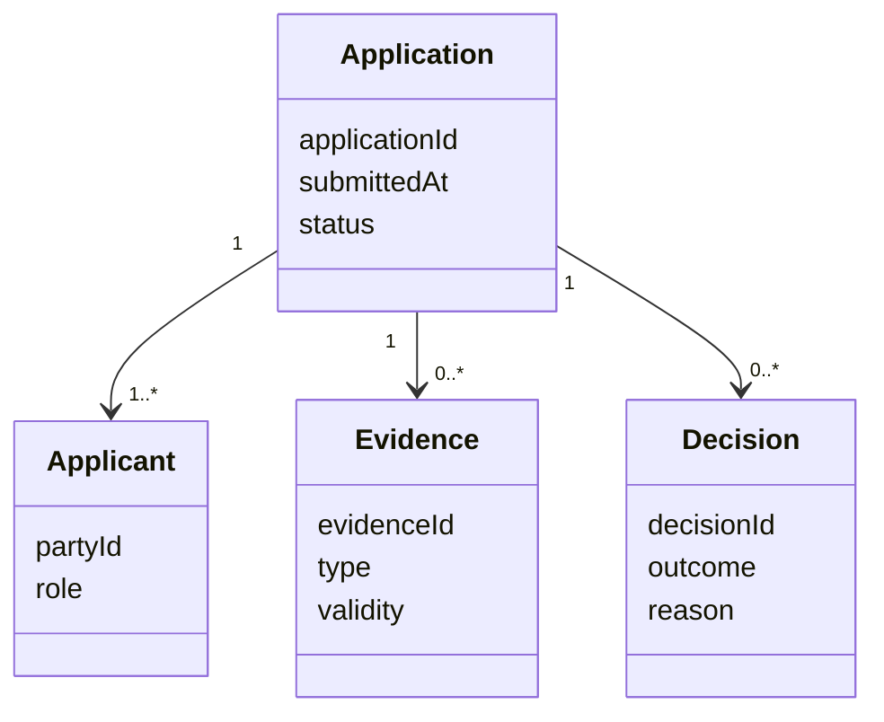

Domain discovery establishes the language and rules through which an enterprise understands and governs its business. Before architects define services, APIs, events, schemas, or ownership boundaries, they must understand what important terms mean, which invariants must hold, where policies originate, how exceptions are handled, and who may change the rules.

## Architectural Question

**Which business concepts, meanings, rules, and invariants must the architecture preserve—and where do they differ by context?**

## Business Problem

Shared words frequently conceal different meanings.

| Term | Possible meanings |
|---|---|
| Customer | Applicant, contracting party, payer, beneficiary, household, legal entity |
| Order | Cart submission, accepted commitment, fulfillment request, financial obligation |
| Active | Logged in recently, contract valid, product in force, service enabled |
| Balance | Ledger balance, available balance, projected balance, settled balance |
| Product | Market offer, commercial bundle, technical service, SKU, contractual agreement |

When these differences remain implicit, integration contracts become ambiguous, reports disagree, data is duplicated, and services enforce conflicting rules.

Rules are equally fragmented. They may live in policy documents, code, configuration, spreadsheets, vendor products, staff judgment, and regulatory interpretation. A modernization that moves code without discovering rule ownership simply relocates ambiguity.

## Why It Matters

Domain language and rules influence:

- capability and bounded-context boundaries;
- API, event, and data-contract meaning;
- transaction and consistency requirements;
- validation, authorization, and audit evidence;
- product variation and regional policy;
- migration reconciliation;
- test strategy and acceptance; and
- ownership of future change.

## Core Model

```mermaid
flowchart LR
    Evidence["Policy, cases, systems, experts"] --> Language["Shared domain language"]
    Language --> Concepts["Concepts, identities, states"]
    Concepts --> Rules["Policies, calculations, invariants"]
    Rules --> Scenarios["Normal, exception, failure cases"]
    Scenarios --> Ownership["Decision and change ownership"]
    Ownership --> Contracts["Domain, API, event, and data contracts"]
    Contracts --> Validation["Tests, controls, and audit evidence"]
```

## Discovery Outputs

| Output | Quality criterion |
|---|---|
| Domain glossary | Terms have scoped definitions, examples, owners, and contested meanings |
| Concept model | Important entities, value objects, identifiers, states, and relationships are visible |
| Rule catalog | Rules identify source, owner, scope, priority, exceptions, evidence, and implementation locations |
| Invariant list | Conditions that must always hold are measurable and testable |
| Decision table | Complex policy outcomes are expressed consistently across scenarios |
| Exception model | Overrides, appeals, compensation, and manual judgment are governed |
| Source-of-truth map | Authoritative meaning and records are distinguished from copies and views |
| Open conflict register | Semantic and rule disputes have impact, authority, and resolution paths |

## How It Works

### 1. Select Decision-Relevant Scenarios

Start with real business cases that matter to the architecture decision:

- normal successful case;
- boundary-value case;
- exception requiring manual judgment;
- failure and recovery;
- correction or reversal;
- regional/product variation; and
- historical case that current policy treats differently.

Concrete scenarios reveal language and rules more effectively than asking stakeholders to define the whole domain abstractly.

### 2. Build the Domain Glossary

| Field | Example |
|---|---|
| Term | Available balance |
| Definition | Funds currently permitted for withdrawal after holds and policy adjustments |
| Context | Retail deposit servicing |
| Distinct from | Ledger balance, projected balance |
| Examples/counterexamples | Posted deposit included; pending card hold deducted |
| Owner | Deposit Product Policy Owner |
| Evidence | Product terms, calculation specification, production cases |
| Status | Validated / contested / deprecated |

Do not force one enterprise definition when contexts genuinely differ. Make the context qualifier explicit.

### 3. Discover Concepts and Identity

Ask:

- What makes this thing uniquely identifiable?
- Does identity persist across lifecycle states and systems?
- Which attributes define meaning versus presentation?
- Which concepts are immutable values?
- Who creates, changes, merges, splits, and retires it?
- Which system is authoritative for which fact?

The model exists to test meaning and rules, not to pre-design a database.

### 4. Classify Rules

| Rule type | Example | Architecture concern |
|---|---|---|
| Invariant | Settled debit and credit entries must balance | Transaction boundary and validation |
| Eligibility | Applicant must meet age and jurisdiction criteria | Policy ownership and versioning |
| Calculation | Premium uses risk factors effective on quote date | Determinism, audit, effective dating |
| Authorization | Only delegated role may approve exception | Identity and decision evidence |
| Obligation | Evidence retained for required period | Data lifecycle and compliance |
| Sequence | Payment must be authorized before fulfillment | State and consistency |
| Temporal | Cancellation allowed within cooling-off period | Time semantics and event history |
| Derivation | Customer status derives from active contracts | Source, freshness, and reconciliation |

### 5. Trace Rule Sources and Implementations

| Rule | Authoritative source | Decision owner | Implemented in | Known divergence |
|---|---|---|---|---|
| | | | | |

Sources may conflict. Policy can differ from code, and operational practice can compensate for both. Use the [evidence model](/architecture-discovery/discovery-framework/evidence-assumptions-and-confidence/) rather than declaring the newest document correct automatically.

### 6. Model Decisions and Exceptions

Use decision tables for multi-condition rules.

| Condition/action | Rule 1 | Rule 2 | Rule 3 |
|---|---:|---:|---:|
| Identity evidence valid | Yes | Yes | No |
| Risk threshold exceeded | No | Yes | — |
| Auto-approve | X | | |
| Manual review | | X | X |

For exceptions, identify:

- who may override;
- required evidence and reason;
- time limit and scope;
- downstream effects;
- audit and notification;
- appeal or reversal; and
- rule feedback loop.

### 7. Find Variations by Context

Variation can arise by jurisdiction, product, channel, customer segment, date, contract, risk class, or operating condition.

Separate:

- intentional policy variation;
- temporary transition rule;
- legacy inconsistency;
- local preference;
- implementation defect; and
- unresolved semantic conflict.

This prevents every difference from becoming permanent architecture configuration.

### 8. Identify Ownership

Distinguish:

| Ownership | Accountability |
|---|---|
| Meaning owner | Defines the concept and semantic contract |
| Policy owner | Decides the business rule and permitted variation |
| Data owner | Governs authoritative data, quality, access, and lifecycle |
| Implementation owner | Implements and operates rule execution |
| Risk/control owner | Governs exposure, evidence, exception, and acceptance |

One team may hold several roles, but technology ownership does not automatically confer policy authority.

### 9. Validate Through Examples

For every material rule, test:

- representative normal cases;
- boundary conditions;
- contradictory or missing information;
- retry, correction, reversal, and replay;
- effective-date change;
- regional/product variation; and
- audit reconstruction.

### 10. Connect to Architecture

| Discovery finding | Architecture implication |
|---|---|
| Different contexts define “customer” differently | Explicit context contracts and translation |
| Rules change more frequently than workflow | Independent rule ownership and deployment consideration |
| Decisions must be reconstructed historically | Versioned rule and evidence model |
| Exceptions rely on expert judgment | Human-in-the-loop workflow and audit |
| Several systems implement the same invariant | Consolidation or conformance validation |
| Authoritative facts differ by attribute | Federated source-of-truth and reconciliation model |

## Practical Example

### Insurance Claim Eligibility

Stakeholders initially say, “A valid policy covers the claim.” Scenario discovery exposes more:

| Concept/rule | Finding |
|---|---|
| Valid policy | Must be in force at incident time, not submission time |
| Covered party | May be policyholder, named insured, beneficiary, or authorized driver |
| Incident date | Can be disputed and later corrected |
| Coverage | Depends on product version, endorsements, jurisdiction, and exclusions |
| Exception | Catastrophe directives can temporarily alter evidence requirements |
| Decision | Denial requires reason codes, rule version, evidence, and appeal path |

The architecture now requires effective-dated policy views, versioned rules, evidence traceability, correction handling, and explicit claim/policy context integration—not merely a synchronous “isCovered” API.

## Tradeoffs and Boundaries

| Choice | Benefit | Risk | Treatment |
|---|---|---|---|
| Enterprise glossary | Shared language | False universal definitions | Qualify by context |
| Central rule engine | Consistency and visibility | Central bottleneck and cross-domain coupling | Centralize only rules with shared ownership |
| Rules in code | Strong testing and version control | Policy visibility and change lead time | Generate readable evidence and owner workflow |
| Configurable rules | Faster variation | Configuration complexity and weak engineering controls | Govern schema, testing, versioning, and rollback |
| Manual exception | Handles ambiguity | Inconsistent outcomes and hidden control | Explicit authority, evidence, monitoring, and feedback |

## Common Mistakes and Anti-Patterns

| Anti-pattern | Correction |
|---|---|
| Glossary copied from data fields | Discover business meaning and context first |
| One enterprise definition forced everywhere | Preserve legitimate contextual language |
| Rule source assumed to be code | Compare policy, operation, evidence, and implementation |
| Exception treated as defect | Classify legitimate judgment, control, transition, and error |
| Domain model becomes database schema | Keep technology-independent concepts and rules |
| Rule engine selected before ownership | Establish policy authority and change model first |

## Best Practices

1. Discover language through real scenarios and counterexamples.
2. Qualify terms by context rather than forcing false universality.
3. Separate policy ownership from implementation ownership.
4. Record authoritative source, effective date, evidence, and divergence.
5. Make invariants testable.
6. Model exceptions, corrections, reversals, and appeals.
7. Preserve rule version and decision evidence where reconstruction matters.
8. Use decision tables for complex policy combinations.
9. Treat semantic conflicts as architecture risks.
10. Link language and rules to contracts, tests, and ownership.

## Architecture Review Notes

Challenge the domain model when:

- terms have no context or accountable owner;
- examples and counterexamples are absent;
- code or database fields are treated as authoritative meaning;
- invariants are not testable;
- variations have no policy rationale;
- exception authority and audit are missing;
- effective dating and historical reconstruction are ignored; or
- technology boundaries are chosen before semantic ownership.

## Interview Questions

### How do you discover a domain's language?

Use real scenarios with domain experts and operators, identify concepts and identities, capture definitions and counterexamples, expose contextual differences, validate against policy and evidence, and assign meaning ownership.

### What is a business invariant?

A condition that must remain true for the domain to be valid, such as balanced ledger entries. It should be stated precisely, owned, testable, and enforced within an appropriate consistency boundary.

### How do you handle the same term meaning different things?

Do not force one definition. Name the contexts, define each meaning and translation, identify owners, and make contracts explicit at boundaries.

### Where should business rules live?

After discovering ownership, change frequency, consistency, evidence, latency, and reuse. Rules may live in code, configuration, workflow, or a rule platform; no location is universally correct.

### Why are exceptions important in domain discovery?

They reveal hidden policies, human judgment, missing states, compensating controls, and ownership that happy-path models omit.

## Summary

Domain language and rule discovery establishes the semantic foundation for architecture. It makes concepts, identities, policies, invariants, variations, exceptions, evidence, and authority explicit before they become APIs, events, schemas, or service boundaries.

The next chapter uses this semantic foundation to identify [domain boundaries and ownership](/architecture-discovery/domain-discovery/domain-boundaries-and-ownership/).

## Related Handbook Guidance

- [Business Capability Mapping](/architecture-discovery/business-discovery/business-capability-mapping/) — business scope feeding domain discovery
- [Discovery Workshops](/architecture-discovery/discovery-framework/discovery-workshops/) — collaborative scenario and rule discovery
- [Evidence, Assumptions, and Confidence](/architecture-discovery/discovery-framework/evidence-assumptions-and-confidence/) — validating policy and implementation claims
- [Monolith Decomposition](/microservices/09-migration-modernization/monolith-decomposition/) — implementation decomposition after domain boundaries are understood
