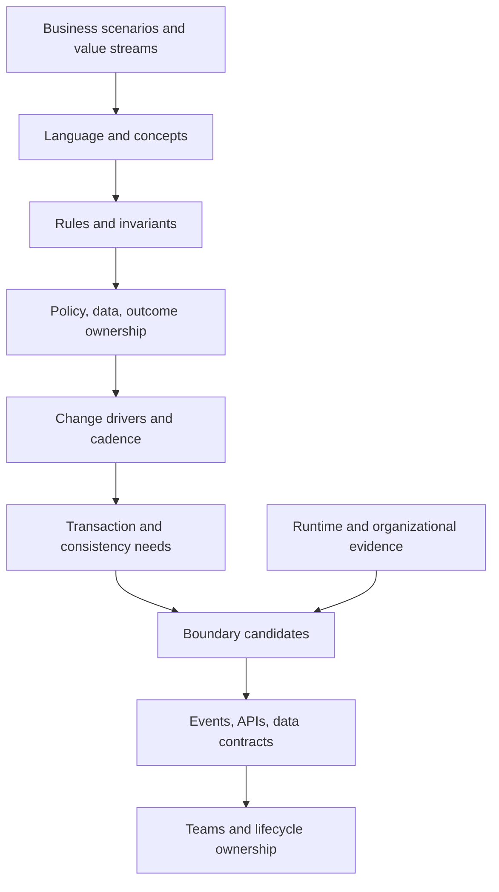
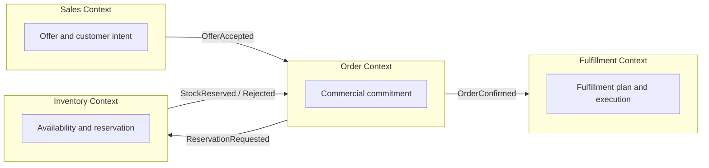

A domain boundary encloses a coherent model, language, rules, data authority, and change responsibility. It allows teams to reason consistently inside the boundary and collaborate through explicit contracts outside it.

Discovery does not begin by drawing microservices. It identifies where meanings, policies, ownership, transaction needs, change rhythms, and operating responsibilities naturally align—and where current systems hide incompatible domains inside shared code and data.

## Business Problem

Enterprise systems accumulate boundaries for historical reasons: acquisitions, vendor modules, reporting lines, database schemas, release trains, and project funding. These boundaries often conflict with current business ownership.

| Current boundary | Hidden problem |
|---|---|
| One monolith for order, inventory, payment, and fulfillment | Shared deployment and database obscure distinct rules and ownership |
| One “customer” database | Identity, relationship, consent, and marketing meanings compete |
| Department-owned applications | End-to-end value crosses ownership and funding boundaries |
| One service per table/entity | Technical CRUD boundaries create chatty, rule-poor services |
| Vendor product modules | Product packaging dictates domain architecture |
| Shared enterprise rule engine | Unrelated policy owners compete for one change path |

Wrong boundaries increase coordination cost, inconsistent decisions, data conflict, and operational ambiguity. Over-fragmentation creates distributed coupling; under-separation creates change contention and unclear ownership.

## Problem and Forces

Boundary decisions balance:

- semantic coherence versus enterprise reuse;
- local autonomy versus cross-domain consistency;
- transactional integrity versus distributed coordination;
- independent change versus operational overhead;
- business ownership versus current team structure;
- transition feasibility versus target purity; and
- explicit contracts versus convenient shared data.

## Applicability

| Use when | Avoid premature decomposition when |
|---|---|
| The same term or entity has conflicting meanings | Language and ownership are not yet understood |
| Change in one area repeatedly affects unrelated areas | The main issue is process or governance, not software coupling |
| Several owners compete over rules or data | Teams cannot operate independent lifecycle responsibility |
| Modernization requires selective extraction or replacement | Current dependencies and transactions are unknown |
| Data ownership and system of record are disputed | A proposed service map merely mirrors tables or org structure |

## Boundary Discovery Model

### Boundary Signals

| Signal | Boundary implication |
|---|---|
| Different definitions for the same term | Separate contexts with translation |
| Distinct policy and decision owners | Likely ownership boundary |
| Rules change for different reasons and cadence | Separate change boundary candidate |
| Strong invariants require immediate consistency | Keep within one consistency boundary where practical |
| Data has one authoritative lifecycle | Align model and data ownership |
| Repeated cross-team coordination for local change | Current boundary may be wrong |
| High-volume chat between proposed services | Proposed boundary may split one cohesive model |
| One team cannot operate the whole lifecycle | Target autonomy is not yet viable |

## Participants and Responsibilities

| Participant | Contribution |
|---|---|
| Capability and outcome owners | Business purpose, measures, policy, investment |
| Domain experts | Language, rules, scenarios, exceptions, history |
| Data owners | Semantics, authority, quality, lifecycle, reconciliation |
| Engineering owners | Code, dependency, deployment, change and failure evidence |
| Operations/service owners | Incidents, support, recovery, capacity, lifecycle readiness |
| Security/risk | Trust, authorization, control, risk and audit boundaries |
| Architects | Synthesize evidence, compare candidates, define contracts and transition |

## Workflow

### 1. Select Representative Scenarios

Use scenarios that cross important rules and ownership:

- create and change;
- approve and reject;
- reserve and commit;
- cancel, reverse, and compensate;
- correct historical data;
- fail and recover; and
- apply regional or product variation.

Trace where language changes, decisions occur, and accountability transfers.

### 2. Cluster Language and Rules

Starting from [domain language and rules](/architecture-discovery/domain-discovery/), group concepts that share:

- one coherent meaning;
- related invariants;
- common policy authority;
- shared lifecycle and identity; and
- similar change drivers.

Do not cluster solely because entities join in a database.

### 3. Map Ownership

| Concern | Owner question |
|---|---|
| Outcome | Who owns performance and tradeoffs? |
| Policy | Who may change rules and approve variation? |
| Meaning | Who defines semantic contracts? |
| Data | Who governs authority, quality, access, and lifecycle? |
| Service | Who builds, runs, secures, recovers, and retires it? |
| Risk | Who accepts residual exposure? |

Where these owners differ, define collaboration rather than pretending one universal owner exists.

### 4. Analyze Change Coupling

Use repository and delivery evidence:

- which files/modules change together;
- which releases require coordinated teams;
- which tests fail together;
- which rules share approval;
- which incidents cross proposed boundaries;
- which data changes require synchronized migration; and
- which roadmap items repeatedly block each other.

Conceptual cohesion without change evidence can produce elegant but impractical boundaries.

### 5. Analyze Consistency and Transactions

| Question | Implication |
|---|---|
| Which invariants must hold immediately? | Candidate local transaction boundary |
| Which outcomes tolerate delay or temporary inconsistency? | Eventual collaboration may be acceptable |
| Who resolves conflicts? | Ownership and reconciliation design |
| What is reserved versus committed? | Explicit state and event semantics |
| How are cancellation and compensation performed? | Saga/workflow implications |
| What must be reconstructed historically? | Event/evidence and versioning requirements |

Do not use “eventual consistency” to avoid discovering business consequences.

### 6. Draft Context Candidates

For each candidate, document:

- purpose and language;
- owned concepts and rules;
- authoritative data;
- inbound/outbound contracts;
- consistency boundary;
- team/lifecycle owner;
- dependencies and risks; and
- current-to-target transition.

### 7. Identify Context Relationships

| Relationship | Discovery concern |
|---|---|
| Upstream/downstream | Which model and change constrains the other? |
| Customer/supplier | Are needs and contracts negotiated explicitly? |
| Conformist | Is downstream accepting an external model and its risk? |
| Anti-corruption layer | Where must translation protect local meaning? |
| Shared kernel | Which small model is jointly owned, and how is change governed? |
| Published language | Is the shared contract stable, versioned, and owned? |

Use relationship names to clarify governance, not to decorate diagrams.

### 8. Test Candidate Boundaries

Score evidence qualitatively:

| Test | Strong boundary | Weak boundary |
|---|---|---|
| Language | Coherent inside, explicit translation outside | Same concepts constantly synchronized |
| Rules | Related and jointly owned | Unrelated policies bundled |
| Change | Mostly independent | Coordinated release remains frequent |
| Data | Clear authority | Shared writes and ambiguous ownership |
| Consistency | Invariants local | Cross-boundary transaction required constantly |
| Team | Durable lifecycle ownership | Temporary project team only |
| Operations | Observable and recoverable | Failures require global diagnosis |

### 9. Distinguish Logical and Physical Boundaries

A logical bounded context does not require an immediate microservice. It may begin as:

- module inside a modular monolith;
- schema with controlled access;
- separately owned package;
- API façade around legacy behavior;
- extracted service; or
- governed data product.

Choose physical separation based on independent scaling, deployment, security, failure isolation, ownership, and transition economics.

### 10. Define Transition Boundaries

Current and target boundaries differ. Record:

- interim owner and source of truth;
- synchronization and reconciliation;
- routing and compatibility;
- rollback and coexistence duration;
- consumers that migrate together; and
- decommission decision and evidence.

## Enterprise Example

### Retail Order Domain

A retailer's “Order” tables contain cart, pricing, payment, inventory, fulfillment, returns, and customer-service state.

Discovery shows:

| Candidate context | Core meaning/owner | Boundary evidence |
|---|---|---|
| Sales | Customer intent and commercial offer | Pricing/promotion changes rapidly |
| Order | Accepted commitment and lifecycle | Owns cancellation and order identity |
| Inventory | Supply position and reservation | Strong stock invariants and store ownership |
| Payment | Authorization, capture, refund | Regulated rules, provider contracts, audit |
| Fulfillment | Shipment/pickup plan and execution | Operational ownership and partner dependencies |
| Returns | Return eligibility and disposition | Distinct policy, reverse logistics, refund collaboration |

The target begins as modules and explicit contracts inside the monolith. Inventory reservation is extracted first because ownership, scale, and store integration justify physical isolation. Payment remains behind an anti-corruption layer until reconciliation evidence is strong enough.

## Variants

### Modular Monolith First

Use logical contexts, module APIs, database ownership rules, and independent tests before network distribution.

### Legacy Context Wrapper

Protect target domains with translation and façade contracts while gradually moving authority.

### Federated Enterprise Domain

Allow local contexts with a small shared semantic contract where global standardization is valuable and locally governed variation is necessary.

## Tradeoffs

| Benefit | Cost or risk | Mitigation |
|---|---|---|
| Clear semantic ownership | Translation overhead | Published contracts and tooling |
| Independent change | Operational and integration complexity | Separate physically only when justified |
| Local data authority | Cross-domain reporting complexity | Governed data products and lineage |
| Failure isolation | Distributed recovery and consistency | Explicit business failure semantics |
| Team autonomy | Duplication and divergence | Enterprise guardrails and platform capabilities |

## Failure Modes and Anti-Patterns

| Anti-pattern | Correction |
|---|---|
| One service per entity/table | Group by coherent rules, language, and change |
| Org chart boundaries | Validate business semantics and value flow |
| Microservices before ownership | Establish durable lifecycle teams first |
| Shared database writes | Assign authority and explicit contracts |
| Universal canonical model | Preserve contextual meaning and translation |
| Events as integration magic | Define business event semantics and failure consequences |
| Boundary purity blocks migration | Design governed transition states |

## Best Practices

1. Start with language, rules, and scenarios.
2. Combine semantic, ownership, change, data, and operational evidence.
3. Keep invariants local where practical.
4. Make translation and relationship governance explicit.
5. Distinguish logical contexts from physical services.
6. Test boundaries against real changes and incidents.
7. Require durable lifecycle ownership.
8. Design transition and coexistence boundaries.
9. Avoid shared writes across ownership boundaries.
10. Reassess boundaries when strategy, ownership, or change patterns shift.

## Architecture Review Notes

Challenge boundaries when:

- they mirror tables, applications, teams, or vendor modules;
- language and rule ownership are undocumented;
- frequent distributed transactions preserve hidden cohesion;
- services share database writes;
- no team owns build-to-retire lifecycle;
- local autonomy conflicts with centralized approval/funding;
- operational failure requires global coordination; or
- transition source-of-truth and reconciliation are missing.

## Interview Questions

### How do you identify bounded contexts?

Use scenarios to discover coherent language, rules, invariants, data authority, policy ownership, change patterns, consistency needs, and lifecycle responsibility; then test contracts and coupling with runtime and delivery evidence.

### Is a bounded context the same as a microservice?

No. It is a logical semantic and ownership boundary. It can be implemented as a module, service, schema, or other physical form depending on operational and transition needs.

### How do you handle shared data across domains?

Assign authoritative ownership, publish explicit contracts or data products, define freshness and reconciliation, and prevent uncontrolled shared writes.

### When should two domains remain together?

When they share one coherent model, tightly coupled invariants, change together, and separating them would add coordination without meaningful ownership or operational benefit.

### How do organizational boundaries affect domain design?

They influence feasible ownership and communication but should not dictate semantics. Misalignment may require operating-model change, platform support, or staged logical boundaries before physical decomposition.

## Summary

Domain boundaries align meaning, rules, data authority, change, consistency, and lifecycle ownership. Discovery treats them as evidence-backed hypotheses, not boxes derived from applications or organization charts.

The next chapter identifies [domain events and collaboration contracts](/architecture-discovery/domain-discovery/domain-events-and-collaboration/) that connect these boundaries without erasing their autonomy.

## Related Patterns and Canonical Guidance

- [Domain Language and Business Rules](/architecture-discovery/domain-discovery/) — semantic foundation
- [Business Capability Mapping](/architecture-discovery/business-discovery/business-capability-mapping/) — business scope and ownership
- [Value Streams and Operating Model](/architecture-discovery/business-discovery/value-streams-and-operating-model/) — end-to-end flow and organizational feasibility
- [Monolith Decomposition](/microservices/09-migration-modernization/monolith-decomposition/) — implementation decomposition after discovery
- [Microservices](/microservices/) — service, data, resilience, and operating patterns
