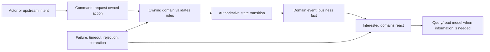
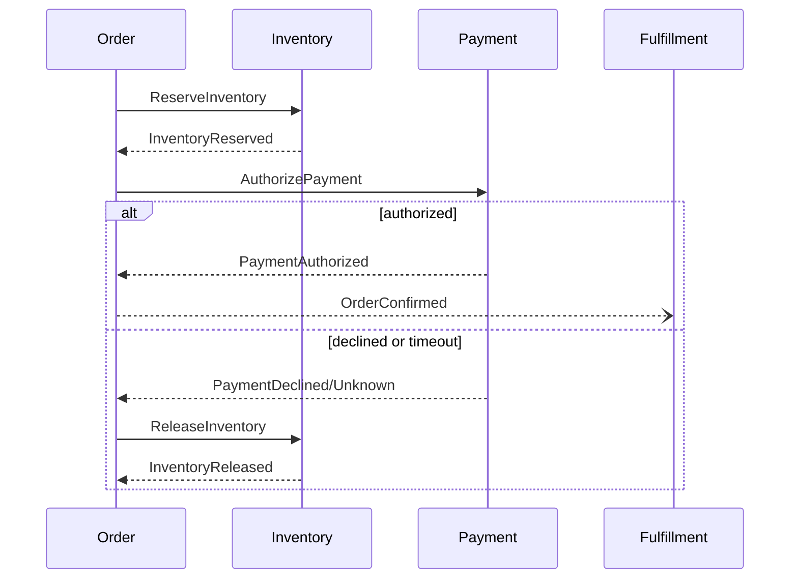

Domain collaboration describes how independently owned contexts coordinate business outcomes. Domain events communicate facts that have occurred; commands request an owned action; queries request information. Discovery must make the business meaning, authority, timing, consistency, failure, and lifecycle of these interactions explicit before selecting brokers, APIs, workflows, or orchestration products.

## Architectural Question

**Which facts and decisions cross domain boundaries, and what consistency, timing, ownership, and failure behavior does the business require?**

## Business Problem

Architecture diagrams often replace collaboration semantics with arrows labeled “API” or “Kafka.” That hides the business contract.

| Hidden question | Result when unanswered |
|---|---|
| Did something happen or is action requested? | Consumers infer authority and intent differently |
| Who owns the fact? | Several domains publish conflicting truth |
| Can processing be delayed or repeated? | Duplicate actions and broken customer expectations |
| What order matters? | State transitions occur incorrectly |
| What happens when a consumer rejects it? | Events accumulate without business recovery |
| Can the producer change the schema? | Independent deployment becomes unsafe |
| How is correction represented? | History is overwritten and audit breaks |

The goal is not “event-driven architecture.” The goal is a collaboration model that preserves domain ownership and business outcomes.

## Core Model

### Interaction Semantics

| Type | Meaning | Naming example | Authority |
|---|---|---|---|
| Command | Request an action | `ReserveInventory` | Receiver owns acceptance and result |
| Domain event | Fact within a domain | `InventoryReserved` | Publisher owns meaning and occurrence |
| Integration event | Stable external representation of fact | `StockReservationConfirmed` | Publishing contract owner |
| Query | Request information without changing authority | `GetAvailableStock` | Provider owns response semantics/freshness |
| Notification | Attention signal, not necessarily full business fact | `ReservationNeedsReview` | Contract must state limited meaning |

## Discovery Outputs

| Output | Quality criterion |
|---|---|
| Collaboration map | Shows domains, interaction intent, ownership, and direction |
| Event catalog | Defines business meaning, trigger, producer, consumers, schema owner, and lifecycle |
| Consistency matrix | States required timing, ordering, atomicity, and tolerance |
| Failure model | Defines rejection, retry, timeout, duplicate, correction, compensation, and escalation |
| Contract governance | Defines versioning, compatibility, consumer discovery, and deprecation |
| Traceability | Connects events to scenarios, rules, outcomes, risks, and evidence |

## How It Works

### 1. Walk Business Scenarios

Use normal, exception, cancellation, correction, and recovery scenarios. Record meaningful state changes in past tense:

- application submitted;
- eligibility determined;
- inventory reserved;
- payment authorized;
- order confirmed;
- shipment dispatched;
- claim denied; and
- settlement reconciled.

Events should matter to domain experts, not merely reflect database CRUD.

### 2. Identify Commands and Decisions

For each event, ask what intent and decision preceded it.

| Command | Decision/rule | Success event | Rejection/failure |
|---|---|---|---|
| Reserve inventory | Availability and reservation policy | Inventory reserved | Reservation rejected/expired |
| Authorize payment | Risk/provider response | Payment authorized | Payment declined/timed out |
| Approve claim | Coverage and evidence rules | Claim approved | Claim referred/denied |

This exposes the authoritative domain and prevents consumers from treating a notification as permission.

### 3. Define Event Meaning

| Field | Required definition |
|---|---|
| Name | Past-tense business fact |
| Context | Domain in which the fact is true |
| Trigger | Rule and state transition that created it |
| Producer | Authoritative owner and publishing service |
| Identity | Aggregate/business identifiers and correlation |
| Occurred/effective time | When it happened and when it becomes effective |
| Payload | Minimum stable facts consumers require |
| Sensitive data | Classification, purpose, minimization, retention |
| Correction | How amended, reversed, or superseded facts are represented |
| Evidence | How occurrence and decision can be reconstructed |

### 4. Discover Consumers and Purpose

Do not accept “many consumers.” Record each material consumption purpose.

| Consumer | Business reaction | Timing | Failure consequence | Owner |
|---|---|---|---|---|
| | | | | |

Runtime subscriptions, code, broker ACLs, lineage, reports, and owner interviews help discover undocumented consumers.

### 5. Define Consistency Expectations

Ask:

- Which invariants must be atomic inside one domain?
- How stale may downstream information be?
- Which event order matters, per which business key?
- What happens during partial success?
- Who decides the final business outcome?
- How is “unknown” distinguished from failure?
- When is compensation valid, and when is manual resolution required?

### 6. Define Delivery and Idempotency Semantics

Business processing should tolerate practical delivery behavior.

| Condition | Required discovery |
|---|---|
| Duplicate delivery | Business idempotency key and repeated-outcome rule |
| Out-of-order event | Version/sequence and stale-event treatment |
| Delayed event | Expiry, effective-time rule, and customer consequence |
| Missing event | Detection, reconciliation, replay, and escalation |
| Poison event | Quarantine, ownership, correction, and replay approval |
| Consumer outage | Backlog tolerance, catch-up, capacity, and priority |

“Exactly once” is not a substitute for business idempotency and reconciliation.

### 7. Model Corrections and Reversals

Facts may later be corrected. Do not mutate history silently.

- publish explicit correction or reversal;
- reference the affected event/decision;
- preserve effective and recorded time;
- define downstream recomputation;
- notify risk/control owners where required; and
- retain audit evidence.

### 8. Govern Contracts

| Governance concern | Required control |
|---|---|
| Schema evolution | Compatibility policy and validation |
| Semantic change | Domain-owner review and version strategy |
| Consumer discovery | Catalog and runtime evidence |
| Data minimization | Purpose-specific payload and classification |
| Deprecation | Consumer migration, deadline, telemetry, escalation |
| Replay | Authorization, scope, side-effect control, audit |
| Ownership | Product/service owner for contract lifecycle |

### 9. Choose Interaction Style Later

| Business need | Likely style, subject to design |
|---|---|
| Immediate accepted/rejected action | Synchronous command or asynchronous command with status |
| Notify many independent reactions | Published event |
| Long-running multi-domain outcome | Workflow/orchestration or explicit process manager |
| Read current information | Query or owned read model |
| High-volume state propagation | Stream/data product with defined freshness |

Use [Technology Decisions](/technology-playbook/) only after semantics and requirements are known.

## Practical Example

### Healthcare Referral

A referral workflow originally publishes one generic `ReferralUpdated` message. Consumers interpret it differently.

Discovery replaces it with explicit facts:

| Event | Meaning | Consumers/reaction |
|---|---|---|
| Referral submitted | Referrer committed a request with evidence | Intake validates completeness |
| Referral accepted | Specialist organization accepted responsibility | Patient and referrer receive status |
| Authorization required | Payer decision is a prerequisite | Authorization domain starts case |
| Appointment scheduled | Time/provider committed | Journey and notification update |
| Referral returned | Request cannot proceed for stated reason | Referrer corrects or chooses alternative |
| Referral completed | Clinical outcome received | Journey closes and records reconcile |

The collaboration model exposes ownership and timeouts: a submitted referral is not accepted; an authorization timeout is not a denial; and patient notification must reflect these distinct states.

## Tradeoffs and Boundaries

| Choice | Benefit | Risk | Treatment |
|---|---|---|---|
| Rich events | Consumer autonomy | Sensitive data and contract coupling | Minimum stable facts and purpose control |
| Event notification only | Small contract | Consumers make synchronous callbacks | Choose intentionally based on scale and consistency |
| Central orchestration | Visible end-to-end control | Central coupling and ownership burden | Use when one owner governs process outcome |
| Choreography | Local autonomy | Emergent flow and difficult recovery | Limit scope, catalog reactions, add observability |
| Shared canonical event | Easier broad integration | Semantic compromise | Context-owned events and translation |

## Common Mistakes and Anti-Patterns

| Anti-pattern | Correction |
|---|---|
| CRUD events | Publish business facts with owned meaning |
| Topic equals domain | Define semantic/ownership boundary first |
| Event contains entire database row | Minimize stable purpose-specific payload |
| Consumer updates producer data | Preserve authoritative ownership |
| Retry is recovery | Define business failure, compensation, and reconciliation |
| Eventual consistency by default | State tolerated delay and consequence |
| Invisible consumers | Catalog and validate runtime subscriptions |
| Schema compatibility only | Govern semantic compatibility too |

## Best Practices

1. Discover events through business scenarios.
2. Name events as completed facts in one context.
3. Separate commands, events, queries, and notifications.
4. Make producer and semantic ownership explicit.
5. Record every material consumer and reaction.
6. Define consistency, ordering, timing, and partial success in business terms.
7. Design idempotency, correction, reconciliation, and replay.
8. Minimize sensitive payloads.
9. Govern semantic and schema evolution.
10. Select technology after collaboration semantics.

## Architecture Review Notes

Challenge the collaboration model when:

- arrows identify technology but not business intent;
- events are named `Created`, `Updated`, or `Changed` without context;
- consumers and failure consequences are unknown;
- “eventual consistency” has no tolerance or owner;
- duplicate, delayed, missing, correction, and replay behavior are absent;
- payloads expose unnecessary domain or personal data;
- several publishers claim the same fact; or
- no team owns contract lifecycle and deprecation.

## Interview Questions

### What makes a good domain event?

It represents a meaningful completed fact in one domain, has authoritative ownership, stable business semantics, identity and time, explicit consumers, governed evolution, and defined correction and evidence.

### What is the difference between a command and an event?

A command requests an owner to perform an action and may be rejected. An event states that a fact already occurred in the publishing domain.

### How do you decide between orchestration and choreography?

Use outcome ownership, process visibility, coupling, failure recovery, change coordination, and scale. Orchestration fits a governed long-running outcome; choreography fits bounded independent reactions but needs strong contracts and observability.

### How do you handle duplicate events?

Define business idempotency using stable identifiers and outcome rules, persist processing state where needed, and ensure repeated delivery cannot repeat unsafe side effects.

### Why is schema compatibility insufficient?

A payload can remain structurally compatible while its meaning, timing, source, or business guarantees change. Semantic compatibility requires domain-owner governance.

## Summary

Domain events and collaboration contracts connect bounded contexts without erasing ownership. Discovery establishes intent, meaning, authority, consistency, failure, correction, consumer purpose, and governance before integration technology is selected.

With Domain Discovery complete, continue with [personas, actors, and user journeys](/architecture-discovery/functional-discovery/) to connect domain collaboration to observable behavior.

## Related Handbook Guidance

- [Domain Language and Business Rules](/architecture-discovery/domain-discovery/) — event meaning and rule foundation
- [Domain Boundaries and Ownership](/architecture-discovery/domain-discovery/domain-boundaries-and-ownership/) — context and authority
- [Event-Driven Architecture](/technology-playbook/event-driven-architecture/) — architecture choice after discovery
- [Microservices](/microservices/) — event, transaction, outbox, saga, and observability implementation patterns
