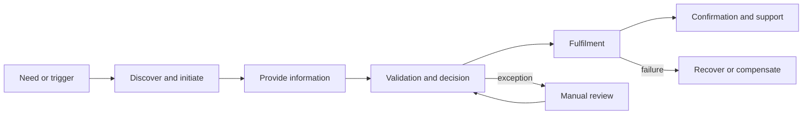
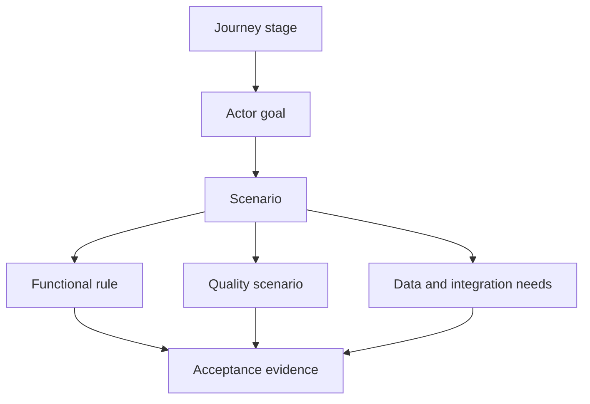

---
title: "Personas, Actors, and User Journeys"
date: 2026-08-05T00:00:00+05:30
draft: true
description: "Discover actors, goals, channels, accessibility needs, handoffs, pain points, and measurable end-to-end journeys before defining system behavior."
tags: ["architecture-discovery", "functional-discovery", "user-journeys", "concept"]
categories: ["Architecture Discovery"]
shortTitle: "Personas, Actors, and Journeys"
module: 2
moduleTitle: "Discovery Domains"
contentType: "concept"
difficulty: "intermediate"
estimatedReadingTime: 20
interviewImportance: "high"
enterpriseImportance: "high"
prerequisites: ["Business Outcomes and Success Measures", "Domain Language and Business Rules"]
dependencies: ["business-discovery/business-outcomes-and-success-measures", "domain-discovery"]
---

Functional discovery begins with people and responsibilities, not screens. An actor is any person, organization, device, service, or scheduled mechanism that pursues a goal or participates in an outcome. A persona adds relevant behavioral context. A journey connects goals, touchpoints, decisions, handoffs, delays, and evidence across an end-to-end experience.

## Architectural Question

**Who is trying to achieve which outcome, under what conditions, through which channels and handoffs?**

## Why This Matters

Requirements organized around an existing application reproduce its navigation and omissions. Actor and journey discovery exposes work that crosses products, teams, channels, and manual queues. It also reveals accessibility, authorization, identity, latency, audit, and continuity needs early enough to influence architecture.

Do not equate an actor with a job title. One person may act as applicant, approver, delegate, and auditor. Conversely, an automated fraud service and a human analyst may perform different responsibilities in the same decision.

## Actor Model

Record only attributes that change the solution:

| Field | Discovery intent |
|---|---|
| Actor and role | Identify the responsibility being exercised |
| Goal and success | State the outcome in the actor's language |
| Authority | Clarify decisions, delegation, and prohibited actions |
| Channel and context | Capture device, location, connectivity, urgency, and assistance |
| Frequency and volume | Separate rare expert work from high-volume routine work |
| Accessibility needs | Include permanent, temporary, and situational needs |
| Knowledge and incentives | Expose training assumptions and conflicting goals |
| Evidence | Link observations, analytics, policy, tickets, or interviews |

Avoid fictional demographic detail that does not affect a decision. Prefer evidence-backed role archetypes such as "branch approver handling exceptions during business hours" over decorative biographies.

## Journey Discovery

A useful journey starts before the software interaction and ends when the business outcome is confirmed or recovered. For each stage capture trigger, actor goal, activity, channel, system, information, rule, handoff, wait, failure, emotion where relevant, and measure.

The diagram is a prompt, not a universal process. Interview participants stage by stage and ask what happens outside the happy path.

## Discovery Procedure

1. Identify outcomes and the actors accountable for or affected by them.
2. Separate primary actors, supporting actors, external parties, automated actors, and governance actors.
3. Select representative journeys using value, volume, risk, variability, and pain.
4. Walk actual recent examples rather than asking only for the documented process.
5. Mark channel changes, ownership changes, waits, re-entry, duplicate data capture, and manual work.
6. Add alternate, failure, recovery, abandonment, and assisted-service paths.
7. Connect each pain point to evidence and a measurable outcome.
8. Validate the journey with frontline staff and affected users, not only managers.

## Example: Commercial Lending

| Stage | Actor goal | Friction discovered | Architecture implication |
|---|---|---|---|
| Application | Submit once | Customer data is re-entered in three channels | Shared identity and application context |
| Evidence | Prove eligibility | Documents arrive by email without correlation | Secure intake, classification, and case linkage |
| Assessment | Receive a timely decision | Credit and fraud checks have different availability | Explicit dependency and degradation rules |
| Exception | Resolve ambiguity | Analyst cannot see rule provenance | Explainable decision evidence and audit trail |
| Offer | Accept correct terms | Pricing expires during manual review | Versioned offer and time-bound acceptance |
| Fulfilment | Receive funds | Downstream booking is eventually consistent | Visible status and reconciliation behavior |

## Accessibility and Inclusion

Accessibility is a functional and quality concern. Discover keyboard and assistive-technology use, language and literacy, contrast and cognition needs, limited bandwidth, shared devices, time pressure, interrupted journeys, proxy or delegated action, and assisted channels. Define equivalent outcomes rather than assuming every actor follows the same interface.

## From Journeys to Requirements

Journeys do not replace use cases. They establish context and priority. Convert significant steps into scenarios, rules, data needs, quality scenarios, integration dependencies, and acceptance evidence.

Maintain identifiers so that a journey pain point can be traced to a requirement, decision, delivery item, and measure.

## Common Failure Modes

- Modeling the current application's menus instead of the actor's outcome.
- Interviewing only sponsors and missing frontline workarounds.
- Treating "customer" or "administrator" as one homogeneous actor.
- Ending the journey at submission instead of confirmation, failure, or recovery.
- Omitting external parties, batch jobs, devices, and support personnel.
- Creating polished maps without evidence, ownership, or measurable pain.
- Treating accessibility as late user-interface compliance.

## Completion Criteria

The discovery is sufficient when priority actors and journeys are agreed; channels, handoffs, exceptions, accessibility, and recovery are visible; pain points have evidence and outcome measures; actor authority is understood; and selected stages trace to scenarios and quality concerns.

## Review Questions

1. Which actor can authorize, override, delegate, or reverse each decision?
2. Where does a journey cross an ownership, trust, or channel boundary?
3. Which steps depend on memory, spreadsheets, email, or unofficial workarounds?
4. What happens when an actor leaves and returns later or changes channel?
5. Which users cannot achieve an equivalent outcome today?
6. How will the target architecture demonstrate improvement?

## Summary

Actor and journey discovery anchors functionality in real outcomes and operating conditions. It establishes who acts, why, with what authority, through which channels and handoffs, and with what measurable result.

Next, turn priority journeys into [use cases, scenarios, and explicit scope](/architecture-discovery/functional-discovery/use-cases-scenarios-and-scope/).
