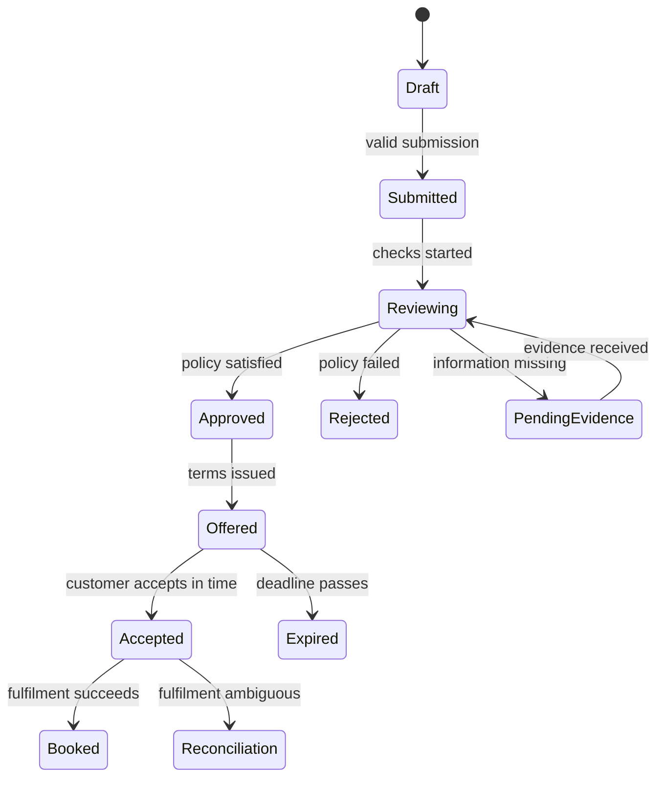
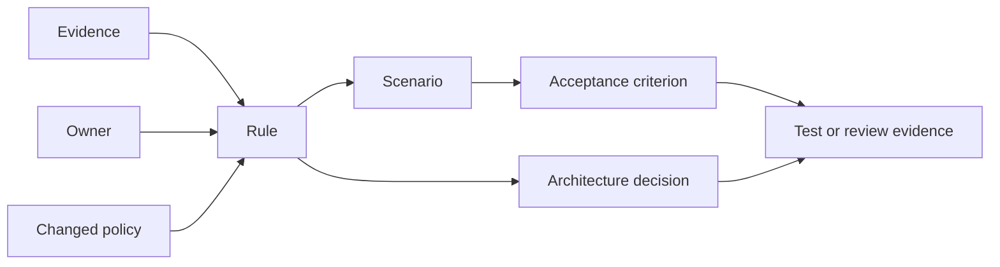

Functional requirements become decision-ready only when their rules, authority, exceptions, state effects, and acceptance evidence are explicit. Discovery must distinguish business policy from current implementation behavior and connect every important rule to an owner, source, scenario, and validation method.

## Architectural Question

**Which rules determine permitted behavior and valid outcomes, and what evidence proves the solution implements them correctly across normal and exceptional conditions?**

## Rule Taxonomy

| Rule type | Example | Architecture relevance |
|---|---|---|
| Validation | Applicant age must be verified | Data source, timing, error response |
| Authorization | Only delegated underwriters may override | Identity, policy decision, audit |
| Calculation | Offer rate uses policy version at decision time | Precision, provenance, determinism |
| Eligibility | Product available only in supported jurisdictions | Rule ownership and change frequency |
| State transition | Accepted offer cannot return to draft | Concurrency and invariant enforcement |
| Temporal | Approval expires after a defined period | Clock, scheduling, revalidation |
| Exception | Senior reviewer may approve with rationale | Control, evidence, monitoring |
| Retention | Decision evidence retained for required duration | Data lifecycle and legal hold |

Capture a stable rule identifier, statement, rationale, authoritative source, owner, effective dates, affected scenarios, inputs, outcome, exceptions, change frequency, evidence, and confidence.

## Separate Policy from Mechanism

"The customer must pass identity verification at the required assurance level" is a policy. "Call vendor X synchronously" is a mechanism. The first belongs in functional and security discovery; the second is an option evaluated against latency, availability, cost, compliance, and transition constraints.

Existing code is evidence of behavior, not automatically the source of truth. Compare policy, procedure, user practice, production behavior, and desired outcome. Record contradictions for decision.

## State and Invariants

Many hidden requirements are state-machine rules. Model significant business states, allowed transitions, actor authority, guards, side effects, and recovery.

For each transition ask what happens under duplication, concurrency, late arrival, cancellation, dependency failure, and policy change. Define minimal guarantees: for example, an accepted commitment must remain discoverable even when downstream booking fails.

## Decision Tables

Use decision tables when several conditions interact. They expose gaps and contradictions better than prose.

| Verified identity | Eligible region | Risk result | Required outcome |
|---|---|---|---|
| No | Any | Any | Request verification; do not decide |
| Yes | No | Any | Reject with applicable reason |
| Yes | Yes | Clear | Continue automatically |
| Yes | Yes | Refer | Create owned manual review |
| Yes | Yes | Unavailable | Apply approved degradation policy |

Every row needs an owner and an acceptance example. Do not invent business policy to fill empty combinations; log an open question.

## Acceptance Boundaries

Acceptance defines the observable boundary between acceptable and unacceptable outcomes. Strong criteria include:

- scenario and actor context;
- authoritative input and rule version;
- observable result and state;
- measurable timing or quality threshold;
- required audit or operational evidence;
- negative and boundary examples;
- validation environment, method, and owner.

Example:

> Given an already accepted offer with the same business idempotency key, when booking is requested again, then no second account is created, the original outcome is returned within the agreed latency, and the repeated request is correlated in operational evidence.

This criterion validates business behavior, reliability, and observability without prescribing implementation.

## Traceability Model

Traceability is valuable when it supports impact analysis. If a regulation, policy, or domain event changes, the team should identify affected scenarios, interfaces, controls, tests, and decisions.

## Discovery Procedure

1. Extract candidate rules from journeys, policies, procedures, code, incident evidence, and expert interviews.
2. Normalize language and assign identifiers without losing the original source.
3. Classify validation, authorization, calculation, eligibility, state, temporal, exception, and evidence rules.
4. Model decisions and state transitions for high-risk behavior.
5. Challenge contradictions, missing combinations, implicit defaults, and exception authority.
6. Write positive, negative, boundary, failure, recovery, and concurrency examples.
7. Assign acceptance method and accountable approver.
8. Link rules to scenarios, quality attributes, data, integrations, controls, and decisions.

## Change and Versioning

Rules change independently from software releases. Discover effective dates, retroactivity, in-flight treatment, version retention, regional variation, approval workflow, communication, and rollback. A decision should be reproducible using the facts and rule version effective when it occurred.

Avoid assuming a rules engine is required. First establish volatility, complexity, ownership, transparency, and deployment independence; then evaluate implementation options.

## Common Failure Modes

- Copying current UI validation as the business rule.
- Using words such as appropriate, timely, secure, or valid without definition.
- Omitting rule sources, owners, effective dates, and exceptions.
- Defining permissions only as broad application roles.
- Ignoring state, concurrency, duplicate requests, and late events.
- Treating acceptance criteria as developer unit-test notes.
- Achieving document traceability without usable change-impact analysis.

## Completion Criteria

Material functional rules are explicit, classified, owned, sourced, and version-aware. Important state transitions and decision combinations are modeled. Exceptions and override authority are visible. Acceptance covers positive, negative, boundary, failure, recovery, and evidence needs. Links support impact analysis from source through decision and validation.

## Review Questions

1. Which rule source prevails when policy, procedure, code, and practice disagree?
2. Can every consequential decision be reproduced later?
3. Which rules change frequently or vary by product, region, or customer?
4. Where can two valid actions create an invalid combined outcome?
5. Who approves exceptions, for how long, and with what monitoring?
6. What evidence proves the rule under production-like conditions?

## Summary

Functional discovery is complete only when behavior is governed by explicit rules and verifiable boundaries. Ownership, state, exceptions, versioning, and evidence turn stakeholder statements into requirements architecture and delivery teams can safely use.

The next domain maps the [current business process](/architecture-discovery/business-process/) and its real queues, controls, handoffs, and recovery work.
