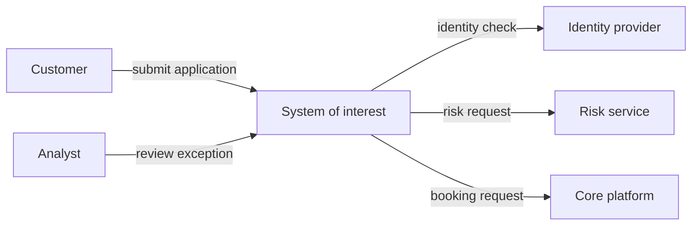
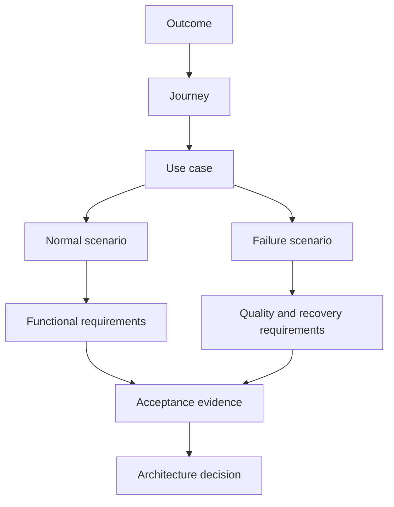

A use case describes an actor pursuing a goal through a system boundary. A scenario is one concrete path through that use case. Architecture discovery needs both: the stable goal prevents screen-level requirements, while scenarios expose the behavior, dependencies, failures, recovery, data, and quality conditions architecture must support.

## Architectural Question

**What behavior is inside the solution boundary, what remains outside, and how must the system respond across success, alternate, failure, and recovery paths?**

## Scope Before Detail

Define the system of interest and its responsibilities before eliciting steps. State:

- business outcome and accountable owner;
- actors and external systems;
- included capabilities, processes, geographies, products, and channels;
- explicit exclusions and adjacent initiatives;
- decision authority for scope changes;
- assumptions, constraints, and unresolved boundary questions.

Every arrow requires semantics: intent, owner, data classification, timing, failure behavior, and evidence. A context diagram without these properties is only an index.

## Use-Case Record

| Field | Required content |
|---|---|
| Identifier and goal | Stable reference and actor-valued outcome |
| Primary/supporting actors | Initiator, participants, systems, governance roles |
| Trigger | Observable event or request that starts the interaction |
| Preconditions | Necessary verified state, not hidden implementation |
| Success guarantee | State true after every successful path |
| Minimal guarantee | State preserved even after failure |
| Main scenario | Typical successful interaction |
| Alternate scenarios | Valid variations that still reach an outcome |
| Failure scenarios | Dependency, validation, concurrency, timeout, and control failures |
| Recovery | Retry, resume, compensate, reconcile, escalate, or abandon |
| Rules and data | Referenced policies, calculations, permissions, and information |
| Quality conditions | Volume, latency, availability, security, audit, usability |
| Evidence and owner | Source, confidence, accountable approver |

## Scenario Syntax

Write observable behavior in domain language:

> Given verified application data and an active pricing policy, when an authorized analyst approves the case, then the system records the decision and policy version, issues a time-bound offer, and makes the outcome visible to the applicant within the agreed response time.

Do not embed an unapproved design such as a particular queue, database, vendor, or microservice unless it is a real constraint. Separate required behavior from solution choice.

## Explore More Than the Happy Path

For every priority scenario ask:

1. What input is missing, invalid, stale, contradictory, or duplicated?
2. What if the actor is unauthorized, delegated, or loses access mid-flow?
3. What if a dependency is slow, unavailable, or returns an ambiguous result?
4. What if two actors change the same state concurrently?
5. Can the request be safely repeated?
6. What can be resumed, reversed, compensated, or reconciled?
7. What evidence must be retained and shown to support or audit staff?
8. When must a human take control?

### Example scenario set

| Scenario | Expected outcome | Architectural concern |
|---|---|---|
| Valid application | Decision and confirmation | Normal orchestration and evidence |
| Duplicate submission | One business outcome | Idempotency and correlation |
| Risk provider timeout | Pending state or approved fallback | Timeout budget and degradation policy |
| Policy changes during review | Deterministic rule version | Temporal consistency and auditability |
| Booking fails after acceptance | Recovery without lost commitment | Compensation and reconciliation |
| Analyst override | Authorized, reasoned exception | Fine-grained permission and immutable audit |

## Boundary Decisions

Scope disagreements are architecture decisions. Record alternatives and consequences. If identity proofing is outside the solution, specify the assertion and assurance the solution consumes. If manual review is inside the outcome but outside software automation, model the queue, ownership, timing, evidence, and re-entry point.

Use four labels consistently:

- **In scope:** behavior the initiative must deliver or change.
- **External dependency:** behavior another owner supplies under a contract.
- **Constraint:** fixed condition the design must respect.
- **Out of scope:** deliberately excluded behavior with an owner or consequence.

## Prioritization

Prioritize scenarios using outcome value, regulatory or safety exposure, transaction volume, failure frequency, architectural significance, uncertainty, and learning value. "Must" should mean an explicit outcome or obligation would fail without it—not merely that a stakeholder prefers it.

Thin slices should cross the real outcome. A slice that builds only a database or interface without an actor-visible result does not validate the scenario.

## Traceability

Maintain links rather than duplicating text. When evidence changes, the team can identify affected scenarios, requirements, and decisions.

## Common Failure Modes

- Writing implementation tasks instead of actor goals.
- Treating external systems as reliable black boxes.
- Listing exceptions without defining resulting state or recovery ownership.
- Hiding manual steps and asynchronous waits.
- Using vague verbs such as "manage" or "support."
- Allowing scope to expand without decision authority and impact analysis.
- Defining acceptance only for the normal path.

## Completion Criteria

Priority use cases have owners, boundaries, triggers, guarantees, and evidence. Representative normal, alternate, failure, and recovery scenarios are explicit. External responsibilities and exclusions are agreed. Scenarios trace to journeys, rules, quality needs, dependencies, and acceptance evidence.

## Interview Questions

### Why distinguish a use case from a scenario?

The use case preserves the actor goal and stable responsibility; scenarios describe concrete paths and conditions. Multiple scenarios reveal architectural variability and failure behavior without fragmenting the goal.

### How do you prevent functional requirements from dictating design?

State observable behavior, domain rules, boundaries, and measurable conditions. Record technology only when it is an evidenced constraint or a separately evaluated decision.

### How do you know discovery has enough scenarios?

Use risk-based coverage: include dominant volume, high-value outcomes, materially different actors or channels, critical controls, dependency failures, concurrency, recovery, and known incident patterns.

## Summary

Use cases establish goal and responsibility; scenarios make behavior testable under real conditions. Explicit scope and boundary semantics prevent hidden ownership and turn journeys into architecture-relevant requirements.

Next, define [functional rules and acceptance boundaries](/architecture-discovery/functional-discovery/functional-rules-and-acceptance-boundaries/).
