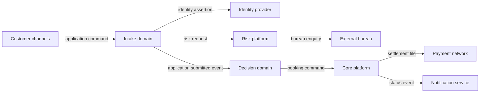
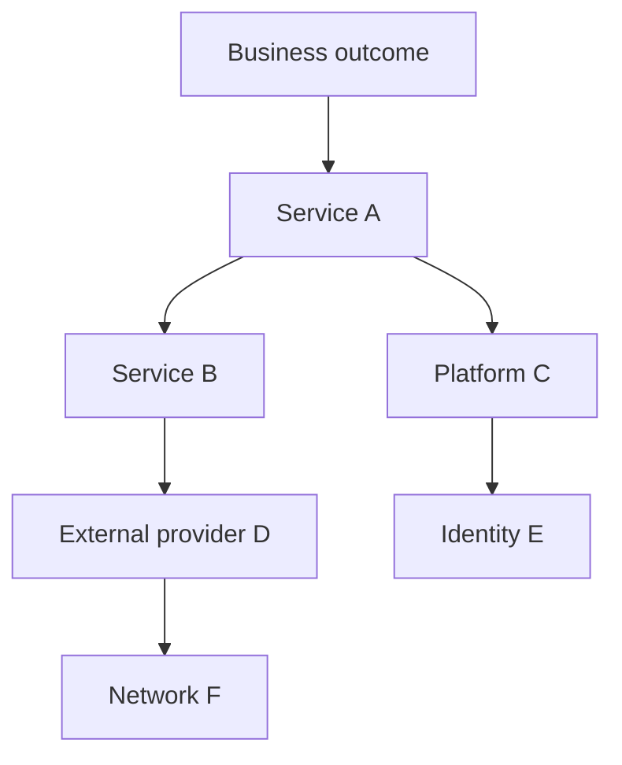

Integration discovery establishes how outcomes depend on information and behavior outside a system boundary. It identifies providers, consumers, ownership, contracts, critical paths, trust transitions, operational evidence, and change risk before choosing APIs, events, files, queues, or integration products.

## Architectural Question

**Which external interactions are required for each outcome, who owns their semantics and operation, and how do direct and transitive dependencies shape risk and design?**

## Why Interface Lists Are Insufficient

A spreadsheet containing endpoint names and protocols does not explain business intent, source of truth, consumer dependency, failure consequence, support ownership, or lifecycle. Architecture needs the contract behind the connection.

Integration discovery distinguishes:

- a business dependency from its current transport;
- provider ownership from platform hosting;
- schema compatibility from semantic compatibility;
- direct interfaces from transitive critical paths;
- documented contracts from observed production behavior;
- desired target interactions from transition obligations.

## Landscape Views

Use complementary views rather than one overloaded diagram:

| View | Shows | Primary decision |
|---|---|---|
| System context | Actors, systems, scope, trust boundaries | What is inside and outside? |
| Interaction map | Business intent, direction, style, data | How do parties collaborate? |
| Dependency graph | Direct and transitive reliance | What can affect the outcome? |
| Data-flow view | Creation, transformation, movement | Where does meaning and risk travel? |
| Runtime sequence | Timing, state, alternate and failure paths | What happens under conditions? |
| Ownership map | Provider, consumer, platform, support | Who decides and responds? |

Label technology only where it is an evidenced constraint. The first purpose is to clarify meaning and dependency.

## Integration Record

For each interaction capture:

| Field | Discovery question |
|---|---|
| Business purpose | Which outcome and scenario requires it? |
| Provider and consumers | Who owns meaning, operation, and use? |
| Intent | Command, event, query, transfer, notification? |
| Contract | Operation/event, schema, semantics, policy, version? |
| Data | Classification, authority, volume, retention, residency? |
| Timing | Synchronous/asynchronous, frequency, latency, deadline? |
| Guarantees | Ordering, delivery, consistency, idempotency? |
| Failure | Timeout, retry, ambiguity, degradation, recovery? |
| Security | Identity, authorization, trust transition, protection? |
| Operations | SLO, telemetry, support, incident and change process? |
| Lifecycle | Status, consumers, deprecation, migration, owner? |
| Evidence | Spec, observation, telemetry, interview, confidence? |

## Discovery Procedure

1. Start from priority journeys, processes, domain events, and quality scenarios.
2. Identify each external fact or action required to complete the outcome.
3. Name provider, consumers, semantic owner, operational owner, and support path.
4. Capture observed contracts and compare them with documentation.
5. Trace critical dependencies beyond the first hop.
6. Add volume, timing, classification, trust, quality, and lifecycle evidence.
7. Walk normal, degraded, failed, recovery, and change scenarios.
8. Validate with both provider and consumer representatives.
9. Link gaps to risks, requirements, experiments, and decisions.

## Criticality and Dependency Chains

Criticality is scenario-specific. A notification provider may be noncritical for completing an order but critical for a regulated disclosure. Record consequence, tolerated duration, fallback, data exposure, concentration risk, and recovery order.

Ask what B, D, and F depend upon. Shared identity, DNS, certificates, networking, secrets, time, observability, and deployment platforms often create hidden common-mode failure.

## Consumer Perspective

Provider catalogues rarely reveal how consumers use an interface. Discover whether a consumer treats data as authoritative, caches it, combines it with other sources, depends on undocumented fields, retries, assumes ordering, or cannot tolerate deprecation. A change that is structurally compatible can still alter decisions.

For events, document consumer purpose—not only subscriber name. This allows impact analysis and safe lifecycle decisions.

## Current, Target, and Transition

Tag every interaction as current, target, transitional, or planned retirement. During modernization, the same business capability may exist in two platforms. Capture routing authority, data synchronization, compatibility, duplicate prevention, reconciliation, and decommission criteria.

Avoid a target-only map that ignores coexistence, or a current-only inventory that turns accidental coupling into permanent requirement.

## Evidence Quality

Prefer production traces, gateway/broker telemetry, contract repositories, code references, incident records, and provider-consumer validation. Network scans can identify connections but not their business meaning. Mark last verified date and confidence; an unowned interface is a risk, not a completed catalogue entry.

## Common Failure Modes

- Listing protocols without business purpose or semantic ownership.
- Mapping only first-hop dependencies.
- Trusting provider documentation without consumer validation.
- Treating every integration as equally critical.
- Missing batch, file, email, spreadsheet, and human-mediated exchange.
- Ignoring platform and control-plane dependencies.
- Combining current and target interactions without status.
- Recording systems but not operations, incidents, or change lifecycle.

## Completion Criteria

Priority outcomes trace to owned interactions and direct/transitive dependencies. Intent, contract, data, timing, guarantees, security, operations, lifecycle, and evidence are sufficient for architectural decisions. Current, target, and transition states are distinguishable. Criticality and common-mode risks are reviewed with providers and consumers.

## Interview Questions

### How do you identify hidden dependencies?

Trace production calls and messages, inspect deployment and platform dependencies, analyze incidents, ask each provider about its dependencies, and walk critical outcomes through degraded scenarios. Include identity, network, DNS, certificates, secrets, telemetry, and human operations.

### What makes an interface contract complete?

It includes business intent and semantics, authority, data, behavior, errors, timing, guarantees, security, compatibility, lifecycle, operations, ownership, and consumer obligations—not only a schema.

### Should an integration catalogue be generated automatically?

Automation is valuable for endpoints, schemas, traffic, and freshness. Business purpose, semantic ownership, criticality, consumer use, and recovery policy require governed human validation.

## Summary

Integration landscape discovery makes dependency risk and ownership visible. It connects business outcomes to interaction semantics, contracts, transitive services, trust, operations, and lifecycle evidence.

Next, specify [integration requirements and failure semantics](/architecture-discovery/integration/integration-requirements-and-failure-semantics/).
