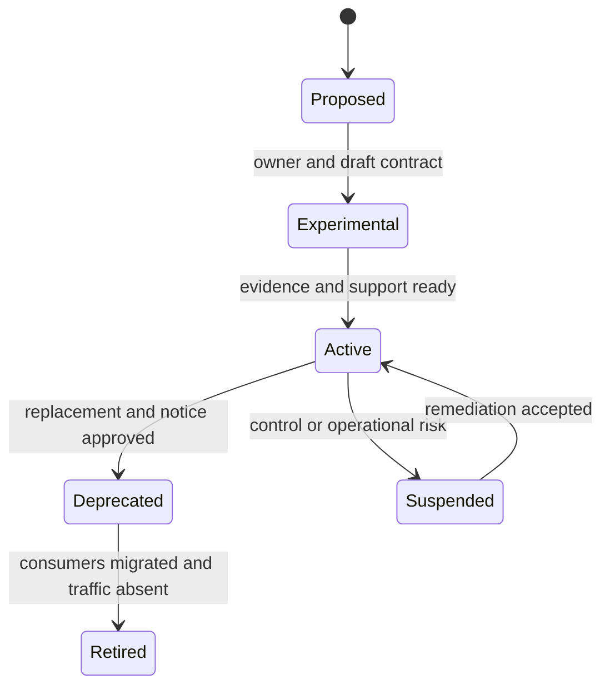
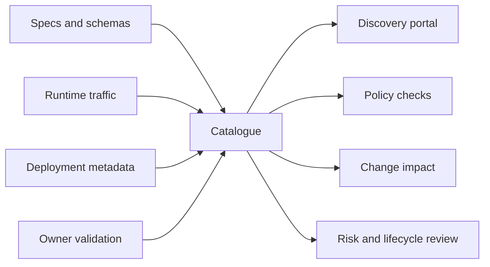

An integration catalogue is a governed decision system, not a directory of URLs. It connects business purpose and semantic ownership to contracts, consumers, criticality, lifecycle, operational health, security, and change impact. Automation keeps technical facts fresh; accountable owners validate meaning and policy.

## Architectural Question

**What minimum governed information allows teams to discover, understand, change, operate, secure, and retire integrations without losing business context?**

## Catalogue Scope

Include APIs, events, commands, queues, streams, files, managed transfers, database exchanges, partner links, webhooks, and material human-mediated handoffs. Catalogue the logical interaction separately from environment-specific instances.

Avoid forcing every integration into an API-shaped model. Shared fields support discovery; type-specific fields preserve semantics.

## Core Record

| Category | Required fields |
|---|---|
| Identity | Stable ID, name, type, status, domain, capability |
| Purpose | Business outcome, intent, authoritative meaning |
| Ownership | Semantic owner, product owner, technical owner, support |
| Parties | Providers, known consumers, consumer purpose |
| Contract | Spec/schema, version, behavior, errors, examples |
| Data | Entities, authority, classification, residency, retention |
| Quality | Criticality, SLO, volume, latency, consistency, delivery |
| Security | Trust boundary, identity, authorization, protection, controls |
| Operations | Telemetry, dashboard, runbook, on-call, incident channel |
| Lifecycle | Introduction, compatibility, deprecation, retirement, replacement |
| Evidence | Source, verification date, confidence, validation owner |

Type-specific extensions include idempotency and timeout for commands, ordering and replay for events, quotas and error models for APIs, and cutoff/checksum/reconciliation for files.

## Ownership Model

Semantic ownership belongs with the domain accountable for the fact or behavior. Platform teams may own gateway, broker, schema registry, or transfer service, but do not automatically own business meaning.

Use explicit responsibilities:

- provider owns contract correctness, service operation, change communication, and support;
- semantic owner approves meaning and policy;
- consumers register purpose, dependencies, and migration status;
- platform owner provides controls and reliable catalogue automation;
- governance defines minimum evidence and adjudicates cross-domain risk.

An entry without an accountable owner is not certified.

## Lifecycle State

Use states with entry and exit criteria:

Record effective dates, supported versions, consumer migration, traffic evidence, data obligations, and retirement authority. Retirement requires more than zero recent traffic when seasonal or disaster-only consumers exist.

## Change Governance

Classify changes by semantic, behavioral, structural, security, quality, and operational impact. A schema-compatible change may still break consumer decisions, timing, error handling, or privacy obligations.

Change workflow:

1. provider proposes change and intended effective date;
2. catalogue identifies registered and observed consumers;
3. semantic owner classifies impact;
4. consumers validate compatibility or migration plan;
5. security, data, and operations review material changes;
6. evidence gates authorize rollout;
7. telemetry confirms adoption and absence of harm;
8. obsolete versions are retired under policy.

## Automation and Evidence

Automatically ingest specifications, schemas, deployments, gateway routes, broker topics, ownership metadata, traffic, dependencies, vulnerabilities, and freshness. Reconcile sources rather than assuming one inventory is complete.

Human validation remains essential for business purpose, authoritative meaning, consumer use, criticality, exception policy, and risk acceptance. Display verification date and confidence so absence of evidence is visible.

## Governance Without Bottlenecks

Use policy-as-code for objective checks: valid owner, spec linting, security baseline, supported version, SLO metadata, and deprecation dates. Reserve human forums for semantic conflicts, exceptions, high-consequence changes, and cross-domain decisions.

Provide paved-road templates, automated registration, ownership reminders, and actionable errors. Measure governance lead time and exception volume alongside compliance.

## Catalogue Quality Measures

Track coverage of observed interactions, owner completeness, verification freshness, known-consumer registration, contract availability, policy conformance, deprecated traffic, orphan interfaces, incident linkage, and retirement lead time. A catalogue with thousands of stale entries creates false confidence.

Sample health rules:

- active critical integrations verified within the agreed interval;
- every production provider has semantic and operational owners;
- observed consumers absent from registration create review tasks;
- deprecated versions show migration owner and deadline;
- critical interactions link to dashboard, runbook, and recovery evidence.

## Consumer Discovery

Combine registration with runtime observation, code search, access records, and owner confirmation. Treat traffic absence carefully. Capture consumer purpose and criticality so providers understand consequences and can detect redundant or prohibited use.

## Common Failure Modes

- Building an endpoint inventory without business meaning.
- Assigning all ownership to the integration platform team.
- Trusting self-registration without runtime reconciliation.
- Treating schema compatibility as complete change safety.
- Allowing deprecated versions without owners or deadlines.
- Measuring catalogue entry count instead of freshness and coverage.
- Creating a central approval board for every low-risk change.
- Retiring based only on short-term traffic absence.

## Completion Criteria

The catalogue covers material observed interactions and contains meaningful, owned, fresh, confidence-marked records. Lifecycle and change workflows include consumers and evidence. Objective policy is automated; semantic and risk decisions have accountable review. Catalogue measures expose gaps, stale entries, deprecated use, and orphan dependencies.

## Interview Questions

### What is the difference between an API portal and an integration catalogue?

An API portal often focuses on documentation and developer consumption. An enterprise integration catalogue spans interaction types and connects business purpose, ownership, consumers, lifecycle, operations, data, security, and impact analysis.

### How do you keep a catalogue current?

Continuously reconcile specs, deployment, runtime traffic, code and ownership systems; require lifecycle events to update records; expose freshness; and assign accountable validation. Manual campaigns alone decay quickly.

### How do you govern without slowing teams?

Automate objective checks, provide paved roads and self-service registration, use risk-based review, and reserve synchronous governance for semantic conflicts and consequential exceptions.

## Summary

Catalogue governance turns integration knowledge into an operational control. It joins automated evidence with semantic ownership, consumer impact, lifecycle discipline, and risk-based policy so contracts can evolve safely.

Continue with [data domains, meaning, and ownership](/architecture-discovery/data/).
