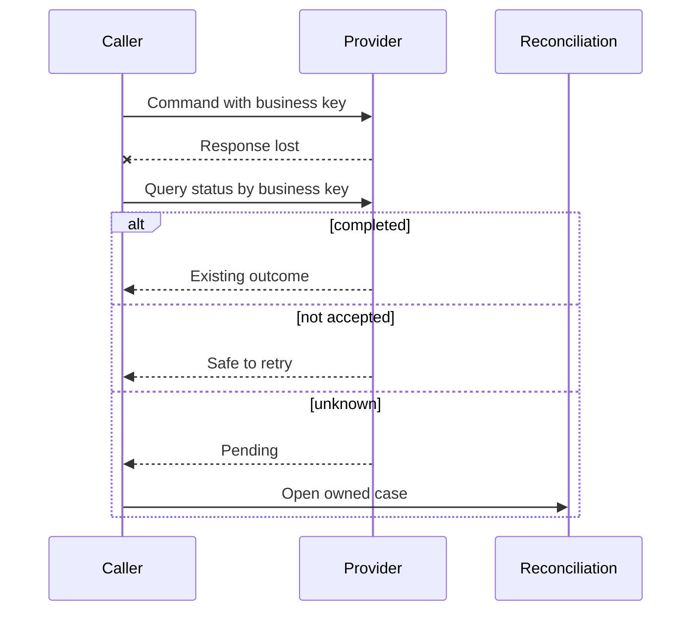
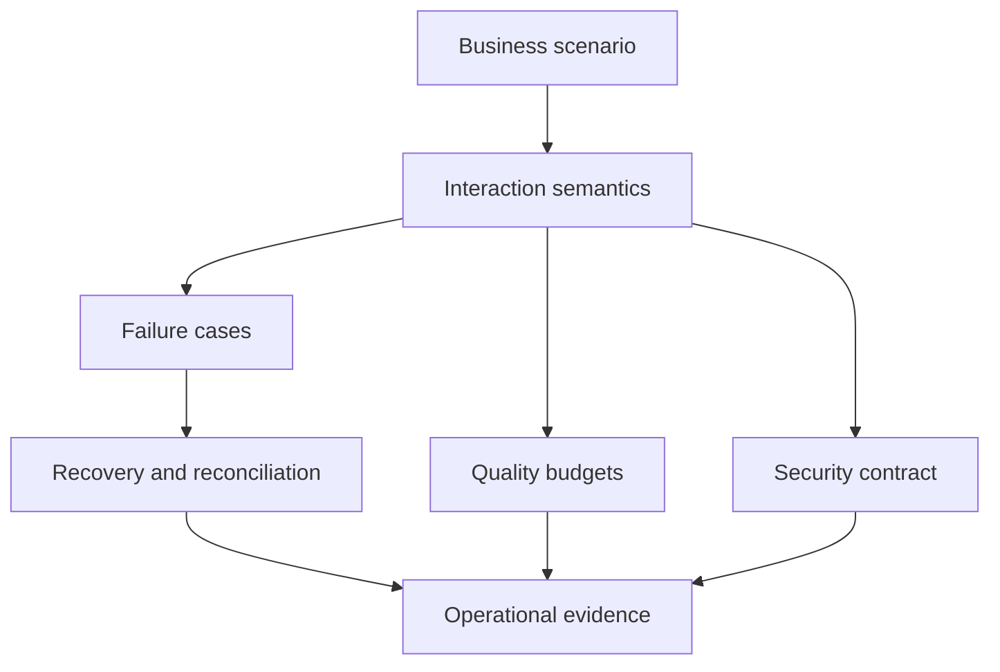

Integration requirements define observable collaboration behavior, especially when parties are slow, unavailable, duplicated, reordered, changed, or partially successful. Selecting HTTP, messaging, streaming, or file transfer before these semantics are understood shifts business decisions into accidental middleware defaults.

## Architectural Question

**What interaction and failure behavior preserves the business outcome when communicating parties have independent state, timing, availability, and ownership?**

## Choose Style from Semantics

| Need | Candidate style | Questions before selection |
|---|---|---|
| Immediate decision or answer | Synchronous request/response | Deadline, availability coupling, ambiguity, fallback |
| Notify independent consumers of a fact | Event publication | Ownership, ordering, delivery, replay, evolution |
| Request durable asynchronous work | Command/message | Acceptance, deduplication, status, expiry, cancellation |
| Move a bounded dataset | Batch/file transfer | Cutoff, completeness, checksums, correction, retention |
| Propagate changing data | Stream/change feed | Authority, snapshot, ordering, schema, deletion |
| Coordinate long-running outcome | Workflow/orchestration | State, timers, compensation, human tasks, ownership |

These styles may coexist. Do not use an event to hide a command, or a synchronous call when the business outcome is inherently long-running.

## Contract Semantics

Define intent, preconditions, authorization, inputs, authoritative identifiers, result, errors, state effects, consistency, timing, idempotency, evidence, and lifecycle. For an event, state why it is true and who owns the fact. For a command, state who may request it and how acceptance differs from completion.

## Timeout and Ambiguity

A timeout means the caller did not receive a conclusive response within its deadline. The requested action may have failed, succeeded, or still be running. Requirements must define:

- end-to-end and per-hop deadlines;
- cancellation semantics;
- status query or correlation mechanism;
- safe retry conditions;
- pending-state visibility;
- maximum uncertainty window;
- reconciliation and escalation ownership.

## Idempotency

Technical message IDs are often insufficient. Define a stable business idempotency key, scope, retention, equivalence rules, concurrency behavior, returned result, and side-effect handling. The provider—not only the caller—must prevent duplicate business effects when repetition is expected.

Idempotency does not mean every repeated request succeeds. A repeated command with conflicting content may require rejection and investigation.

## Delivery and Ordering

Avoid “exactly once” as an unexplained requirement. Separate transport delivery from business effect. Discover tolerance for loss, duplication, delay, reordering, replay, and poison messages. Specify ordering scope—global order is expensive and rarely necessary; per-account or per-case order may match the invariant.

For late events define whether to ignore, apply, compensate, rebuild, or escalate. Include event time, processing time, effective time, and policy version where material.

## Consistency Expectations

State which operations require authoritative current data and which tolerate bounded staleness. Define convergence deadline, read-your-writes needs, monotonic behavior, conflict ownership, and user communication. “Eventually consistent” is incomplete without maximum meaningful delay and behavior before convergence.

### Example interaction matrix

| Interaction | Consistency | Failure behavior | Recovery |
|---|---|---|---|
| Funds reservation | Authoritative before commitment | Refuse or remain pending | Status query and reconciliation |
| Product display | Bounded stale data acceptable | Serve cached with freshness signal | Background refresh |
| Regulatory disclosure | Correct version by deadline | Queue durably; escalate age | Replay with evidence |
| Analytics feed | Duplicates acceptable, loss not | Pause partition on corruption | Replay and deduplicate |

## Retry, Backoff, and Load

Define retryable errors, deadline, maximum attempts, exponential backoff, jitter, concurrency, retry budget, and terminal disposition. Coordinate policies across clients, gateways, libraries, and brokers. Nested retries amplify load and can prevent recovery.

Use circuit breaking or admission control only with explicit degraded behavior. “Fail fast” is useful only when callers know what outcome to produce.

## Contract Evolution

Compatibility includes syntax, semantics, behavior, timing, security, and operations. Capture additive/change rules, version strategy, consumer testing, parallel support, deprecation notice, migration evidence, and retirement authority.

For events, consumers must tolerate unknown fields and publishers must not silently change meaning. For APIs, a new optional field can still be semantically breaking if consumers infer absence differently.

## Security and Trust

Discover workload identity, user context propagation, authorization point, least privilege, tenant isolation, encryption, data minimization, replay protection, nonrepudiation where required, secret/certificate lifecycle, and cross-boundary monitoring. Avoid forwarding user tokens through every service without audience, delegation, and exposure analysis.

## Operational Contract

An integration contract includes SLOs, service indicators, rate and quota policy, maintenance, support hours, incident communication, escalation, trace correlation, data-quality alerts, replay tooling, recovery tests, and dependency change notification.

## Common Failure Modes

- Treating a timeout as proof of failure.
- Retrying without business idempotency or a deadline.
- Requiring global ordering when only entity order matters.
- Saying “eventual consistency” without convergence behavior.
- Assuming broker delivery prevents duplicate business effects.
- Versioning schemas while changing semantics silently.
- Specifying protocol errors without business-state outcomes.
- Omitting operator and consumer recovery tools.

## Completion Criteria

Each critical interaction has explicit intent, contract, timing, consistency, delivery, ordering, idempotency, failure, security, recovery, and operational semantics. Ambiguous outcomes and partial success are covered. Provider and consumers agree on validation, lifecycle, and support responsibilities.

## Interview Questions

### When would you choose asynchronous integration?

When the business outcome is long-running, durable acceptance matters more than an immediate result, availability coupling should be reduced, buffering is valuable, or independent consumers react to facts. It requires status, failure, observability, and recovery semantics.

### Does messaging guarantee exactly-once processing?

Transport features can reduce duplication, but end-to-end exactly-once business effect spans state changes and external side effects. Design idempotent outcomes, correlation, and reconciliation rather than relying on a slogan.

### How should an API handle a long-running request?

Return durable acceptance with a correlation/resource identifier, expose status and cancellation semantics, define expiry and callbacks or events where useful, and make final success, failure, and recovery observable.

## Summary

Integration requirements are business-state semantics across an unreliable boundary. Explicit timing, ambiguity, idempotency, consistency, recovery, security, and operations allow technology choices to be evaluated safely.

Next, govern these contracts through an [integration and API catalogue](/architecture-discovery/integration/integration-and-api-catalog-governance/).
