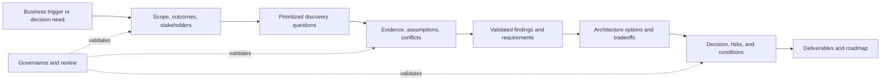
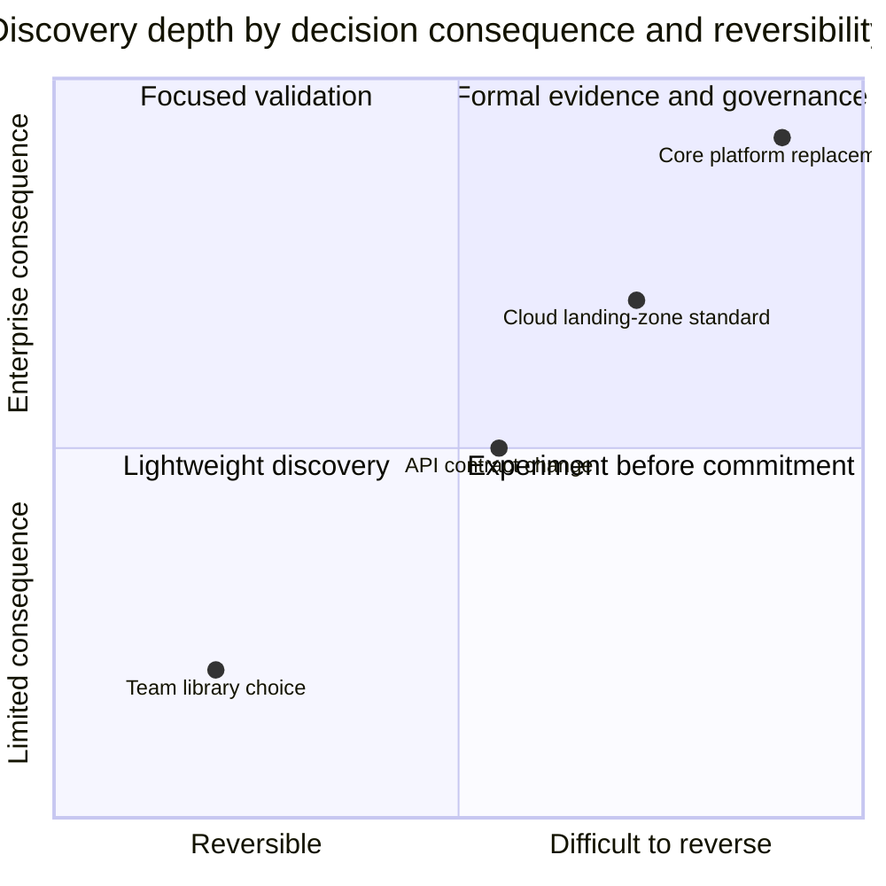

Architecture discovery is the disciplined work of reducing uncertainty before an enterprise commits to an architecture direction. It establishes what problem matters, whose outcomes and risks count, what exists today, which constraints are real, and which claims still lack evidence.

Discovery is not a ceremonial requirements phase and it is not solution design performed in a workshop. Its purpose is to make the decision context trustworthy enough that architects can compare options, expose risk, and recommend a responsible next step.

## Architectural Question

**What must an architect understand—and how well must it be evidenced—before the organization can make a consequential architecture decision?**

The answer is not “everything.” Enterprise estates are too large, stakeholders disagree, documentation is incomplete, and business conditions continue to change. Effective discovery is intentionally bounded by the decision it must enable.

For example, deciding whether to modernize a claims platform requires different evidence from selecting an API gateway. The first needs business outcomes, process bottlenecks, domain boundaries, estate dependencies, migration constraints, organizational readiness, and transition risk. The second needs workload characteristics, security policies, integration requirements, operating-model constraints, and commercial criteria.

The discovery boundary therefore begins with a decision, not a list of technologies.

## Business Problem

Large architecture initiatives often begin with a proposed answer:

- “Move the estate to the cloud.”
- “Break the monolith into microservices.”
- “Replace the core platform.”
- “Standardize on an event-driven architecture.”
- “Create a single enterprise data platform.”

These statements may describe a useful direction, but they are not yet validated architecture decisions. They frequently conceal different stakeholder concerns: time to market, vendor end-of-support, regulatory exposure, operating cost, resilience, merger integration, skills shortages, or poor customer experience.

When architects accept the proposed answer as the problem definition, predictable failures follow.

| Failure | What was missing | Enterprise consequence |
|---|---|---|
| A technically successful platform does not improve the business outcome | Measurable outcome and baseline | Investment without demonstrable value |
| A target architecture ignores a critical legacy dependency | Current-state evidence and ownership | Delayed migration, emergency coexistence design |
| Stakeholders approve different interpretations of scope | Decision rights and explicit boundaries | Rework, escalation, and contested acceptance |
| NFRs remain words such as “fast” and “highly available” | Measurable scenarios and evidence | Unverifiable design and uncontrolled cost |
| A preferred product wins before alternatives are framed | Decision criteria and option analysis | Lock-in and post-hoc justification |
| Risk is recorded but has no accountable owner | Governance and acceptance authority | Known exposure persists without treatment |

The business problem discovery solves is therefore **premature commitment under uncertainty**.

## Why It Matters

Architecture decisions shape capital allocation, delivery sequencing, vendor commitments, security exposure, organizational structure, and years of operational cost. The cost of correcting a weak assumption increases after contracts are signed, teams are mobilized, data is migrated, and consumers depend on new interfaces.

Discovery creates value in four ways:

1. **It frames the right decision.** The team separates the underlying outcome from a stakeholder's preferred solution.
2. **It makes uncertainty visible.** Facts, assumptions, opinions, conflicts, and unanswered questions are not treated as equivalent.
3. **It connects evidence to judgment.** Requirements, risks, options, and recommendations retain traceability to their sources.
4. **It makes commitment conditional.** Leaders can approve, reject, defer, experiment, or narrow a decision based on evidence quality and risk.


Discovery does not eliminate uncertainty. It reduces the uncertainty that could materially change the decision and makes the remaining uncertainty governable.


## Enterprise Context

Enterprise discovery operates across several perspectives at once.

| Perspective | Questions discovery must answer | Typical evidence |
|---|---|---|
| Business | Which outcome, capability, customer, or obligation justifies change? | Strategy, KPIs, financial baseline, regulatory finding, customer research |
| Domain | Which concepts, rules, events, and ownership boundaries must be preserved? | Domain workshops, policies, process rules, terminology, exception records |
| Functional | Who needs the system to do what, under which normal and exceptional conditions? | Journeys, use cases, service data, support cases, acceptance criteria |
| Quality | How well must the system behave, in which conditions, and how will that be verified? | SLOs, incident history, demand forecasts, audit evidence, performance data |
| Integration and data | Which dependencies, contracts, meanings, flows, and lifecycle obligations constrain change? | Interface catalogs, schemas, lineage, volumes, reconciliation reports |
| Security and compliance | What must be protected, from whom, under which obligations and risk authority? | Threat models, control evidence, audit findings, data classifications |
| Technology | Which estate facts, standards, lifecycle risks, skills, and commercial constraints matter? | Inventories, CMDB records, contracts, support matrices, engineering surveys |
| Operations | Who runs the service, how does it fail, and what must recovery cost and look like? | Incidents, runbooks, telemetry, DR tests, staffing model, cloud cost data |

No single stakeholder owns this complete picture. Discovery is an evidence-integration activity across business, delivery, operations, security, data, and technology communities.

## Core Model

The framework treats discovery as a traceable chain from decision need to governed outcome.

Each link matters. A recommendation that cannot be traced to findings is an opinion. A finding that cannot be traced to evidence is an assumption. Evidence that has no relationship to the decision is research without purpose.

### The Discovery Contract

Every discovery engagement should establish a minimal contract.

| Contract element | Required answer |
|---|---|
| Trigger | What event, problem, opportunity, or obligation initiated discovery? |
| Decision | Which decision must be enabled, by whom, and by when? |
| Outcomes | What measurable change would make the initiative worthwhile? |
| Scope | Which capabilities, processes, systems, regions, users, and time horizons are included? |
| Exclusions | What is deliberately outside the investigation? |
| Evidence standard | Which claims require measurement, records, experiments, or formal validation? |
| Risk authority | Who may accept which kinds of residual risk? |
| Exit criteria | What must be sufficiently known, decided, or explicitly deferred? |

Without this contract, discovery tends to expand indefinitely or close when the calendar expires rather than when the decision is ready.

## How It Works

Architecture discovery is iterative rather than strictly sequential.

### 1. Frame the Decision

Clarify the trigger, outcome, decision owner, deadline, scope, and material constraints. Challenge solution-shaped problem statements. If the sponsor says “we need microservices,” ask which business or operating outcome the proposed decomposition must improve.

### 2. Map Stakeholders and Evidence Sources

Identify people who own outcomes, knowledge, operations, risk, funding, delivery, and approval. Then identify durable evidence: metrics, incidents, audits, contracts, code and deployment inventories, process records, support cases, forecasts, and prior decisions.

### 3. Discover by Risk and Decision Impact

Prioritize questions whose answers could change the decision. A missing interface used once a month is not equivalent to an undocumented settlement dependency moving billions in value. Discovery depth should follow materiality.

### 4. Separate Facts from Uncertainty

Record whether each important claim is verified, inferred, assumed, disputed, or unknown. Assign confidence, source, owner, and validation action. Do not allow workshop consensus to silently convert an assumption into a fact.

### 5. Synthesize Findings

Convert evidence into implications: business requirements, domain boundaries, functional behavior, quality scenarios, constraints, risks, and decision criteria. Preserve traceability so reviewers can challenge the reasoning rather than debate recollections.

### 6. Frame Options and Conditions

Compare viable choices, including “do nothing,” incremental change, and experiments that buy information. Make tradeoffs, reversibility, transition states, costs, and organizational implications explicit.

### 7. Close or Continue Deliberately

Conclude with one of several valid outcomes: approve a direction, reject it, narrow it, defer it, commission an experiment, or escalate unresolved risk. Discovery is complete when the decision is responsibly enabled—not only when a target diagram exists.

## Evidence and Validation

Evidence quality should match decision consequence. A reversible team-level choice may rely on engineering judgment and a short experiment. A multi-year regulated-platform replacement demands stronger traceability and independent validation.

| Claim | Suitable evidence | Owner | Confidence test | Validation action |
|---|---|---|---|---|
| Peak traffic is 8,000 requests per second | Production telemetry across representative peaks | Service owner | Data source and time window are known | Reconcile gateway and service metrics |
| The legacy vendor ends support next year | Executed contract and vendor notice | Vendor manager | Legal entity and product version match | Confirm obligations with procurement and legal |
| Manual reconciliation causes customer delay | Process timing, queue data, support cases | Operations lead | Samples cover normal and peak periods | Observe the process and validate baseline |
| A region requires local data residency | Applicable regulation and legal interpretation | Privacy or legal owner | Scope and data categories are explicit | Obtain formal compliance determination |
| Teams cannot operate the proposed platform | Skills inventory, support model, delivery history | Engineering leader | Capability gaps are role-specific | Run a bounded proof of capability |

### Proportionate Evidence

This is not permission to under-investigate “small” decisions that aggregate into enterprise risk. Architects must consider blast radius, coupling, precedent, regulatory impact, and the cost of propagating a choice.

## Practical Example

Consider a regional insurer whose sponsor asks for a “microservices transformation” of its claims platform.

### Initial Statement

> The monolith prevents rapid change, so the organization should replace it with microservices in eighteen months.

### Discovery Reframing

| Dimension | Evidence discovered | Architectural implication |
|---|---|---|
| Business outcome | Most customer delay occurs in manual document review, not software release | Service decomposition alone will not meet the outcome |
| Change history | Product-rule changes are frequent; claim-payment logic is stable and highly controlled | Separate change rates may justify selective modularization |
| Dependencies | Forty-two partner and regulatory interfaces depend on a shared claim identifier | Transition architecture and compatibility dominate migration risk |
| Data | Claims, documents, payments, and fraud signals have different owners and retention obligations | Data ownership must be clarified before extraction |
| Operations | One central team supports the platform; product teams lack 24×7 ownership | Microservice operating model is not yet viable at target scale |
| Technology | Runtime support ends in twenty-four months, but the database remains supported | Runtime remediation is urgent; wholesale replacement is not the only option |

### Discovery Outcome

The responsible recommendation is not an immediate yes-or-no vote on microservices. Discovery enables a staged decision:

1. modernize the unsupported runtime;
2. automate document intake and expose measurable cycle-time outcomes;
3. establish domain and data ownership around product rules, documents, and fraud;
4. pilot extraction of one high-change, operationally owned capability;
5. reassess decomposition using delivery and reliability fitness measures.

The original solution hypothesis remains possible, but it is now conditional on evidence, readiness, and value.

## Tradeoffs and Boundaries

| Choice | Benefit | Cost or risk | Appropriate when |
|---|---|---|---|
| Broad discovery | Reveals cross-domain dependencies and systemic risk | Slower, expensive, vulnerable to analysis sprawl | Decision has enterprise blast radius and low reversibility |
| Narrow discovery | Faster path to a bounded decision | May miss dependencies outside the chosen boundary | Scope and interfaces are stable and decision is reversible |
| Document-led discovery | Efficient use of existing organizational knowledge | Documents may be stale, aspirational, or ownerless | Sources are current and independently corroborated |
| Workshop-led discovery | Rapidly exposes perspectives and conflicts | Authority and group dynamics can distort “facts” | Combined with evidence validation and inclusive facilitation |
| Experiment-led discovery | Replaces speculation with observed behavior | Can optimize a technically narrow question while missing business fit | Uncertainty is testable within a safe, representative boundary |

### What Discovery Does Not Own

The framework deliberately stops at several boundaries:

- It captures quality requirements; the [System Design NFR guide](/system-design/non-functional-requirements/) explains architecture levers and broader NFR patterns.
- It produces workload and constraint evidence; [Technology Decisions](/technology-playbook/) owns detailed category and product selection.
- It identifies modernization conditions and transition risk; [Microservices Migration and Modernization](/microservices/09-migration-modernization/) owns implementation patterns.
- It identifies assets, trust boundaries, obligations, and security gaps; [Security Architecture](/security-architecture/) owns detailed control design.
- It captures operational outcomes and gaps; [Microservices Observability](/microservices/08-observability/observability/) owns telemetry and diagnostic architecture.

## Best Practices

1. **Begin with the decision and consequence.** Discovery scope should be justified by what could change the decision.
2. **Triangulate material claims.** Combine stakeholder knowledge with operational, financial, contractual, or technical evidence.
3. **Record dissent.** Disagreement often reveals different scopes, incentives, or risk tolerances.
4. **Use confidence explicitly.** A low-confidence critical assumption deserves validation or a conditional decision.
5. **Make ownership durable.** Every requirement, risk, artifact, decision, and follow-up needs an accountable owner.
6. **Prefer minimum sufficient artifacts.** Produce a diagram or register because it enables a decision, not because a methodology lists it.
7. **Timebox research, not truth.** At the deadline, expose what remains unknown and its consequence instead of declaring artificial certainty.
8. **Design for reassessment.** Decisions need review triggers when traffic, regulation, costs, dependencies, or strategy change.

## Common Mistakes and Anti-Patterns

| Anti-pattern | Why it fails | Corrective action |
|---|---|---|
| Solution-first discovery | Questions are biased toward confirming a preferred answer | Restate the outcome and include credible alternatives |
| Questionnaire dumping | Hundreds of generic questions exhaust stakeholders without enabling a decision | Prioritize questions by materiality and dependency |
| Workshop consensus as truth | Agreement may reflect hierarchy, incomplete attendance, or shared assumptions | Record claims and validate them against durable evidence |
| Diagram archaeology | Existing diagrams are accepted as the current state | Verify runtime topology, ownership, interfaces, and observed behavior |
| NFR adjectives | “Scalable,” “secure,” and “available” cannot be tested | Write measurable scenarios with environment, response, owner, and validation |
| Artifact factory | Teams produce documents that no decision maker uses | State the audience and decision enabled by every artifact |
| Endless discovery | The team pursues completeness instead of decision readiness | Define exit criteria and unresolved-risk treatment at the start |
| Invisible uncertainty | Assumptions are embedded in prose and later remembered as facts | Maintain explicit confidence, source, owner, and validation state |


A polished target-state diagram can create false confidence. If its requirements, constraints, and tradeoffs cannot be traced to validated findings, it is a hypothesis—not an approved architecture.


## Architecture Review Notes

An architecture review of discovery readiness should ask:

- Is the business trigger separated from the proposed solution?
- Is the decision, decision owner, deadline, and consequence explicit?
- Are scope and exclusions concrete enough to prevent silent expansion?
- Are material claims linked to evidence with owners and confidence?
- Have operational, security, data, integration, and organizational constraints been represented?
- Are conflicting stakeholder positions visible and resolved or escalated?
- Could an unanswered question materially change the recommended option?
- Are risks, conditions, experiments, and reassessment triggers explicit?
- Is every planned artifact tied to a decision audience?
- Does the recommendation distinguish current fact from future assumption?

Discovery is not ready to close when reviewers can see a target architecture but cannot reconstruct why it is appropriate.

## Interview Questions

### 1. How do you begin when a customer asks you to design microservices?

A strong answer reframes the request around business outcomes, change constraints, current-state pain, domain ownership, operating maturity, and decision authority. It treats microservices as an option to evaluate, not the initial requirement.

### 2. How do you decide when discovery is complete?

Discovery is complete when the agreed decision can be made responsibly: material requirements and constraints are sufficiently evidenced, consequential uncertainty is validated or governed, options and tradeoffs are explicit, risk owners are identified, and follow-up actions have accountable owners.

### 3. What do you do when senior stakeholders provide conflicting requirements?

Separate the claims, identify their underlying outcomes and authority, gather evidence, make the tradeoff visible, and escalate to the appropriate decision owner. Architecture should not hide governance conflicts inside a technical compromise.

### 4. How much documentation should discovery produce?

The minimum set that enables and governs the decision. Each artifact needs an audience, purpose, owner, quality criterion, and lifecycle. More documentation is not automatically stronger evidence.

### 5. How do you prevent discovery from becoming analysis paralysis?

Frame a bounded decision, prioritize high-impact uncertainty, define exit criteria, timebox validation, use experiments for testable unknowns, and close with explicit residual risk rather than waiting for complete knowledge.

## Summary

Architecture discovery is a decision-enablement discipline. It frames the outcome and decision, integrates evidence across enterprise perspectives, makes uncertainty explicit, and traces findings into options, risks, deliverables, and roadmaps.

Its quality is not measured by workshop count or document volume. High-quality discovery allows a reviewer to understand:

- what decision must be made;
- why it matters;
- which evidence supports the findings;
- what remains uncertain;
- which options and tradeoffs were considered;
- who owns the decision and risk; and
- under which conditions the decision should be revisited.

The next chapter turns this scope into an explicit [Discovery Engagement Charter](/architecture-discovery/discovery-framework/) so objectives, boundaries, roles, evidence standards, and exit criteria are agreed before deep discovery begins.

## Further Reading

- [System Design Process](/system-design/system-design-process/) — the solution-design workflow that follows sufficient discovery
- [Non-Functional Requirements](/system-design/non-functional-requirements/) — canonical quality-attribute reference and design implications
- [Technology Decisions](/technology-playbook/) — architecture and technology decision frameworks
- [Microservices Migration and Modernization](/microservices/09-migration-modernization/) — implementation patterns after modernization direction is selected
- [Security Architecture](/security-architecture/) — detailed trust, identity, control, and platform-security guidance
