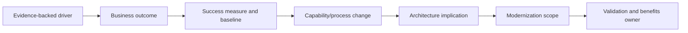
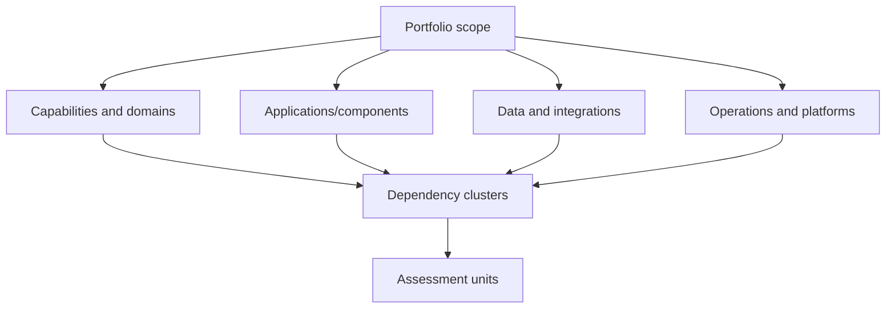

Modernization is a business change that alters capabilities, operating model, technology, data, controls, and delivery. “Move to cloud,” “break up the monolith,” or “replace legacy” is not a sufficient objective. Discovery must establish why change matters, which outcomes justify investment, what is assessed, what remains outside scope, and who can make disposition and transition decisions.

## Architectural Question

**Which measurable outcomes justify modernization, and what bounded estate, capabilities, dependencies, constraints, and decisions must discovery cover?**

## Driver Model

Organize drivers by enterprise consequence:

| Driver | Evidence examples | Possible measure |
|---|---|---|
| Growth/value | Demand forecast, lost opportunity, channel limits | Conversion, capacity, time to market |
| Risk/obligation | Support expiry, audit finding, concentration | Exposure retired by deadline |
| Changeability | Lead time, release coupling, regression burden | Change lead time, independent releases |
| Reliability | Incidents, recovery tests, backlog | Outcome SLO, recovery/reconciliation |
| Economics | Unit cost, licenses, manual work, exit | Cost per outcome, avoided renewal |
| Operating model | Ownership gaps, skills, toil | Owned services, support sustainability |
| Data/security | Quality, lineage, access, residency gaps | Control and data fitness evidence |

Separate symptom from driver. High infrastructure cost may result from workload inefficiency, commercial commitments, idle resilience, duplicated environments, or architecture coupling; each suggests different action.

## Outcome Chain

Every architecture initiative should trace to an outcome and owner. If a target platform is already mandated, still document which outcomes, constraints, and risks the decision is expected to address.

## Define the Assessment Unit

Applications are often poor modernization units because they contain several capabilities and shared components. Choose units that support decisions: business capability, domain/context, service, application, component, data store, integration, process, platform, or deployment group.

Record relationships so a component can be assessed in workload and dependency context. Do not split a tightly coupled estate into artificial independent scores.

## Scope Record

Capture:

- target outcomes, baseline, measures, and benefits owner;
- included capabilities, applications, data, integrations, regions, users, and environments;
- excluded areas, rationale, owner, and consequence;
- current, target, and transition decision horizons;
- obligations, standards, deadlines, contracts, and budgets;
- dependency and supplier boundaries;
- assessment depth and evidence confidence;
- disposition, funding, risk, and architecture decision rights;
- assumptions, open questions, and scope-change governance.

## Portfolio Boundaries

Use capability, value stream, domain, and dependency views together. A modernization boundary should preserve meaningful ownership while exposing shared databases, platforms, contracts, batch cycles, identity, reporting, and operational processes.

## Time and Deadline Semantics

Distinguish business deadline, regulatory effective date, vendor end of standard support, extended-support end, contract renewal, data-center exit, skill attrition, and last responsible start date. Migration lead time, procurement, coexistence, testing, and contingency determine when action must begin.

Do not convert an external deadline into an arbitrary “big bang.” Explore risk-reducing intermediate states.

## Constraints and Non-Goals

Classify obligations, genuine constraints, standards, preferences, and assumptions. State non-goals to prevent modernization from absorbing every improvement. For example, infrastructure rehosting may address a facility exit but not domain coupling; document that limitation rather than claiming transformation.

## Governance and Decisions

Name accountable owners for scope, outcomes, disposition, funding, data, security, operations, supplier, and residual risk. Establish evidence gates and escalation for contradictions. A central modernization office can coordinate but should not erase domain and service accountability.

## Common Failure Modes

- Using technology movement as the primary outcome.
- Scoping by application inventory without capability and dependency context.
- Treating every defect and enhancement as modernization scope.
- Ignoring data, operations, controls, and organizational transition.
- Accepting deadlines without calculating last responsible start.
- Hiding exclusions and inherited risk.
- Assigning benefits without baseline or accountable owner.

## Completion Criteria

Modernization has evidenced drivers, measurable outcomes, baselines, benefits owners, bounded assessment units, dependencies, exclusions, constraints, decision rights, deadlines, and scope-change governance. The scope is sufficient for disposition and transition decisions without assuming one solution.

## Interview Questions

### How do you decide modernization scope?

Start from outcomes and capabilities, then follow domain, data, integration, platform, operational, and organizational dependencies. Choose assessment units that can receive coherent disposition and transition decisions.

### Is cloud migration a modernization outcome?

No. It is a possible approach. Outcomes may include facility exit, elasticity, resilience, delivery speed, control evidence, or cost; each must be measured and may require more than hosting change.

### How do you handle an immovable deadline?

Validate its source and exact semantics, work backward through delivery and contingency lead time, prioritize minimum risk-retiring outcomes, create transition states, and make residual gaps explicit.

## Summary

Modernization discovery begins with why, not where. Outcome-linked scope and coherent assessment units create the basis for evidence-driven portfolio decisions.

Next, perform the [application and component assessment](/architecture-discovery/modernization/application-and-component-assessment/).
