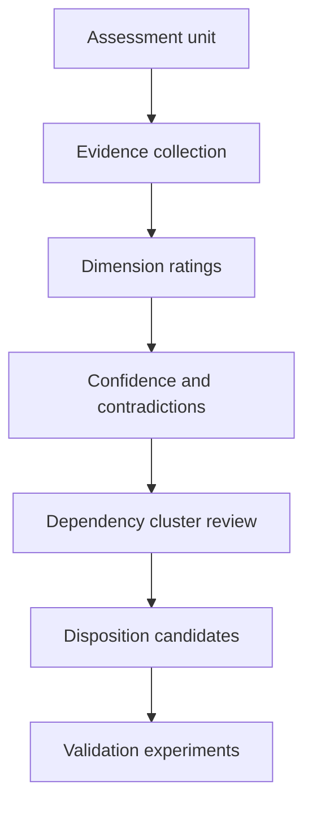
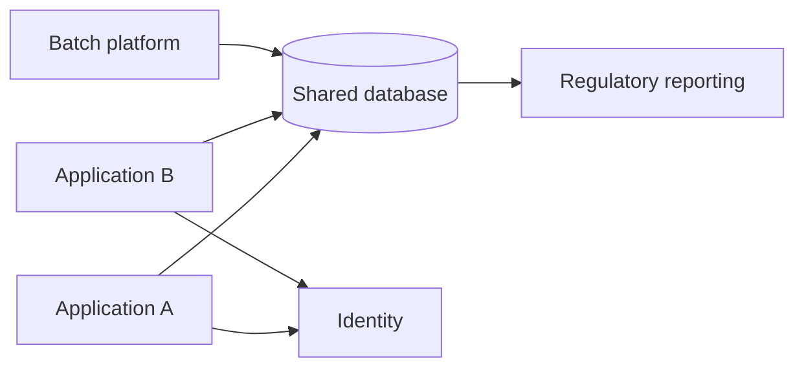

Application and component assessment creates comparable, evidence-backed views of business value, architecture fitness, risk, cost, dependency, and readiness. Its purpose is to support disposition and sequencing—not produce a decorative heat map or punish older technology.

## Architectural Question

**For each assessment unit, what value does it enable, what condition is it in, what constrains change, and which uncertainties must be resolved before disposition?**

## Assessment Dimensions

| Dimension | Questions |
|---|---|
| Business value | Which capabilities, outcomes, users, revenue, controls? |
| Functional fit | What gaps, workarounds, variants, duplicate behavior? |
| Architecture fit | Boundaries, coupling, state, change and quality fitness? |
| Technology health | Lifecycle, support, dependencies, skills, portability? |
| Data | Meaning, authority, quality, lineage, lifecycle, migration? |
| Integration | Critical dependencies, contracts, failure and change semantics? |
| Security/compliance | Assets, exposure, control evidence, accepted risk? |
| Operations | Ownership, incidents, SLOs, observability, recovery, toil? |
| Delivery | Lead time, testability, deployment coupling, rollback? |
| Economics | Run/change cost, license, unit cost, transition and exit? |
| Readiness | Funding, capacity, knowledge, platform, business change? |

## Evidence Before Rating

For each rating store measure, source, observation date, owner validation, confidence, and exceptions. Use telemetry, incidents, financials, code/deployment evidence, contracts, user/process evidence, recovery exercises, and dependency records.

Do not equate missing evidence with acceptable condition. Mark “unknown,” assign validation, and include uncertainty in prioritization.

## Rating Model

Use ordinal scales with anchored definitions. Example for changeability:

| Rating | Evidence anchor |
|---:|---|
| 1 | Independent, frequent, low-risk change with automated evidence |
| 2 | Mostly independent; bounded coordination or manual evidence |
| 3 | Material coordination, regression, or environment delay |
| 4 | Infrequent high-risk change requiring specialists and broad testing |
| 5 | Change is unsafe, unsupported, or operationally impractical |

Define whether high scores mean health or concern and remain consistent. Preserve raw evidence and decisive threshold failures; a weighted average can hide an unacceptable security or recovery gap.

## Business Value

Assess strategic differentiation, outcome contribution, criticality, demand, regulatory necessity, customer impact, future capability need, and duplication. High operating cost does not imply low value; low usage may still support a mandatory close-of-period control.

Separate the value of the capability from the value of the current implementation.

## Architecture and Change Fitness

Examine domain cohesion, shared data, release coupling, dependency fan-in/out, state and transaction boundaries, interface semantics, quality limits, test isolation, deployment, recovery, and operational ownership. Use representative change scenarios to measure impact rather than relying on diagram aesthetics.

## Cost and Effort

Include run, support, incidents, manual work, change, licenses, infrastructure, control evidence, vendor, data reconciliation, and opportunity cost. For modernization estimates use ranges and confidence, including discovery gaps, coexistence, remediation, migration, business change, contingency, and decommission.

## Dependency Clusters

Assess connected units together where shared databases, releases, platforms, data, vendors, or business processes make independent disposition unrealistic.

An apparently simple retirement may fail because reporting or batch reconciliation depends on undocumented tables.

## Confidence and Contradictions

Record disagreements among inventory, code, runtime, policy, finance, and owner claims. Use confidence levels and materiality. High-consequence/low-confidence dimensions become discovery experiments or early wave work.

## Portfolio Views

Useful views include value versus health, criticality versus supportability, change demand versus coupling, cost versus outcome, security exposure versus remediation lead time, and disposition confidence. Always allow drill-down to evidence and dependency cluster.

## Common Failure Modes

- Using application age as a health score.
- Scoring every dimension without defined anchors.
- Averaging away mandatory failures.
- Assessing applications independently despite shared state and release coupling.
- Confusing capability value with implementation quality.
- Treating owner opinion or CMDB fields as verified evidence.
- Producing a portfolio chart without action, confidence, or decision rights.

## Completion Criteria

Assessment units and clusters have comparable, anchored, evidence-backed dimensions, owners, confidence, cost ranges, dependencies, and material unknowns. Business value is separate from implementation health. Findings support disposition options, experiments, prioritization, and transition planning.

## Interview Questions

### Should modernization assessment use one composite score?

It can assist sorting, but never replace dimension evidence, threshold gates, and narrative. Security, obligation, recovery, or deadline failures may be decisive regardless of average.

### How do you assess a poorly documented application?

Use runtime/deployment evidence, incidents, code and schema analysis, user/process observation, financial and access data, and dependency tracing. Mark uncertainty and validate high-consequence assumptions.

### Why assess components rather than only applications?

Different parts may have different value, coupling, lifecycle, and disposition. Component assessment reveals extractable seams and avoids replacing healthy capability with the unhealthy whole.

## Summary

Modernization assessment makes portfolio choices traceable to value, fitness, risk, dependencies, cost, readiness, and evidence confidence. It prepares options without reducing complex decisions to a color.

Next, choose [modernization disposition decisions](/architecture-discovery/modernization/modernization-disposition-decisions/).
