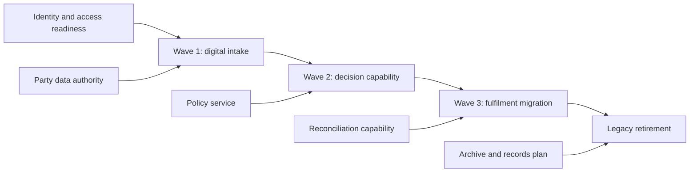
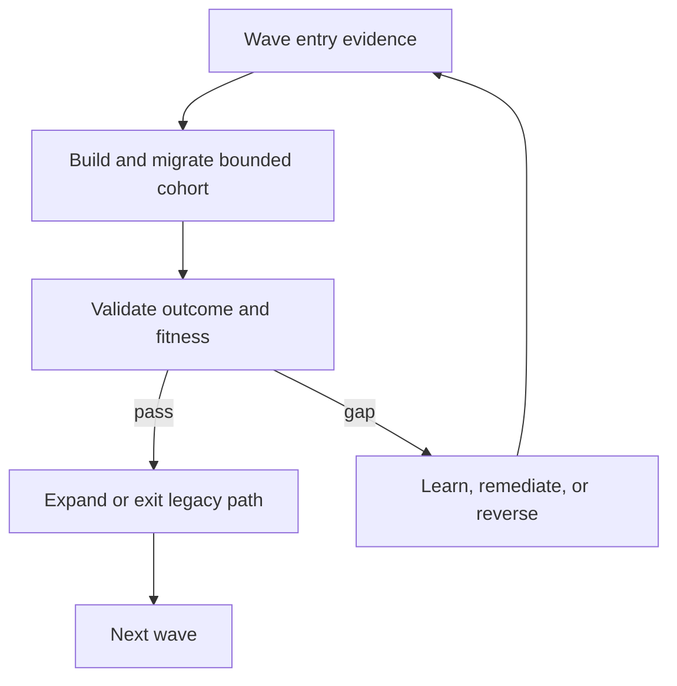

Migration waves group changes into independently valuable, operationally supportable increments. Sequencing is constrained by capability, data, contract, platform, supplier, control, delivery, and organizational dependencies. A roadmap ordered only by application priority creates unmanaged coexistence and delayed benefits.

## Architectural Question

**Which sequence retires risk and delivers measurable outcomes earliest while respecting dependencies, capacity, learning, control continuity, and transition-state limits?**

## Wave Design Principles

- deliver an actor- or business-visible outcome;
- establish prerequisites only when a consuming wave is committed;
- use early waves to test high-consequence assumptions;
- limit simultaneous transition states and operational load;
- pair migration with legacy retirement wherever possible;
- preserve safe rollback or forward recovery;
- measure benefit, architecture fitness, and readiness at each gate.

## Dependency Types

| Dependency | Examples |
|---|---|
| Business | Product launch, policy, operating-model decision |
| Capability/domain | Shared rule, ownership boundary, prerequisite service |
| Data | Authority, cleansing, identifier, lineage, migration |
| Integration | Contract, consumer adoption, partner window |
| Platform | Landing zone, identity, observability, delivery capability |
| Control | Approval, audit evidence, residency, security remediation |
| Commercial | Contract, procurement, license, vendor capacity |
| Organizational | Team formation, skills, funding, change adoption |
| Operational | Support readiness, capacity, recovery, reconciliation |

Distinguish hard precedence, preferred sequence, shared resource, and information dependency.

## Dependency Graph

Use the graph to expose critical path, parallel work, common resources, and missing owners. Do not let the diagram imply certainty where estimates or dependencies are unvalidated.

## Wave Record

For each wave capture outcome and measures, scope/cohort, dispositions, prerequisite evidence, transition state, data/integration/control changes, delivery capacity, business adoption, operational readiness, entry/exit gates, rollback/forward recovery, retirement action, cost range, risks, owners, and dates/ranges.

## Prioritization

Balance value, risk retirement, deadline, dependency unlock, learning, readiness, effort, transition burden, and reversibility. Early-wave candidates often have bounded scope and meaningful learning—not merely lowest technical effort.

Use cost of delay carefully. Include risk exposure and deadline, but avoid false numerical precision. A mandatory control remediation may be a gate rather than a weighted item.

## Thin Vertical Outcomes

A platform-only wave can be necessary, but its acceptance should prove a real consuming scenario. Prefer a minimal end-to-end capability that exercises identity, data, integration, delivery, observability, recovery, and support. This reveals systemic gaps early.

## Limit Work in Transition

Track how many dual-run paths, adapters, synchronized stores, temporary controls, and support models coexist. Set limits and expiry. Starting more migrations can reduce completion rate and increase operational risk.

## Capacity and Funding

Include product/domain teams, platform, security, data, operations, testing, vendor, business change, and subject-matter experts. Shared specialists create portfolio bottlenecks. Reserve capacity for incidents, discovery, remediation, and decommission—not only feature delivery.

Tie funding to outcome and wave gates where governance permits. Annual project funding can conflict with iterative evidence; make continuation and stop decisions explicit.

## Replanning Triggers

Replan on experiment failure, incident, dependency delay, cost variance, workload change, supplier change, control finding, benefits variance, capacity loss, or transition-state growth. Preserve the destination outcome while allowing sequence to adapt.

## Common Failure Modes

- Sequencing by application list without dependencies.
- Creating horizontal infrastructure waves with no consuming proof.
- Starting every workstream and retiring none.
- Leaving data, controls, operations, and adoption to late waves.
- Treating dates as commitments despite low evidence confidence.
- Ignoring shared specialist and vendor capacity.
- Counting migration completion without legacy exit or benefit evidence.

## Completion Criteria

Waves deliver measurable outcomes, respect evidence-backed dependencies, fit delivery and operational capacity, and limit coexistence. Entry/exit gates, learning, recovery, adoption, retirement, and replanning triggers are explicit. Portfolio views expose critical paths, shared resources, uncertainty, and benefits realization.

## Interview Questions

### What should the first modernization wave contain?

A bounded, valuable outcome that tests important architecture and operating assumptions with manageable blast radius and produces reusable platform or domain capability. Avoid a trivial demo or the highest-risk core first.

### How do you sequence shared-platform work?

Build the minimum capability needed by a committed consuming wave, validate it end to end, then generalize from evidence. Avoid speculative platforms with no adoption owner.

### How do you know a wave is done?

The outcome and fitness measures pass, operations and controls accept it, transition debt is within limits, benefits are observable, and the superseded path is retired or has a governed exit plan.

## Summary

Migration waves are architecture decisions about value, dependency, learning, and coexistence. Outcome-oriented sequencing creates evidence early and makes retirement part of delivery.

Next, evaluate [modernization readiness and fitness measures](/architecture-discovery/modernization/modernization-readiness-and-fitness-measures/).
