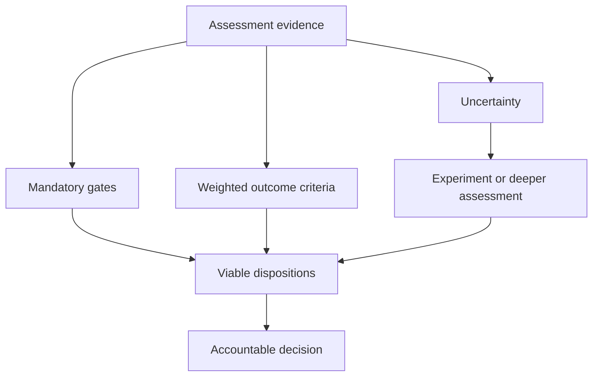
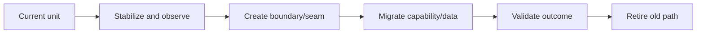

A modernization disposition states what will happen to a bounded capability or implementation and why. The familiar “R” labels are option vocabulary, not an algorithm. A defensible choice connects outcomes, assessment evidence, dependencies, transition feasibility, cost, risk, and explicit conditions.

## Architectural Question

**Which disposition best achieves the required outcomes for each assessment unit, considering current evidence, transition, residual risk, and enterprise portfolio effects?**

## Disposition Vocabulary

| Disposition | Meaning | Common limitation |
|---|---|---|
| Retain | Continue with governed maintenance | Must address lifecycle and accepted gaps |
| Retire | Remove capability or implementation | Requires consumer/data/control exit evidence |
| Consolidate | Move duplicate capability to an existing owner | May create concentration and migration risk |
| Replace | Adopt another product/service | Process/data fit and vendor dependence remain |
| Rehost | Move runtime with minimal application change | Usually preserves architecture debt |
| Replatform | Change managed/runtime platform with bounded code change | May not improve domain or release coupling |
| Refactor | Restructure selected internals or boundaries | Needs precise outcome and seam |
| Rebuild | Create new implementation for retained capability | High delivery and equivalence risk |
| Repurchase | Adopt commercial/SaaS capability | Configuration, operating model, exit, data concerns |

Disposition can differ by component. A portfolio may retire UI, retain ledger, replace workflow, and refactor integration around one capability.

## Decision Criteria

Use governing gates and weighted criteria:

- capability future and differentiation;
- outcome improvement and deadline;
- functional/process fit;
- quality and control gaps;
- data/integration migration complexity;
- lifecycle and supportability;
- operating/delivery model;
- skills and organizational readiness;
- total cost and benefits confidence;
- dependency cluster and portfolio concentration;
- reversibility, coexistence, and risk.

## Retain Is a Decision

Retain requires owner, support horizon, control evidence, investment level, monitoring, and reassessment trigger. It may be correct for stable low-change capability, runoff product, or high-risk replacement where current gaps are manageable.

Do not use retain as the absence of funding or evidence.

## Retirement Evidence

Before retirement prove:

- capability is no longer required or is accepted elsewhere;
- users and all observed consumers have transitioned;
- contractual, regulatory, records, and data obligations are satisfied;
- integrations, credentials, licenses, jobs, environments, alerts, and support are removed;
- data is migrated, archived, retained, or deleted correctly;
- rollback window and final authority are defined;
- savings and risk retirement can be measured.

Zero recent traffic alone does not cover seasonal, recovery, or audit use.

## Rehost and Replatform

These can address facility exit, support deadlines, elastic capacity, or managed operations quickly. State which outcomes they do not address. Avoid claiming improved changeability or domain ownership without corresponding application and operating-model change.

Define compatibility, performance, licensing, data movement, observability, security, recovery, and exit tests.

## Refactor and Rebuild

Bound refactoring by a measurable change, reliability, ownership, or scaling outcome. Identify seams using domain boundaries, change patterns, data ownership, and dependency evidence. Incremental extraction may reduce risk but creates coexistence complexity.

Rebuild is justified only when retained business capability cannot meet outcomes economically through safer dispositions. Avoid rewriting undocumented behavior blindly; use scenario, rule, data, control, and operational evidence.

## Replace or Repurchase

Evaluate process fit, configuration/customization, data semantics, integration, identity, controls, service levels, vendor roadmap, pricing trajectory, operational responsibility, portability, and exit. Excess customization can recreate the legacy estate inside a product.

## Option Combination and Sequencing

Disposition and delivery sequence are different decisions. A final rebuild may begin with containment, platform stabilization, data authority, and interface seams. Record intermediate disposition and target disposition.

## Decision Record

For each unit or cluster record context, outcome, current evidence, options, criteria, rejected alternatives, chosen disposition, intermediate states, dependencies, cost range, uncertainty, residual risk, owner, decision date, conditions, and triggers. Keep portfolio decisions consistent while permitting justified exceptions.

## Common Failure Modes

- Applying one disposition to an entire application by default.
- Treating the 6R/7R list as an automatic scoring model.
- Selecting rehost while promising architecture transformation outcomes.
- Choosing rebuild because code is disliked.
- Ignoring business process and customization in product replacement.
- Declaring retirement without consumer and data evidence.
- Recording target disposition without intermediate states or triggers.

## Completion Criteria

Every in-scope assessment unit or dependency cluster has an accountable, evidence-backed disposition or a bounded validation action. Choices trace to outcomes, gates, criteria, transition, costs, dependencies, uncertainty, and residual risk. Retain and retire decisions have the same governance discipline as transformation choices.

## Interview Questions

### When is rehosting the right decision?

When relocation or support risk is urgent, application change adds disproportionate risk, and the resulting platform meets required quality, security, operations, licensing, and economics—with preserved debt explicitly accepted.

### How do you choose refactor versus rebuild?

Compare retained valuable behavior, architecture seams, test/evidence quality, change constraints, delivery risk, transition, and total cost. Refactor when value can be improved incrementally; rebuild only when the existing structure cannot economically support outcomes.

### Why is retirement difficult?

Hidden consumers, records obligations, batch/report use, data authority, contracts, credentials, and operational dependencies persist after visible usage ends. Retirement needs positive exit evidence.

## Summary

Disposition decisions translate portfolio evidence into accountable action. They remain credible when scoped below application labels, explicit about preserved debt, and connected to transition and retirement proof.

Next, design [transition and coexistence architecture](/architecture-discovery/modernization/transition-and-coexistence-architecture/).
