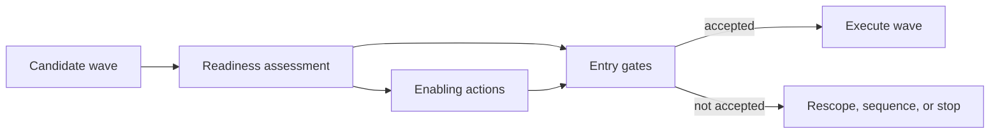
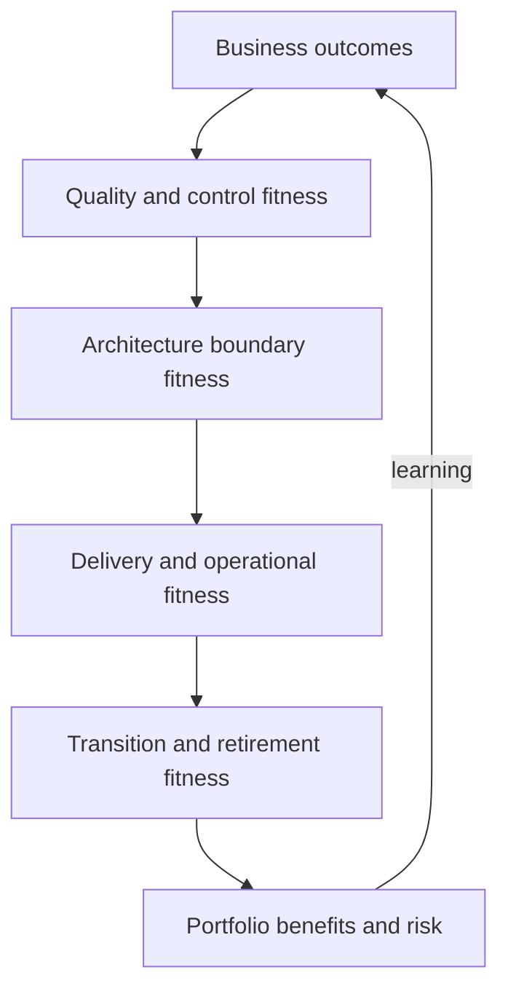

Readiness determines whether the enterprise can execute and sustain a modernization wave. Fitness measures determine whether the evolving architecture continues to meet its intended outcomes and constraints. A technically feasible roadmap fails when ownership, skills, data, platforms, controls, operations, funding, or business adoption are not ready.

## Architectural Question

**What capabilities must be ready before each wave, and which automated and reviewed signals will show that the modernization remains fit for purpose?**

## Readiness Dimensions

| Dimension | Evidence |
|---|---|
| Outcome/governance | Owner, baseline, funding, decision rights, benefit measures |
| Domain/product | Boundaries, product ownership, roadmap, user/process adoption |
| Engineering | Skills, capacity, testability, delivery and architecture practices |
| Platform | Supported paved roads, SLOs, capacity, security, recovery |
| Data | Authority, quality, lineage, migration, retention, reconciliation |
| Integration | Contracts, consumers, compatibility, observability, recovery |
| Security/control | Threat/control evidence, access, compliance, exceptions |
| Operations | Service ownership, on-call, telemetry, runbooks, incident/recovery |
| Commercial | Procurement, licenses, supplier obligations, exit |
| Change | Training, communication, process, support, stakeholder capacity |

## Readiness Is Wave-Specific

Do not require the entire enterprise to reach an abstract maturity level. Define minimum evidence for the next outcome and identify capabilities that can be built within the wave.

Use states such as ready, conditionally ready, not ready, and unknown, each with anchored criteria. “Green” requires evidence, owner, and verification date.

## Readiness Record

Capture dimension, required state, current evidence, confidence, gap, consequence, enabling action, owner, dependency, due date, entry gate, and fallback. Track common enablers as portfolio capabilities, but retain service-level accountability.

## Architecture Fitness Measures

Fitness functions are objective signals that indicate whether an architecture characteristic remains within an acceptable boundary. They can be automated, scheduled, exercised, or reviewed.

Examples:

- domain service changes deploy without coordinated database release;
- no prohibited dependency crosses a defined boundary;
- p99 journey latency remains within budget under peak workload;
- critical events include required identity, time, and schema metadata;
- recovery exercise verifies RTO/RPO and reconciliation;
- every production service has current owner, SLO, runbook, and on-call;
- sensitive data remains in approved locations and retention rules execute;
- legacy traffic and transition adapters decline according to exit plan;
- cost per completed outcome remains within forecast range.

## Fitness Record

| Field | Meaning |
|---|---|
| Characteristic | Outcome or architecture property protected |
| Scope | Services, data, environment, cohort |
| Measure | Formula, test, rule, exercise, review |
| Threshold | Acceptable, warning, violation |
| Evidence | Source, frequency, quality, retention |
| Owner | Response and acceptance authority |
| Action | Block, alert, investigate, remediate, waive |
| Trigger | When threshold or context changes |

## Layered Measures

Balance leading signals (boundary conformance, testability, readiness) with lagging outcomes (incidents, lead time, cost, benefits). Avoid optimizing one layer while the business outcome worsens.

## Governance Response

Define what happens when a measure fails. Some gates block release; others open an investigation or consume an error budget. Record exception authority, compensating control, expiry, and remediation. Too many blocking checks encourage bypass; too few create architecture drift.

## Benefits Realization

Measure baselines and target outcomes such as change lead time, service reliability, unit cost, control evidence, customer effort, retirement savings, or risk exposure. Attribute carefully: modernization may contribute alongside process, policy, and market change. Use ranges and counterfactual reasoning rather than claiming every improvement.

## Readiness Debt

If a wave proceeds conditionally, record readiness debt—missing documentation, manual control, limited staffing, platform gap, or temporary support—with owner, operational burden, expiry, and fitness measure. Do not hide enabling work inside delivery estimates.

## Common Failure Modes

- Using a generic maturity score as a wave gate.
- Marking readiness by self-attestation without evidence.
- Building platforms before a consuming outcome defines fitness.
- Defining fitness functions only as code-style rules.
- Collecting measures without an owner or response.
- Measuring migration activity rather than outcomes and retirement.
- Allowing conditional readiness to become permanent operating debt.

## Completion Criteria

Each wave has evidence-based entry readiness, enabling actions, owners, and fallback. Governing architecture characteristics have measurable fitness signals, thresholds, response, exceptions, and reassessment. Benefits, transition debt, retirement, and operational sustainability remain visible throughout execution.

## Interview Questions

### What is an architecture fitness function?

An objective, repeatable measure that evaluates whether an architecture characteristic remains within an accepted boundary. It may be a test, policy check, telemetry signal, recovery exercise, or governed review.

### Must every fitness function be automated?

No. Automate frequent objective checks; use exercises or expert review for properties such as recovery, threat coverage, domain coherence, and operating-model effectiveness. All need evidence and response.

### What if a wave is not ready but a deadline remains?

Identify minimum risk-retiring scope, build critical enablers, use explicit compensating controls, narrow exposure, preserve recovery, and obtain accountable residual-risk acceptance. Do not relabel missing readiness as green.

## Summary

Readiness turns a roadmap into an executable commitment; fitness measures keep modernization aligned after launch. Together they connect people, platforms, data, controls, operations, benefits, and architecture boundaries to continuous evidence.

Continue with [architecture risk and assumption management](/architecture-discovery/risk/).
