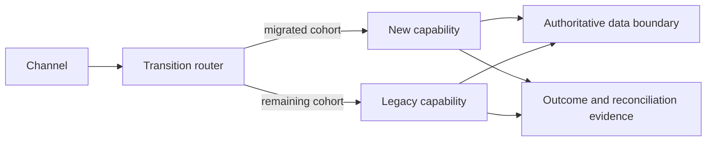
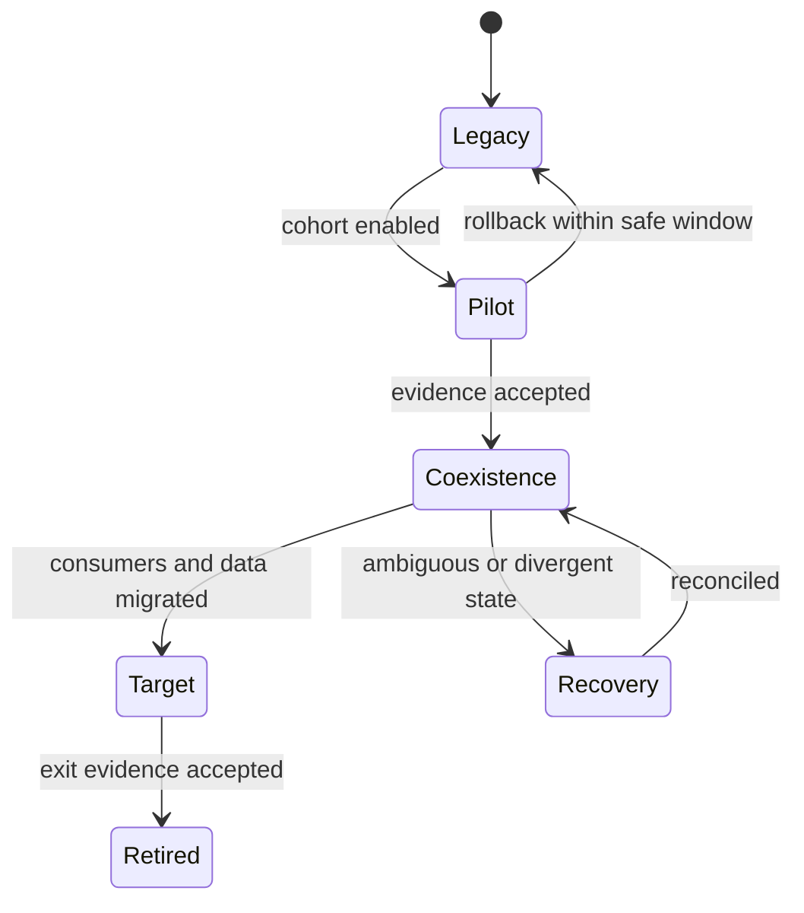

Transition architecture defines the viable intermediate states between current and target. Most enterprise modernization requires systems, data models, processes, controls, channels, and teams to coexist. These states are real production architectures with owners, quality requirements, costs, and risks—not temporary arrows to omit from design.

## Architectural Question

**How will current and target capabilities coexist while preserving authoritative state, business outcomes, controls, recoverability, and a provable path to retirement?**

## Transition-State Record

For every intermediate state capture:

| Field | Required decision |
|---|---|
| Scope and duration | Capabilities, cohorts, regions, expected start/end |
| Routing authority | Who decides which path handles a request? |
| Data authority | Source by attribute, lifecycle stage, and effective time |
| Synchronization | Direction, trigger, latency, ordering, conflict, replay |
| Compatibility | Contract/schema/rule versions and consumer support |
| Controls | Identity, authorization, audit, privacy, reconciliation |
| Operations | Ownership, telemetry, support, incident and capacity |
| Recovery | Pending state, failover, rollback, restore, reconciliation |
| Exit | Consumer migration, data/control proof, decommission criteria |

## Routing Patterns

Routing may use customer cohort, tenant, product, region, capability, transaction type, feature flag, or time window. Define deterministic selection, persistence for in-flight work, fallback, audit, monitoring, and change authority.

Avoid per-request oscillation when stateful journeys require affinity. Routing behavior is a business rule and needs evidence.

## Data Coexistence

Choose authority before synchronization. Common patterns include legacy authoritative with target projection, target authoritative for migrated cohorts, partitioned authority by capability, shared journal with separate projections, and controlled dual operation.

Dual write is not a strategy by itself. Define partial failure, order, duplicate prevention, correction, observation, and reconciliation. Prefer one authoritative write with durable propagation where feasible.

## Compatibility and Contracts

Use expand/migrate/contract across APIs, events, schemas, data, and rules. Record supported versions, semantic differences, adapters, consumers, migration owner, traffic evidence, and removal date. Anti-corruption layers can protect domain meaning but require lifecycle and operational ownership.

## In-Flight Work

Decide whether existing cases complete on legacy, migrate at a safe state, restart, or receive special reconciliation. Capture long-running workflow, scheduled work, reservations, pending approvals, timers, callbacks, and customer communications. A data snapshot alone rarely preserves process state.

## Controls During Transition

Verify segregation of duties, policy version, consent, audit continuity, data minimization, residency, retention, reporting, and evidence across both paths. A transitional store or adapter may create a new trust boundary and regulated copy.

## Rollback and Forward Recovery

Rollback feasibility expires after incompatible state or external effects. Define the rollback window, routing reversal, data treatment, consumer behavior, authority, and validation. After that point use roll-forward, compensation, or reconciliation.

## Operational Model

Transition doubles paths but must not halve ownership. Define end-to-end service owner, path-specific teams, cross-system incident command, dashboards by cohort, reconciliation queues, capacity, release coordination, and on-call. Monitor comparison signals without exposing sensitive data.

## Decommission by Evidence

Retire only when traffic and registered consumers are absent for an appropriate window, in-flight work is complete, data and records obligations are satisfied, controls/reports are transferred, credentials and integrations are removed, recovery requirements are updated, and accountable owners approve.

## Common Failure Modes

- Showing only current and target diagrams.
- Allowing two systems to be authoritative for the same fact without conflict rules.
- Using dual write without durable repair.
- Migrating records but not in-flight process state.
- Assuming rollback remains possible indefinitely.
- Leaving adapters and compatibility layers ownerless.
- Declaring migration complete while legacy reports or recovery paths remain.

## Completion Criteria

Every material transition state has bounded scope, authority, routing, synchronization, compatibility, controls, operations, recovery, cost, and exit evidence. In-flight work and ambiguous outcomes are addressed. The path reduces rather than accumulates coexistence debt.

## Interview Questions

### What is the strangler pattern's hardest problem?

Usually ownership of state and transactions during coexistence—not routing. The team must define domain seams, data authority, in-flight work, consistency, recovery, and retirement.

### Is dual write always wrong?

No, but it needs a clear authority, durable outbox or equivalent evidence, idempotency, partial-failure handling, reconciliation, and bounded duration. Uncoordinated synchronous dual write is fragile.

### When is rollback unsafe?

After target-only state, incompatible schema/rules, irreversible external effects, or consumer migration makes legacy unable to represent the outcome. Define the safe window and forward-recovery plan before release.

## Summary

Transition architecture makes coexistence a governed production state. Explicit routing, authority, compatibility, controls, operations, and exit evidence prevent modernization from becoming permanent duplication.

Next, organize work into [migration waves and dependency sequencing](/architecture-discovery/modernization/migration-waves-and-dependency-sequencing/).
