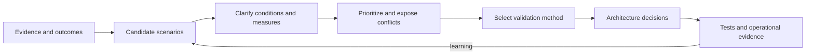
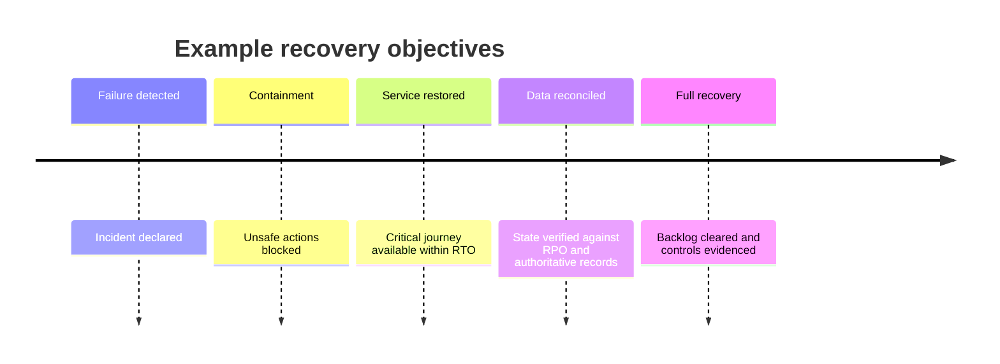

Quality attributes describe how well a system must behave under meaningful conditions. Availability, performance, security, recoverability, operability, usability, accessibility, modifiability, scalability, and cost become architecturally useful only when expressed as scenarios with measurable responses, evidence, ownership, and validation.

## Architectural Question

**Under which stimuli and operating conditions must the system produce which measurable response, and who owns the outcome and its validation?**

## Why “The System Must Be Scalable” Fails

Adjectives hide incompatible interpretations. Scalability could mean absorbing a seasonal peak, adding tenants without isolation loss, processing a growing backlog within a deadline, or expanding to a new region. Each creates different architecture decisions.

Likewise, “highly available” is incomplete without scope, demand, failure, duration, degraded behavior, measurement window, planned maintenance treatment, dependencies, and recovery expectations.

## Quality-Scenario Structure

Use six core parts plus governance:

| Element | Question |
|---|---|
| Source | Who or what generates the condition? |
| Stimulus | What demand, failure, change, misuse, or event occurs? |
| Artifact | Which capability, data, interface, or component is affected? |
| Environment | Under what load, operating mode, incident, or lifecycle state? |
| Response | What observable behavior is required? |
| Measure | What threshold and measurement method determine acceptance? |
| Owner/evidence | Who accepts it, from which source, with what confidence? |

Example:

> During the annual enrollment peak, when authenticated users submit up to 1,500 benefit elections per second, accepted submissions complete within 800 ms at the 99th percentile, no committed election is lost, overload is signaled before queues exceed the recovery window, and the service owner validates the result using a production-representative load test and telemetry.

This is more useful than separate statements for performance, scalability, and reliability because it makes their interaction visible.

## Attribute Catalogue

Use a catalogue as a prompt, not a checklist that gives every attribute equal weight.

| Attribute | Discovery focus |
|---|---|
| Availability | Outcome scope, failure classes, dependency behavior, error budget |
| Performance | Workload, percentile, end-to-end boundary, concurrency, deadline |
| Scalability | Growth dimension, limit, scaling lead time, state and cost |
| Reliability | Integrity, duplicate/loss tolerance, ordering, degradation |
| Recoverability | Failure scope, RTO, RPO, restore evidence, reconciliation |
| Security/privacy | Assets, actors, trust, abuse, control response, evidence |
| Operability | Detection, diagnosis, safe intervention, automation, ownership |
| Observability | Questions telemetry must answer and evidence retention |
| Usability/accessibility | Actor, context, task success, errors, equivalent outcome |
| Modifiability | Change class, frequency, affected scope, lead time, regression |
| Portability/interoperability | Target environments, standards, semantic compatibility |
| Compliance/auditability | Obligation, control, evidence, retention, decision authority |
| Sustainability/cost | Consumption boundary, demand, budget, carbon or cost target |

## Discover from Evidence

Quality requirements should not come only from stakeholder aspiration. Examine business outcomes, incident history, support cases, telemetry, capacity records, audit findings, recovery exercises, change lead time, user research, contractual commitments, cost reports, and dependency agreements.

Separate:

- **current baseline** — observed performance and reliability;
- **committed requirement** — contractual, regulatory, or business obligation;
- **target** — desired improvement with an accountable sponsor;
- **assumption** — unverified condition needing an experiment;
- **constraint** — boundary the solution must respect.

## Scenario Workshop

Invite business outcome owners, product, engineering, operations, security, data, accessibility, finance, and critical dependency owners. Start with concrete events:

- the most damaging recent incident;
- the next expected demand peak;
- a critical dependency unavailable for 30 minutes;
- a compromised credential or malicious request;
- restoration after regional loss;
- a policy or schema change under delivery pressure;
- an operator diagnosing an ambiguous business outcome.

Generate scenarios individually, clarify them, consolidate duplicates, then prioritize. Avoid debating solutions during elicitation; capture candidate tactics separately.

## Workload and Environment

Performance and capacity measures are meaningless without workload shape. Capture request mix, payload size, concurrency, tenant distribution, data volume, hot keys, read/write ratio, burst duration, seasonality, batch windows, background work, and growth assumptions.

Environment includes more than infrastructure: normal operation, peak, deployment, dependency degradation, disaster recovery, security incident, data migration, backlog recovery, and manual intervention may each require different responses.

## End-to-End Boundaries

Measure the actor-visible or business-visible boundary. Component targets must derive from the end-to-end budget and include network, dependency, queue, and client behavior. State excluded time explicitly.

For asynchronous outcomes, measure acceptance latency, completion latency, backlog age, and uncertainty duration separately. A fast acknowledgment does not prove timely completion.

## Recovery Quality

Define RTO and RPO for business capabilities and data, not just servers. Discover maximum tolerable outage, data-loss tolerance, degraded service, dependency restoration order, reconciliation, restore validation, communication, and restart capacity. Evidence from a recovery exercise is stronger than a backup-success log.

## Common Failure Modes

- Copying generic NFR lists into every project.
- Using averages instead of percentiles and distributions.
- Defining component targets without end-to-end budgets.
- Omitting stimulus, environment, owner, or validation.
- Confusing aspiration with funded commitment.
- Setting availability higher than dependencies can support.
- Defining recovery for infrastructure but not business state.
- Ignoring cost and operability consequences.

## Completion Criteria

Architecturally significant quality scenarios are measurable, prioritized, owned, evidenced, and linked to affected outcomes and scenarios. Workload and environment are explicit. Current baseline, commitment, target, assumption, and constraint are distinguished. Each scenario has a feasible validation method and exposes relevant dependencies and conflicts.

## Interview Questions

### What makes an NFR architecturally significant?

It materially constrains structure, technology, interaction, deployment, operations, cost, or delivery and is costly to add later. Significance depends on context, not the attribute label.

### Are SLAs the same as quality requirements?

No. An SLA is an external service commitment, often with measurement and remedies. Architecture also needs internal objectives, dependency expectations, error budgets, recovery behavior, and validation scenarios that make the commitment achievable.

### How do you validate modifiability?

Choose representative change scenarios and measure affected components, teams, lead time, regression scope, coordination, deployment independence, and evidence from prior changes or architecture exercises.

## Summary

Quality discovery converts vague adjectives into measurable behavior under real conditions. Strong scenarios connect business outcome, workload, failure, owner, evidence, validation, and architecture consequence.

Next, resolve [NFR priorities and conflicts](/architecture-discovery/non-functional-discovery/nfr-prioritization-and-conflict-resolution/).
