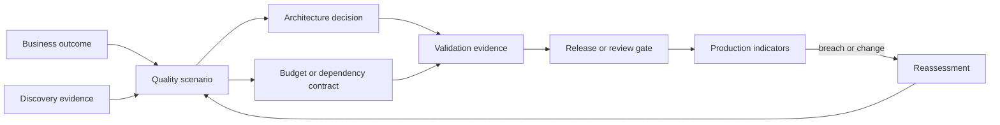
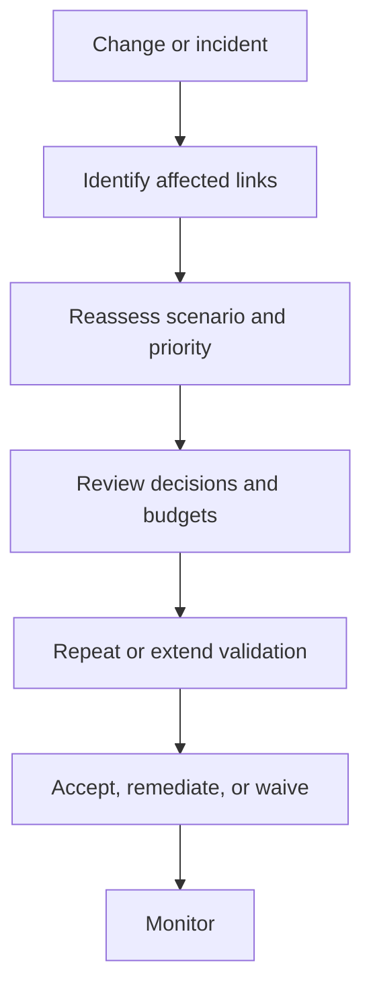

An NFR is not complete when it appears in a document. It must have an accountable owner, measurable boundary, validation method, evidence lifecycle, exception path, and operational signal. Traceability connects the original outcome and scenario to architecture decisions, delivery controls, tests, production evidence, and reassessment.

## Architectural Question

**What evidence will prove each significant quality requirement before release and during operation, and how will change or noncompliance trigger action?**

## Acceptance Record

| Field | Required decision |
|---|---|
| Identifier and scenario | Stable reference with stimulus, environment, response, measure |
| Outcome and scope | Capability, actors, operations, data, geography, exclusions |
| Priority and rationale | Governing, differentiating, necessary, or monitor |
| Baseline and target | Observed state, commitment, threshold, measurement window |
| Owner | Accountable acceptor and evidence producer |
| Validation | Method, environment, workload, data, pass/fail criteria |
| Operational evidence | Metric, log, trace, audit record, report, or exercise |
| Dependencies and budgets | Allocations and supplier expectations |
| Exception | Authority, rationale, compensating action, expiry |
| Review trigger | Date, volume, incident, change, threshold, obligation |

## Layered Validation

No single test proves an enterprise quality property. Use complementary evidence:

1. **Static evidence:** design review, threat model, configuration policy, dependency contract.
2. **Component evidence:** benchmark, unit property, fault behavior, security test.
3. **Integrated evidence:** end-to-end load, resilience, accessibility, recovery, and control tests.
4. **Operational readiness:** dashboards, alerts, runbooks, capacity, support ownership, rollback.
5. **Production evidence:** service indicators, incidents, error budgets, audit evidence, cost and recovery exercises.

State limitations. A staging test with synthetic data may not demonstrate production scale, real dependency variability, or operator behavior.

## Traceability Graph

Trace links should support questions such as: Which decisions depend on this availability target? Which scenarios are affected if a supplier changes its contract? Which test and dashboard prove the recovery objective?

## Acceptance by Attribute

| Attribute | Strong evidence examples |
|---|---|
| Performance | Representative end-to-end workload, percentile distribution, saturation point |
| Availability | Service indicators, dependency analysis, failure tests, error-budget policy |
| Recovery | Restore and reconciliation exercise with measured RTO/RPO |
| Security | Threat-model closure, control tests, abuse cases, detection and response exercise |
| Accessibility | Expert and assistive-technology evaluation across priority journeys |
| Modifiability | Representative change exercise and historical lead-time evidence |
| Operability | Incident simulation, diagnostic questions answered, safe action demonstrated |
| Cost | Workload-linked cost model reconciled with observed consumption |

Validate the outcome boundary. A database restored within RTO does not prove the business capability is usable or reconciled.

## Quality Gates

Define evidence gates at architecture option selection, implementation readiness, production readiness, release, and post-release review. A gate should specify required evidence, decision authority, permitted outcomes, actions, expiry, and escalation. Gates must enable informed decisions, not become document attendance checks.

Possible outcomes are approve, approve with conditions, request evidence, accept a time-bound exception, or reject. Record dissent and unresolved uncertainty.

## Exceptions and Waivers

A quality exception includes affected scenario and scope, measured gap, business consequence, compensating controls, remediation owner, acceptance authority, expiry, monitoring, and trigger for immediate review. Permanent waivers without monitoring silently redefine the requirement.

When a target is missed, distinguish invalid target, inadequate design, incomplete implementation, unrepresentative validation, and changed context. Each demands a different decision.

## Operationalization

Translate acceptance measures into service-level indicators and operational questions. Define aggregation, percentile, windows, exclusions, labels, data quality, retention, alert threshold, escalation, and decision response. Avoid vanity dashboards that cannot indicate actor-visible failure or business-state uncertainty.

For example, monitor not only request success but also completion latency, pending age, duplicate effects, reconciliation backlog, recovery point verification, and failed control evidence.

## Change Impact

Reassess quality scenarios when workload, user population, criticality, architecture, dependency, data classification, regulation, operating model, or incident evidence changes. Automated relationship checks can identify candidates, but accountable owners decide impact.

## Common Failure Modes

- Treating a signed NFR document as acceptance evidence.
- Testing components while claiming end-to-end compliance.
- Using production monitoring without pre-release validation.
- Omitting measurement windows, exclusions, workload, or data quality.
- Assigning ownership to “the platform” or “the team.”
- Allowing exceptions without expiry or compensating action.
- Maintaining traceability fields nobody uses for impact decisions.

## Completion Criteria

Every governing and differentiating quality scenario has accountable acceptance, representative validation, evidence, operational measures, and dependency budgets. Exceptions are time-bound and monitored. Trace links support impact analysis and review triggers are active. Evidence limitations and residual uncertainty are visible.

## Interview Questions

### When is an NFR accepted?

When the accountable owner has credible evidence that the measurable scenario is satisfied under representative conditions—or explicitly accepts a governed residual gap. Document approval alone is insufficient.

### How do tests and SLOs relate?

Tests provide controlled evidence before and during change; SLOs govern sustained production reliability. They should share outcome semantics and measures but serve different evidence windows.

### What is useful traceability?

Traceability is useful when a changed source, requirement, dependency, or incident identifies affected decisions, validations, owners, and operational action. Mere identifier coverage is not enough.

## Summary

NFR acceptance is an evidence lifecycle. It joins discovery scenarios to decisions, budgets, validation, release gates, production indicators, exceptions, and reassessment so quality commitments remain enforceable after design.

Continue with [integration landscape and dependency discovery](/architecture-discovery/integration/).
