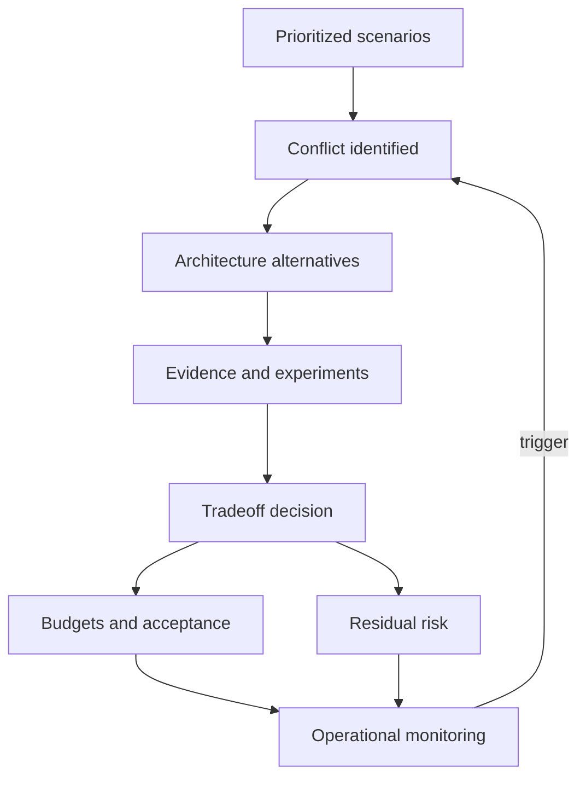

Quality attributes compete for design attention, delivery capacity, operational complexity, and cost. Architecture cannot maximize every attribute. Prioritization identifies which scenarios govern decisions; conflict resolution makes the accepted compromise, evidence, authority, and reassessment conditions explicit.

## Architectural Question

**Which quality scenarios matter most for each outcome, where do they conflict, and who has authority to accept the resulting tradeoffs?**

## Prioritize Scenarios, Not Labels

“Security is number one” and “performance is critical” do not guide a decision. Prioritize concrete scenarios. A service may require strict integrity for financial posting, fast degraded reads for account display, and lower availability for historical reports.

Evaluate each scenario using:

- business outcome and affected actors;
- obligation or contractual commitment;
- consequence and reversibility of failure;
- frequency, volume, and proximity;
- architectural sensitivity and cost of late change;
- current gap and evidence confidence;
- dependency feasibility and delivery readiness.

## Priority Tiers

Use a small set of governed tiers:

| Tier | Meaning | Expected treatment |
|---|---|---|
| Governing | Failure makes the option unacceptable | Explicit architecture tactics and proof |
| Differentiating | Materially improves value or risk | Weighted option evaluation and validation |
| Necessary | Must meet an agreed baseline | Standard controls and evidence |
| Monitor | Uncertain or currently low consequence | Instrument, reassess on trigger |

Avoid assigning most scenarios to the highest tier. Forced ranking or limited governing slots exposes real choices.

## Common Conflicts

| Tension | Discovery questions |
|---|---|
| Availability vs consistency | Which operations may use stale state? What is irreversible? |
| Latency vs security/control | Which checks must be synchronous? What assurance is required? |
| Resilience vs cost | What outcome and failure scope justify redundant capacity? |
| Flexibility vs simplicity | Which change scenarios justify extension points? |
| Autonomy vs consistency | Which decisions require central policy or shared semantics? |
| Delivery speed vs assurance | What evidence can be automated? Which gate is mandatory? |
| Observability vs privacy | Which fields are necessary, masked, restricted, or retained? |
| Recovery vs data loss | Which records can be recreated or reconciled? |
| Performance vs sustainability | Which workload, caching, or data movement creates the tradeoff? |

The goal is not a universal winner. Different operations can receive different semantics.

## Tradeoff Workshop

1. Present prioritized scenarios with source, measure, and confidence.
2. Identify pairs that demand competing tactics or budgets.
3. Describe the business consequence at realistic thresholds.
4. Generate alternatives, including scoped or degraded behavior.
5. Assess value, risk, cost, operability, transition, and uncertainty.
6. Select experiments for disputed or weakly evidenced claims.
7. Obtain acceptance from the accountable outcome or risk owner.
8. Record conditions, dissent, residual risk, and reassessment triggers.

## Use Budgets

Allocate end-to-end requirements across responsibilities while retaining outcome ownership:

- latency budget across client, network, service, dependency, and queue;
- availability budget across critical-path dependencies and recovery;
- error budget for acceptable unreliability and release governance;
- recovery budget from detection through restore and reconciliation;
- cost budget by transaction, tenant, workload, or capability;
- data-loss budget by record type and reconstruction method.

Budgets reveal infeasible combinations. If a dependency contract consumes the entire latency or availability budget, the architecture must change the path, negotiate the contract, degrade safely, or revise the outcome commitment.

## Scenario-Specific Semantics

One architecture may need different modes:

- account display tolerates slightly stale data during dependency degradation;
- funds transfer refuses action without authoritative balance;
- statement generation completes asynchronously within a deadline;
- fraud containment favors safety over availability;
- support search offers reduced fields when a sensitive-data service is unavailable.

Document the switch condition, permitted behavior, customer communication, security constraints, and recovery to normal operation.

## Evidence and Experiments

Use load tests, failure injection, recovery exercises, threat models, accessibility evaluations, change-impact exercises, prototypes, cost models, dependency measurements, and production baselines. An experiment must state hypothesis, representative conditions, threshold, owner, result, limitation, and decision impact.

Do not use a technology benchmark to prove an end-to-end business scenario unless the environment and workload are representative.

## Decision Record

For each material tradeoff record:

- competing scenarios and priority;
- alternatives considered;
- evidence and uncertainty;
- selected behavior and rationale;
- budgets and validation;
- affected actors and operations;
- residual risk and acceptance authority;
- expiry or reassessment trigger.

This prevents an implicit implementation compromise from becoming permanent policy.

## Common Failure Modes

- Ranking attribute names rather than measurable scenarios.
- Declaring every NFR mandatory and equally critical.
- Letting the loudest technical stakeholder accept business risk.
- Solving conflicts with unexplained averages or arbitrary percentages.
- Ignoring dependency and operational feasibility.
- Treating cost as a late optimization rather than a quality constraint.
- Recording the chosen option without rejected alternatives or triggers.

## Completion Criteria

Governing scenarios and their rationale are agreed. Material conflicts, alternatives, experiments, budgets, and scoped semantics are explicit. Accountable owners accept residual tradeoffs. Decisions link to validation and monitoring, with thresholds that trigger reassessment.

## Interview Questions

### How would you choose between consistency and availability?

Start with operation-specific business consequences. Identify which state is authoritative, what staleness is tolerable, which actions are reversible, and how degraded behavior is communicated and reconciled. Do not choose once for the entire system.

### Who prioritizes NFRs?

Architecture facilitates evidence and consequences. Business outcome owners, risk owners, product, operations, security, and engineering jointly inform priority; the accountable authority accepts the tradeoff and funding implication.

### What if stakeholders demand an infeasible target?

Show the conflicting evidence and budget, propose scoped alternatives or experiments, quantify cost and risk, and escalate the decision transparently. Do not silently weaken the requirement.

## Summary

NFR prioritization makes architectural tension governable. Scenario-specific priorities, explicit budgets, credible evidence, and accountable acceptance replace blanket claims with defensible tradeoffs.

Next, convert priorities into [NFR acceptance and traceability](/architecture-discovery/non-functional-discovery/nfr-acceptance-and-traceability/).
